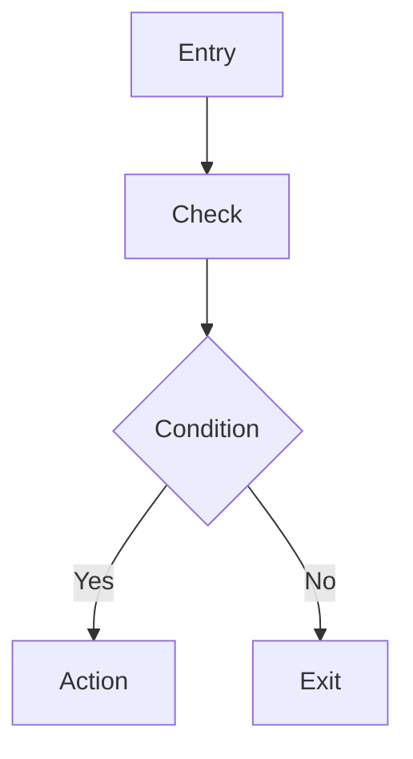

# FC Flowchart Rules

## Purpose

This file owns stable rules for when to include flowcharts in implementation-level detailed design and what granularity they should use.

The final output remains markdown. Flowcharts should be rendered as `mermaid` blocks inside the markdown document.

## 1. Core Principle

Flowcharts are not decoration. They exist to make coding order and branch structure obvious.

A flowchart is useful when the developer would otherwise need to mentally reconstruct:

- execution order
- decision points
- DET insertion points
- dependency call points
- state transitions
- fault or recovery branches

If a section is trivial and the sequence is obvious from a short table, a flowchart may be omitted.

Hard rule:

- flowcharts describe implementation steps, not code text
- flowcharts are subordinate to step decomposition tables
- if a step table already explains the sequence, the flowchart should summarize that sequence instead of re-encoding code details

## 2. Flowchart Priority

Default priority from highest to lowest:

1. external API control flow
2. state-machine main flow
3. key internal control flow
4. fault handling flow
5. initialization flow
6. dependency or callout flow
7. periodic task main flow

If the document must stay short, keep the higher-priority flowcharts first.

## 3. Mandatory Flowchart Cases

Flowcharts should normally be included when any of these are true:

- an external API triggers multiple ordered subfunctions
- stateful behavior exists
- the logic contains more than one meaningful branch
- a fault branch changes execution outcome
- asynchronous or deferred behavior exists
- a periodic task mixes monitoring, state handling, and service logic
- a dependency call can fail and alter the path

## 4. Recommended Flowchart Types

### 4.1 External API Flowchart

Use for:

- non-trivial external APIs
- especially `Init`, `MainFunction`, service or control APIs

Show:

- entry
- DET or state checks
- main subfunction steps
- dependency or callout steps
- success and failure exits

### 4.2 State-Machine Main Flowchart

Use for:

- any explicit state machine

Show:

- entry
- current state read
- condition scan
- transition decision
- action execution
- state update and optional record

### 4.3 Internal Control Flowchart

Use for:

- key non-public flows with meaningful sequencing
- data conversion + validation + runtime update combinations
- fault-confirmation or monitor logic

Show:

- trigger or entry condition
- main internal processing steps
- update points
- return or exit

### 4.4 Fault Flowchart

Use for:

- faults with confirmation, degradation, recovery, or reset coupling

Show:

- detect
- confirm
- respond
- recover or retain
- optional reset request

### 4.5 Initialization Flowchart

Use for:

- multi-stage init
- per-core init
- init with retained-data interpretation

Show:

- memory init
- cfg binding
- runtime init
- dependency init
- retained-data or reset-info handling
- final ready state

### 4.6 Periodic Task Flowchart

Use for:

- tasks that combine multiple concerns
- monitor + state machine + service processing in one cycle

Show:

- task entry
- ordered subfunctions
- optional monitor actions
- state progression
- fault branch if present

## 5. Granularity Rules

Use one flowchart per meaningful control unit.

Do not create one huge cross-module mega-flowchart.

Preferred granularity:

- one external API -> one flowchart
- one state machine -> one main flowchart
- one key fault lifecycle -> one flowchart
- one important internal flow -> one flowchart

If one API has multiple clearly separate paths, use one main flowchart and optionally add smaller focused ones.

## 6. Node Content Rules

Nodes should describe actions, not implementation trivia.

Prefer labels like:

- `DET/State Check`
- `Read Current State`
- `Check Transition Conditions`
- `Execute Action Function`
- `Call Hardware Adaptation`
- `Update Runtime State`
- `Return E_NOT_OK`
- `Load Chip Configuration`
- `Process Interrupt Event`
- `Update Fault Status`

Avoid:

- raw local variable names only
- too much code-like syntax inside nodes
- full C expressions as node labels
- register names as primary node labels
- array indexing expressions such as `runtime[chipIndex]`
- counter operations such as `chipIndex++`
- exact control expressions such as `chipCount > 0`
- implementation pseudo-code such as `Write Output Port regs via I2C`

Preferred rewrite examples:

- not preferred: `chipIndex = 0`
  preferred: `Start Chip Traversal`
- not preferred: `chipIndex < chipCount?`
  preferred: `More Chips To Process?`
- not preferred: `Write Output Port regs via I2C`
  preferred: `Write Default Output State`
- not preferred: `runtime[chipIndex].InitState = READY`
  preferred: `Set Chip State To READY`
- not preferred: `CalloutI2cRead`
  preferred: `Read Input Register`

## 7. Branching Rules

Decision nodes should be used when:

- state conditions determine path
- dependency result determines path
- fault detection determines path
- invalid input or invalid state causes early exit

When possible, decision outcomes should be explicit:

- success/fail
- yes/no
- valid/invalid
- transition/no-transition

## 8. Relationship To Tables

A flowchart does not replace:

- API tables
- subfunction decomposition tables
- state transition tables
- fault tables

Recommended pairing:

- API section -> table + subfunction steps + flowchart
- state machine -> transition table + main flowchart
- fault handling -> fault table + fault flowchart

The step table is the source of truth for developer work order.

The flowchart should be a visual compression of the step table, not a second representation of code details.

## 9. Complexity Limits

Keep one flowchart readable in markdown.

Recommended soft limits:

- roughly 5 to 12 nodes for normal API flow
- roughly 1 to 4 decision diamonds
- avoid branching into too many low-value minor details

If the flow becomes too complex:

- split into main flow + focused subflow
- keep the main flow coding-oriented

## 10. Mermaid Style Rule

Use `flowchart TD` by default unless there is a clear reason to use another direction.

Preferred simple pattern:

Do not over-style or theme the diagram. Keep it simple and readable.

Do not put:

- code fragments
- API prototypes
- register identifiers
- variable update statements
- detailed loop mechanics

inside the flowchart unless the user explicitly asks for code-oriented pseudo-flow.

## 11. Single-Core vs Multi-Core Flowchart Rules

### 11.1 Core Principle

The flowchart must reflect the actual execution model. A single-core design must not leak multi-core patterns into its flowcharts.

### 11.2 Single-Core Flowchart Constraints

When the detailed design is explicitly single-core, the following nodes and patterns are forbidden in all flowcharts:

- core matching / core selection nodes (e.g. `核匹配`, `Core Match`, `Select Core`)
- core traversal loops (e.g. `For Each Core`, `Next Core`)
- `CalloutGetCoreId` call nodes
- per-core index or core-id-based branching
- runtime container indexing by core id

Acceptable single-core replacements:

| Forbidden | Acceptable Single-Core Replacement |
|---|---|
| `核匹配 / Core Match` | Omit entirely |
| `CalloutGetCoreId` | Omit entirely |
| `For Each Core` | Direct chip/instance traversal if multi-instance exists |
| `Select Core Runtime` | Direct runtime access |
| `Per-Core Init` | `Init` (single path) |

### 11.3 Multi-Core Flowchart Requirements

When the design is multi-core, flowcharts may include core-aware nodes, but only when core separation is a real design concern:

- `CalloutGetCoreId` is allowed only when per-core runtime/config routing exists
- core traversal is allowed only when the FC behavior iterates across cores
- per-core init paths are allowed only when different cores have different init responsibilities

### 11.4 Validation

Before accepting a flowchart, additionally check:

- if single-core, verify no core-matching or core-traversal nodes exist
- if multi-core, verify core-aware nodes reflect actual design separation, not decorative labeling

## 12. Review Checklist

Before accepting a flowchart, check:

1. does it show execution order clearly
2. does it include the meaningful branch points
3. does it align with the written steps and tables
4. does it help coding rather than merely decorate the document
5. is it small enough to remain readable in markdown
6. does it avoid code-like wording and stay at step level
7. if single-core, does it avoid core-matching, core-traversal, and `CalloutGetCoreId` nodes
8. if multi-core, do core-aware nodes reflect real design separation
