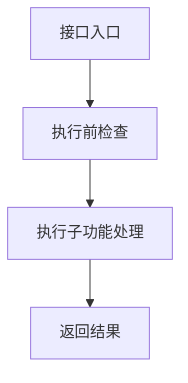
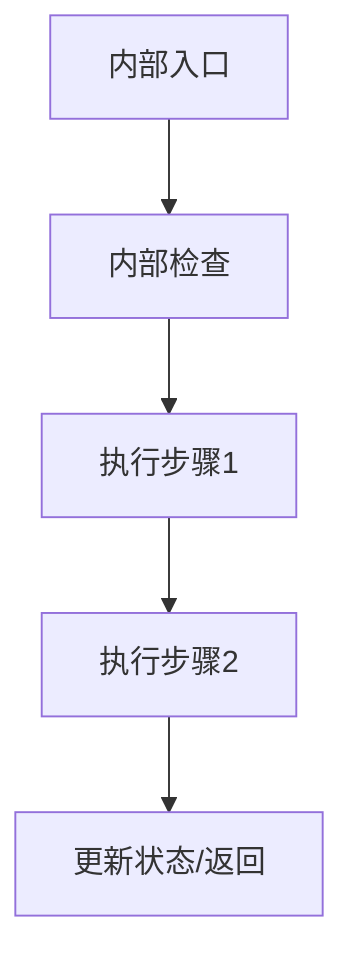

# FC详细设计校验精简版

说明：

- 本模板用于默认的精简版实现级详细设计输出。
- 重点是让开发能快速进入 coding，而不是展开所有推理过程。
- 即使是精简版，关键接口也应给出执行步骤和子功能拆分，不能只写功能摘要。
- 所有流程图节点必须表达实现步骤，不能直接出现代码、变量名、数组下标、寄存器名或条件表达式。

## 1. FC总结

- 详细设计版本:
- 详细设计状态:
- 输出模式:
- 生成时间:
- FC名称:
- 当前软件层级:
- 核心职责:
- 单核/多核:
- 设计思路:

## 2. 文件列表

| 文件名 | 必需/可选 | 职责 |
| --- | --- | --- |
|  |  |  |

## 3. 外部接口设计

| Interface Prototype | Description | Sync/Async | Reentrancy | Return Value |
| --- | --- | --- | --- | --- |
|  |  |  |  |  |

### 3.1 关键接口步骤拆分

| 接口 | 步骤 | 子功能 | 调用对象/内部函数 | 结果 |
| --- | --- | --- | --- | --- |
|  | 1 |  |  |  |

### 3.2 关键接口流程图

## 4. 依赖接口与Callout

| Interface Prototype | Implemented By | Purpose | Basic Constraints |
| --- | --- | --- | --- |
|  |  |  |  |

### 4.1 依赖接口步骤拆分

| 依赖接口 | 步骤 | 子功能 | 失败路径 |
| --- | --- | --- | --- |
|  | 1 |  |  |

## 5. 单核/多核框架

| Core/Task | Role | Period | Owned Logic | Shared Data |
| --- | --- | --- | --- | --- |
|  |  |  |  |  |

## 6. 状态机与内部函数

### 6.1 状态机

| 当前状态 | 条件函数 | 动作函数 | 下一状态 |
| --- | --- | --- | --- |
|  |  |  |  |

### 6.2 内部函数

| 函数名 | 类别 | 职责 |
| --- | --- | --- |
|  |  |  |

### 6.3 关键内部流程图

## 7. cfg / runtime / DET / fault

### 7.1 配置

| Macro/Table | Purpose | Location |
| --- | --- | --- |
|  |  |  |

### 7.2 运行时变量

| 变量名 | 类别 | 所属Core | 生命周期 |
| --- | --- | --- | --- |
|  |  |  |  |

### 7.3 DET

| 检查点 | 触发条件 | 失败策略 |
| --- | --- | --- |
|  |  |  |

### 7.4 Fault

| 故障项 | 检测条件 | 响应动作 | 恢复条件 |
| --- | --- | --- | --- |
|  |  |  |  |

## 8. 编码起步建议

- 优先创建的文件:
- 优先实现的接口:
- 优先落地的 cfg:
- 优先验证的风险:
