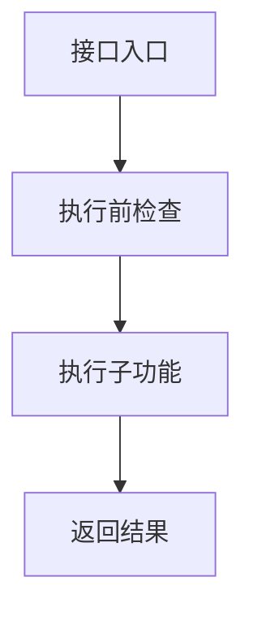
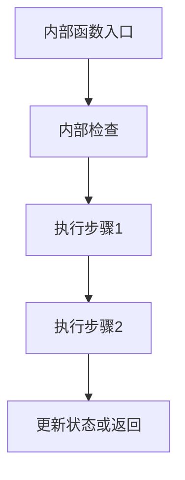
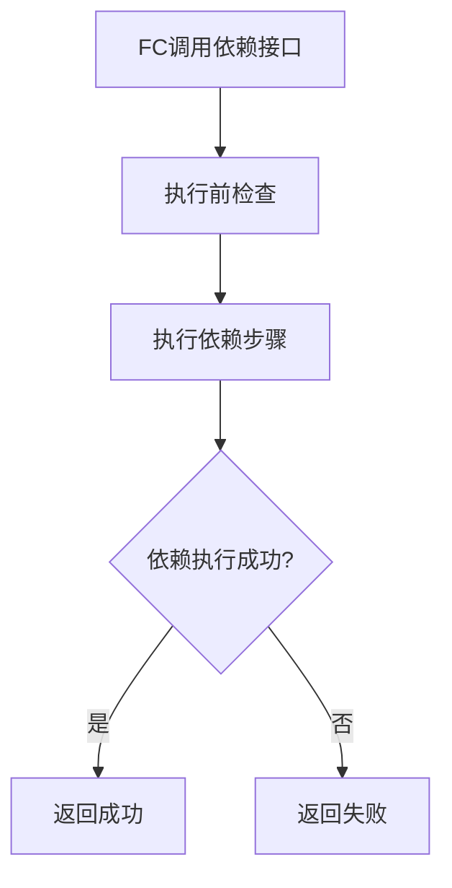
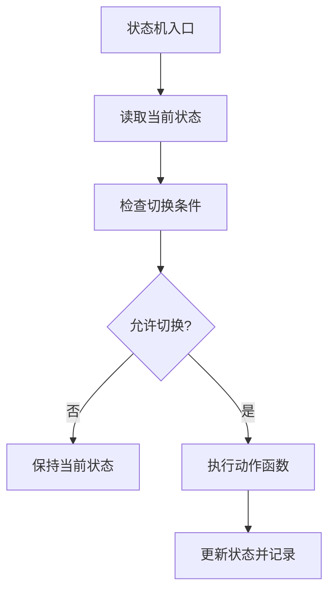
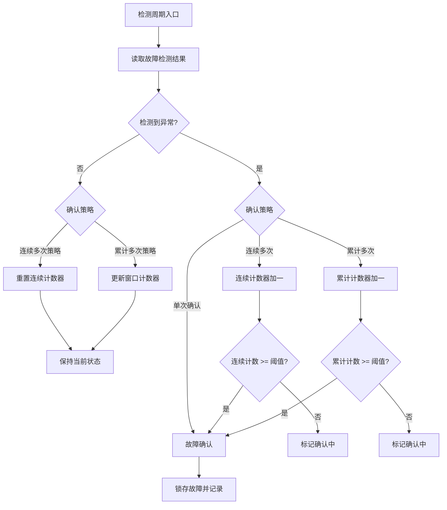

# 《`<FC>` 模块详细设计规范》

**`<FC>`_详细设计规范**

**`<FC>` Detailed Design Specification**

项目编号/Project number: `<FC>`
保密性/Security: 内部

**Document Properties**
Status: **草稿**
详细设计版本: **V1**
详细设计状态: **Draft**
Author: FC Implementation Workbench
Created: `<GenerationTime>`

**Approved Versions**

Current Document version **V1** is **Draft**.

**Approved Versions:**

- TBD

**Document Signatures**

| 版本 | 状态 | 审批人 | 日期 | 意见 |
| --- | --- | --- | --- | --- |
| V1 | Draft | TBD | TBD | TBD |

## 适用说明

本文档适用于 `<FC>` 模块的详细设计定义。本文档描述模块的功能方案、外部接口、内部接口、依赖接口、状态机、DET、故障处理、配置参数、运行参数和 MemMap 策略，面向编码实现。

说明：

- 本模板是 FC 实现级详细设计的唯一正式交付模板，覆盖 Quick Draft / Formal Draft / Released 所有输出模式。
- 本文件只定义输出形态，不承担长期规则定义；长期规则以 `references/rules/*.md` 为准。
- 外部接口、依赖接口、关键内部控制流不应只写”功能说明”，必须写出子功能拆分、执行步骤和流程图。
- 流程图节点必须表达步骤，不允许直接写代码、变量更新、数组下标、寄存器名或条件表达式。

---

## 文档修订记录

| 版本 | 日期 | 作者 | 变更说明 | 状态 |
| --- | --- | --- | --- | --- |
| V1 | `<GenerationDate>` | FC Implementation Workbench | `<ChangeSummary>` | Draft |

---

## 目录

- [1. FC概述](#1-fc概述)
- [2. 设计输入](#2-设计输入)
- [3. 功能设计](#3-功能设计)
- [4. 文件列表设计](#4-文件列表设计)
- [5. 单核/多核框架设计](#5-单核多核框架设计)
- [6. 接口设计](#6-接口设计)
  - [6.1 外部接口设计](#61-外部接口设计)
  - [6.2 内部接口设计](#62-内部接口设计)
  - [6.3 依赖接口设计](#63-依赖接口设计)
- [7. 状态机设计](#7-状态机设计)
- [8. DET设计](#8-det设计)
- [9. 故障处理设计](#9-故障处理设计)
- [10. 运行参数设计](#10-运行参数设计)
- [11. 配置参数设计](#11-配置参数设计)
- [12. MemMap设计](#12-memmap设计)
- [13. 编码起步建议](#13-编码起步建议)
- [14. 风险与待确认项](#14-风险与待确认项)
- [15. 伴生评审与追溯产物](#15-伴生评审与追溯产物)

---

## 1. FC概述

- **FC名称**: `<FC>`
- **当前软件层级**: (e.g. `IoExtDev`, `IoHwAb`, `Cdd`, `Srv`)
- **核心职责**: (中文完整段落；接口名、架构术语可保留英文)
- **运行模型**: (同步/异步请求-周期处理/纯事件驱动/混合)
- **单核/多核**: (单核 / 多核)
- **实现方案**: (中文完整段落；概要描述三层接口模型、核心设计决策)

## 2. 设计输入

| 输入类别 | 文档/来源 | 版本/日期 | 用途 |
| --- | --- | --- | --- |
| 需求文档 | `<SRS_Doc>` | `<Version>` | 功能需求、接口需求、配置需求、诊断需求、时序需求来源 |
| 架构文档 | `<SDD_Doc>` | `<Version>` | 外部接口签名、Callout 依赖、配置宏参、MemMap、文件族定义 |
| 芯片约束 | `<ChipDoc>` | `<Version>` | 引脚功能、真值表、时序参数、模式行为 |
| 平台约束 | `<PlatformDoc>` | `<Version>` | 接口命名规范、多核模式、DET 模式、MemMap 分段策略 |
| 编码规范 | `<CodingStandard>` | `<Version>` | 命名规范、静态检查规则、文件组织结构 |

## 3. 功能设计

### 3.1 功能设计说明

(中文完整段落；说明模块采用的整体实现方案、核心设计思想。例如：异步请求-周期处理模式、Callout 抽象硬件边界、每核独立运行时容器、真值表驱动输出映射等。列出 4~6 条核心设计决策，每条一句话。)

### 3.2 功能框图

```mermaid
flowchart LR
    subgraph External["上层调用方"]
        APP[应用层/控制算法]
    end

    subgraph FC["`<FC>` 模块"]
        direction TB
        EXT[外部接口层<br>列出关键 API]
        INT[内部函数层<br>列出核心内部函数类别]
        DEP[依赖接口层<br>列出关键 Callout]
        EXT --> INT
        INT --> DEP
    end

    subgraph Platform["平台/硬件抽象"]
        BSW[MCAL / IoMcu / 项目适配层]
    end

    APP -->|"请求"| EXT
    EXT -->|"状态/数据"| APP
    DEP -->|"硬件访问"| BSW
    BSW -->|"采样数据"| DEP
```

## 4. 文件列表设计

| 文件名 | 必需/可选 | 职责 | 关键内容 |
| --- | --- | --- | --- |
|  |  |  |  |

## 5. 单核/多核框架设计

> **标题规则**：若为单核部署，本章标题写 `## 5. 单核框架设计`；若为多核部署，写 `## 5. 多核框架设计`。

### 5.1 框架设计说明

(中文完整段落；描述当前单核或多核的**整体结构与实现方式**。单核时应说明：单一执行上下文、实例直接遍历、运行时容器不分区。多核时应说明：每核独立数据区、Core ID 校验入口、配置 per-core 复制、同步策略。不要只写抽象标签，应让读者感受到实际代码组织形态。)

### 5.2 核模型

| Core | 职责 | Init入口 | 周期任务 | 运行时数据 |
| --- | --- | --- | --- | --- |
|  |  |  |  |  |

> **单核时**：仅一行，Core 列填 `Core0` 或项目实际核名。
> **多核时**：每核一行，体现各自独立的运行时数据归属。

### 5.3 任务模型

| Task | Core | 周期 | 调用对象 | 监控动作 |
| --- | --- | --- | --- | --- |
|  |  |  |  |  |

### 5.4 同步点与共享对象

| 对象/同步点 | 写方 | 读方 | 用途 | 一致性要求 |
| --- | --- | --- | --- | --- |
|  |  |  |  |  |

> **单核时**：可填 `无共享对象，所有数据在当前核内闭环`。
> **多核时**：列出跨核共享的 const 配置或同步点；若无跨核共享运行时对象，应显式声明。

## 6. 接口设计

> **本章将外部接口、内部接口、依赖接口作为整体设计**，三个子章节分别承载不同调用层级，共同描述模块的完整接口体系。

### 6.1 外部接口设计

> **完整性规则**：架构或需求中定义的所有外部接口，无论数目多少，都必须在本书中按统一格式逐一完整生成。不得因接口数目多而缩减、合并或跳过任何接口的子功能拆分、执行步骤和流程图。

#### 6.1.x `FC_FunctionName`

| Interface Prototype | Description | Sync/Async | Reentrancy | Return Value | Basic Constraints |
| --- | --- | --- | --- | --- | --- |
|  |  |  |  |  |  |

##### 6.1.x.1 子功能拆分

| 步骤 | 子功能 | 输入 | 输出 | 关键检查/约束 | 依赖对象 |
| --- | --- | --- | --- | --- | --- |
| 1 |  |  |  |  |  |

##### 6.1.x.2 执行步骤

1. 步骤1:
2. 步骤2:
3. 步骤3:

##### 6.1.x.3 调用关系

| 调用对象 | 类别 | 作用 | 调用时机 |
| --- | --- | --- | --- |
|  | 内部函数 / 依赖接口 |  |  |

**类别说明：**
- `内部函数` — 本模块 static 或 Internal.h 中的函数
- `依赖接口` — Callout 或外部依赖接口（外部 API 可直接调用依赖接口，不必经过内部函数）

##### 6.1.x.4 流程图



> **单核约束**：单核部署时，外部接口的流程图中不得出现 `CalloutGetCoreId`、`核匹配`、`核遍历` 等节点。

---

### 6.2 内部接口设计

> **完整性规则**：所有内部接口（不论复杂度高低）都必须按照与外部接口相同的格式逐一完整展开，包括接口原型表、子功能拆分、执行步骤、调用关系表和流程图。不得因"仅为简单辅助函数"而缩减、合并或跳过任何内部接口。
>
> **命名规则**：所有内部函数名必须使用与外部接口一致的完整模块名前缀 `<FC>_`，不得使用裸函数名。例如，`Gp_NCA9539_VerifyRegisterDefault` 不得写为 `VerifyRegisterDefault`，`Gp_NCA9539_I2cReadReg` 不得写为 `I2cReadReg`。外部接口和依赖接口天然需要模块前缀（调用方可见），内部函数虽为 `static` 但在设计文档中仍需完整前缀以确保可追溯性和无歧义。

#### 6.2.x `FC_InternalFunctionName`

| Function Prototype | Description | Scope | Trigger Point | Dependency/Callout |
| --- | --- | --- | --- | --- |
|  |  | `static` / `Internal.h` |  |  |

> **依赖接口列**：标注该内部函数调用了哪些依赖接口/Callout。若不调用任何依赖接口，标注 `N/A`。

##### 6.2.x.1 子功能拆分

| 步骤 | 子功能 | 输入 | 输出 | 关键检查/约束 | 依赖对象 |
| --- | --- | --- | --- | --- | --- |
| 1 |  |  |  |  |  |

##### 6.2.x.2 执行步骤

1. 步骤1:
2. 步骤2:
3. 步骤3:

##### 6.2.x.3 调用关系

| 调用对象 | 类别 | 作用 | 调用时机 |
| --- | --- | --- | --- |
|  | 依赖接口 / 内部函数 |  |  |

**类别说明：**
- `依赖接口` — Callout 或外部依赖接口
- `内部函数` — 本模块其他 static 或 Internal.h 中的函数

##### 6.2.x.4 流程图



---

### 6.3 依赖接口设计

#### 6.3.x `FC_CalloutFunctionName`

| Interface Prototype | Description | Implemented By | Sync/Async | Reentrancy | Basic Constraints |
| --- | --- | --- | --- | --- | --- |
|  |  |  |  |  |  |

##### 6.3.x.1 关联接口

列出哪些外部接口或内部函数调用了此依赖接口：

| 调用方 | 类别 | 调用场景 |
| --- | --- | --- |
|  | 外部接口 / 内部函数 |  |

##### 6.3.x.2 执行步骤

1. 步骤1:
2. 步骤2:
3. 步骤3:

##### 6.3.x.3 流程图



## 7. 状态机设计

> **设计选型说明：** 状态机设计有两种可选方案：
> 1. **芯片硬件状态机** — 完整复刻芯片手册中定义的状态与切换规则。适用于芯片状态模型已足够覆盖驱动行为、无需额外软件状态的场景。
> 2. **软件驱动状态机** — 在芯片状态机之外，额外抽象一层软件驱动自身的状态（如 UNINIT / IDLE / ACTIVE / FAULT），用于管理驱动生命周期、模式切换和故障隔离。适用于驱动需要独立于芯片状态做生命周期管理的场景。
>
> 若当前项目未积累软件驱动状态机开发经验，沿用方案 1（芯片硬件状态机）即可，无需强行抽象。

### 7.1 状态定义

| 状态名 | 含义 | 进入条件 | 退出条件 |
| --- | --- | --- | --- |
|  |  |  |  |

### 7.2 状态切换表

| 当前状态 | 条件函数 | 动作函数 | 下一状态 | 备注 |
| --- | --- | --- | --- | --- |
|  |  |  |  |  |

### 7.3 状态机主流程图



## 8. DET设计

| 检查点 | 触发条件 | 记录方式 | 返回策略 | 适用API |
| --- | --- | --- | --- | --- |
|  |  |  |  |  |

## 9. 故障处理设计

故障处理设计覆盖两类故障：

- **芯片故障** — 硬件芯片自身产生的故障（如 nFAULT 引脚拉低、过流保护、过温关断），由芯片硬件触发，驱动通过 Callout 读取并上报。
- **驱动逻辑故障** — 软件驱动逻辑检测到的异常（如 Callout 调用失败、配置不可用、时序超时、DIO/ADC/PWM 操作失败），由驱动内部检测逻辑判定。

故障处理设计需完整定义：故障类型、确认策略、恢复策略、是否触发状态跳转、锁存语义、清除方式，以及关联的配置项和运行参数。

### 9.1 故障确认策略

| 策略 | 说明 | 适用场景 | 所需配置 | 所需运行参数 |
| --- | --- | --- | --- | --- |
| 单次确认 | 检测到一次异常即确认故障 | 硬件已锁存的故障（如 nFAULT 拉低）、无抖动的一次性异常 | 无 | 故障确认标志（boolean） |
| 连续多次 | 连续 N 次检测到异常才确认；中间若有一次未检测到则重置计数 | 需要去抖的瞬态信号、周期性采样的故障 | 连续确认次数阈值（可配置宏参） | 连续确认计数器（uint8/uint16） |
| 累计多次 | 在滑动窗口内累计达到 N 次即确认 | 偶发但需关注的异常、统计型故障 | 累计次数阈值 + 窗口大小（均可配置宏参） | 累计计数器 + 窗口计数器 |

**故障确认状态机：**



### 9.2 故障恢复策略

| 策略 | 说明 | 适用场景 | 所需配置 | 所需运行参数 |
| --- | --- | --- | --- | --- |
| 不可恢复 | 故障一旦确认即永久锁存，仅能通过重新初始化清除 | 需人工介入的严重故障、硬件永久损伤 | 无 | 故障锁存标志 |
| 单次自恢复 | 检测到一次正常即恢复 | 瞬态可自愈的故障、跟随硬件信号自动恢复 | 故障自恢复使能开关 | 恢复标志 |
| 连续多次自恢复 | 连续 N 次检测正常才恢复；中间若有一次异常则重置恢复计数 | 需要确认稳定恢复的故障，避免恢复抖动 | 故障自恢复使能开关 + 连续恢复次数阈值（可配置宏参） | 连续恢复计数器 |

> **故障自恢复约束：** 若任一故障采用自恢复策略，必须在 §11.1 配置宏参中新增自恢复使能开关和对应的恢复次数阈值。若需按故障项独立控制自恢复，可分别配置。

### 9.3 故障锁存与清除

故障确认后进入锁存状态：即使故障条件消除，已确认的故障仍保持上报，直至显式清除。

| 清除方式 | 说明 | 约束 |
| --- | --- | --- |
| Init 清除 | 模块重新初始化时清除所有锁存故障 | 适用于未设计故障清除接口的场景 |
| 故障清除接口 | 外部调用专用故障清除 API 清除指定或全部锁存故障 | 需在 §6.1 中新增故障清除外部接口 |
| 不可清除 | 锁存后无法通过任何方式清除（仅复位生效） | 必须在设计说明中显式标注 |

> **关键约束：** 若模块未设计故障清除接口，则锁存故障一旦确认将永久保持，只能通过模块重新 Init 清除。设计时必须明确：是否需要故障清除接口？若不需要，须在 §9.5 中标注各故障项的清除方式为“Init 清除”。

### 9.4 故障自恢复配置

若任一故障支持自恢复，必须在配置宏参中新增：

| Macro | Category | Purpose | Default Value |
| --- | --- | --- | --- |
| `FC_CFG_FAULT_SELF_RECOVERY_ENABLE` | feature | 故障自恢复总开关 | STD_OFF |
| `FC_CFG_FAULT_RECOVERY_CONFIRM_CNT` | threshold | 自恢复连续正常次数阈值 | 由项目定义 |

若需按故障项独立控制自恢复，可为每个故障项拆分独立开关和阈值。

### 9.5 故障项设计

| 故障项 | 故障类型 | 检测条件 | 确认策略 | 确认阈值/配置 | 确认状态 | 响应动作 | 是否可恢复 | 是否可自恢复 | 恢复策略 | 恢复阈值/配置 | 恢复状态 | 触发状态跳转 | 锁存策略 | 清除方式 |
| --- | --- | --- | --- | --- | --- | --- | --- | --- | --- | --- | --- | --- | --- | --- |
|  | 芯片故障 / 驱动逻辑故障 |  | 单次 / 连续多次 / 累计多次 | 次数，关联宏参 | 未确认/确认中/已确认 |  | 是 / 否 | 是 / 否 | 单次 / 连续多次 / 不适用 | 次数，关联宏参 | 恢复中/已恢复/不适用 | 是/否，跳转目标 | 锁存 / 不锁存 | Init清除 / 故障清除接口 / 不可清除 |

**列说明：**

- **故障类型** — `芯片故障`：芯片硬件触发；`驱动逻辑故障`：驱动内部逻辑检测
- **确认策略** — 单次确认 / 连续多次 / 累计多次；策略选择依据见 §9.1
- **确认阈值/配置** — 多次确认所需的次数阈值，标注关联的 §11.1 配置宏参名；单次确认填 `N/A`
- **确认状态** — 运行时确认状态机位置：`未确认` → `确认中`（计数进行中）→ `已确认`（锁存）
- **是否可恢复** — 故障条件消除后是否可能恢复；`否` 表示不可逆
- **是否可自恢复** — 是否支持驱动自动恢复，无需外部接口调用；仅 `是否可恢复=是` 时有效
- **恢复策略** — `单次` / `连续多次` / `不适用`（不可恢复时）
- **恢复阈值/配置** — 多次恢复所需的正常次数阈值，标注关联宏参；单次恢复填 `N/A`
- **恢复状态** — `恢复中` / `已恢复` / `不适用`；关联运行时恢复计数器变量
- **触发状态跳转** — 故障确认/恢复后是否触发 §7 状态机跳转及跳转目标状态名
- **锁存策略** — `锁存`：确认后保持上报直至显式清除；`不锁存`：故障条件消除即自动清除
- **清除方式** — `Init清除` / `故障清除接口` / `不可清除`；见 §9.3

### 9.6 故障相关运行参数

故障确认与恢复所需的运行时计数器及状态变量，应在 §10.1 运行变量表中统一列出，类别标注为 `fault`：

| 变量名（示例） | 类别 | 说明 |
| --- | --- | --- |
| `Fault_nFaultConfirmCnt_u8` | fault | nFAULT 连续确认计数器 |
| `Fault_nFaultRecoveryCnt_u8` | fault | nFAULT 连续恢复计数器 |
| `Fault_nFaultLatched_b` | fault | nFAULT 锁存状态标志 |
| `Fault_CalloutFailConfirmCnt_u8` | fault | Callout 失败连续确认计数器 |

> 实际变量名和数量根据 §9.5 中各故障项的确认/恢复策略确定。

## 10. 运行参数设计

运行参数设计分为两个维度：

1. **运行变量** — 运行时的变量清单，明确每个变量的类别、类型、所属 Core、读写方、生命周期和内存放置
2. **运行参数类型** — 运行时数据的结构化类型定义，说明运行态数据在内存中的布局形态

两个维度必须分别设计、分别评审。只列出变量名而不定义运行参数类型布局，视为运行参数设计不完整。

### 10.1 运行变量

| 变量名 | 类别 | 类型 | 所属Core | 写方 | 读方 | 生命周期 | MemMap | NoClear | 设计依据 |
| --- | --- | --- | --- | --- | --- | --- | --- | --- | --- |
|  |  |  |  |  |  |  |  |  | architecture / design-addition (Rx) |

**类别说明：**
- `input` — 外部请求缓存
- `status` — 模块/实例状态标志
- `intermediate` — 内部计算中间量
- `output` — 对外发布的输出数据
- `monitor` — 周期监控/采样数据
- `fault` — 故障状态
- `retained` — 跨复位保留数据

**设计依据说明：**
- `architecture` — 来源于架构设计中的运行态数据定义
- `design-addition (Rx)` — 详细设计过程中识别出的必要运行变量，须关联 §14 评审项；`Rx` 为评审项索引

### 10.2 运行参数类型（`FC.c` / `FC_Internal.h`）

运行参数类型定义运行时数据的结构化布局，回答"运行时变量在内存中的组织形态"。

#### 10.2.1 运行参数类型拆分

| 类型名 | 类别 | 所属文件 | 关键字段 | 字段类型 | 字段描述 | 关联变量 | 设计依据 | Status |
| --- | --- | --- | --- | --- | --- | --- | --- | --- |
|  | global / per-instance / per-core / fault / monitor |  | 字段名（含类型后缀） | C 标准类型（uint8/uint16/uint32/sint8/sint16/sint32/boolean 等） | 字段含义与取值范围 | 对应的 §10.1 变量名 | architecture / design-addition (Rx) | formal / pending-confirm |

**类别说明：**
- `global` — 模块级全局运行态数据
- `per-instance` — 每实例运行态数据
- `per-core` — 每核运行态数据
- `fault` — 故障相关运行态数据
- `monitor` — 监控/采样运行态数据

**关联变量：** 该运行参数类型包含了哪些 §10.1 中定义的变量（引用变量名）

**设计依据说明：**
- `architecture` — 字段来源于架构设计
- `design-addition (Rx)` — 详细设计过程中新增字段，须关联 §14 评审项

#### 10.2.2 运行参数类型设计说明

- 运行参数类型拆分必须遵循语义边界（全局/每实例/故障/监控），不得按文件大小或随意归组
- 至少定义一个全局运行参数类型，承载模块级状态（如 InitStatus、DET 错误记录）
- 若工程已有成熟的运行参数类型定义模式，按工程模式拆分
- 若工程尚无运行参数类型经验，当前设计提出合理类型布局并整体标记 `pending-confirm`

## 11. 配置参数设计

配置参数设计分为两个维度：

1. **配置宏参** — 编译期可控的开关、数量、阈值宏，关联 `FC_Cfg.h`
2. **配置类型** — 配置数据的结构化类型定义与实例化，关联 `FC_CfgData.h` / `FC_Cfg.c`

两个维度必须分别设计、分别评审。只列宏参而不定义配置类型布局，视为配置参数设计不完整。

### 11.1 配置宏参（`FC_Cfg.h`）

配置宏参覆盖所有架构级配置参数，以及详细设计过程中因编码规范引入的新增宏参。

| Macro | Category | Purpose | Default Value | Source | Usage Location | Status |
| --- | --- | --- | --- | --- | --- | --- |
|  | feature / count / threshold / platform |  |  | architecture / coding-standard / design-addition |  | formal / pending-confirm |

**Category 说明：**
- `feature` — 功能开关（enable/disable）
- `count` — 数量/大小宏（数组维度、缓冲大小、实例数）
- `threshold` — 阈值常量
- `platform` — 平台/项目选择宏

**Source 说明：**
- `architecture` — 来源于架构设计
- `coding-standard` — 因编码规范要求新增
- `design-addition` — 详细设计过程中识别出的必要补充

**覆盖校验：**
- 架构设计中的每个配置参数是否都有对应宏参？
- 编码规范是否要求了架构未提及的新增宏参？若已列出，标注 `coding-standard`

> **设计增量溯源规则：** 凡 Source 标注为 `design-addition` 的配置宏参、配置类型字段、运行变量——即需求文档和架构文档中均不存在的、由详细设计过程自行增加的项——必须满足：
> 1. 在 Source 列标注 `design-addition (Rx)`，其中 `Rx` 为 §14 风险与待确认项中对应的评审项索引
> 2. 在 §14 中为每个设计增量建立对应的风险/评审项，说明"为何需要此增量"和"不采纳的后果"
> 3. 不得以 `design-addition` 裸标签出现而不关联评审项
>
> 此规则适用于本模板中所有带 Source 或类似溯源列的表格。

### 11.2 配置类型（`FC_CfgData.h` / `FC_Cfg.c`）

配置类型定义配置数据的结构化布局，回答”给定宏参，FC 在初始化时期望什么样的具体数据形状”。

#### 11.2.1 配置类型

| 类型名 | 类别 | 所属文件 | 关键字段 | 字段类型 | 字段描述 | 关联宏参 | 设计依据 | Status |
| --- | --- | --- | --- | --- | --- | --- | --- | --- |
|  | top-level / hardware / timing / feature / per-instance / dependency |  | 字段名（含类型后缀） | C 标准类型（uint8/uint16/uint32/sint8/sint16/sint32/boolean 等） | 字段含义、取值范围、约束 |  | architecture / design-addition (Rx) | formal / pending-confirm |

**类别说明：**
- `top-level` — 顶层配置容器，聚合所有子结构
- `hardware` — 硬件资源配置（总线地址、通道分配、寄存器基址）
- `timing` — 时序/阈值配置（延迟、超时、重试次数）
- `feature` — 功能使能配置（子功能开关、策略选择）
- `per-instance` — 每实例/每核配置数组
- `dependency` — 依赖绑定配置（callout 函数指针、依赖句柄）

**字段命名规范：**
- 关键字段名必须携带类型后缀，与 C 类型对应：`_u8` (uint8), `_u16` (uint16), `_u32` (uint32), `_u64` (uint64), `_s8` (sint8), `_s16` (sint16), `_s32` (sint32), `_b` (boolean), `_f32` (float32)
- 示例：`PeriodMax_u32` 表示类型为 `uint32` 的周期最大值字段
- 字段类型列明确写出 C 标准类型，不得写"枚举"或"结构体"而不给出具体类型名
- 若字段为枚举类型，字段类型列写枚举类型名（如 `DeviceModeType`），关键字段名仍按值语义加后缀

**关联宏参：** 该配置类型使用了哪些 §11.1 中定义的宏参（引用 Macro 名）

**设计依据说明：**
- `architecture` — 字段来源于架构设计中的配置定义
- `design-addition (Rx)` — 详细设计过程中新增字段，须关联 §14 评审项；`Rx` 为评审项索引

#### 11.2.2 配置类型实例化（`FC_Cfg.c`）

| 对象名 | 类型 | 所属文件 | 初始化方式 | 关联配置类型 | Status |
| --- | --- | --- | --- | --- | --- |
|  |  | `FC_Cfg.c` | const-init / runtime-fill |  | formal / pending-confirm |

#### 11.2.3 配置类型设计说明

- 若工程已有成熟的配置类型定义模式，按工程模式拆分
- 若工程尚无配置类型经验，当前设计提出合理类型布局并整体标记 `pending-confirm`，同时标记为工程学习项
- 配置类型拆分必须遵循语义边界（硬件/时序/功能/实例），不得按文件大小或随意归组

## 12. MemMap设计

| Memory Section | Target Content | Start Macro | Stop Macro | Used Files | Notes |
| --- | --- | --- | --- | --- | --- |
|  |  |  |  |  |  |

## 13. 编码起步建议

- 首先创建文件:
- 首先实现接口:
- 首先落配置:
- 首先落runtime:
- 首先验证点:

### 13.1 推荐实现顺序

1. 建文件族与基础类型
2. 建 `Cfg.h/CfgData.h/Cfg.c`
3. 建外部接口原型与返回策略
4. 建内部函数骨架与子功能拆分
5. 建状态机和主流程
6. 接入 Callout / 依赖接口
7. 接入 DET / fault / runtime / MemMap

## 14. 风险与待确认项

| 索引 | 问题项 | 影响 | 关联设计增量 | 建议动作 | 状态 |
| --- | --- | --- | --- | --- | --- |
| R1 |  |  | 列出此评审项关联的 design-addition 对象（宏参名/类型字段名/变量名） |  | `待评审` |

> **设计增量与评审项关联规则：** 凡在配置宏参（§11.1）、配置类型（§11.2.1）、运行变量（§10.1）、运行参数类型（§10.2.1）中标注 `design-addition (Rx)` 的项，必须在 §14 中有对应的 Rx 行，并在"关联设计增量"列中列出具体的对象名。此关联在 Review 评审记录中可被逐项追溯和关闭。

## 15. 伴生评审与追溯产物

正式详细设计 Markdown 只承载详细设计正文；完整评审、检查和追溯闭环应作为同目录伴生产物输出。

| 产物 | 文件名 | 用途 |
| --- | --- | --- |
| Review 详细设计评审记录 | `Review_{FC}_详细设计规范.md` | 记录评审重点、阻断项、风险关闭记录、评审结论和编码进入判断。 |
| Check 详细设计检查清单 | `Check_{FC}_详细设计规范.md` | 记录检查项、检查结果、证据、主要问题和下一步动作。 |
| Trace 追溯矩阵 | `Trace_{FC}_详细设计规范.md` | 记录 Requirement / Architecture → Detailed Design 的覆盖对象、状态、详细设计落点和关闭条件。 |

详细设计正文可以引用这些伴生产物，但不要在正文内重复完整 Review/Check/Trace 表。
