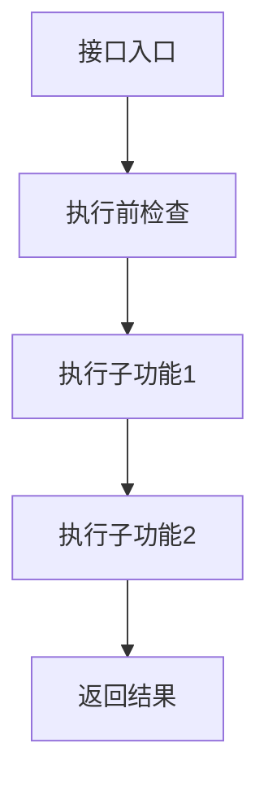
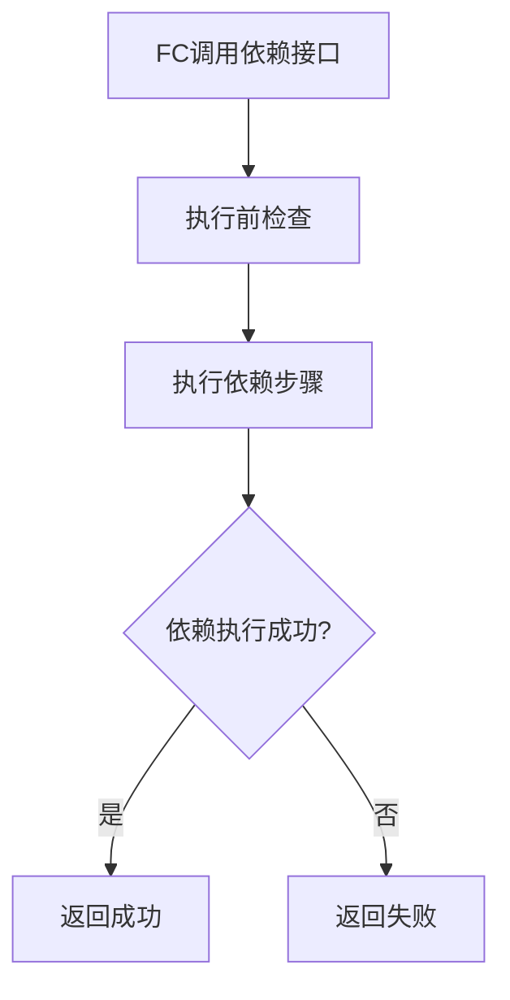
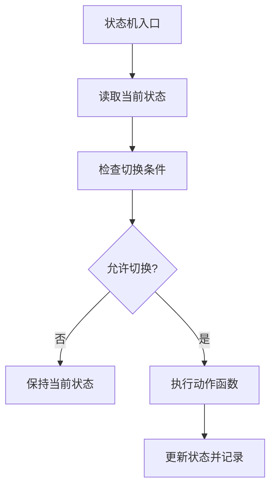

# FC详细设计定义

说明：

- 本模板用于正式、完整、可编码的 FC 实现级详细设计输出。
- 本文件只定义输出形态，不承担长期规则定义；长期规则以 `references/rules/*.md` 为准。
- 外部接口、依赖接口、关键内部控制流不应只写“功能说明”，应写出子功能拆分、执行步骤和流程图。
- 流程图节点必须表达步骤，不允许直接写代码、变量更新、数组下标、寄存器名或条件表达式。

## 文档元信息

- 详细设计版本: `V1` / `V2` / `V3`
- 详细设计状态: `Draft` / `Released`
- 输出模式: `Quick Draft` / `Formal Draft` / `Released`
- 生成时间:
- 生成/修订说明:
- 变更点总结:

## 1. FC概述

- FC名称:
- 当前软件层级:
- 核心职责:
- 运行模型:
- 单核/多核:

## 2. 设计输入

- 需求文档:
- 架构文档:
- 芯片/平台约束:
- 公司规则/命名规则:
- 其他输入:

## 3. 假设与待确认项

- 假设:
- 缺失信息:
- 待确认项:

## 4. 实现总策略

- 代码组织策略:
- cfg 与 runtime 分界:
- callout 策略:
- DET 与 fault 分界:
- MemMap 策略:

## 5. 文件列表设计

| 文件名 | 必需/可选 | 职责 | 关键内容 |
| --- | --- | --- | --- |
|  |  |  |  |

## 6. 单核/多核框架设计

### 6.1 核模型

| Core | 职责 | Init入口 | 周期任务 | 共享对象 |
| --- | --- | --- | --- | --- |
|  |  |  |  |  |

### 6.2 任务模型

| Task | Core | 周期 | 优先级类别 | 调用对象 | 监控动作 |
| --- | --- | --- | --- | --- | --- |
|  |  |  |  |  |  |

### 6.3 同步点与共享对象

| 对象/同步点 | 写方 | 读方 | 用途 | 一致性要求 |
| --- | --- | --- | --- | --- |
|  |  |  |  |  |

## 7. 外部接口设计

### 7.x `FC_FunctionName`

| Interface Prototype | Description | Sync/Async | Reentrancy | Return Value | Basic Constraints |
| --- | --- | --- | --- | --- | --- |
|  |  |  |  |  |  |

#### 7.x.1 子功能拆分

| 步骤 | 子功能 | 输入 | 输出 | 关键检查/约束 | 依赖对象 |
| --- | --- | --- | --- | --- | --- |
| 1 |  |  |  |  |  |

#### 7.x.2 执行步骤

1. 步骤1:
2. 步骤2:
3. 步骤3:

#### 7.x.3 参与内部函数

| 内部函数 | 作用 | 调用时机 |
| --- | --- | --- |
|  |  |  |

#### 7.x.4 流程图

## 8. 依赖接口与Callout设计

### 8.x `FC_CalloutFunctionName`

| Interface Prototype | Description | Implemented By | Sync/Async | Reentrancy | Basic Constraints |
| --- | --- | --- | --- | --- | --- |
|  |  |  |  |  |  |

#### 8.x.1 子功能拆分

| 步骤 | 子功能 | 输入 | 输出 | 失败路径 | 备注 |
| --- | --- | --- | --- | --- | --- |
| 1 |  |  |  |  |  |

#### 8.x.2 执行步骤

1. 步骤1:
2. 步骤2:
3. 步骤3:

#### 8.x.3 流程图

## 9. 内部函数设计

| 函数名 | 类别 | 作用域 | 职责 | 触发点 |
| --- | --- | --- | --- | --- |
|  |  | `static` / `Internal.h` |  |  |

### 9.1 关键内部控制流拆分

#### 9.1.x `InternalFlowName`

| 步骤 | 子功能 | 调用函数 | 输入/读取 | 输出/写入 | 说明 |
| --- | --- | --- | --- | --- | --- |
| 1 |  |  |  |  |  |

#### 9.1.x.1 执行步骤

1. 步骤1:
2. 步骤2:
3. 步骤3:

#### 9.1.x.2 流程图

## 10. 状态机设计

### 10.1 状态定义

| 状态名 | 含义 | 进入条件 | 退出条件 |
| --- | --- | --- | --- |
|  |  |  |  |

### 10.2 状态切换表

| 当前状态 | 条件函数 | 动作函数 | 下一状态 | 备注 |
| --- | --- | --- | --- | --- |
|  |  |  |  |  |

### 10.3 状态机主流程图

## 11. DET设计

| 检查点 | 触发条件 | 记录方式 | 返回策略 | 适用API |
| --- | --- | --- | --- | --- |
|  |  |  |  |  |

## 12. 故障处理设计

| 故障项 | 检测条件 | 确认规则 | 响应动作 | 恢复条件 | 保留策略 |
| --- | --- | --- | --- | --- | --- |
|  |  |  |  |  |  |

## 13. 运行时变量设计

| 变量名 | 类别 | 类型 | 所属Core | 写方 | 读方 | 生命周期 | MemMap | NoClear |
| --- | --- | --- | --- | --- | --- | --- | --- | --- |
|  |  |  |  |  |  |  |  |  |

## 14. 配置设计

### 14.1 配置宏参

| Macro | Purpose | Default Value | Usage Location | Status |
| --- | --- | --- | --- | --- |
|  |  |  |  |  |

### 14.2 配置表

| 表名 | 作用域 | 行含义 | 关键字段 | 所属文件 |
| --- | --- | --- | --- | --- |
|  |  |  |  |  |

## 15. MemMap设计

| Memory Section | Target Content | Start Macro | Stop Macro | Used Files | Notes |
| --- | --- | --- | --- | --- | --- |
|  |  |  |  |  |  |

## 16. 编码起步建议

- 首先创建文件:
- 首先实现接口:
- 首先落配置:
- 首先落runtime:
- 首先验证点:

### 16.1 推荐实现顺序

1. 建文件族与基础类型
2. 建 `Cfg.h/CfgData.h/Cfg.c`
3. 建外部接口原型与返回策略
4. 建内部函数骨架与子功能拆分
5. 建状态机和主流程
6. 接入 Callout / 依赖接口
7. 接入 DET / fault / runtime / MemMap

## 17. 风险与待确认项

| 索引 | 问题项 | 影响 | 建议动作 | 状态 |
| --- | --- | --- | --- | --- |
| R1 |  |  |  | `待评审` |
