# 《Gp_NCA9539 模块详细设计规范》

**Gp_NCA9539_详细设计规范**

**Gp_NCA9539 Detailed Design Specification**

项目编号/Project number: Gp_NCA9539
保密性/Security: 内部

**Document Properties**
Status: **草稿**
详细设计版本: **V1**
详细设计状态: **Draft**
Author: FC Implementation Workbench
Created: 2026-05-28

**Approved Versions**

Current Document version **V1** is **Draft**.

**Approved Versions:**

- TBD

**Document Signatures**

| 版本 | 状态 | 审批人 | 日期 | 意见 |
| --- | --- | --- | --- | --- |
| V1 | Draft | TBD | TBD | TBD |

## 适用说明

本文档适用于 `Gp_NCA9539` 模块的详细设计定义。本文档描述模块的功能方案、外部接口、内部接口、依赖接口、状态机、DET、故障处理、配置参数、运行参数和 MemMap 策略，面向编码实现。

---

## 文档修订记录

| 版本 | 日期 | 作者 | 变更说明 | 状态 |
| --- | --- | --- | --- | --- |
| V1 | 2026-05-28 | FC Implementation Workbench | 初版生成：基于 SRS V0.1.0 + SDD V1 + 芯片详细设计输入 D1-D8。7 个外部接口 + 8 个内部函数 + 6 个 Callout + 12 个配置宏参 + 4 个运行参数类型 + 4 个配置类型 + 7 个 MemMap 段。MainFunction 判定为不需要。 | Draft |

---

## 目录

- [1. FC概述](#1-fc概述)
- [2. 设计输入](#2-设计输入)
- [3. 功能设计](#3-功能设计)
- [4. 文件列表设计](#4-文件列表设计)
- [5. 单核框架设计](#5-单核框架设计)
- [6. 接口设计](#6-接口设计)
  - [6.1 外部接口设计](#61-外部接口设计)
  - [6.2 内部接口设计](#62-内部接口设计)
  - [6.3 依赖接口与Callout设计](#63-依赖接口与callout设计)
- [7. 状态机设计](#7-状态机设计)
- [8. DET设计](#8-det设计)
- [9. 故障处理设计](#9-故障处理设计)
- [10. 运行参数设计](#10-运行参数设计)
- [11. 配置参数设计](#11-配置参数设计)
- [12. MemMap设计](#12-memmap设计)
- [13. 编码起步建议](#13-编码起步建议)
- [14. 风险与待确认项](#14-风险与待确认项)
- [15. 伴生评审与追溯产物](#15-伴生评审与追溯产物)

---

## 1. FC概述

- **FC名称**: `Gp_NCA9539`
- **当前软件层级**: `IoExtDev`
- **核心职责**: Gp_NCA9539 是 NCA9539-Q1 16 位 I2C GPIO 扩展器芯片的驱动模块。模块通过 I2C 接口（最高 400 kHz Fast-mode）访问芯片 8 个内部寄存器（Input Port 0/1、Output Port 0/1、Polarity Inversion 0/1、Configuration 0/1），实现两个 8 位 GPIO 端口（P00~P07、P10~P17）的输入读取、输出控制、方向配置和极性反转。模块支持最多 4 个芯片实例（I2C 地址 0x74~0x77），各实例独立管理。模块提供 INT\ 开漏中断监控与响应、RESET\ 硬件复位控制，内置 DET 开发错误检测、I2C NACK 通信故障诊断、寄存器回读校验和中断丢失防护等安全机制。模块整体功能安全等级为 ASIL-B。
- **运行模型**: 纯同步事件驱动 — 所有 GPIO 操作（读写、方向配置、极性反转、中断查询、故障查询）均由上层同步调用并立即返回结果，无周期采样、无去抖、无状态机推进需求，不需要 MainFunction。
- **单核/多核**: 单核（多核 per-core 数据隔离结构已预留，CalloutGetCoreId 为 Conditional 状态，待项目确认）
- **实现方案**: 模块采用三层接口模型：外部接口层（7 个同步 API，以端口 8 位为操作粒度，Instance ID 统一标识芯片实例）→ 内部函数层（I2C 寄存器读写封装、参数校验、中断状态维护、故障记录）→ 依赖接口层（6 个 Callout 隔离 I2C 总线操作、RESET\ 引脚控制、INT\ 引脚读取、核 ID 获取和微秒延时）。所有 I2C 寄存器访问由 `I2cReadReg` / `I2cWriteReg` 内部函数封装完整的 I2C 帧协议（START→器件地址→命令字节→数据→STOP），通过 CalloutI2cWrite / CalloutI2cRead 抽象具体 MCU I2C 外设。芯片寄存器地址、位掩码、复位默认值等硬件常量集中在 `FC_Reg.h`。配置采用编译期宏参（`FC_Cfg.h`）+ 结构化配置类型（`FC_CfgData.h` / `FC_Cfg.c`）双层设计，运行态数据按 per-instance 聚合为结构化运行参数类型。中断处理采用读清除机制（芯片 Input Port 读取自动清除 INT\），模块内部维护中断待处理标志防止丢失。故障处理采用单次确认 + 锁存 + GetFaultStatus 读取清除策略，覆盖 I2C NACK 通信故障、寄存器回读不一致和寄存器默认值异常三类驱动逻辑故障。

---

## 2. 设计输入

| 输入类别 | 文档/来源 | 版本/日期 | 用途 |
| --- | --- | --- | --- |
| 需求文档 | Gp_NCA9539_软件需求规范.md (SRS) | V0.1.0 / 2026-05-28 | 22 条功能/接口/配置/诊断/时序/安全/编码/资源需求 |
| 架构文档 | Gp_NCA9539_软件架构设计.md (SDD) | V1 / 2026-05-28 | 7 个外部接口签名、5 个 Callout 依赖、6 个配置宏参、8 个运行时状态域、7 个 MemMap 段、12 个文件载体 |
| 芯片约束 | Gp_NCA9539_芯片详细设计输入.md | V0.1.0 / 2026-05-28 | D1 寄存器完整行为与常量、D2 状态转换条件、D3 故障源行为、D4 操作时序参数、D5 初始化约束、D6 数据组装规则、D7 命令/响应编码、D8 跨寄存器关系 |
| 平台约束 | FC Implementation Workbench Rules | — | 接口命名规范、单核框架约束、DET 模式、MemMap 分段策略、Callout 抽象规则 |
| 编码规范 | MISRA C:2012 | — | Mandatory 规则零违反、Required 规则偏离记录 |

---

## 3. 功能设计

### 3.1 功能设计说明

模块采用**纯同步调用**实现方案，所有 GPIO 操作在上层调用后立即通过 I2C 总线同步完成并返回结果，无需 MainFunction 周期调度。核心设计决策：

1. **同步 I2C 寄存器访问**: 所有芯片寄存器读写通过 `I2cReadReg` / `I2cWriteReg` 内部函数封装完整 I2C 帧协议，由 CalloutI2cWrite / CalloutI2cRead 抽象 MCU I2C 外设。写操作帧序列为 START→器件地址(W)→命令字节→数据→STOP，读操作帧序列增加重复 START 和器件地址(R)。
2. **端口粒度操作**: 外部接口以端口（8 位）为操作粒度，芯片 8 个寄存器自然对应两个端口 × 4 种功能（Input/Output/Polarity/Configuration）。所有 R/W 寄存器无保留位、无 RMW 约束（D1 确认），可直接 8 位写入。
3. **Per-Instance 运行时隔离**: 每个芯片实例维护独立的初始化状态、方向缓存、极性缓存、输出缓存、中断待处理标志和故障记录，通过 Instance ID 索引。
4. **中断读清除机制**: 利用芯片硬件特性——读取 Input Port 寄存器自动清除 INT\ 中断（D1 读副作用），模块内部在 GetInputLevel 执行时同步更新中断待处理标志。INT\ 有效时两个端口中断标志均置位（芯片不提供端口级中断源寄存器），上层依次读取两个端口以清除中断。
5. **DET 边界防御**: 所有外部接口入口统一执行参数校验（实例 ID 范围、初始化状态、端口号、NULL 指针），校验失败上报 DET 并立即返回 E_NOT_OK，不进入业务逻辑。
6. **故障单次确认+锁存**: I2C NACK、寄存器回读不一致和寄存器默认值异常采用单次确认策略（检测到即确认），确认后锁存故障记录，通过 GetFaultStatus 接口读取后自动清除。模块不提供独立故障清除接口。

### 3.2 功能框图

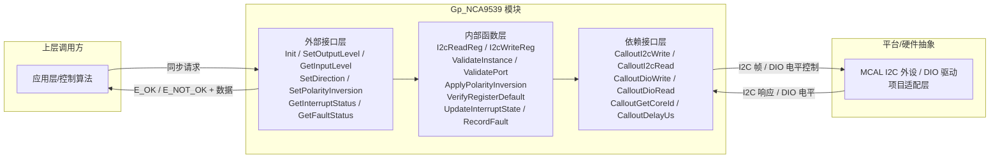

---

## 4. 文件列表设计

| 文件名 | 必需/可选 | 职责 | 关键内容 |
| --- | --- | --- | --- |
| `Gp_NCA9539.c` | 必需 | 驱动实现文件 | 7 个外部 API 实现、8 个内部静态函数、per-instance 运行时容器（状态机数组、运行时数据数组、I2C 事务缓冲、DET 缓冲） |
| `Gp_NCA9539.h` | 必需 | 外部接口头文件 | 7 个外部 API 原型声明、CODE_START/STOP 段宏、Gp_NCA9539_Cfg.h 和 Gp_NCA9539_CfgData.h 的包含 |
| `Gp_NCA9539_Types.h` | 必需 | 类型定义头文件 | 实例状态枚举（UNINIT/NORMAL/RESET_RECOVERY）、运行时数据结构体、初始化配置结构体、故障状态位定义、I2C 速率模式枚举 |
| `Gp_NCA9539_Cfg.h` | 必需 | 配置宏参头文件 | DET 开关、版本号宏、实例数量、I2C 速率模式、寄存器回读校验开关、时序阈值宏、故障确认阈值 |
| `Gp_NCA9539_Cfg.c` | 必需 | 配置数据实现文件 | Per-instance 默认方向/输出/极性配置表、per-instance I2C 地址映射表、配置结构体 const 实例化 |
| `Gp_NCA9539_CfgData.h` | 必需 | 配置数据声明头文件 | 配置类型定义（顶层容器/per-instance/per-port）、extern 配置对象声明 |
| `Gp_NCA9539_Reg.h` | 必需 | 寄存器定义头文件 | 8 个寄存器地址常量（0x00~0x07）、I2C 基地址（0x74）、地址掩码（0x07）、各寄存器位段掩码和移位量、复位默认值常量、中断状态位编码 |
| `Gp_NCA9539_Callout.h` | 必需 | 平台适配接口头文件 | 6 个 Callout 原型：CalloutI2cWrite、CalloutI2cRead、CalloutDioWrite、CalloutDioRead、CalloutGetCoreId、CalloutDelayUs |
| `Gp_NCA9539_Callout.c` | 必需 | 平台适配实现文件 | Callout 集成桩或项目适配实现（I2C 外设绑定、DIO 引脚映射、核 ID 获取、微秒延时） |
| `Gp_NCA9539_MemMap.h` | 必需 | 内存段映射头文件 | CODE、CLEAR_FAR_DATA、CONST（global + per-core）、REG CONST、CALIB、CODE RAM COPY 各段 START/STOP 宏 |
| `Gp_NCA9539_Internal.h` | 可选 | 内部共享头文件 | 若模块拆分为多个 .c 文件时，承载跨文件的内部函数声明和内部类型；单文件时不需要 |
| `Gp_NCA9539_Cali.c` | 可选 | 标定实现文件 | 预留，当前为空（IoExtDev 族默认无标定参数） |

---

## 5. 单核框架设计

### 5.1 框架设计说明

模块默认采用单核框架。所有外部 API 在调用线程的上下文中同步执行，运行时数据归属单一执行上下文，无需跨核同步或核间路由。

当前架构设计中包含 per-core 数据隔离基础设施（per-core CLEAR_FAR_DATA / CONST MemMap 段、CalloutGetCoreId），这是为多核部署预留的结构。若项目确认为单核部署，per-core 段可简化为全局单例；若确认为多核部署，则各核独立持有自己的运行时数据副本，通过 CalloutGetCoreId 在初始化时选择正确的数据区。当前详细设计按架构的 per-core 数据布局编写，CalloutGetCoreId 保持 Conditional 状态。所有流程图中不包含核匹配、核遍历或 CalloutGetCoreId 节点。

### 5.2 核模型

| Core | 职责 | Init入口 | 周期任务 | 运行时数据 |
| --- | --- | --- | --- | --- |
| Core0 | 全部 GPIO 操作（读写/方向/极性/中断/故障） | Gp_NCA9539_Init | 无（纯同步调用） | per-instance 状态机数组、运行时数据容器、I2C 缓冲、DET 缓冲 |

### 5.3 任务模型

| Task | Core | 周期 | 调用对象 | 监控动作 |
| --- | --- | --- | --- | --- |
| N/A | — | — | 所有外部 API 由上层任务上下文同步调用 | 无周期监控 |

> 模块无 MainFunction，无周期任务。所有功能由上层在需要时通过外部 API 同步触发。

### 5.4 同步点与共享对象

无共享对象，所有数据在当前核内闭环。

---

## 6. 接口设计

### 6.1 外部接口设计

> 本章按统一格式逐一完整展开架构中定义的 7 个外部接口：Gp_NCA9539_Init、Gp_NCA9539_SetOutputLevel、Gp_NCA9539_GetInputLevel、Gp_NCA9539_SetDirection、Gp_NCA9539_SetPolarityInversion、Gp_NCA9539_GetInterruptStatus、Gp_NCA9539_GetFaultStatus。每个接口包含接口原型表、子功能拆分、执行步骤、调用关系表和流程图。

#### 6.1.1 `Gp_NCA9539_Init`

| Interface Prototype | Description | Sync/Async | Reentrancy | Return Value | Basic Constraints |
| --- | --- | --- | --- | --- | --- |
| `Std_ReturnType Gp_NCA9539_Init(uint16 Id_u16, const Gp_NCA9539_InitConfigType* Config_pcst)` | 初始化指定芯片实例。依次执行：I2C 通信可达性验证、寄存器默认值校验（Configuration 期望 0xFF）、按配置写入方向/输出初值/极性反转、回读校验 Configuration 和 Output Port 寄存器。必须在实例的其他 API 调用前完成。 | Synchronous | Non-reentrant（同实例） | `E_OK` 初始化成功；`E_NOT_OK` 实例已初始化、I2C 通信失败、寄存器默认校验失败、回读不一致 | `Id_u16` 须映射已配置实例（0 ~ `GP_NCA9539_CFG_INSTANCE_COUNT`-1）。`Config_pcst` 非 NULL。实例须处于 UNINIT 状态。RESET\ 须为高、VDD 稳定。RESET\ 释放后内部等待 ≥200ns 再发起 I2C 通信。 |

##### 6.1.1.1 子功能拆分

| 步骤 | 子功能 | 输入 | 输出 | 关键检查/约束 | 依赖对象 |
| --- | --- | --- | --- | --- | --- |
| 1 | 参数校验与状态检查 | Id_u16, Config_pcst | 校验结果 | 实例 ID 范围、Config_pcst 非 NULL、实例当前状态为 UNINIT | ValidateInstance |
| 2 | RESET\ 释放等待 | Id_u16 | — | RESET\ 释放后等待 ≥200ns (t_rec(rst))；若实例未经历复位则跳过 | CalloutDioWrite, CalloutDelayUs |
| 3 | I2C 通信可达性验证 | Id_u16 | ACK/NACK | 向器件地址发送空写（仅 START→地址→STOP），检测 ACK；重试上限 3 次（D5 约束） | CalloutI2cWrite |
| 4 | Configuration 寄存器默认值校验 | Id_u16 | 校验结果 | 读 Configuration 0 (0x06) 期望 0xFF，Configuration 1 (0x07) 期望 0xFF；重试上限 3 次（D5 约束） | I2cReadReg, VerifyRegisterDefault |
| 5 | 配置端口方向 | Id_u16, Config_pcst | 写入结果 | 写 Configuration 0/1 寄存器，写后回读校验 | I2cWriteReg, I2cReadReg |
| 6 | 配置输出端口初值 | Id_u16, Config_pcst | 写入结果 | 写 Output Port 0/1 寄存器；仅对已配置为输出的引脚生效（D8 约束） | I2cWriteReg |
| 7 | 配置极性反转 | Id_u16, Config_pcst | 写入结果 | 写 Polarity Inversion 0/1 寄存器 | I2cWriteReg |
| 8 | 回读校验与状态切换 | Id_u16 | 校验结果 | 回读 Configuration 和 Output Port 寄存器，与写入值比较；全部通过后实例状态切换为 NORMAL | I2cReadReg |
| 9 | 初始化运行时缓存 | Id_u16, Config_pcst | — | 将方向/输出/极性配置写入 per-instance 运行时缓存，清除中断标志和故障记录 | — |

##### 6.1.1.2 执行步骤

1. 校验 `Id_u16` 范围：0 ≤ Id_u16 < `GP_NCA9539_CFG_INSTANCE_COUNT`，越界则 DET 上报并返回 E_NOT_OK
2. 校验 `Config_pcst` 非 NULL，为 NULL 则 DET 上报并返回 E_NOT_OK
3. 检查实例当前状态，非 UNINIT 则 DET 上报并返回 E_NOT_OK
4. 若 RESET\ 刚释放（由上层或复位流程触发），通过 CalloutDelayUs 等待 ≥200ns 以确保芯片内部 POR 完成
5. 发送空 I2C 写（START→器件地址(W)→STOP），检测 ACK；若 NACK 则重试最多 `GP_NCA9539_CFG_MAX_I2C_RETRY_COUNT` 次，均失败则记录故障并返回 E_NOT_OK
6. 读 Configuration 0 (0x06) 和 Configuration 1 (0x07)，期望复位默认值 0xFF（D5 约束）；不匹配则重试最多 `GP_NCA9539_CFG_MAX_I2C_RETRY_COUNT` 次，均失败则记录故障并返回 E_NOT_OK
7. 按 Config_pcst 中 PortConfig_ast[0].Direction_u8 写 Configuration 0 寄存器，写后回读校验
8. 按 Config_pcst 中 PortConfig_ast[1].Direction_u8 写 Configuration 1 寄存器，写后回读校验；不一致则记录故障并返回 E_NOT_OK
9. 按 Config_pcst 中 PortConfig_ast[0].OutputInit_u8 写 Output Port 0 寄存器（地址 0x02）
10. 按 Config_pcst 中 PortConfig_ast[1].OutputInit_u8 写 Output Port 1 寄存器（地址 0x03）
11. 按 Config_pcst 中 PortConfig_ast[0].Polarity_u8 写 Polarity Inversion 0 寄存器（地址 0x04）
12. 按 Config_pcst 中 PortConfig_ast[1].Polarity_u8 写 Polarity Inversion 1 寄存器（地址 0x05）
13. 若 `GP_NCA9539_CFG_REG_READBACK_VERIFY_ENABLE == STD_ON`，回读 Output Port 0/1 寄存器与写入值比较；不一致则记录故障并返回 E_NOT_OK
14. 更新 per-instance 运行时缓存：DirectionCache/PolarityCache/OutputCache 写入配置值
15. 清除 per-instance 中断待处理标志和故障记录
16. 实例状态切换为 NORMAL，返回 E_OK

##### 6.1.1.3 调用关系

| 调用对象 | 类别 | 作用 | 调用时机 |
| --- | --- | --- | --- |
| `ValidateInstance` | 内部函数 | 校验实例 ID 范围和未初始化状态 | 步骤 1-3 |
| `CalloutDioWrite` | 依赖接口 | 控制 RESET\ 引脚电平 | 步骤 4（若需要） |
| `CalloutDelayUs` | 依赖接口 | RESET\ 释放后等待 ≥200ns | 步骤 4 |
| `CalloutI2cWrite` | 依赖接口 | 发送空写帧验证 I2C 可达性 | 步骤 5 |
| `I2cReadReg` | 内部函数 | 读取 Configuration 寄存器默认值 | 步骤 6 |
| `VerifyRegisterDefault` | 内部函数 | 比较读回值与期望默认值 0xFF | 步骤 6 |
| `I2cWriteReg` | 内部函数 | 写入 Configuration/Output/Polarity 寄存器 | 步骤 7-12 |
| `I2cReadReg` | 内部函数 | 回读 Configuration/Output 寄存器做校验 | 步骤 7,8,13 |

##### 6.1.1.4 流程图

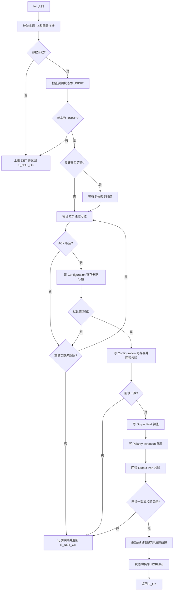

---

#### 6.1.2 `Gp_NCA9539_SetOutputLevel`

| Interface Prototype | Description | Sync/Async | Reentrancy | Return Value | Basic Constraints |
| --- | --- | --- | --- | --- | --- |
| `Std_ReturnType Gp_NCA9539_SetOutputLevel(uint16 Id_u16, uint8 Port_u8, uint8 OutputValue_u8)` | 向指定实例的指定端口（0 或 1）的 Output Port 寄存器写入 8 位输出值。仅对已配置为输出的引脚生效，配置为输入的引脚忽略对应位。写后更新运行时输出缓存。 | Synchronous | Reentrant | `E_OK` I2C 写成功；`E_NOT_OK` 实例未初始化、端口号无效、I2C 通信失败 | `Id_u16` 须引用已初始化实例。`Port_u8` 须为 0 或 1。`OutputValue_u8`: bit=0 驱动 LOW，bit=1 驱动 HIGH（开漏需外部上拉）。失败时保持原输出不变。 |

##### 6.1.2.1 子功能拆分

| 步骤 | 子功能 | 输入 | 输出 | 关键检查/约束 | 依赖对象 |
| --- | --- | --- | --- | --- | --- |
| 1 | 参数校验与状态检查 | Id_u16, Port_u8 | 校验结果 | 实例 ID 范围、实例已初始化（NORMAL）、端口号 0 或 1 | ValidateInstance, ValidatePort |
| 2 | I2C 写 Output Port 寄存器 | Id_u16, Port_u8, OutputValue_u8 | I2C ACK/NACK | Port 0→地址 0x02, Port 1→地址 0x03；无 RMW（D1 确认所有位为 R/W） | I2cWriteReg |
| 3 | 更新输出缓存 | Id_u16, Port_u8, OutputValue_u8 | — | I2C ACK 后更新 OutputCache | — |

##### 6.1.2.2 执行步骤

1. 校验 `Id_u16` 范围并检查实例已初始化（状态为 NORMAL），失败则 DET 上报并返回 E_NOT_OK
2. 校验 `Port_u8` 为 0 或 1，无效则 DET 上报并返回 E_NOT_OK
3. 根据 Port_u8 选择寄存器地址（Port 0: 0x02, Port 1: 0x03）
4. 调用 I2cWriteReg 通过 I2C 写入 `OutputValue_u8` 到 Output Port 寄存器
5. I2C NACK 则记录故障并返回 E_NOT_OK
6. 更新 per-instance 运行时 `OutputCache_au8[Port_u8]` = `OutputValue_u8`
7. 返回 E_OK

##### 6.1.2.3 调用关系

| 调用对象 | 类别 | 作用 | 调用时机 |
| --- | --- | --- | --- |
| `ValidateInstance` | 内部函数 | 校验实例 ID 和初始化状态 | 步骤 1 |
| `ValidatePort` | 内部函数 | 校验端口号有效性 | 步骤 2 |
| `I2cWriteReg` | 内部函数 | 通过 I2C 写 Output Port 寄存器 | 步骤 4 |
| `RecordFault` | 内部函数 | 记录 I2C NACK 通信故障 | 步骤 5（NACK 时） |

##### 6.1.2.4 流程图

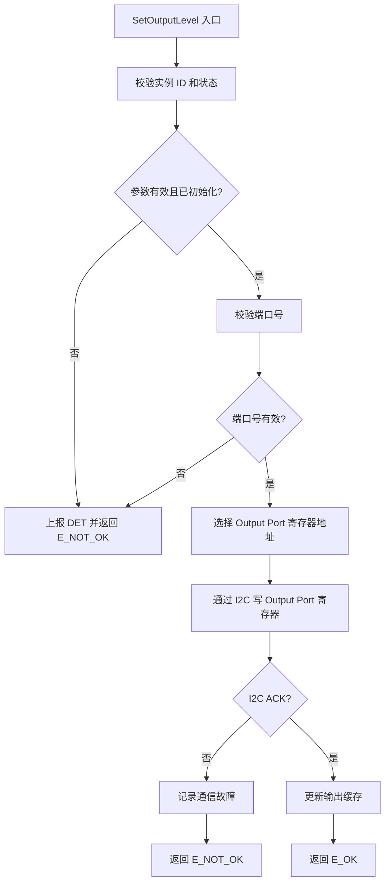

---

#### 6.1.3 `Gp_NCA9539_GetInputLevel`

| Interface Prototype | Description | Sync/Async | Reentrancy | Return Value | Basic Constraints |
| --- | --- | --- | --- | --- | --- |
| `Std_ReturnType Gp_NCA9539_GetInputLevel(uint16 Id_u16, uint8 Port_u8, uint8* InputValue_pu8)` | 从指定实例的指定端口的 Input Port 寄存器读取 8 位输入值。返回值为极性反转后的逻辑值（若已配置极性反转）。Input Port 寄存器反映引脚实际电平（D1 确认：无论引脚方向）。读操作可能清除芯片 INT\ 中断标志（D1 读副作用），本接口读取后同步清除内部中断待处理标志。 | Synchronous | Reentrant | `E_OK` I2C 读成功；`E_NOT_OK` 实例未初始化、端口号无效、InputValue_pu8 为 NULL、I2C 通信失败 | `Id_u16` 须引用已初始化实例。`Port_u8` 须为 0 或 1。`InputValue_pu8` 非 NULL（NULL 时 DET 上报）。失败时输出指针内容不变。 |

##### 6.1.3.1 子功能拆分

| 步骤 | 子功能 | 输入 | 输出 | 关键检查/约束 | 依赖对象 |
| --- | --- | --- | --- | --- | --- |
| 1 | 参数校验与状态检查 | Id_u16, Port_u8, InputValue_pu8 | 校验结果 | 实例 ID 范围、实例已初始化、端口号 0/1、指针非 NULL | ValidateInstance, ValidatePort |
| 2 | I2C 读 Input Port 寄存器 | Id_u16, Port_u8 | 原始输入值 | Port 0→地址 0x00, Port 1→地址 0x01；读操作可能清除 INT\（D1） | I2cReadReg |
| 3 | 极性反转处理 | 原始输入值, 极性缓存 | 最终输入值 | 按 PolarityCache 对相应位做异或反转（bit=1 反转） | ApplyPolarityInversion |
| 4 | 中断状态更新 | Id_u16, Port_u8 | — | Input Port 读取已可能清除芯片 INT\，同步清除内部对应端口中断待处理标志 | UpdateInterruptState |

##### 6.1.3.2 执行步骤

1. 校验 `Id_u16` 范围并检查实例已初始化（NORMAL），失败则 DET 上报并返回 E_NOT_OK
2. 校验 `Port_u8` 为 0 或 1，无效则 DET 上报并返回 E_NOT_OK
3. 校验 `InputValue_pu8` 非 NULL，为 NULL 则 DET 上报并返回 E_NOT_OK
4. 根据 Port_u8 选择寄存器地址（Port 0: 0x00, Port 1: 0x01）
5. 调用 I2cReadReg 通过 I2C 读取 Input Port 寄存器原始值
6. I2C NACK 则记录故障并返回 E_NOT_OK
7. 读取 per-instance 运行时 `PolarityCache_au8[Port_u8]`
8. 对原始值按极性缓存做位异或：`*InputValue_pu8 = RawValue_u8 ^ PolarityCache_au8[Port_u8]`
9. 清除 per-instance 运行时中对应端口的中断待处理标志（芯片 Input Port 读取已自动清除 INT\）
10. 返回 E_OK

##### 6.1.3.3 调用关系

| 调用对象 | 类别 | 作用 | 调用时机 |
| --- | --- | --- | --- |
| `ValidateInstance` | 内部函数 | 校验实例 ID 和初始化状态 | 步骤 1 |
| `ValidatePort` | 内部函数 | 校验端口号有效性 | 步骤 2 |
| `I2cReadReg` | 内部函数 | 通过 I2C 读 Input Port 寄存器 | 步骤 5 |
| `RecordFault` | 内部函数 | 记录 I2C NACK 通信故障 | 步骤 6（NACK 时） |
| `ApplyPolarityInversion` | 内部函数 | 对原始值按极性缓存做位异或 | 步骤 8 |
| `UpdateInterruptState` | 内部函数 | 清除对应端口中断待处理标志 | 步骤 9 |

##### 6.1.3.4 流程图

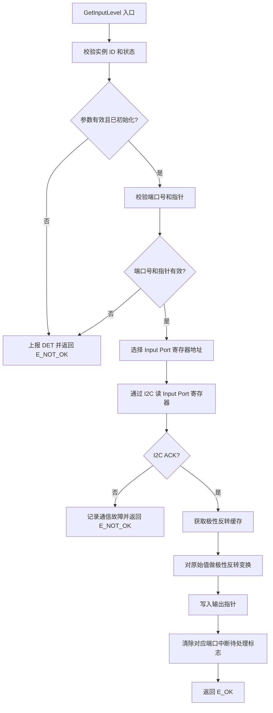

---

#### 6.1.4 `Gp_NCA9539_SetDirection`

| Interface Prototype | Description | Sync/Async | Reentrancy | Return Value | Basic Constraints |
| --- | --- | --- | --- | --- | --- |
| `Std_ReturnType Gp_NCA9539_SetDirection(uint16 Id_u16, uint8 Port_u8, uint8 Direction_u8)` | 向指定实例的指定端口的 Configuration 寄存器写入 8 位方向配置。bit=1 配置为输入（高阻态），bit=0 配置为输出。D1 确认上电默认全部为输入（0xFF）。 | Synchronous | Reentrant | `E_OK` I2C 写成功；`E_NOT_OK` 实例未初始化、端口号无效、I2C 通信失败 | `Id_u16` 须引用已初始化实例。`Port_u8` 须为 0 或 1。引脚从输出切换为输入可能触发假中断。失败时保持原配置不变。 |

##### 6.1.4.1 子功能拆分

| 步骤 | 子功能 | 输入 | 输出 | 关键检查/约束 | 依赖对象 |
| --- | --- | --- | --- | --- | --- |
| 1 | 参数校验与状态检查 | Id_u16, Port_u8 | 校验结果 | 实例 ID 范围、实例已初始化、端口号 0/1 | ValidateInstance, ValidatePort |
| 2 | I2C 写 Configuration 寄存器 | Id_u16, Port_u8, Direction_u8 | I2C ACK/NACK | Port 0→地址 0x06, Port 1→地址 0x07；无 RMW（D1 确认所有位为 R/W） | I2cWriteReg |
| 3 | 更新方向缓存 | Id_u16, Port_u8, Direction_u8 | — | I2C ACK 后更新 DirectionCache | — |

##### 6.1.4.2 执行步骤

1. 校验 `Id_u16` 范围并检查实例已初始化（NORMAL），失败则 DET 上报并返回 E_NOT_OK
2. 校验 `Port_u8` 为 0 或 1，无效则 DET 上报并返回 E_NOT_OK
3. 根据 Port_u8 选择寄存器地址（Port 0: 0x06, Port 1: 0x07）
4. 调用 I2cWriteReg 通过 I2C 写入 `Direction_u8` 到 Configuration 寄存器
5. I2C NACK 则记录故障并返回 E_NOT_OK
6. 更新 per-instance 运行时 `DirectionCache_au8[Port_u8]` = `Direction_u8`
7. 返回 E_OK

##### 6.1.4.3 调用关系

| 调用对象 | 类别 | 作用 | 调用时机 |
| --- | --- | --- | --- |
| `ValidateInstance` | 内部函数 | 校验实例 ID 和初始化状态 | 步骤 1 |
| `ValidatePort` | 内部函数 | 校验端口号有效性 | 步骤 2 |
| `I2cWriteReg` | 内部函数 | 通过 I2C 写 Configuration 寄存器 | 步骤 4 |
| `RecordFault` | 内部函数 | 记录 I2C NACK 通信故障 | 步骤 5（NACK 时） |

##### 6.1.4.4 流程图

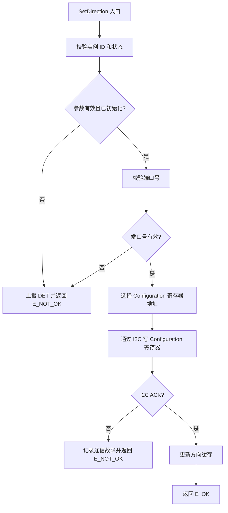

---

#### 6.1.5 `Gp_NCA9539_SetPolarityInversion`

| Interface Prototype | Description | Sync/Async | Reentrancy | Return Value | Basic Constraints |
| --- | --- | --- | --- | --- | --- |
| `Std_ReturnType Gp_NCA9539_SetPolarityInversion(uint16 Id_u16, uint8 Port_u8, uint8 Polarity_u8)` | 向指定实例的指定端口的 Polarity Inversion 寄存器写入 8 位极性反转配置。bit=1 反转对应输入引脚逻辑电平，bit=0 保留原始极性。D1 确认仅影响 Input Port 读值，不影响引脚实际电平或 Output Port 寄存器。上电默认全部不反转（0x00）。 | Synchronous | Reentrant | `E_OK` I2C 写成功；`E_NOT_OK` 实例未初始化、端口号无效、I2C 通信失败 | `Id_u16` 须引用已初始化实例。`Port_u8` 须为 0 或 1。失败时保持原配置不变。 |

##### 6.1.5.1 子功能拆分

| 步骤 | 子功能 | 输入 | 输出 | 关键检查/约束 | 依赖对象 |
| --- | --- | --- | --- | --- | --- |
| 1 | 参数校验与状态检查 | Id_u16, Port_u8 | 校验结果 | 同上 | ValidateInstance, ValidatePort |
| 2 | I2C 写 Polarity Inversion 寄存器 | Id_u16, Port_u8, Polarity_u8 | I2C ACK/NACK | Port 0→地址 0x04, Port 1→地址 0x05；无 RMW（D1 确认） | I2cWriteReg |
| 3 | 更新极性缓存 | Id_u16, Port_u8, Polarity_u8 | — | I2C ACK 后更新 PolarityCache | — |

##### 6.1.5.2 执行步骤

1. 校验 `Id_u16` 范围并检查实例已初始化（NORMAL），失败则 DET 上报并返回 E_NOT_OK
2. 校验 `Port_u8` 为 0 或 1，无效则 DET 上报并返回 E_NOT_OK
3. 根据 Port_u8 选择寄存器地址（Port 0: 0x04, Port 1: 0x05）
4. 调用 I2cWriteReg 通过 I2C 写入 `Polarity_u8` 到 Polarity Inversion 寄存器
5. I2C NACK 则记录故障并返回 E_NOT_OK
6. 更新 per-instance 运行时 `PolarityCache_au8[Port_u8]` = `Polarity_u8`
7. 返回 E_OK

##### 6.1.5.3 调用关系

| 调用对象 | 类别 | 作用 | 调用时机 |
| --- | --- | --- | --- |
| `ValidateInstance` | 内部函数 | 校验实例 ID 和初始化状态 | 步骤 1 |
| `ValidatePort` | 内部函数 | 校验端口号有效性 | 步骤 2 |
| `I2cWriteReg` | 内部函数 | 通过 I2C 写 Polarity Inversion 寄存器 | 步骤 4 |
| `RecordFault` | 内部函数 | 记录 I2C NACK 通信故障 | 步骤 5（NACK 时） |

##### 6.1.5.4 流程图

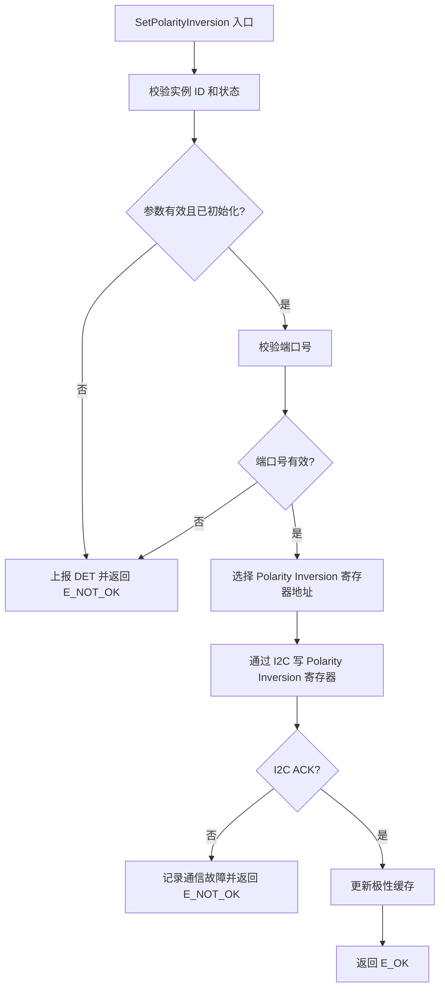

---

#### 6.1.6 `Gp_NCA9539_GetInterruptStatus`

| Interface Prototype | Description | Sync/Async | Reentrancy | Return Value | Basic Constraints |
| --- | --- | --- | --- | --- | --- |
| `Std_ReturnType Gp_NCA9539_GetInterruptStatus(uint16 Id_u16, uint8* IntStatus_pu8)` | 查询指定实例的中断状态。通过 CalloutDioRead 读取 INT\ 引脚电平，若有效（低电平）则置位两个端口的中断待处理标志并返回。Bit 0: 端口 0 中断待处理，Bit 1: 端口 1 中断待处理。中断在 Input Port 读取后由芯片自动清除（D1 读副作用）；本 API 保留内部中断记录直到应用读取 Input Port。 | Synchronous | Reentrant | `E_OK` 查询成功；`E_NOT_OK` 实例未初始化、IntStatus_pu8 为 NULL | `Id_u16` 须引用已初始化实例。`IntStatus_pu8` 非 NULL（NULL 时 DET 上报）。失败时输出指针内容不变。 |

##### 6.1.6.1 子功能拆分

| 步骤 | 子功能 | 输入 | 输出 | 关键检查/约束 | 依赖对象 |
| --- | --- | --- | --- | --- | --- |
| 1 | 参数校验与状态检查 | Id_u16, IntStatus_pu8 | 校验结果 | 实例 ID 范围、实例已初始化（NORMAL）、指针非 NULL | ValidateInstance |
| 2 | 读取 INT\ 引脚电平 | Id_u16 | 引脚电平 (0=有效) | 通过 CalloutDioRead 读取；开漏，需外部上拉 | CalloutDioRead |
| 3 | 中断端口判定与标志置位 | INT\ 电平, 内部中断标志 | 中断状态字节 | INT\ 低有效时两个端口中断标志均置位（芯片无端口级中断源寄存器） | UpdateInterruptState |
| 4 | 组装并返回中断状态 | 内部中断标志 | *IntStatus_pu8 | Bit0=端口0, Bit1=端口1 | — |

##### 6.1.6.2 执行步骤

1. 校验 `Id_u16` 范围并检查实例已初始化（NORMAL），失败则 DET 上报并返回 E_NOT_OK
2. 校验 `IntStatus_pu8` 非 NULL，为 NULL 则 DET 上报并返回 E_NOT_OK
3. 初始化 `*IntStatus_pu8` = 0x00
4. 调用 CalloutDioRead 读取 INT\ 引脚电平
5. 若 INT\ 为低（有效）：两个端口的中断待处理标志均置位（`IntPort0Pending_b`=TRUE, `IntPort1Pending_b`=TRUE）；`*IntStatus_pu8` = 0x03（Bit0+Bit1）
6. 若 INT\ 为高（无效）但内部标志仍置位（Input Port 尚未读取），`*IntStatus_pu8` 按保留标志组装
7. 返回 E_OK

> 注：芯片的中断读清除机制意味着输入变化会拉低 INT\，但芯片不提供寄存器直接标识哪个端口触发了中断。本模块采用简化策略：当 INT\ 有效时，两个端口的中断待处理标志均置位，上层应依次读取两个端口的 Input Port 寄存器以清除中断。不通过逐端口试探读取来区分触发端口。

##### 6.1.6.3 调用关系

| 调用对象 | 类别 | 作用 | 调用时机 |
| --- | --- | --- | --- |
| `ValidateInstance` | 内部函数 | 校验实例 ID 和初始化状态 | 步骤 1 |
| `CalloutDioRead` | 依赖接口 | 读取 INT\ 引脚电平 | 步骤 4 |
| `UpdateInterruptState` | 内部函数 | 置位中断待处理标志 | 步骤 5 |

##### 6.1.6.4 流程图

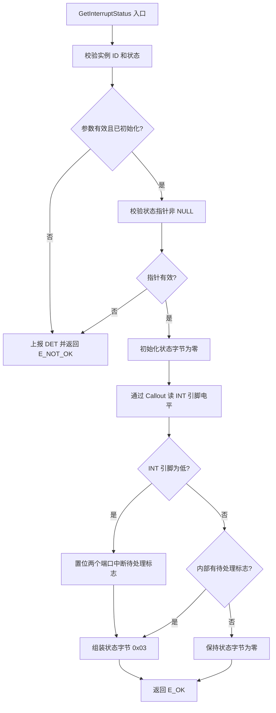

---

#### 6.1.7 `Gp_NCA9539_GetFaultStatus`

| Interface Prototype | Description | Sync/Async | Reentrancy | Return Value | Basic Constraints |
| --- | --- | --- | --- | --- | --- |
| `Std_ReturnType Gp_NCA9539_GetFaultStatus(uint16 Id_u16, uint32* FaultStatus_pu32)` | 返回指定实例的当前故障和诊断状态。报告最近一次 I2C 通信故障详情：故障是否发生、故障寄存器地址、故障类型（NACK=1）。故障信息锁存至本 API 读取后自动清除。 | Synchronous | Reentrant | `E_OK` 查询成功；`E_NOT_OK` 实例未初始化、FaultStatus_pu32 为 NULL | `Id_u16` 须引用已初始化实例。`FaultStatus_pu32` 非 NULL（NULL 时 DET 上报）。读取后故障状态清除。 |

##### 6.1.7.1 子功能拆分

| 步骤 | 子功能 | 输入 | 输出 | 关键检查/约束 | 依赖对象 |
| --- | --- | --- | --- | --- | --- |
| 1 | 参数校验与状态检查 | Id_u16, FaultStatus_pu32 | 校验结果 | 实例 ID 范围、实例已初始化、指针非 NULL | ValidateInstance |
| 2 | 读取故障记录 | Id_u16 | 故障记录 | 从 per-instance 运行时读取 FaultActive/FaultRegAddr/FaultType | — |
| 3 | 编码故障状态字 | 故障记录 | *FaultStatus_pu32 | Bit[0]=活跃标志, Bit[15:8]=寄存器地址, Bit[23:16]=故障类型 | — |
| 4 | 清除故障记录 | Id_u16 | — | 读取后将 FaultActive_b 置 FALSE | — |

##### 6.1.7.2 执行步骤

1. 校验 `Id_u16` 范围并检查实例已初始化（NORMAL），失败则 DET 上报并返回 E_NOT_OK
2. 校验 `FaultStatus_pu32` 非 NULL，为 NULL 则 DET 上报并返回 E_NOT_OK
3. 从 per-instance 运行时读取故障记录字段
4. 编码故障状态字：Bit[0] = `FaultActive_b`，Bit[15:8] = `FaultRegAddr_u8`，Bit[23:16] = `FaultType_u8`（1=NACK）
5. 将编码后的值写入 `*FaultStatus_pu32`
6. 清除 per-instance 运行时故障记录：`FaultActive_b` = FALSE
7. 返回 E_OK

##### 6.1.7.3 调用关系

| 调用对象 | 类别 | 作用 | 调用时机 |
| --- | --- | --- | --- |
| `ValidateInstance` | 内部函数 | 校验实例 ID 和初始化状态 | 步骤 1 |

##### 6.1.7.4 流程图

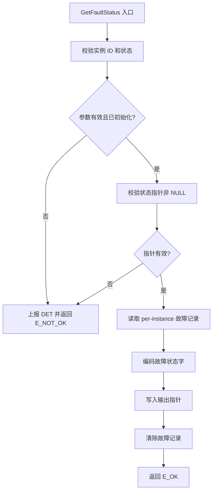

---

### 6.2 内部接口设计

> 本章按统一格式逐一完整展开所有内部函数：I2cReadReg、I2cWriteReg、ValidateInstance、ValidatePort、ApplyPolarityInversion、VerifyRegisterDefault、UpdateInterruptState、RecordFault。每个内部函数包含函数原型表、子功能拆分、执行步骤、调用关系表和流程图。

#### 6.2.1 `I2cReadReg`

| Function Prototype | Description | Scope | Trigger Point | Dependency/Callout |
| --- | --- | --- | --- | --- |
| `static Std_ReturnType I2cReadReg(uint16 Id_u16, uint8 RegAddr_u8, uint8* Data_pu8, uint16 Size_u16)` | 通过 I2C 从指定芯片实例读取指定寄存器地址的数据。封装完整 I2C 读帧流程：以 RegAddr_u8 为命令字节，由 CalloutI2cRead 完成 START→器件地址(W)→命令字节→重复 START→器件地址(R)→读取数据→NACK→STOP 的全帧序列（D7 协议）。 | `static` (FC.c) | GetInputLevel、Init 中的寄存器回读和默认值校验 | `Gp_NCA9539_CalloutI2cRead` |

##### 6.2.1.1 子功能拆分

| 步骤 | 子功能 | 输入 | 输出 | 关键检查/约束 | 依赖对象 |
| --- | --- | --- | --- | --- | --- |
| 1 | 参数校验 | RegAddr_u8, Data_pu8 | 校验结果 | RegAddr_u8 ≤ 0x07，Data_pu8 非 NULL | — |
| 2 | I2C 读操作 | Id_u16, RegAddr_u8, Size_u16 | 读取数据, ACK/NACK | Callout 内部完成完整读帧（D7） | CalloutI2cRead |
| 3 | NACK 处理 | Callout 返回值 | E_OK/E_NOT_OK | NACK 时记录故障 | RecordFault |

##### 6.2.1.2 执行步骤

1. 若 `RegAddr_u8 > 0x07`，DET 上报并返回 E_NOT_OK
2. 若 `Data_pu8 == NULL`，DET 上报并返回 E_NOT_OK
3. 调用 `Gp_NCA9539_CalloutI2cRead(Id_u16, Data_pu8, Size_u16)` 执行 I2C 读取
4. 若 Callout 返回 E_NOT_OK，调用 RecordFault(Id_u16, RegAddr_u8, FAULT_TYPE_NACK) 并返回 E_NOT_OK
5. 返回 E_OK

##### 6.2.1.3 调用关系

| 调用对象 | 类别 | 作用 | 调用时机 |
| --- | --- | --- | --- |
| `Gp_NCA9539_CalloutI2cRead` | 依赖接口 | 执行 I2C 读帧操作 | 步骤 3 |
| `RecordFault` | 内部函数 | 记录 I2C NACK 故障 | 步骤 4（失败时） |

##### 6.2.1.4 流程图

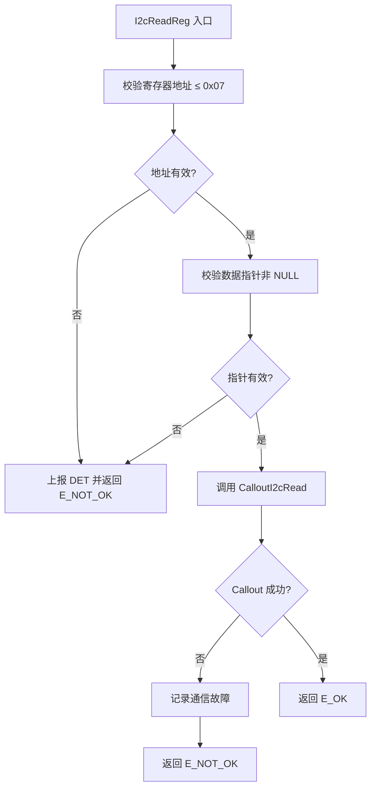

---

#### 6.2.2 `I2cWriteReg`

| Function Prototype | Description | Scope | Trigger Point | Dependency/Callout |
| --- | --- | --- | --- | --- |
| `static Std_ReturnType I2cWriteReg(uint16 Id_u16, uint8 RegAddr_u8, const uint8* Data_pcu8, uint16 Size_u16)` | 通过 I2C 向指定芯片实例的指定寄存器地址写入数据。封装完整 I2C 写帧流程：在数据前插入 RegAddr_u8 作为命令字节，由 CalloutI2cWrite 完成 START→器件地址(W)→命令字节→数据字节(s)→STOP 的全帧序列（D7 协议）。 | `static` (FC.c) | SetOutputLevel、SetDirection、SetPolarityInversion、Init 中的配置写入 | `Gp_NCA9539_CalloutI2cWrite` |

##### 6.2.2.1 子功能拆分

| 步骤 | 子功能 | 输入 | 输出 | 关键检查/约束 | 依赖对象 |
| --- | --- | --- | --- | --- | --- |
| 1 | 参数校验 | RegAddr_u8, Data_pcu8 | 校验结果 | RegAddr_u8 ≤ 0x07，Data_pcu8 非 NULL | — |
| 2 | 组装写缓冲 | RegAddr_u8, Data_pcu8, Size_u16 | 完整写帧 | I2C 事务缓冲[0]=命令字节, [1..Size_u16]=数据 | — |
| 3 | I2C 写操作 | Id_u16, 写缓冲, Size_u16+1 | ACK/NACK | Callout 内部完成完整写帧（D7） | CalloutI2cWrite |
| 4 | NACK 处理 | Callout 返回值 | E_OK/E_NOT_OK | NACK 时记录故障 | RecordFault |

##### 6.2.2.2 执行步骤

1. 若 `RegAddr_u8 > 0x07`，DET 上报并返回 E_NOT_OK
2. 若 `Data_pcu8 == NULL`，DET 上报并返回 E_NOT_OK
3. 组装写缓冲：I2C 缓冲[0] = `RegAddr_u8`，后续复制 `Data_pcu8[0..Size_u16-1]`
4. 调用 `Gp_NCA9539_CalloutI2cWrite(Id_u16, 缓冲, Size_u16 + 1)` 执行 I2C 写入
5. 若 Callout 返回 E_NOT_OK，调用 RecordFault(Id_u16, RegAddr_u8, FAULT_TYPE_NACK) 并返回 E_NOT_OK
6. 返回 E_OK

##### 6.2.2.3 调用关系

| 调用对象 | 类别 | 作用 | 调用时机 |
| --- | --- | --- | --- |
| `Gp_NCA9539_CalloutI2cWrite` | 依赖接口 | 执行 I2C 写帧操作 | 步骤 4 |
| `RecordFault` | 内部函数 | 记录 I2C NACK 故障 | 步骤 5（失败时） |

##### 6.2.2.4 流程图

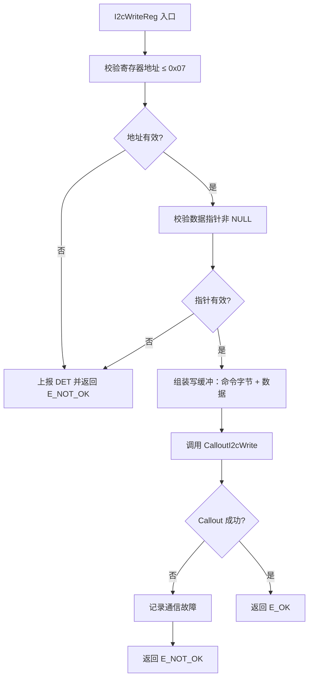

---

#### 6.2.3 `ValidateInstance`

| Function Prototype | Description | Scope | Trigger Point | Dependency/Callout |
| --- | --- | --- | --- | --- |
| `static Std_ReturnType ValidateInstance(uint16 Id_u16, Gp_NCA9539_InstanceStateType ExpectedState_e)` | 校验实例 ID 是否在配置范围内，以及实例当前状态是否等于期望状态。校验失败时上报 DET 并返回 E_NOT_OK。 | `static` (FC.c) | 所有外部 API 入口 | N/A |

##### 6.2.3.1 子功能拆分

| 步骤 | 子功能 | 输入 | 输出 | 关键检查/约束 | 依赖对象 |
| --- | --- | --- | --- | --- | --- |
| 1 | 实例 ID 范围校验 | Id_u16 | 校验结果 | Id_u16 < `GP_NCA9539_CFG_INSTANCE_COUNT` | — |
| 2 | 实例状态校验 | Id_u16, ExpectedState_e | 校验结果 | InstanceState_ae[Id_u16] == ExpectedState_e | — |
| 3 | DET 上报 | 校验结果 | — | 失败时触发 DET（若 DEV_ERROR_DETECT == STD_ON） | — |

##### 6.2.3.2 执行步骤

1. 若 `Id_u16 >= GP_NCA9539_CFG_INSTANCE_COUNT`，DET 上报 `GP_NCA9539_DEV_ERR_INV_INSTANCE_ID` 并返回 E_NOT_OK
2. 读取 per-instance 运行时状态 `Gp_NCA9539_InstanceState_ae[Id_u16]`
3. 若当前状态 ≠ `ExpectedState_e`：
   - 若 ExpectedState_e == NORMAL 且当前状态 != NORMAL：DET 上报 `GP_NCA9539_DEV_ERR_UNINIT`
   - 若 ExpectedState_e == UNINIT 且当前状态 != UNINIT：DET 上报 `GP_NCA9539_DEV_ERR_ALREADY_INIT`
   - 返回 E_NOT_OK
4. 返回 E_OK

##### 6.2.3.3 调用关系

| 调用对象 | 类别 | 作用 | 调用时机 |
| --- | --- | --- | --- |
| N/A | — | 本函数不调用其他函数 | — |

##### 6.2.3.4 流程图

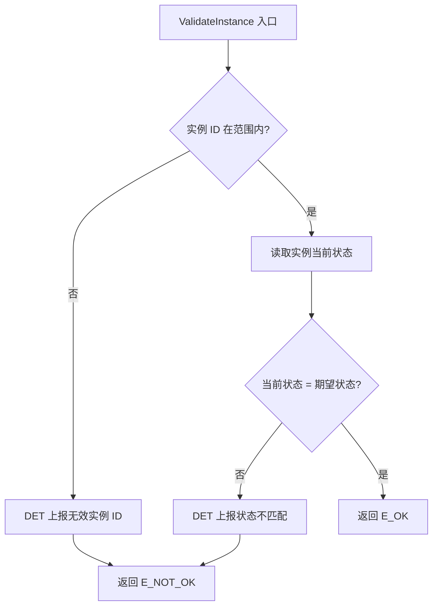

---

#### 6.2.4 `ValidatePort`

| Function Prototype | Description | Scope | Trigger Point | Dependency/Callout |
| --- | --- | --- | --- | --- |
| `static Std_ReturnType ValidatePort(uint8 Port_u8)` | 校验端口号是否为 0 或 1。无效时上报 DET 并返回 E_NOT_OK。 | `static` (FC.c) | SetOutputLevel、GetInputLevel、SetDirection、SetPolarityInversion | N/A |

##### 6.2.4.1 子功能拆分

| 步骤 | 子功能 | 输入 | 输出 | 关键检查/约束 | 依赖对象 |
| --- | --- | --- | --- | --- | --- |
| 1 | 端口号范围校验 | Port_u8 | 校验结果 | Port_u8 ≤ 1 | — |

##### 6.2.4.2 执行步骤

1. 若 `Port_u8 > 1`，DET 上报 `GP_NCA9539_DEV_ERR_INV_PORT_ID` 并返回 E_NOT_OK
2. 返回 E_OK

##### 6.2.4.3 调用关系

| 调用对象 | 类别 | 作用 | 调用时机 |
| --- | --- | --- | --- |
| N/A | — | 本函数不调用其他函数 | — |

##### 6.2.4.4 流程图

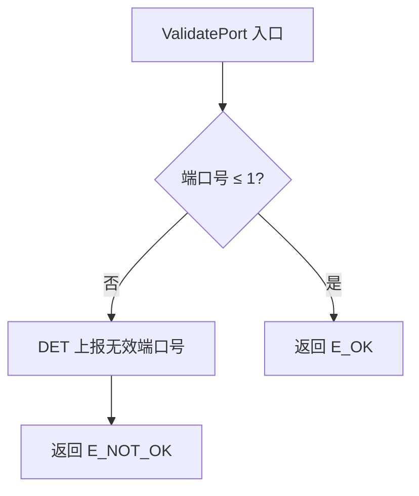

---

#### 6.2.5 `ApplyPolarityInversion`

| Function Prototype | Description | Scope | Trigger Point | Dependency/Callout |
| --- | --- | --- | --- | --- |
| `static uint8 ApplyPolarityInversion(uint8 RawValue_u8, uint8 PolarityMask_u8)` | 对原始输入值按极性掩码做位异或变换。bit=1 的位置反转逻辑电平，bit=0 保持不变。D1 行为约束：极性反转仅影响 Input Port 读值。 | `static` (FC.c) | GetInputLevel | N/A |

##### 6.2.5.1 子功能拆分

| 步骤 | 子功能 | 输入 | 输出 | 关键检查/约束 | 依赖对象 |
| --- | --- | --- | --- | --- | --- |
| 1 | 位异或变换 | RawValue_u8, PolarityMask_u8 | 变换后值 | `RawValue_u8 XOR PolarityMask_u8` | — |

##### 6.2.5.2 执行步骤

1. 返回 `RawValue_u8 ^ PolarityMask_u8`

##### 6.2.5.3 调用关系

| 调用对象 | 类别 | 作用 | 调用时机 |
| --- | --- | --- | --- |
| N/A | — | 纯位运算 | — |

##### 6.2.5.4 流程图

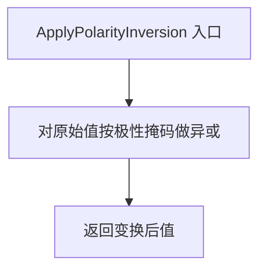

---

#### 6.2.6 `VerifyRegisterDefault`

| Function Prototype | Description | Scope | Trigger Point | Dependency/Callout |
| --- | --- | --- | --- | --- |
| `static Std_ReturnType VerifyRegisterDefault(uint8 ReadValue_u8, uint8 ExpectedValue_u8)` | 比较寄存器读回值与期望默认值。不匹配时返回 E_NOT_OK。 | `static` (FC.c) | Init 中的 Configuration 寄存器默认值校验（期望 0xFF，来自 D5） | N/A |

##### 6.2.6.1 子功能拆分

| 步骤 | 子功能 | 输入 | 输出 | 关键检查/约束 | 依赖对象 |
| --- | --- | --- | --- | --- | --- |
| 1 | 值比较 | ReadValue_u8, ExpectedValue_u8 | 比较结果 | 相等→E_OK，不等→E_NOT_OK | — |

##### 6.2.6.2 执行步骤

1. 比较 `ReadValue_u8` 与 `ExpectedValue_u8`
2. 不匹配则返回 E_NOT_OK，匹配则返回 E_OK

##### 6.2.6.3 调用关系

| 调用对象 | 类别 | 作用 | 调用时机 |
| --- | --- | --- | --- |
| N/A | — | 纯比较 | — |

##### 6.2.6.4 流程图

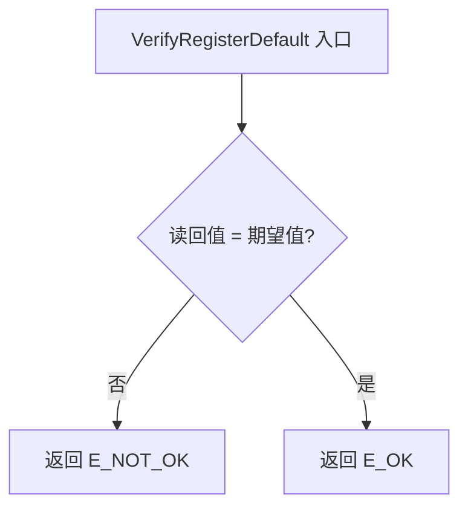

---

#### 6.2.7 `UpdateInterruptState`

| Function Prototype | Description | Scope | Trigger Point | Dependency/Callout |
| --- | --- | --- | --- | --- |
| `static void UpdateInterruptState(uint16 Id_u16, uint8 Port_u8, boolean Set_b)` | 更新指定实例指定端口的中断待处理标志。Set_b=TRUE 时置位标志，Set_b=FALSE 时清除标志。 | `static` (FC.c) | GetInterruptStatus（置位）、GetInputLevel（清除） | N/A |

##### 6.2.7.1 子功能拆分

| 步骤 | 子功能 | 输入 | 输出 | 关键检查/约束 | 依赖对象 |
| --- | --- | --- | --- | --- | --- |
| 1 | 中断标志更新 | Id_u16, Port_u8, Set_b | — | Port 0→IntPort0Pending_b, Port 1→IntPort1Pending_b | — |

##### 6.2.7.2 执行步骤

1. 根据 `Port_u8` 定位 per-instance 中断标志（0→IntPort0Pending_b, 1→IntPort1Pending_b）
2. 根据 `Set_b` 赋值 TRUE（置位）或 FALSE（清除）

##### 6.2.7.3 调用关系

| 调用对象 | 类别 | 作用 | 调用时机 |
| --- | --- | --- | --- |
| N/A | — | 直接操作运行时变量 | — |

##### 6.2.7.4 流程图

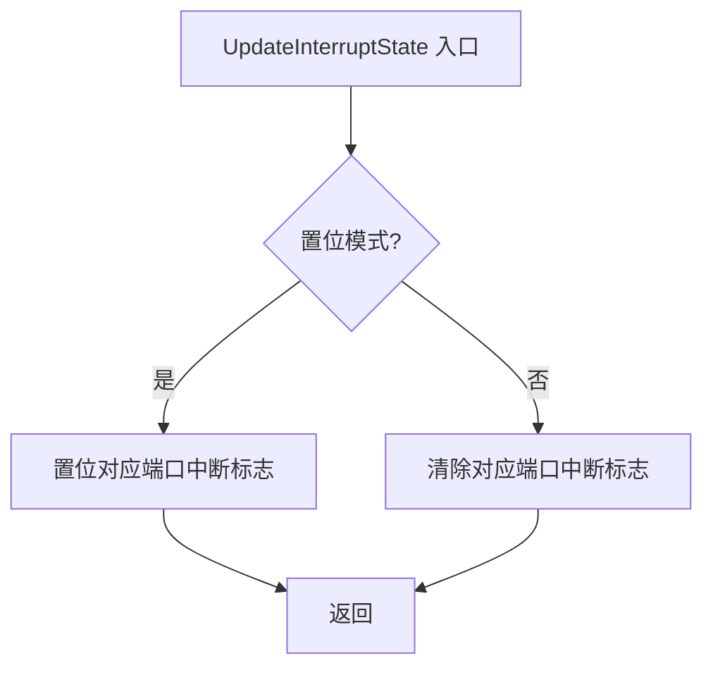

---

#### 6.2.8 `RecordFault`

| Function Prototype | Description | Scope | Trigger Point | Dependency/Callout |
| --- | --- | --- | --- | --- |
| `static void RecordFault(uint16 Id_u16, uint8 RegAddr_u8, uint8 FaultType_u8)` | 记录指定实例的 I2C 通信故障信息到 per-instance 运行时故障记录。采用最近故障覆盖策略（若已有未读故障，新故障覆盖旧故障）。 | `static` (FC.c) | I2cReadReg、I2cWriteReg 中 NACK 发生时 | N/A |

##### 6.2.8.1 子功能拆分

| 步骤 | 子功能 | 输入 | 输出 | 关键检查/约束 | 依赖对象 |
| --- | --- | --- | --- | --- | --- |
| 1 | 写入故障记录 | Id_u16, RegAddr_u8, FaultType_u8 | — | 设置 FaultActive_b=TRUE, FaultRegAddr_u8, FaultType_u8；若已活跃则覆盖 | — |

##### 6.2.8.2 执行步骤

1. 定位 per-instance 运行时故障记录字段
2. 设置 `FaultActive_b` = TRUE
3. 设置 `FaultRegAddr_u8` = RegAddr_u8
4. 设置 `FaultType_u8` = FaultType_u8

##### 6.2.8.3 调用关系

| 调用对象 | 类别 | 作用 | 调用时机 |
| --- | --- | --- | --- |
| N/A | — | 直接操作运行时变量 | — |

##### 6.2.8.4 流程图

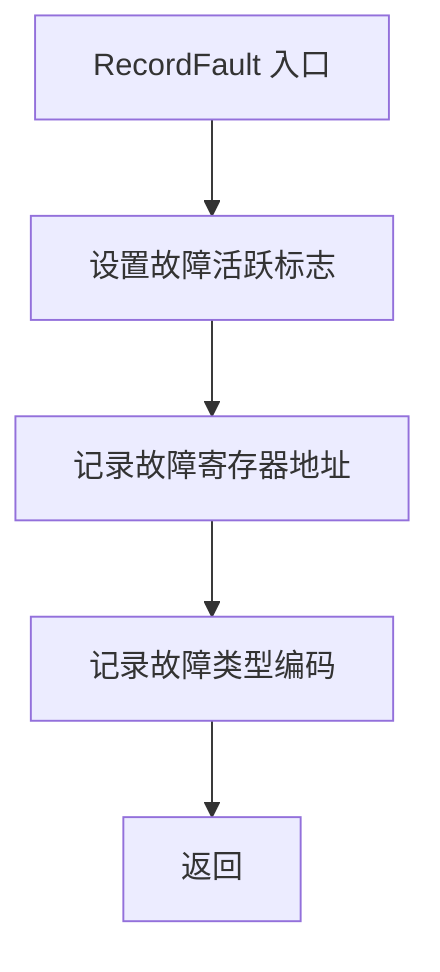

---

### 6.3 依赖接口与Callout设计

> 本章按统一格式逐一展开所有依赖接口，包含架构中 5 个 Callout + 详细设计新增 1 个延时 Callout。每个 Callout 包含接口原型表、关联接口表、执行步骤和流程图。

#### 6.3.1 `Gp_NCA9539_CalloutI2cWrite`

| Interface Prototype | Description | Implemented By | Sync/Async | Reentrancy | Basic Constraints |
| --- | --- | --- | --- | --- | --- |
| `Std_ReturnType Gp_NCA9539_CalloutI2cWrite(uint16 Id_u16, uint8* Data_pu8, uint16 Size_u16)` | 执行 I2C 写事务。帧格式（D7）：START → 器件地址(W) → 命令字节 → 数据字节(s) → STOP。实现层负责 I2C 外设控制、7 位地址组装（基地址 0x74 + A0/A1 偏移）、ACK/NACK 检测。支持 Burst 写（port 0↔port 1 寄存器对交替，D8）。 | Project Adaptation (MCU I2C 外设驱动绑定) | Synchronous | Reentrant | `Id_u16` 标识 I2C 器件。`Data_pu8` 首字节为命令字节（寄存器地址），其后为数据字节。`Size_u16` 含命令字节（最小 2）。Fast-mode 时序约束（D4）：f_SCL ≤ 400 kHz, t_LOW ≥ 1.3 us, t_HIGH ≥ 0.6 us, t_SU;DAT ≥ 100 ns, t_HD;STA ≥ 0.6 us, t_SU;STO ≥ 0.6 us。 |

##### 6.3.1.1 关联接口

| 调用方 | 类别 | 调用场景 |
| --- | --- | --- |
| `I2cWriteReg` | 内部函数 | 所有寄存器写操作（Output/Configuration/Polarity） |
| `Gp_NCA9539_Init` | 外部接口 | I2C 可达性验证（空写帧） |

##### 6.3.1.2 执行步骤

1. 从 `Id_u16` 映射 I2C 器件地址：基地址 0x74，A0=Id_u16 bit0, A1=Id_u16 bit1 → 7 位地址 0x74~0x77（D7 地址表）
2. 组装写地址字节：(7 位地址 << 1) | 0（R/W=0）→ 0xE8~0xEE（D7）
3. 发送 START 条件
4. 发送写地址字节，检测从机 ACK；NACK 则 STOP 并返回 E_NOT_OK
5. 依次发送 `Data_pu8[0..Size_u16-1]`，每字节检测 ACK；NACK 则 STOP 并返回 E_NOT_OK
6. 发送 STOP 条件
7. 返回 E_OK

##### 6.3.1.3 流程图

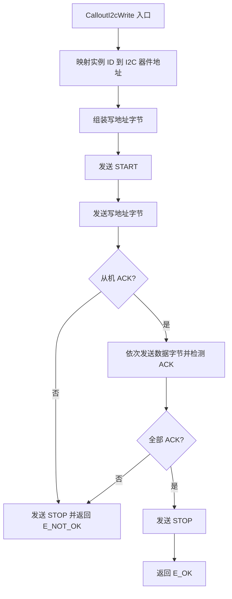

---

#### 6.3.2 `Gp_NCA9539_CalloutI2cRead`

| Interface Prototype | Description | Implemented By | Sync/Async | Reentrancy | Basic Constraints |
| --- | --- | --- | --- | --- | --- |
| `Std_ReturnType Gp_NCA9539_CalloutI2cRead(uint16 Id_u16, uint8* Data_pu8, uint16 Size_u16)` | 执行 I2C 读事务。帧格式（D7）：START → 器件地址(W) → 命令字节 → 重复 START → 器件地址(R) → 读数据字节(s) → NACK → STOP。实现层负责 I2C 外设控制、地址组装和 ACK/NACK 检测。 | Project Adaptation (MCU I2C 外设驱动绑定) | Synchronous | Reentrant | `Id_u16` 标识 I2C 器件。`Data_pu8` 存放读取数据。`Size_u16` 为读取字节数。时序约束同 CalloutI2cWrite（D4）。 |

##### 6.3.2.1 关联接口

| 调用方 | 类别 | 调用场景 |
| --- | --- | --- |
| `I2cReadReg` | 内部函数 | 所有寄存器读操作（Input/Configuration/Output/Polarity） |

##### 6.3.2.2 执行步骤

1. 从 `Id_u16` 映射 I2C 器件地址（同 CalloutI2cWrite）
2. 发送 START 条件
3. 发送写地址字节（R/W=0），检测 ACK；NACK 则 STOP 并返回 E_NOT_OK
4. 发送命令字节（寄存器地址），检测 ACK；NACK 则 STOP 并返回 E_NOT_OK
5. 发送重复 START 条件
6. 发送读地址字节（R/W=1），检测 ACK；NACK 则 STOP 并返回 E_NOT_OK
7. 依次读取 `Size_u16` 个数据字节，每字节后发送 ACK（非最后一字节）或 NACK（最后一字节）
8. 发送 STOP 条件
9. 返回 E_OK

##### 6.3.2.3 流程图

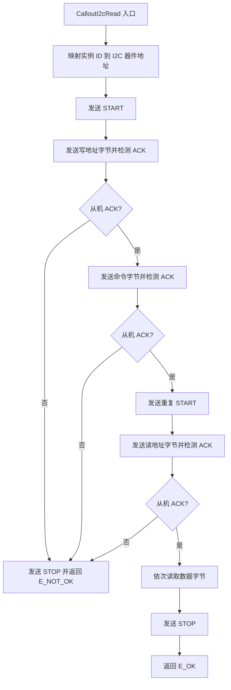

---

#### 6.3.3 `Gp_NCA9539_CalloutDioWrite`

| Interface Prototype | Description | Implemented By | Sync/Async | Reentrancy | Basic Constraints |
| --- | --- | --- | --- | --- | --- |
| `Std_ReturnType Gp_NCA9539_CalloutDioWrite(uint16 Id_u16, uint8 Level_u8)` | 控制指定芯片实例的 RESET\ 引脚电平。Level_u8=0 拉低（复位），Level_u8=1 拉高（释放复位）。实现层负责 MCU GPIO 引脚映射和电平转换。 | Project Adaptation (MCU DIO 驱动绑定) | Synchronous | Reentrant | `Id_u16` 映射到对应芯片的 RESET\ GPIO。RESET\ 低电平脉冲 ≥ 6 ns（D4 t_w(rst)）。RESET\ 释放后 ≥ 200 ns 才能 I2C 通信（D4 t_rec(rst)）。 |

##### 6.3.3.1 关联接口

| 调用方 | 类别 | 调用场景 |
| --- | --- | --- |
| `Gp_NCA9539_Init` | 外部接口 | 复位释放后的等待和初始化 |

##### 6.3.3.2 执行步骤

1. 根据 `Id_u16` 索引 per-instance RESET\ GPIO 引脚映射
2. 若 `Level_u8 == 0`，驱动 GPIO 输出低电平（复位），保持时间由调用方控制
3. 若 `Level_u8 == 1`，驱动 GPIO 输出高电平（释放复位）
4. 返回 E_OK

##### 6.3.3.3 流程图

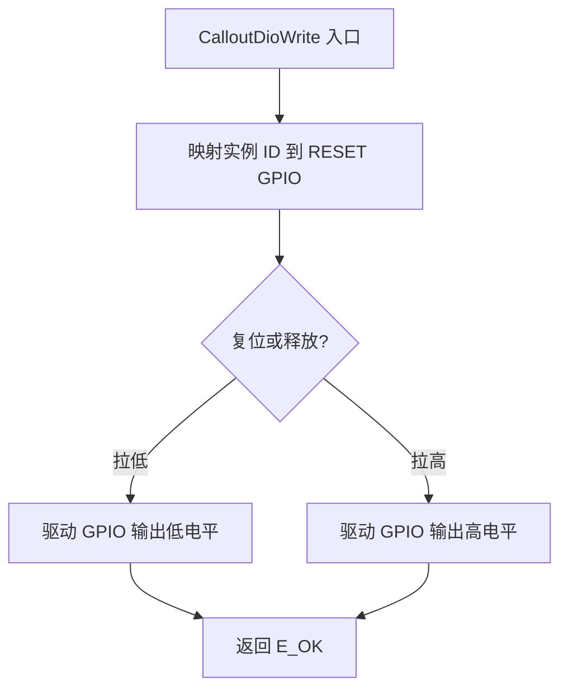

---

#### 6.3.4 `Gp_NCA9539_CalloutDioRead`

| Interface Prototype | Description | Implemented By | Sync/Async | Reentrancy | Basic Constraints |
| --- | --- | --- | --- | --- | --- |
| `Std_ReturnType Gp_NCA9539_CalloutDioRead(uint16 Id_u16, uint8* Level_pu8)` | 读取指定芯片实例的 INT\ 引脚电平。Level_pu8 返回 0（低电平/中断有效）或 1（高电平/无效）。INT\ 为开漏输出，需外部上拉电阻。 | Project Adaptation (MCU DIO 驱动绑定) | Synchronous | Reentrant | `Id_u16` 映射到对应芯片的 INT\ GPIO。`Level_pu8` 非 NULL。 |

##### 6.3.4.1 关联接口

| 调用方 | 类别 | 调用场景 |
| --- | --- | --- |
| `Gp_NCA9539_GetInterruptStatus` | 外部接口 | 查询中断状态时读取 INT\ 引脚电平 |

##### 6.3.4.2 执行步骤

1. 根据 `Id_u16` 索引 per-instance INT\ GPIO 引脚映射
2. 读取 GPIO 输入电平
3. 写入 `*Level_pu8`
4. 返回 E_OK

##### 6.3.4.3 流程图

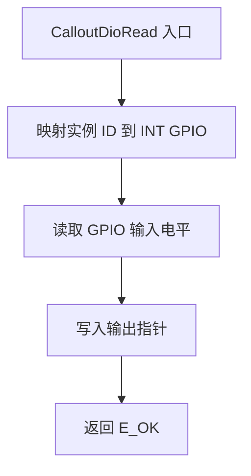

---

#### 6.3.5 `Gp_NCA9539_CalloutGetCoreId`

| Interface Prototype | Description | Implemented By | Sync/Async | Reentrancy | Basic Constraints |
| --- | --- | --- | --- | --- | --- |
| `Std_ReturnType Gp_NCA9539_CalloutGetCoreId(uint8* CoreId_pu8)` | 返回当前执行 CPU 核的标识符。多核部署时用于选择正确的 per-core 运行时数据和配置表。 | Project Adaptation (平台核识别) | Synchronous | Reentrant | `CoreId_pu8` 非 NULL。须安全地从任何核调用。 |

**状态**: Conditional — 待项目确认是否需要多核部署（关联风险 R9）。

##### 6.3.5.1 关联接口

| 调用方 | 类别 | 调用场景 |
| --- | --- | --- |
| （多核部署时）所有外部 API | 外部接口 | 选择正确的 per-core 运行时容器和配置表 |

##### 6.3.5.2 执行步骤

1. 读取当前核硬件 ID 寄存器
2. 写入 `*CoreId_pu8`
3. 返回 E_OK

##### 6.3.5.3 流程图

```mermaid
flowchart TD
    A[CalloutGetCoreId 入口] --> B[读取核硬件 ID]
    B --> C[写入输出指针]
    C --> D[返回 E_OK]
```

---

#### 6.3.6 `Gp_NCA9539_CalloutDelayUs`

| Interface Prototype | Description | Implemented By | Sync/Async | Reentrancy | Basic Constraints |
| --- | --- | --- | --- | --- | --- |
| `Std_ReturnType Gp_NCA9539_CalloutDelayUs(uint32 DelayUs_u32)` | 提供微秒级阻塞延时。用于 RESET\ 释放后等待芯片内部 POR 完成（D4 t_rec(rst) ≥ 200ns）。 | Project Adaptation (平台定时器) | Synchronous (blocking) | Reentrant | `DelayUs_u32` 为延时微秒数。最小延时由平台实现决定。建议 ≥ 1us 安全裕量。 |

**状态**: design-addition (R6) — 架构中未定义延时 Callout，Init 流程中 RESET\ 释放后等待需求来自 D4 和 D5。

##### 6.3.6.1 关联接口

| 调用方 | 类别 | 调用场景 |
| --- | --- | --- |
| `Gp_NCA9539_Init` | 外部接口 | RESET\ 释放后等待 t_rec(rst) ≥ 200ns |

##### 6.3.6.2 执行步骤

1. 启动平台微秒定时器
2. 等待 `DelayUs_u32` 微秒
3. 返回 E_OK

##### 6.3.6.3 流程图

```mermaid
flowchart TD
    A[CalloutDelayUs 入口] --> B[启动平台微秒定时器]
    B --> C[等待指定微秒数]
    C --> D[返回 E_OK]
```

---

## 7. 状态机设计

### 7.1 设计选型说明

本模块采用**软件驱动状态机**方案，在芯片硬件状态（POR/Reset → 正常运行）之上额外抽象一层驱动生命周期状态。

芯片硬件状态转换（POR→正常运行、正常运行→复位）由芯片内部自动完成，不通过寄存器暴露状态位（D2：判定方式为 VDD 电压监控、RESET\ 引脚电平，无寄存器标志）。驱动层无法直接观测芯片硬件状态，仅能通过 I2C ACK 响应间接判断芯片是否在线。因此需要软件状态机管理 per-instance 生命周期，控制 API 访问合法性。

### 7.2 状态定义

| 状态名 | 含义 | 进入条件 | 退出条件 |
| --- | --- | --- | --- |
| `UNINIT` | 实例尚未初始化，除 Init 外所有 API 被拒绝 | 系统启动后模块加载，per-instance 状态默认值 | Init 成功完成 |
| `NORMAL` | 实例已初始化，所有 API 可正常调用 | Init 成功完成 | RESET\ 事件或连续 I2C NACK ≥ 阈值 |
| `RESET_RECOVERY` | 芯片发生复位，寄存器回到默认值，需重新初始化 | RESET\ 拉低或连续 I2C NACK ≥ `GP_NCA9539_CFG_I2C_NACK_CONSECUTIVE_LIMIT` | Init 再次成功 → NORMAL |

### 7.3 状态切换表

| 当前状态 | 条件函数 | 动作函数 | 下一状态 | 备注 |
| --- | --- | --- | --- | --- |
| UNINIT | I2C 可达 + 寄存器默认值校验通过 + 配置写入回读一致 | 写配置寄存器、更新运行缓存、清故障和中断标志 | NORMAL | Init API 触发 |
| UNINIT | I2C NACK / 默认值不匹配 / 回读不一致 | 记录故障、保持 UNINIT | UNINIT | Init 失败 |
| NORMAL | RESET\ 引脚拉低或连续 I2C NACK ≥ 阈值 | 标记缓存无效、记录复位事件、置 RESET_RECOVERY | RESET_RECOVERY | 外部复位或芯片异常 |
| RESET_RECOVERY | 同 UNINIT→NORMAL 条件 | 同 UNINIT→NORMAL 动作（完整重新初始化） | NORMAL | Init 成功恢复 |
| RESET_RECOVERY | Init 再次失败 | 保持 RESET_RECOVERY | RESET_RECOVERY | 反复失败维持恢复状态 |

> D2 状态转换条件交叉校验：D2 定义了 POR/Reset→正常运行（VDD≥V_PORR 且 RESET\=HIGH）、正常运行→复位（RESET\ 拉低≥6ns 或 VDD<V_PORF）、正常运行→待机（SCL 无活动）。其中 POR 条件和欠压复位条件由芯片内部自动处理，驱动不直接感知；RESET\ 拉低可通过 CalloutDioWrite/Read 间接感知；待机状态对驱动透明。软件状态机覆盖了所有驱动需要响应和恢复的场景。

### 7.4 状态机主流程图

```mermaid
flowchart TD
    A[状态机入口：API 调用] --> B[读取当前实例状态]
    B --> C{当前状态?}
    C -->|UNINIT| D{API 为 Init?}
    D -->|是| E[执行初始化流程]
    E --> F{初始化成功?}
    F -->|是| G[状态切换为 NORMAL]
    F -->|否| H[保持 UNINIT]
    D -->|否| I[DET 上报未初始化]
    I --> J[返回 E_NOT_OK]
    C -->|NORMAL| K{API 为 Init?}
    K -->|是| L[DET 上报重复初始化]
    L --> J
    K -->|否| M[执行 API 业务逻辑]
    M --> N{检测到复位或连续 NACK?}
    N -->|是| O[状态切换为 RESET_RECOVERY]
    O --> J
    N -->|否| P[保持 NORMAL]
    C -->|RESET_RECOVERY| Q{API 为 Init?}
    Q -->|是| E
    Q -->|否| I
    G --> R[返回 E_OK]
    H --> J
    P --> R
```

---

## 8. DET设计

| 检查点 | 触发条件 | 记录方式 | 返回策略 | 适用API |
| --- | --- | --- | --- | --- |
| `GP_NCA9539_DEV_ERR_INV_INSTANCE_ID` | `Id_u16 >= GP_NCA9539_CFG_INSTANCE_COUNT` | DET 模块 `Det_ReportError` | 返回 E_NOT_OK | 所有外部 API |
| `GP_NCA9539_DEV_ERR_UNINIT` | 实例状态 ≠ NORMAL 时调用非 Init API | DET 模块 | 返回 E_NOT_OK | SetOutputLevel, GetInputLevel, SetDirection, SetPolarityInversion, GetInterruptStatus, GetFaultStatus |
| `GP_NCA9539_DEV_ERR_ALREADY_INIT` | 实例状态 ≠ UNINIT 时调用 Init | DET 模块 | 返回 E_NOT_OK | Init |
| `GP_NCA9539_DEV_ERR_INV_PORT_ID` | `Port_u8 > 1` | DET 模块 | 返回 E_NOT_OK | SetOutputLevel, GetInputLevel, SetDirection, SetPolarityInversion |
| `GP_NCA9539_DEV_ERR_NULL_POINTER` | 输出指针参数为 NULL | DET 模块 | 返回 E_NOT_OK | GetInputLevel, GetInterruptStatus, GetFaultStatus, Init |
| `GP_NCA9539_DEV_ERR_INV_REG_ADDR` | `RegAddr_u8 > 0x07`（来自 D1 8 个寄存器地址范围 0x00~0x07） | DET 模块 | 返回 E_NOT_OK | I2cReadReg, I2cWriteReg（内部函数） |

> DET 由 `GP_NCA9539_CFG_DEV_ERROR_DETECT` 宏控制：STD_ON 启用，STD_OFF 编译器优化移除。DET 遵循 AUTOSAR DET 规范。DET 检查在 API 入口统一执行，不在内部函数中重复检查已由外部 API 校验过的参数。

---

## 9. 故障处理设计

故障处理覆盖两类故障：驱动逻辑故障（I2C NACK、寄存器回读不一致、寄存器默认值异常），芯片故障（上电复位、欠压复位）由芯片硬件自动处理。D3 中定义的中断事件不属于故障，而是正常中断通知机制。

### 9.1 故障确认策略

| 策略 | 说明 | 适用场景 | 所需配置 | 所需运行参数 |
| --- | --- | --- | --- | --- |
| 单次确认 | 检测到一次异常即确认 | I2C NACK（硬件已锁存）、寄存器回读不一致（单次即表明数据损坏）、寄存器默认值异常 | 无 | FaultActive_b (boolean) |

### 9.2 故障恢复策略

| 策略 | 说明 | 适用场景 |
| --- | --- | --- |
| 不可恢复（Init 清除） | 故障确认后锁存，仅能通过重新 Init 清除 | 所有故障项 — I2C NACK 需确认总线恢复后重新初始化；寄存器回读不一致和默认值异常需重新配置芯片 |

### 9.3 故障锁存与清除

| 清除方式 | 说明 | 约束 |
| --- | --- | --- |
| GetFaultStatus 读取清除 | 上层调用 GetFaultStatus 后自动清除锁存的故障记录（读后清除） | 适用于 I2C NACK 故障 |
| Init 清除 | 模块重新初始化时清除所有锁存故障 | 适用于所有故障项 |

> 模块不提供独立的故障清除接口。锁存故障通过 GetFaultStatus 读取清除或 Init 重新初始化清除。

### 9.4 故障自恢复配置

| Macro | Category | Purpose | Default Value |
| --- | --- | --- | --- |
| `GP_NCA9539_CFG_FAULT_SELF_RECOVERY_ENABLE` | feature | 故障自恢复总开关 | `STD_OFF` |

> 当前所有故障采用 Init 清除策略（不可自恢复），该宏保持 STD_OFF。若后续需要运行时自恢复，启用后可拆分 per-fault 恢复开关和阈值。

### 9.5 故障项设计

| 故障项 | 故障类型 | 检测条件 | 确认策略 | 确认阈值/配置 | 确认状态 | 响应动作 | 是否可恢复 | 是否可自恢复 | 恢复策略 | 恢复阈值/配置 | 恢复状态 | 触发状态跳转 | 锁存策略 | 清除方式 |
| --- | --- | --- | --- | --- | --- | --- | --- | --- | --- | --- | --- | --- | --- | --- |
| I2C NACK 通信故障 | 驱动逻辑故障 | I2C 写/读操作中从机返回 NACK（D3 无对应芯片故障，由驱动检测） | 单次确认 | N/A | 已确认 | 当前 API 返回 E_NOT_OK；记录故障实例/寄存器地址/故障类型=1(NACK)；累计连续 NACK 计数 | 是 | 否 | 不适用 | N/A | 不适用 | 是（连续 NACK ≥ `GP_NCA9539_CFG_I2C_NACK_CONSECUTIVE_LIMIT` → RESET_RECOVERY） | 锁存 | GetFaultStatus 读取清除 / Init 清除 |
| 寄存器回读不一致 | 驱动逻辑故障 | Init 中回读 Configuration/Output Port 寄存器值与写入值不匹配 | 单次确认 | N/A | 已确认 | Init 返回 E_NOT_OK；记录故障 | 是 | 否 | 不适用 | N/A | 不适用 | 否（Init 未完成，状态保持 UNINIT） | 锁存 | Init 重新执行清除 |
| 寄存器默认值异常 | 驱动逻辑故障 | Init 中读 Configuration 寄存器默认值 ≠ 0xFF（D5 期望值） | 单次确认 | N/A | 已确认 | Init 返回 E_NOT_OK；芯片可能未完成 POR 或损坏 | 是 | 否 | 不适用 | N/A | 不适用 | 否（状态保持 UNINIT） | 锁存 | Init 重新执行清除 |

> D3 故障源交叉校验：D3 定义 3 个故障源——中断事件（驱动逻辑故障）、上电复位（芯片故障）、欠压复位（芯片故障）。中断事件不属于故障（是正常中断通知），不走故障处理路径。上电复位和欠压复位由芯片硬件自动处理（VDD 恢复后自恢复），驱动仅通过 I2C NACK 间接感知，体现在 I2C NACK 通信故障和寄存器默认值异常两个故障项中。D3 全集已覆盖。

### 9.6 故障相关运行参数

| 变量名（示例） | 类别 | 说明 |
| --- | --- | --- |
| `FaultActive_ab[N]` | fault | 故障活跃标志（锁存状态） |
| `FaultRegAddr_au8[N]` | fault | 故障发生时访问的寄存器地址 |
| `FaultType_au8[N]` | fault | 故障类型编码（1=NACK） |
| `I2cNackConsecutiveCnt_au8[N]` | fault | 连续 I2C NACK 计数器（design-addition R8） |

> 实际变量名和数量在 §10 运行参数设计中统一定义。

---

## 10. 运行参数设计

### 10.1 运行变量

| 变量名 | 类别 | 类型 | 所属Core | 写方 | 读方 | 生命周期 | MemMap | NoClear | 设计依据 |
| --- | --- | --- | --- | --- | --- | --- | --- | --- | --- |
| `Gp_NCA9539_InstanceState_ae[N]` | status | `Gp_NCA9539_InstanceStateType` 数组 | Core0 | Init | 所有外部 API | 模块加载 → 去初始化 | CLEAR_FAR_DATA | 否 | architecture |
| `Gp_NCA9539_DirectionCache_au8[N][2]` | intermediate | `uint8` 二维数组 | Core0 | SetDirection, Init | GetInputLevel, Init | 模块加载 → 去初始化 | CLEAR_FAR_DATA | 否 | architecture |
| `Gp_NCA9539_PolarityCache_au8[N][2]` | intermediate | `uint8` 二维数组 | Core0 | SetPolarityInversion, Init | GetInputLevel | 模块加载 → 去初始化 | CLEAR_FAR_DATA | 否 | architecture |
| `Gp_NCA9539_OutputCache_au8[N][2]` | intermediate | `uint8` 二维数组 | Core0 | SetOutputLevel, Init | Init | 模块加载 → 去初始化 | CLEAR_FAR_DATA | 否 | architecture |
| `Gp_NCA9539_IntPort0Pending_ab[N]` | status | `boolean` 数组 | Core0 | GetInterruptStatus, GetInputLevel | GetInterruptStatus | 模块加载 → 去初始化 | CLEAR_FAR_DATA | 否 | architecture |
| `Gp_NCA9539_IntPort1Pending_ab[N]` | status | `boolean` 数组 | Core0 | GetInterruptStatus, GetInputLevel | GetInterruptStatus | 模块加载 → 去初始化 | CLEAR_FAR_DATA | 否 | architecture |
| `Gp_NCA9539_FaultActive_ab[N]` | fault | `boolean` 数组 | Core0 | RecordFault | GetFaultStatus | 模块加载 → 去初始化 | CLEAR_FAR_DATA | 否 | architecture |
| `Gp_NCA9539_FaultRegAddr_au8[N]` | fault | `uint8` 数组 | Core0 | RecordFault | GetFaultStatus | 模块加载 → 去初始化 | CLEAR_FAR_DATA | 否 | architecture |
| `Gp_NCA9539_FaultType_au8[N]` | fault | `uint8` 数组 | Core0 | RecordFault | GetFaultStatus | 模块加载 → 去初始化 | CLEAR_FAR_DATA | 否 | architecture |
| `Gp_NCA9539_I2cNackConsecutiveCnt_au8[N]` | fault | `uint8` 数组 | Core0 | I2cReadReg, I2cWriteReg (NACK 时递增), I2C ACK 时清零 | 状态机条件检查 | 模块加载 → 去初始化 | CLEAR_FAR_DATA | 否 | design-addition (R8) |
| `Gp_NCA9539_I2cBuffer_au8[3]` | intermediate | `uint8` 数组 | Core0 | I2cWriteReg | — | per API call | CLEAR_FAR_DATA (static) | 否 | architecture |
| `Gp_NCA9539_DetBuffer_ast` | status | `Gp_NCA9539_DetBufferType` | Core0 | ValidateInstance, ValidatePort, 各 API DET 检查 | DET 模块 | 模块加载 → 去初始化 | CLEAR_FAR_DATA | 否 | design-addition (R7) |

> N = `GP_NCA9539_CFG_INSTANCE_COUNT`

### 10.2 运行参数类型

#### 10.2.1 运行参数类型拆分

| 类型名 | 类别 | 所属文件 | 关键字段 | 字段类型 | 字段描述 | 关联变量 | 设计依据 | Status |
| --- | --- | --- | --- | --- | --- | --- | --- | --- |
| `Gp_NCA9539_InstanceStateType` | global (枚举) | `FC_Types.h` | — | enum | UNINIT=0, NORMAL=1, RESET_RECOVERY=2 | `InstanceState_ae` | architecture | formal |
| `Gp_NCA9539_FaultRecordType` | per-instance / fault | `FC_Types.h` | `FaultActive_b` | boolean | 故障活跃标志，TRUE=待读 | `FaultActive_ab` | architecture | formal |
| | | | `FaultRegAddr_u8` | uint8 | 故障发生时访问的寄存器地址 (0x00~0x07) | `FaultRegAddr_au8` | architecture | formal |
| | | | `FaultType_u8` | uint8 | 故障类型 1=NACK | `FaultType_au8` | architecture | formal |
| `Gp_NCA9539_InstanceDataType` | per-instance | `FC_Types.h` | `DirectionCache_au8[2]` | uint8[2] | 端口 0/1 方向缓存（1=输入,0=输出） | `DirectionCache_au8` | architecture | formal |
| | | | `PolarityCache_au8[2]` | uint8[2] | 端口 0/1 极性缓存（1=反转,0=不反转） | `PolarityCache_au8` | architecture | formal |
| | | | `OutputCache_au8[2]` | uint8[2] | 端口 0/1 输出缓存 | `OutputCache_au8` | architecture | formal |
| | | | `IntPort0Pending_b` | boolean | 端口 0 中断待处理标志 | `IntPort0Pending_ab` | architecture | formal |
| | | | `IntPort1Pending_b` | boolean | 端口 1 中断待处理标志 | `IntPort1Pending_ab` | architecture | formal |
| | | | `I2cNackConsecutiveCnt_u8` | uint8 | 连续 I2C NACK 计数（达到阈值触发 RESET_RECOVERY） | `I2cNackConsecutiveCnt_au8` | design-addition (R8) | formal |
| | | | `FaultRecord_st` | Gp_NCA9539_FaultRecordType | 故障记录子结构 | `FaultActive_ab`, `FaultRegAddr_au8`, `FaultType_au8` | architecture | formal |
| `Gp_NCA9539_RuntimeType` | global | `FC_Types.h` | `InstanceState_ae[N]` | Gp_NCA9539_InstanceStateType[N] | per-instance 状态机当前状态 | `InstanceState_ae` | architecture | formal |
| | | | `InstanceData_ast[N]` | Gp_NCA9539_InstanceDataType[N] | per-instance 运行时数据数组 | 所有 per-instance 变量 | architecture | formal |
| | | | `I2cBuffer_au8[3]` | uint8[3] | I2C 事务缓冲 | `I2cBuffer_au8` | architecture | formal |
| | | | `DetBuffer_st` | Gp_NCA9539_DetBufferType | DET 错误缓冲（条件于 DEV_ERROR_DETECT） | `DetBuffer_ast` | design-addition (R7) | pending-confirm |

#### 10.2.2 运行参数类型设计说明

- 按语义边界拆分为 4 类：global 枚举（InstanceStateType）→ per-instance（InstanceDataType，聚合所有缓存/标志/故障/计数器）→ fault 子结构（FaultRecordType）→ global 顶层容器（RuntimeType）
- `Gp_NCA9539_InstanceDataType` 是核心运行态容器，聚合方向/极性/输出缓存、中断标志、连续 NACK 计数器和故障记录——这些字段的读写生命周期都与同一个 chip 实例绑定
- `Gp_NCA9539_RuntimeType` 是唯一顶层全局运行变量，包含 per-instance 数组 + I2C 缓冲 + DET 缓冲
- `I2cNackConsecutiveCnt_u8` 用于跟踪连续 NACK 次数（ACK 时清零），达到 `GP_NCA9539_CFG_I2C_NACK_CONSECUTIVE_LIMIT` 时触发 RESET_RECOVERY 状态跳转
- DET 缓冲类型 `Gp_NCA9539_DetBufferType` 字段布局在编码阶段定义（参考项目已有 DET 模式）

---

## 11. 配置参数设计

### 11.1 配置宏参（`FC_Cfg.h`）

| Macro | Category | Purpose | Default Value | Source | Usage Location | Status |
| --- | --- | --- | --- | --- | --- | --- |
| `GP_NCA9539_CFG_DEV_ERROR_DETECT` | feature | DET 开发错误检测全局开关 | `STD_ON` | architecture | 所有外部 API、ValidateInstance、ValidatePort | formal |
| `GP_NCA9539_CFG_SW_MAJOR_VERSION` | platform | 模块主版本号 | `1` | architecture | 版本信息 | formal |
| `GP_NCA9539_CFG_SW_MINOR_VERSION` | platform | 模块次版本号 | `0` | architecture | 版本信息 | formal |
| `GP_NCA9539_CFG_INSTANCE_COUNT` | count | NCA9539-Q1 芯片实例数量（1~4） | `1` | architecture | FC_Types.h, FC_Cfg.c, FC.c 数组维度 | conditional |
| `GP_NCA9539_CFG_I2C_SPEED_MODE` | feature | I2C 总线速率选择 | `GP_NCA9539_I2C_SPEED_FAST` | architecture | CalloutI2cWrite/Read 速率参数传递 | conditional |
| `GP_NCA9539_CFG_REG_READBACK_VERIFY_ENABLE` | feature | Init 中寄存器回读校验使能 | `STD_ON` | architecture | Gp_NCA9539_Init 回读校验步骤 | formal |
| `GP_NCA9539_CFG_MAX_I2C_RETRY_COUNT` | threshold | I2C 操作失败最大重试次数 | `3` | design-addition (R1) | Init 中 I2C 通信验证和寄存器校验的重试循环 | formal |
| `GP_NCA9539_CFG_T_REC_RST_MIN_NS` | threshold | RESET\ 释放后最小等待 (ns) | `200` | design-addition (R2) | Init 中 RESET\ 释放等待 | formal |
| `GP_NCA9539_CFG_T_W_RST_MIN_NS` | threshold | RESET\ 低电平脉冲最小宽度 (ns) | `6` | design-addition (R3) | CalloutDioWrite 侧 RESET\ 控制 | formal |
| `GP_NCA9539_CFG_T_V_Q_MAX_NS` | threshold | Output Port 写后稳定最大时间 (ns) | `300` | design-addition (R4) | 写后回读校验等待 | formal |
| `GP_NCA9539_CFG_FAULT_SELF_RECOVERY_ENABLE` | feature | 故障自恢复总开关 | `STD_OFF` | design-addition (R5) | 故障处理路径 | formal |
| `GP_NCA9539_CFG_I2C_NACK_CONSECUTIVE_LIMIT` | threshold | 连续 NACK 触发 RESET_RECOVERY 阈值 | `5` | design-addition (R8) | NORMAL 状态 I2C NACK 计数判断 | formal |

**设计增量溯源：**
- R1: `GP_NCA9539_CFG_MAX_I2C_RETRY_COUNT` — D5 初始化约束要求重试上限 3 次，SDD 未定义为宏参
- R2: `GP_NCA9539_CFG_T_REC_RST_MIN_NS` — D4 t_rec(rst) min 200ns，须可配置
- R3: `GP_NCA9539_CFG_T_W_RST_MIN_NS` — D4 t_w(rst) min 6ns
- R4: `GP_NCA9539_CFG_T_V_Q_MAX_NS` — D4 t_v(Q) max 300ns
- R5: `GP_NCA9539_CFG_FAULT_SELF_RECOVERY_ENABLE` — state-and-fault-rules.md §11 要求
- R8: `GP_NCA9539_CFG_I2C_NACK_CONSECUTIVE_LIMIT` — 连续 NACK 跳转阈值，须可配置

### 11.2 配置类型（`FC_CfgData.h` / `FC_Cfg.c`）

#### 11.2.1 配置类型

| 类型名 | 类别 | 所属文件 | 关键字段 | 字段类型 | 字段描述 | 关联宏参 | 设计依据 | Status |
| --- | --- | --- | --- | --- | --- | --- | --- | --- |
| `Gp_NCA9539_I2cSpeedModeType` | feature (枚举) | `FC_Types.h` | — | enum | STANDARD=0 (100kHz), FAST=1 (400kHz) | `GP_NCA9539_CFG_I2C_SPEED_MODE` | architecture | formal |
| `Gp_NCA9539_PerPortConfigType` | per-instance | `FC_CfgData.h` | `Direction_u8` | uint8 | 端口方向配置（1=输入, 0=输出），用于初始化写 Configuration 寄存器 | — | architecture | formal |
| | | | `OutputInit_u8` | uint8 | 端口输出初值（bit=1 HIGH, bit=0 LOW），写 Output Port 寄存器 | — | architecture | formal |
| | | | `Polarity_u8` | uint8 | 端口极性反转（1=反转, 0=不反转），写 Polarity Inversion 寄存器 | — | architecture | formal |
| `Gp_NCA9539_InstanceConfigType` | per-instance | `FC_CfgData.h` | `I2cAddr_u8` | uint8 | I2C 7 位器件地址（0x74~0x77），由硬件 A0/A1 引脚决定（D7） | `GP_NCA9539_CFG_INSTANCE_COUNT` | architecture | formal |
| | | | `PortConfig_ast[2]` | Gp_NCA9539_PerPortConfigType[2] | 端口 0 和端口 1 的独立配置 | — | architecture | formal |
| `Gp_NCA9539_InitConfigType` | top-level | `FC_CfgData.h` | `InstanceCount_u8` | uint8 | 有效实例数量（1~4） | `GP_NCA9539_CFG_INSTANCE_COUNT` | architecture | formal |
| | | | `InstanceConfig_ast[N]` | Gp_NCA9539_InstanceConfigType[N] | per-instance 配置数组 | — | architecture | formal |
| | | | `I2cSpeedMode_e` | Gp_NCA9539_I2cSpeedModeType | I2C 速率模式选择 | `GP_NCA9539_CFG_I2C_SPEED_MODE` | architecture | formal |

#### 11.2.2 配置类型实例化（`FC_Cfg.c`）

| 对象名 | 类型 | 所属文件 | 初始化方式 | 关联配置类型 | Status |
| --- | --- | --- | --- | --- | --- |
| `Gp_NCA9539_InitConfig_cst` | `const Gp_NCA9539_InitConfigType` | `FC_Cfg.c` | const-init（编译期常量） | Gp_NCA9539_InitConfigType | formal |

#### 11.2.3 配置类型设计说明

- 按语义边界拆分为 3 层：顶层容器（InitConfigType）→ per-instance（InstanceConfigType）→ per-port（PerPortConfigType）
- `Gp_NCA9539_PerPortConfigType` 收敛每个端口的 3 项配置（方向/输出初值/极性），对应 Init 中分别写 3 类寄存器
- `Gp_NCA9539_InstanceConfigType` 含 I2C 地址 + 两个端口配置，一个实例 = 一个芯片
- I2C 地址直接存储 7 位地址值（0x74~0x77），简化 Callout 层地址组装

---

## 12. MemMap设计

| Memory Section | Target Content | Start Macro | Stop Macro | Used Files | Notes |
| --- | --- | --- | --- | --- | --- |
| CODE | 7 个外部 API + 8 个内部函数 | `GP_NCA9539_CODE_START` | `GP_NCA9539_CODE_STOP` | `FC.c`, `FC_Callout.c` | 标准 CODE 段 |
| RUNTIME RAM | 实例状态数组、运行时数据数组、I2C 缓冲、DET 缓冲 | `GP_NCA9539_CLEAR_FAR_DATA_ALIGN4_COREx_START` | `GP_NCA9539_CLEAR_FAR_DATA_ALIGN4_COREx_STOP` | `FC.c` | per-core CLEAR_FAR_DATA；单核使用 CORE0 |
| CONST (global) | 跨核共享只读：寄存器复位默认值、I2C 基地址常量、版本信息 | `GP_NCA9539_CONST_FAR_DATA_ALIGN4_GLOBAL_START` | `GP_NCA9539_CONST_FAR_DATA_ALIGN4_GLOBAL_STOP` | `FC_Reg.h`, `FC_CfgData.h` | 全局只读常量 |
| CONST (per core) | per-instance 配置表：方向/输出/极性配置、I2C 地址映射 | `GP_NCA9539_CONST_FAR_DATA_ALIGN4_COREx_START` | `GP_NCA9539_CONST_FAR_DATA_ALIGN4_COREx_STOP` | `FC_Cfg.c`, `FC_CfgData.h` | 每核独立配置区 |
| REG CONST | 寄存器地址常量（0x00~0x07）、位段掩码和移位量（D1）、I2C 器件地址编码（D7） | `GP_NCA9539_CONST_FAR_DATA_ALIGN4_GLOBAL_START` | `GP_NCA9539_CONST_FAR_DATA_ALIGN4_GLOBAL_STOP` | `FC_Reg.h` | FC 控制 I2C 寄存器外设 |
| CALIB | 预留标定参数 | `GP_NCA9539_CONST_FAR_DATA_ALIGN4_CALI_START` | `GP_NCA9539_CONST_FAR_DATA_ALIGN4_CALI_STOP` | `FC_Cali.c` | 当前为空 |
| CODE RAM COPY | 预留 ISR 上下文延迟关键代码 | `GP_NCA9539_CODE_RAM_COPY_START` | `GP_NCA9539_CODE_RAM_COPY_STOP` | `FC.c` | Conditional；中断处理确认为 ISR 方式时激活（关联 R10） |

---

## 13. 编码起步建议

- 首先创建文件: `Gp_NCA9539_Reg.h`（D1 寄存器地址/位掩码/移位量/默认值常量、D7 器件地址和命令字节编码）→ `Gp_NCA9539_Types.h`（状态枚举、运行参数类型、配置类型）→ `Gp_NCA9539_Cfg.h`（12 个配置宏参）
- 首先实现接口: `I2cReadReg` / `I2cWriteReg`（所有其他接口的基础依赖）→ `Gp_NCA9539_Init`（最复杂接口，含 I2C 验证、默认值校验、配置写入、回读校验和状态机切换）
- 首先落配置: `Gp_NCA9539_Cfg.h` 中的 12 个宏参 + `Gp_NCA9539_CfgData.h` 中的 4 个配置类型 + `Gp_NCA9539_Cfg.c` 中的 const 实例化
- 首先落 runtime: `Gp_NCA9539_InstanceDataType`（per-instance 容器）→ `Gp_NCA9539_RuntimeType`（顶层全局容器）
- 首先验证点: Init 中 Configuration 寄存器默认值 0xFF 校验 + I2C ACK 可达性验证

### 13.1 推荐实现顺序

1. 建文件族与基础类型 — `FC_Reg.h` → `FC_Types.h` → `FC_Cfg.h` → `FC_MemMap.h`
2. 建配置层 — `FC_CfgData.h`（配置类型定义 + extern 声明）→ `FC_Cfg.c`（配置表 const 实例化）
3. 建 Callout 骨架 — `FC_Callout.h` 原型声明 → `FC_Callout.c` 桩实现（I2C/DIO/Delay/GetCoreId）
4. 建内部函数 — `I2cReadReg` / `I2cWriteReg` → `ValidateInstance` / `ValidatePort` → `RecordFault` → `ApplyPolarityInversion` / `VerifyRegisterDefault` / `UpdateInterruptState`
5. 建外部接口 — `Init`（含完整状态机逻辑）→ `SetOutputLevel` → `GetInputLevel` → `SetDirection` → `SetPolarityInversion` → `GetInterruptStatus` → `GetFaultStatus`
6. 接入 DET / fault — DET 检查点集成到所有 API 入口、故障记录和 GetFaultStatus 读取-清除路径
7. MemMap 收尾 — 所有 section-managed 文件添加 START/STOP 宏对

---

## 14. 风险与待确认项

| 索引 | 问题项 | 影响 | 关联设计增量 | 建议动作 | 状态 |
| --- | --- | --- | --- | --- | --- |
| R1 | I2C 重试次数 | Init 中 I2C 验证和寄存器校验的重试上限 | `GP_NCA9539_CFG_MAX_I2C_RETRY_COUNT` | D5 指定重试上限 3 次；确认默认值是否满足项目要求 | 待评审 |
| R2 | RESET\ 恢复等待 | t_rec(rst) min 200ns → 实际等待需加安全裕量 | `GP_NCA9539_CFG_T_REC_RST_MIN_NS`, `CalloutDelayUs` | 建议实际等待 ≥ 1us；确认项目时序预算 | 待评审 |
| R3 | RESET\ 脉冲宽度 | t_w(rst) min 6ns，需确认 MCU GPIO 能力 | `GP_NCA9539_CFG_T_W_RST_MIN_NS` | 确认 MCU GPIO 翻转速度满足要求 | 待评审 |
| R4 | 输出稳定等待 | t_v(Q) max 300ns，仅写后回读验证需要 | `GP_NCA9539_CFG_T_V_Q_MAX_NS` | 确认回读校验场景是否需显式等待 | 待评审 |
| R5 | 故障自恢复 | 所有故障当前不可自恢复（Init 清除） | `GP_NCA9539_CFG_FAULT_SELF_RECOVERY_ENABLE` | 确认是否需要运行时自恢复能力 | 待评审 |
| R6 | 延时 Callout | 架构未定义，Init 中 RESET\ 释放等待需要 | `Gp_NCA9539_CalloutDelayUs` | 确认新增延时 Callout 或使用平台现有机制 | 待评审 |
| R7 | DET 缓冲类型 | `Gp_NCA9539_DetBufferType` 字段布局未定义 | `Gp_NCA9539_DetBufferType`, `DetBuffer_ast` | 编码时参考项目已有 DET 模式 | 待评审 |
| R8 | 连续 NACK 跳转阈值 | NORMAL 状态连续 I2C NACK 触发 RESET_RECOVERY | `GP_NCA9539_CFG_I2C_NACK_CONSECUTIVE_LIMIT`, `I2cNackConsecutiveCnt_au8` | 确认默认值 5 是否合理 | 待评审 |
| R9 | 单核 vs 多核 | 架构含 per-core 基础设施，多核未确认 | CalloutGetCoreId, per-core MemMap 段 | 若单核，简化 per-core 为全局单例 | 待评审 |
| R10 | 中断处理策略 | 轮询 vs ISR 未明确，影响 CODE RAM COPY 段 | GetInterruptStatus 调用模式 | 确认中断架构；若 ISR 需激活 CODE RAM COPY | 待评审 |
| R11 | 去初始化接口 | SRS/架构风险：是否需要 Deinit/Reinit | 外部接口列表 | 确认是否需要运行时动态卸载 | 待评审 |
| R12 | 运行期间回读策略 | SAFE-0002 要求运行期间回读，触发条件未定义 | Init 回读校验 vs 周期回读 + MainFunction | 确认是否需要周期回读；若需要则增加 MainFunction | 待评审 |
| R-OTHER | 其他 | 用户补充的其他建议或风险 | 用户填写 | 用户填写 | 待评审 |

---

## 15. 伴生评审与追溯产物

| 产物 | 文件名 | 用途 |
| --- | --- | --- |
| Review 详细设计评审记录 | `Review_Gp_NCA9539_详细设计规范.md` | 记录评审重点、阻断项、风险关闭记录、评审结论和编码进入判断 |
| Check 详细设计检查清单 | `Check_Gp_NCA9539_详细设计规范.md` | 记录检查项、检查结果、证据、主要问题和下一步动作 |
| Trace 追溯矩阵 | `Trace_Gp_NCA9539_详细设计规范.md` | 记录 Requirement / Architecture → Detailed Design 的覆盖对象、状态、详细设计落点和关闭条件 |
