# 《Gp_Drv8876 模块详细设计规范》

**Gp_Drv8876_详细设计规范**

**Gp_Drv8876 Detailed Design Specification**

项目编号/Project number: Gp_Drv8876
保密性/Security: 内部

**Document Properties**
Status: **草稿**
详细设计版本: **V4**
详细设计状态: **Draft**
Author: FC Implementation Workbench
Created: 2026-05-27

**Approved Versions**

Current Document version **V2** is **Draft**.

**Approved Versions:**

- TBD

**Document Signatures**

| 版本 | 状态 | 审批人 | 日期 | 意见 |
| --- | --- | --- | --- | --- |
| V3 | Draft | TBD | TBD | TBD |

## 适用说明

本文档适用于 `Gp_Drv8876` 模块的详细设计定义。本文档描述模块的功能方案、外部接口、内部接口、依赖接口、状态机、DET、故障处理、配置参数、运行参数和 MemMap 策略，面向编码实现。

说明：

- 本模板用于正式、完整、可编码的 FC 实现级详细设计输出。
- 本文件只定义输出形态，不承担长期规则定义；长期规则以 `references/rules/*.md` 为准。
- 外部接口、依赖接口、关键内部控制流不应只写"功能说明"，应写出子功能拆分、执行步骤和流程图。
- 流程图节点必须表达步骤，不允许直接写代码、变量更新、数组下标、寄存器名或条件表达式。

---

## 文档修订记录

| 版本 | 日期 | 作者 | 变更说明 | 状态 |
| --- | --- | --- | --- | --- |
| V4 | 2026-05-27 | FC Implementation Workbench | 设计增量溯源：运行变量/配置类型/运行参数类型增加设计依据列；design-addition 项强制关联 §17 评审项；完善评审追溯闭环 | Draft |
| V3 | 2026-05-27 | FC Implementation Workbench | Phase 5 增强：内部接口全部按外部接口格式完整展开；故障处理设计重構（芯片/驱动故障分类+确认策略+恢复策略+锁存清除）；配置/运行类型增加字段类型列与命名规范 | Draft |
| V2 | 2026-05-27 | FC Implementation Workbench | 基于模板 V2 重构：接口设计合并为统一章节，多核框架展开，外部 API 可直调依赖接口，完整 8 个外部接口子功能拆分与流程图；更新运行参数类型与配置类型定义 | Draft |
| V1 | 2026-05-27 | FC Implementation Workbench | 基于 SRS V1 + SDD V1 生成初版详细设计 | Draft |

---

## 目录

- [1. FC概述](#1-fc概述)
- [2. 设计输入](#2-设计输入)
- [3. 功能设计](#3-功能设计)
- [4. 文件列表设计](#4-文件列表设计)
- [5. 多核框架设计](#5-多核框架设计)
- [6. 接口设计](#6-接口设计)
  - [6.1 外部接口设计](#61-外部接口设计)
  - [6.2 内部接口设计](#62-内部接口设计)
  - [6.3 依赖接口与Callout设计](#63-依赖接口与callout设计)
- [7. 状态机设计](#7-状态机设计)
- [8. DET设计](#8-det设计)
- [9. 故障处理设计](#9-故障处理设计)
- [10. 运行参数设计](#10-运行参数设计)
- [11. 配置参数设计](#11-配置参数设计)
- [12. MemMap设计](#12-memmap设计)
- [13. 代码编写限制要求](#13-代码编写限制要求)
- [14. 架构与详细设计覆盖表](#14-架构与详细设计覆盖表)
- [15. 编码起步建议](#15-编码起步建议)
- [16. 伴生评审与追溯产物](#16-伴生评审与追溯产物)
- [17. 风险与待确认项](#17-风险与待确认项)

---

## 1. FC概述

- **FC名称**: `Gp_Drv8876`
- **当前软件层级**: `IoExtDev`
- **核心职责**: `Gp_Drv8876` 是 IoExtDev 层外部 H 桥电机驱动模块，负责通过 MCU 的 DIO/PWM/ADC 资源控制 DRV8876 芯片。模块提供芯片模式管理（Sleep/Active）、H 桥输出控制（Coast/Brake/Forward/Reverse）、nFAULT 故障读取、IPROPI 电流反馈采集以及开发错误检测（DET）。控制模式（PH/EN、PWM）和电流调节模式由 PMODE/IMODE 锁存配置决定，模块通过 Callout 抽象所有硬件资源访问，不直接操作 MCAL 或寄存器。
- **运行模型**: 异步请求-周期处理（混合模型）
- **单核/多核**: 多核
- **实现方案**: 模块采用异步请求-周期处理模式，外部 Set 接口仅缓冲请求和校验参数，所有硬件操作由 MainFunction 统一执行。三层接口模型：外部接口层提供 8 个 API（Init / SetDevModeOutSig / GetDevModeInSig / SetHbOutSig / SetHalfBridgeOutSig / GetDevFaultSig / GetCurrentRaw / MainFunction），内部函数层承载参数校验、状态机推进、真值表映射、故障去抖和 ADC 采集逻辑，依赖接口层通过 6 个 Callout（GetCoreId / WrDioCh / ReadDioCh / SetPwmPerdAndDuty / GetAdcRaw / DelayUs）抽象硬件边界。多核部署下每核持有独立运行时数据区和配置表，所有外部接口入口通过 CalloutGetCoreId 校验调用核身份，禁止跨核访问。

## 2. 设计输入

| 输入类别 | 文档/来源 | 版本/日期 | 用途 |
| --- | --- | --- | --- |
| 需求文档 | `Gp_Drv8876_软件需求规范.md` (SRS) | V1 Draft / 2026-05-27 | 功能需求、接口需求、配置需求、诊断需求、时序需求来源 |
| 架构文档 | `Gp_Drv8876_软件架构设计.md` (SDD) | V1 Draft / 2026-05-27 | 外部接口签名、Callout 依赖、配置宏参、MemMap、文件族定义 |
| 芯片约束 | DRV8876 数据手册 (ZHCSJR0A) | 2019-05 | 引脚功能、真值表、时序参数（tSLEEP/tWAKE ≥ 1ms）、模式行为 |
| 平台约束 | AURIX2G 平台规范 | 当前仓库版本 | 接口命名规范、多核模式、DET 模式、MemMap 分段策略 |
| 编码规范 | 项目 C 语言编码规范 | 当前项目版本 | 命名规范、静态检查规则、文件组织结构 |

## 3. 功能设计

### 3.1 功能设计说明

模块采用异步请求-周期处理架构：外部 Set 接口立即缓存上层请求并校验参数合法性，不直接操作硬件；MainFunction 周期执行状态机推进、nSLEEP 时序管理、nFAULT 采样去抖、IPROPI ADC 采集和输出控制下发。Get 接口同步返回缓存的最新状态。核心设计决策：

- **异步缓冲模式**：Set 接口将请求写入运行时缓存后立即返回，MainFunction 统一将缓冲请求下发硬件，避免同步阻塞和竞态。
- **Callout 抽象硬件边界**：所有 DIO/PWM/ADC/Delay/GetCoreId 操作通过 Callout 隔离，FC 逻辑不依赖具体 MCAL 实现，支持多项目和芯片平台适配。
- **每核独立运行时容器**：多核部署下每核持有独立的运行时数据数组和配置表，外部接口入口校验 Core ID，禁止跨核访问。
- **真值表驱动输出映射**：根据已配置的 PMODE（PH/EN 或 PWM）查真值表，将 H 桥输出请求（Coast/Brake/Forward/Reverse）映射为 EN/IN1 和 PH/IN2 引脚控制序列。
- **nSLEEP 时序状态机**：通过 5 状态状态机管理 Sleep/Active 转换，确保满足 tSLEEP ≥ 1ms 和 tWAKE ≥ 1ms 芯片时序约束。
- **nFAULT 去抖与故障确认**：通过迟滞计数器对 nFAULT 采样结果进行去抖，故障确认后才更新软件故障位掩码，避免瞬态干扰误报。

### 3.2 功能框图

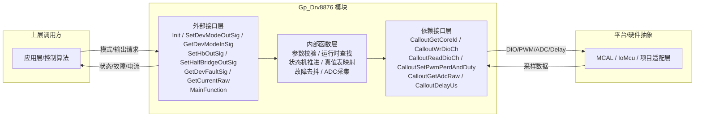

## 4. 文件列表设计

| 文件名 | 必需/可选 | 职责 | 关键内容 |
| --- | --- | --- | --- |
| `Gp_Drv8876.c` | 必需 | 驱动实现主体 | 8 个外部 API 实现、内部 static 函数、每核运行时数据数组、状态机逻辑、真值表映射、故障去抖、时序管理 |
| `Gp_Drv8876.h` | 必需 | 外部接口头文件 | 外部 API 原型声明、模块版本信息 |
| `Gp_Drv8876_Types.h` | 必需 | 类型定义头文件 | 设备模式枚举、H 桥输出状态枚举、半桥输出状态枚举、PMODE/IMODE 枚举、故障位掩码定义、实例配置容器结构体、运行时容器结构体、SigMapping 条目结构体 |
| `Gp_Drv8876_Cfg.h` | 必需 | 配置宏参头文件 | DEV_ERROR_DETECT / MAINFUNCTION_ENABLE / HALF_BRIDGE_ENABLE 功能开关、版本宏、每核实例数宏 |
| `Gp_Drv8876_CfgData.h` | 必需 | 配置数据声明头文件 | 配置表 extern 声明、配置容器结构体前向引用 |
| `Gp_Drv8876_Cfg.c` | 必需 | 配置数据定义文件 | 每核配置表（实例数、每实例配置容器数组、SigMapping 表）、const 数据 MemMap 放置 |
| `Gp_Drv8876_Callout.h` | 必需 | 平台适配接口头文件 | 6 个 Callout 原型：GetCoreId / WrDioCh / ReadDioCh / SetPwmPerdAndDuty / GetAdcRaw / DelayUs |
| `Gp_Drv8876_Callout.c` | 必需 | 平台适配实现文件 | Callout 集成桩代码或项目适配实现 |
| `Gp_Drv8876_MemMap.h` | 必需 | 内存段映射头文件 | CODE / CLEAR_FAR_DATA (per-core) / CONST (per-core) / CONST (global) 段宏定义 |

## 5. 多核框架设计

### 5.1 框架设计说明

模块采用多核部署，每核持有独立的运行时数据和配置表副本。外部接口入口统一通过 CalloutGetCoreId 获取当前核 ID，校验调用核身份与目标实例的配置核归属是否一致。运行时数据以每核静态数组组织，索引为实例序号（非核 ID），Init 加载当前核配置表并为每个配置实例初始化运行时容器。MainFunction 仅处理当前核拥有的实例，不跨核遍历。配置表 per-core 复制保证各核独立读写不冲突。同步点仅限于编译期共享的 const 全局配置（如版本信息），运行时数据完全隔离。任务模型按核分配，每核独立调度 MainFunction。

### 5.2 核模型

| Core | 职责 | Init入口 | 周期任务 | 运行时数据 |
| --- | --- | --- | --- | --- |
| Core0 | 管理本核拥有的 DRV8876 实例 | `Gp_Drv8876_Init(void)` | `Gp_Drv8876_MainFunction(void)` | 每核静态运行时数组、DET 错误记录、配置表常量 |
| Core1 | 管理本核拥有的 DRV8876 实例 | `Gp_Drv8876_Init(void)` | `Gp_Drv8876_MainFunction(void)` | 每核静态运行时数组、DET 错误记录、配置表常量 |
| CoreN | 同模式，按需扩展 | 同上 | 同上 | 同上 |

### 5.3 任务模型

| Task | Core | 周期 | 调用对象 | 监控动作 |
| --- | --- | --- | --- | --- |
| `Gp_Drv8876_Task` | Core0 | 项目定义（建议 ≥ 1ms） | `Gp_Drv8876_MainFunction()` | 状态机推进、nSLEEP 时序管理、nFAULT 采样去抖、IPROPI ADC 采集、输出控制下发 |
| `Gp_Drv8876_Task` | Core1 | 项目定义（建议 ≥ 1ms） | `Gp_Drv8876_MainFunction()` | 同上 |
| Set/Get API | 各核 | 事件驱动 | 各外部 Set/Get API | Core ID 校验 + 参数校验 |

### 5.4 同步点与共享对象

| 对象/同步点 | 写方 | 读方 | 用途 | 一致性要求 |
| --- | --- | --- | --- | --- |
| 版本信息常量 | 编译期固定 | 所有核 | 模块版本查询 | 编译期常量，无需同步 |
| 全局 CONST 段配置 | 编译期固定 | 所有核 | 模块级共享常量 | 编译期常量，无需同步 |
| 每核运行时数据 | 本核 Init/MainFunction | 本核 Set/Get API | 实例状态、故障、电流 | 单核独占，无需跨核同步 |
| 每核配置表 | 编译期固定 | 本核所有 API | 实例配置查询 | 单核独占，无需跨核同步 |

> 跨核共享运行时对象：**无**。所有运行时数据在当前核内闭环。跨核共享仅限编译期 const 全局数据，不涉及运行时同步。

## 6. 接口设计

> 本章将外部接口、内部接口、依赖接口作为整体设计，三个子章节分别承载不同调用层级，共同描述模块的完整接口体系。

### 6.1 外部接口设计

> **完整性规则**：架构或需求中定义的所有外部接口，无论数目多少，都必须在本书中按统一格式逐一完整生成。不得因接口数目多而缩减、合并或跳过任何接口的子功能拆分、执行步骤和流程图。

#### 6.1.1 `Gp_Drv8876_Init`

| Interface Prototype | Description | Sync/Async | Reentrancy | Return Value | Basic Constraints |
| --- | --- | --- | --- | --- | --- |
| `void Gp_Drv8876_Init(void)` | 初始化当前核的 Gp_Drv8876 模块。加载每核实例配置，为每个已配置实例初始化运行时状态容器，并将所有控制输出（nSLEEP、EN/IN1、PH/IN2、PMODE、IMODE）置为配置定义的默认安全状态。必须在当前核任何其他 Gp_Drv8876 API 之前调用一次。 | 同步 | 不可重入 | 无 | MCU DIO/PWM/ADC 资源必须已完成上游初始化；配置数据必须可访问。重复调用按项目约定重新加载配置或保持幂等。无效配置实例被标记为不可用，不产生未定义的 H 桥输出。 |

##### 6.1.1.1 子功能拆分

| 步骤 | 子功能 | 输入 | 输出 | 关键检查/约束 | 依赖对象 |
| --- | --- | --- | --- | --- | --- |
| 1 | 获取当前核 ID | 无 | 当前 Core ID | CalloutGetCoreId 必须可用 | `Gp_Drv8876_CalloutGetCoreId` |
| 2 | 加载当前核配置表 | Core ID | 实例数、每实例配置容器指针 | 配置表必须存在且可访问 | 配置表常量 |
| 3 | 遍历实例并初始化运行时容器 | 实例配置、默认模式/输出 | 运行时容器数组 | 实例数在有效范围内 | 运行时容器 |
| 4 | 设置默认控制输出 | 默认输出配置 | nSLEEP/EN/IN1/PH/IN2/PMODE/IMODE 初始电平 | 无效实例跳过不下发 | `Gp_Drv8876_CalloutWrDioCh` |
| 5 | 标记模块已初始化 | 初始化完成标志 | 模块初始化状态 | — | 运行时全局状态 |

##### 6.1.1.2 执行步骤

1. 调用 CalloutGetCoreId 获取当前核 ID。
2. 根据核 ID 索引当前核配置表，读取实例数量和各实例配置容器。
3. 遍历每个已配置实例：
   a. 初始化运行时容器：设备模式设为默认值，输出状态设为默认值，故障状态清零，电流采样值清零，时序状态机置为 IDLE。
   b. 标记有效实例为可用。
4. 遍历每个有效实例，调用 CalloutWrDioCh 依次设置 nSLEEP、EN/IN1、PH/IN2、PMODE、IMODE 为配置默认电平。
5. 设置模块全局初始化完成标志。

##### 6.1.1.3 调用关系

| 调用对象 | 类别 | 作用 | 调用时机 |
| --- | --- | --- | --- |
| `Gp_Drv8876_CalloutGetCoreId` | 依赖接口 | 获取当前核 ID 以选择配置表 | 步骤 1 |
| `Gp_Drv8876_CalloutWrDioCh` | 依赖接口 | 设置各控制引脚默认输出电平 | 步骤 4 |
| `Gp_Drv8876_GetRumtime` | 内部函数 | 获取实例运行时容器指针 | 步骤 3 |
| `Gp_Drv8876_GetCfgData` | 内部函数 | 获取实例配置容器指针 | 步骤 2 |

##### 6.1.1.4 流程图

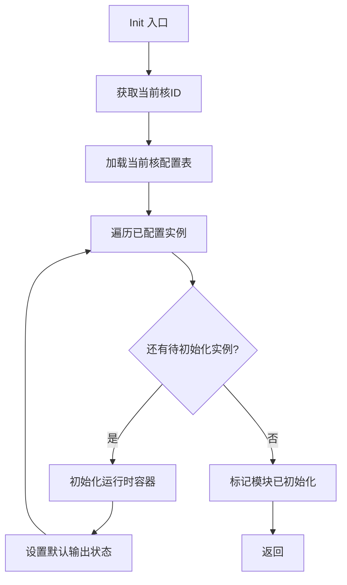

#### 6.1.2 `Gp_Drv8876_SetDevModeOutSig`

| Interface Prototype | Description | Sync/Async | Reentrancy | Return Value | Basic Constraints |
| --- | --- | --- | --- | --- | --- |
| `Std_ReturnType Gp_Drv8876_SetDevModeOutSig(uint16 Id_u16, uint8 DevMode_u8)` | 请求目标实例进入 Sleep 或 Active 软件模式。请求立即缓冲到运行时容器；实际 nSLEEP 引脚跳变和 tSLEEP/tWAKE 时序由 MainFunction 异步处理。 | 异步（缓冲请求） | 不可重入 | `E_OK` 缓冲成功；`E_NOT_OK` 若未初始化、Id_u16 无效、跨核访问或 DevMode_u8 非法。 | 模块必须已初始化；Id_u16 必须解析为当前核有效实例；DevMode_u8 必须为定义的 Sleep 或 Active 模式常量。非法请求不改变缓冲请求和引脚状态。 |

##### 6.1.2.1 子功能拆分

| 步骤 | 子功能 | 输入 | 输出 | 关键检查/约束 | 依赖对象 |
| --- | --- | --- | --- | --- | --- |
| 1 | 参数校验与初始化检查 | Id_u16, DevMode_u8 | 校验结果 | 模块已初始化、DevMode_u8 合法 | `Gp_Drv8876_CheckInitAndId` |
| 2 | 查找运行时容器 | Id_u16 | 实例运行时容器指针 | 实例必须有效 | `Gp_Drv8876_GetRumtime` |
| 3 | 缓冲模式请求 | DevMode_u8, 运行时容器 | 更新后的运行时容器 | 请求模式与当前模式不同时才更新 | 运行时容器 |

##### 6.1.2.2 执行步骤

1. 调用内部校验函数检查模块初始化状态和 Id_u16 有效性（含 Core ID 匹配）。
2. 若 DevMode_u8 非法（非 Sleep 且非 Active），记录 DET 并返回 E_NOT_OK。
3. 通过 Id_u16 查找对应实例运行时容器。
4. 若实例被标记为不可用，返回 E_NOT_OK。
5. 将 DevMode_u8 写入运行时容器的缓冲模式请求字段。
6. 返回 E_OK。

##### 6.1.2.3 调用关系

| 调用对象 | 类别 | 作用 | 调用时机 |
| --- | --- | --- | --- |
| `Gp_Drv8876_CheckInitAndId` | 内部函数 | 校验模块已初始化、Id 有效、Core 匹配 | 步骤 1 |
| `Gp_Drv8876_GetRumtime` | 内部函数 | 获取实例运行时容器指针 | 步骤 3 |

##### 6.1.2.4 流程图

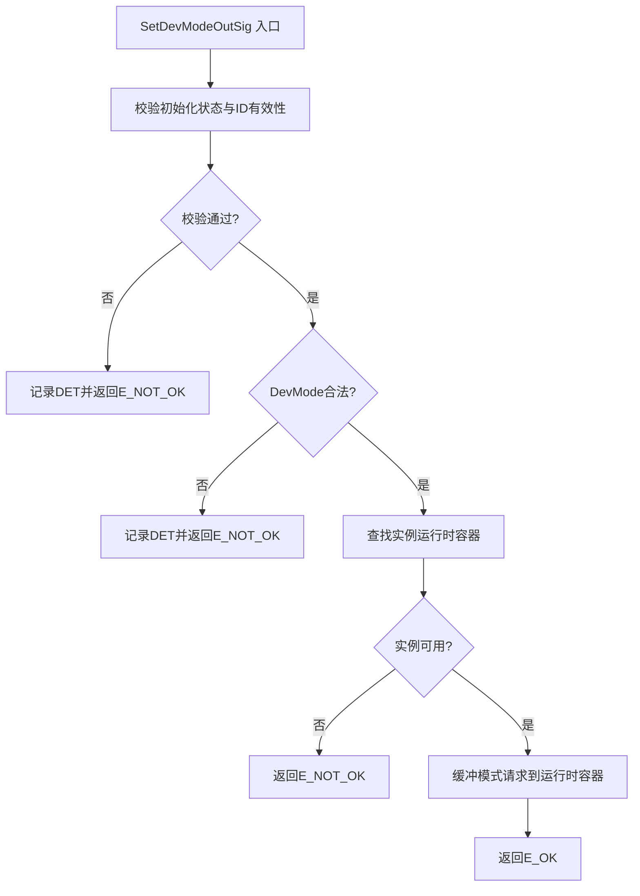

#### 6.1.3 `Gp_Drv8876_GetDevModeInSig`

| Interface Prototype | Description | Sync/Async | Reentrancy | Return Value | Basic Constraints |
| --- | --- | --- | --- | --- | --- |
| `Std_ReturnType Gp_Drv8876_GetDevModeInSig(uint16 Id_u16, uint8* DevMode_pu8)` | 读取目标实例最近一次被接受的软件模式请求状态。返回缓冲请求值，不声明芯片物理确认状态。 | 同步 | 可重入 | `E_OK` 成功；`E_NOT_OK` 若未初始化、Id_u16 无效、跨核访问或 DevMode_pu8 为空指针。 | 模块必须已初始化；输出指针非空。失败时不写入输出参数。 |

##### 6.1.3.1 子功能拆分

| 步骤 | 子功能 | 输入 | 输出 | 关键检查/约束 | 依赖对象 |
| --- | --- | --- | --- | --- | --- |
| 1 | 参数校验与初始化检查 | Id_u16, DevMode_pu8 | 校验结果 | 模块已初始化、指针非空 | `Gp_Drv8876_CheckInitIdAndPtr` |
| 2 | 查找运行时容器 | Id_u16 | 实例运行时容器指针 | 实例必须有效 | `Gp_Drv8876_GetRumtime` |
| 3 | 读取并返回软件模式 | 运行时容器 | 软件模式值 | — | 运行时容器 |

##### 6.1.3.2 执行步骤

1. 调用内部校验函数检查模块初始化状态、Id_u16 有效性（含 Core ID 匹配）和 DevMode_pu8 非空。
2. 通过 Id_u16 查找对应实例运行时容器。
3. 读取运行时容器中当前软件模式值，写入 DevMode_pu8。
4. 返回 E_OK。

##### 6.1.3.3 调用关系

| 调用对象 | 类别 | 作用 | 调用时机 |
| --- | --- | --- | --- |
| `Gp_Drv8876_CheckInitIdAndPtr` | 内部函数 | 校验初始化、ID、指针 | 步骤 1 |
| `Gp_Drv8876_GetRumtime` | 内部函数 | 获取实例运行时容器指针 | 步骤 2 |

##### 6.1.3.4 流程图

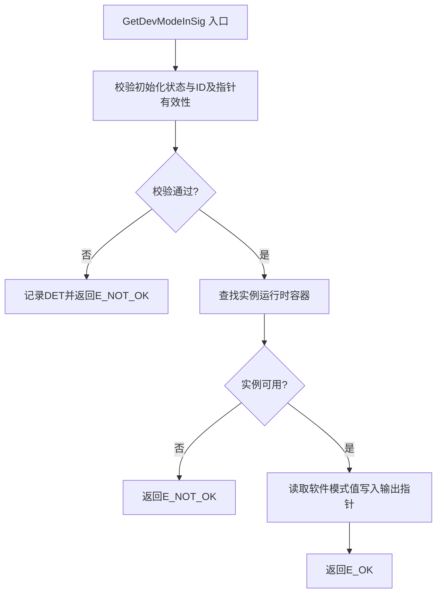

#### 6.1.4 `Gp_Drv8876_SetHbOutSig`

| Interface Prototype | Description | Sync/Async | Reentrancy | Return Value | Basic Constraints |
| --- | --- | --- | --- | --- | --- |
| `Std_ReturnType Gp_Drv8876_SetHbOutSig(uint16 Id_u16, uint8 HbState_u8, uint32 Period_u32, uint32 Duty_u32)` | 请求目标实例的 H 桥输出状态（Coast/Brake/Forward/Reverse）及 PWM 参数。请求缓冲到运行时容器；实际 EN/IN1 和 PH/IN2 引脚更新由 MainFunction 按已配置控制模式查真值表后统一下发。 | 异步（缓冲请求） | 不可重入 | `E_OK` 缓冲成功；`E_NOT_OK` 若未初始化、Id_u16 无效、实例不在 Active 模式、HbState_u8 非法、Duty_u32 > Period_u32 或控制模式不支持请求状态。 | 模块必须已初始化；目标实例必须处于 Active 软件模式；占空比不得大于周期；PWM 参数单位和范围由配置表定义。非法请求不改变缓冲输出状态和引脚电平。 |

##### 6.1.4.1 子功能拆分

| 步骤 | 子功能 | 输入 | 输出 | 关键检查/约束 | 依赖对象 |
| --- | --- | --- | --- | --- | --- |
| 1 | 参数校验与初始化检查 | Id_u16, HbState_u8, Period_u32, Duty_u32 | 校验结果 | 模块已初始化 | `Gp_Drv8876_CheckInitAndId` |
| 2 | 输出状态合法性校验 | HbState_u8 | 校验结果 | HbState 必须为已定义枚举值 | 类型定义 |
| 3 | PWM 参数校验 | Period_u32, Duty_u32 | 校验结果 | Duty ≤ Period | 配置表 PWM 范围 |
| 4 | 实例 Active 状态检查 | 运行时容器 | 校验结果 | 实例必须处于 Active 模式 | `Gp_Drv8876_CheckInstanceActive` |
| 5 | 缓冲输出请求 | HbState_u8, Period_u32, Duty_u32 | 更新后的运行时容器 | — | 运行时容器 |

##### 6.1.4.2 执行步骤

1. 调用内部校验函数检查模块初始化状态和 Id_u16 有效性（含 Core ID 匹配）。
2. 校验 HbState_u8 是否为合法 H 桥输出状态枚举值（Coast/Brake/Forward/Reverse），非法则记录 DET 并返回 E_NOT_OK。
3. 校验 Duty_u32 ≤ Period_u32，不满足则记录 DET 并返回 E_NOT_OK。
4. 通过 Id_u16 查找对应实例运行时容器，检查实例是否处于 Active 软件模式，不在 Active 模式则返回 E_NOT_OK。
5. 检查控制模式（PMODE）是否支持所请求的输出状态（如独立半桥模式下不支持 H 桥输出），不支持则返回 E_NOT_OK。
6. 将 HbState_u8、Period_u32、Duty_u32 写入运行时容器的缓冲输出请求字段。
7. 返回 E_OK。

##### 6.1.4.3 调用关系

| 调用对象 | 类别 | 作用 | 调用时机 |
| --- | --- | --- | --- |
| `Gp_Drv8876_CheckInitAndId` | 内部函数 | 校验初始化、ID、Core 匹配 | 步骤 1 |
| `Gp_Drv8876_GetRumtime` | 内部函数 | 获取实例运行时容器指针 | 步骤 4 |
| `Gp_Drv8876_CheckInstanceActive` | 内部函数 | 校验实例处于 Active 模式 | 步骤 4 |

##### 6.1.4.4 流程图

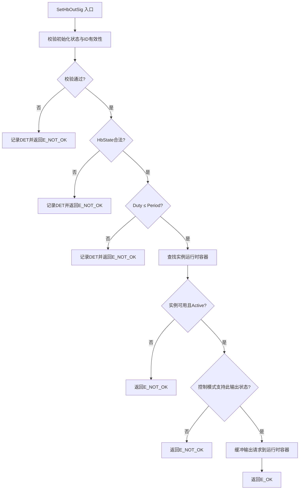

#### 6.1.5 `Gp_Drv8876_SetHalfBridgeOutSig`

| Interface Prototype | Description | Sync/Async | Reentrancy | Return Value | Basic Constraints |
| --- | --- | --- | --- | --- | --- |
| `Std_ReturnType Gp_Drv8876_SetHalfBridgeOutSig(uint16 Id_u16, uint8 HalfBridge_u8, uint8 OutState_u8)` | 当实例配置为独立半桥控制模式时，请求 OUT1 或 OUT2 对应半桥的输出状态。请求缓冲到运行时容器；实际 INx 引脚更新由 MainFunction 执行。若项目未启用独立半桥模式（`GP_DRV8876_CFG_HALF_BRIDGE_ENABLE = STD_OFF`），此接口不编译或固定返回 E_NOT_OK。 | 异步（缓冲请求） | 不可重入 | `E_OK` 成功；`E_NOT_OK` 若模式不匹配、半桥 ID 非法、输出状态非法、实例不在 Active 模式。 | 实例必须配置为独立半桥模式（PMODE=Hi-Z 锁存）；HalfBridge_u8 选择 OUT1 或 OUT2；OutState_u8 选择低侧或高侧导通。 |

##### 6.1.5.1 子功能拆分

| 步骤 | 子功能 | 输入 | 输出 | 关键检查/约束 | 依赖对象 |
| --- | --- | --- | --- | --- | --- |
| 1 | 参数校验与初始化检查 | Id_u16, HalfBridge_u8, OutState_u8 | 校验结果 | 模块已初始化 | `Gp_Drv8876_CheckInitAndId` |
| 2 | 独立半桥模式校验 | 运行时容器 | 校验结果 | PMODE 必须为独立半桥 | `Gp_Drv8876_GetRumtime` |
| 3 | 半桥参数校验 | HalfBridge_u8, OutState_u8 | 校验结果 | 半桥 ID 和输出状态合法 | 类型定义 |
| 4 | 缓冲输出请求 | HalfBridge_u8, OutState_u8 | 更新后的运行时容器 | — | 运行时容器 |

##### 6.1.5.2 执行步骤

1. 调用内部校验函数检查模块初始化状态和 Id_u16 有效性（含 Core ID 匹配）。
2. 通过 Id_u16 查找实例运行时容器，检查实例配置的 PMODE 是否为独立半桥模式。若不是，返回 E_NOT_OK。
3. 校验 HalfBridge_u8 是否合法（OUT1 或 OUT2），非法则记录 DET 并返回 E_NOT_OK。
4. 校验 OutState_u8 是否合法（低侧导通或高侧导通），非法则记录 DET 并返回 E_NOT_OK。
5. 检查实例是否处于 Active 软件模式，否则返回 E_NOT_OK。
6. 将半桥输出请求写入运行时容器的缓冲字段。
7. 返回 E_OK。

##### 6.1.5.3 调用关系

| 调用对象 | 类别 | 作用 | 调用时机 |
| --- | --- | --- | --- |
| `Gp_Drv8876_CheckInitAndId` | 内部函数 | 校验初始化、ID、Core 匹配 | 步骤 1 |
| `Gp_Drv8876_GetRumtime` | 内部函数 | 获取实例运行时容器指针 | 步骤 2 |
| `Gp_Drv8876_CheckInstanceActive` | 内部函数 | 校验实例处于 Active 模式 | 步骤 5 |

##### 6.1.5.4 流程图

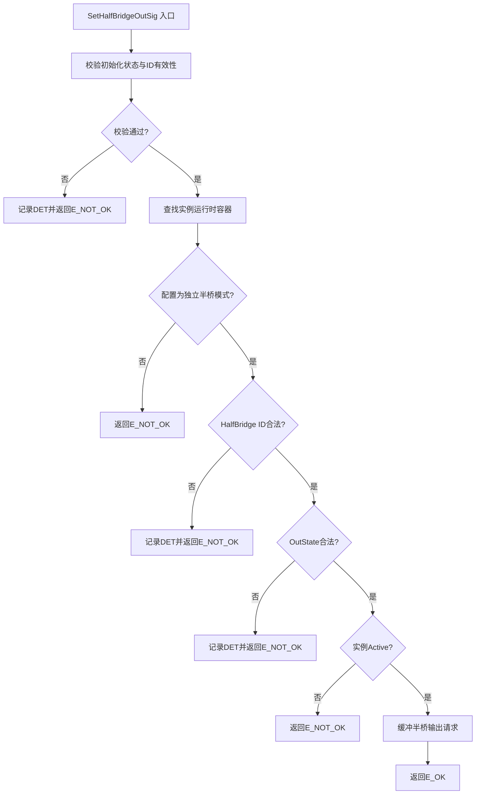

#### 6.1.6 `Gp_Drv8876_GetDevFaultSig`

| Interface Prototype | Description | Sync/Async | Reentrancy | Return Value | Basic Constraints |
| --- | --- | --- | --- | --- | --- |
| `Std_ReturnType Gp_Drv8876_GetDevFaultSig(uint16 Id_u16, uint32* Fault_pu32)` | 读取目标实例的当前软件故障状态位掩码。故障状态由 MainFunction 通过周期采样 nFAULT 引脚并去抖后更新。位掩码聚合 nFAULT 低有效指示，若无额外硬件测量，UVLO/CPUV/OCP/TSD 具体物理根因无法仅由软件区分。 | 同步 | 可重入 | `E_OK` 成功；`E_NOT_OK` 若未初始化、Id_u16 无效、跨核访问或 Fault_pu32 为空指针。 | 模块必须已初始化；输出指针非空；nFAULT DIO 通道必须已配置。失败时不写入输出参数。 |

##### 6.1.6.1 子功能拆分

| 步骤 | 子功能 | 输入 | 输出 | 关键检查/约束 | 依赖对象 |
| --- | --- | --- | --- | --- | --- |
| 1 | 参数校验与初始化检查 | Id_u16, Fault_pu32 | 校验结果 | 模块已初始化、指针非空 | `Gp_Drv8876_CheckInitIdAndPtr` |
| 2 | 查找运行时容器 | Id_u16 | 实例运行时容器指针 | 实例必须有效 | `Gp_Drv8876_GetRumtime` |
| 3 | 返回故障位掩码 | 运行时容器 | 故障位掩码值 | — | 运行时容器 |

##### 6.1.6.2 执行步骤

1. 调用内部校验函数检查模块初始化状态、Id_u16 有效性（含 Core ID 匹配）和 Fault_pu32 非空。
2. 通过 Id_u16 查找对应实例运行时容器。
3. 读取运行时容器中经过去抖确认的故障位掩码，写入 Fault_pu32。
4. 返回 E_OK。

##### 6.1.6.3 调用关系

| 调用对象 | 类别 | 作用 | 调用时机 |
| --- | --- | --- | --- |
| `Gp_Drv8876_CheckInitIdAndPtr` | 内部函数 | 校验初始化、ID、指针 | 步骤 1 |
| `Gp_Drv8876_GetRumtime` | 内部函数 | 获取实例运行时容器指针 | 步骤 2 |

##### 6.1.6.4 流程图


#### 6.1.7 `Gp_Drv8876_GetCurrentRaw`

| Interface Prototype | Description | Sync/Async | Reentrancy | Return Value | Basic Constraints |
| --- | --- | --- | --- | --- | --- |
| `Std_ReturnType Gp_Drv8876_GetCurrentRaw(uint16 Id_u16, uint16* Raw_pu16)` | 读取目标实例最近一次 IPROPI ADC 原始采样值。ADC 值由 MainFunction 周期性采集并缓存。电流-电压换算和跳闸点推导可由上层或驱动内部（若后续确认换算接口）完成。 | 同步 | 可重入 | `E_OK` 成功；`E_NOT_OK` 若未初始化、Id_u16 无效、跨核访问、Raw_pu16 为空指针或 IPROPI ADC 通道未配置。 | 模块必须已初始化；输出指针非空；IPROPI ADC 通道必须已配置。失败时不写入输出参数。 |

##### 6.1.7.1 子功能拆分

| 步骤 | 子功能 | 输入 | 输出 | 关键检查/约束 | 依赖对象 |
| --- | --- | --- | --- | --- | --- |
| 1 | 参数校验与初始化检查 | Id_u16, Raw_pu16 | 校验结果 | 模块已初始化、指针非空 | `Gp_Drv8876_CheckInitIdAndPtr` |
| 2 | 查找运行时容器 | Id_u16 | 实例运行时容器指针 | 实例必须有效，ADC 通道已配置 | `Gp_Drv8876_GetRumtime` |
| 3 | 返回 ADC 原始值 | 运行时容器 | ADC 原始值 | — | 运行时容器 |

##### 6.1.7.2 执行步骤

1. 调用内部校验函数检查模块初始化状态、Id_u16 有效性（含 Core ID 匹配）和 Raw_pu16 非空。
2. 通过 Id_u16 查找对应实例运行时容器。
3. 检查实例配置中 IPROPI ADC 通道是否已配置，未配置则返回 E_NOT_OK。
4. 读取运行时容器中最近一次 ADC 原始采样缓存值，写入 Raw_pu16。
5. 返回 E_OK。

##### 6.1.7.3 调用关系

| 调用对象 | 类别 | 作用 | 调用时机 |
| --- | --- | --- | --- |
| `Gp_Drv8876_CheckInitIdAndPtr` | 内部函数 | 校验初始化、ID、指针 | 步骤 1 |
| `Gp_Drv8876_GetRumtime` | 内部函数 | 获取实例运行时容器指针 | 步骤 2 |

##### 6.1.7.4 流程图

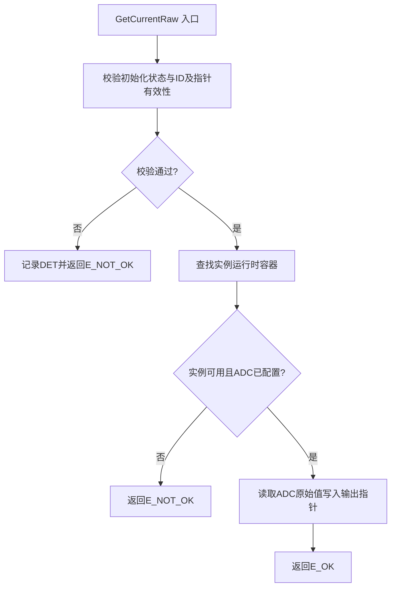

#### 6.1.8 `Gp_Drv8876_MainFunction`

| Interface Prototype | Description | Sync/Async | Reentrancy | Return Value | Basic Constraints |
| --- | --- | --- | --- | --- | --- |
| `void Gp_Drv8876_MainFunction(void)` | 当前核的周期处理函数。驱动每实例状态机、将缓冲的模式/H桥/半桥请求下发至 DIO/PWM 输出、管理 nSLEEP 的 tSLEEP/tWAKE 时序、采样 nFAULT 并去抖、读取 IPROPI ADC、更新软件故障状态、执行 PMODE/IMODE 重锁存序列。必须由操作系统或调度器按周期调用。 | 异步（周期处理） | 不可重入 | 无 | 模块必须已初始化；Callout 依赖（DIO/PWM/ADC/GetCoreId/Delay）必须可用。本函数是硬件输出引脚的唯一写入者和运行时故障/电流反馈状态的唯一更新者。 |

##### 6.1.8.1 子功能拆分

| 步骤 | 子功能 | 输入 | 输出 | 关键检查/约束 | 依赖对象 |
| --- | --- | --- | --- | --- | --- |
| 1 | 获取核 ID 与遍历实例 | 无 | 核 ID、实例列表 | CalloutGetCoreId 可用 | `Gp_Drv8876_CalloutGetCoreId` |
| 2 | nSLEEP 时序状态机推进 | 运行时容器、配置 | 更新后的时序状态、nSLEEP 控制输出 | tSLEEP/tWAKE ≥ 1ms | `Gp_Drv8876_CalloutDelayUs`, `Gp_Drv8876_CalloutWrDioCh` |
| 3 | 缓冲请求处理与输出下发 | 运行时容器、配置 | EN/IN1、PH/IN2 控制输出 | 仅在 Active 且时序就绪后下发 | `Gp_Drv8876_CalloutWrDioCh`, `Gp_Drv8876_CalloutSetPwmPerdAndDuty` |
| 4 | nFAULT 采样与去抖 | nFAULT DIO 输入 | 更新后的故障位掩码 | 去抖计数器达到阈值才确认故障 | `Gp_Drv8876_CalloutReadDioCh` |
| 5 | IPROPI ADC 采集 | ADC 通道 | 更新后的 ADC 缓存值 | ADC 结果有效才更新缓存 | `Gp_Drv8876_CalloutGetAdcRaw` |

##### 6.1.8.2 执行步骤

1. 调用 CalloutGetCoreId 获取当前核 ID，索引当前核运行时数据区。
2. 若模块未初始化，直接返回。
3. 遍历当前核所有已配置实例，对每个有效实例：
   a. **nSLEEP 时序状态机推进**：根据当前时序状态和缓冲模式请求，执行状态切换动作（拉高/拉低 nSLEEP）、启动/检查延时、标记时序完成。
   b. **输出控制下发**：若实例处于 Active 模式且 nSLEEP 时序已完成，检查缓冲输出请求是否变化。如有新请求，根据 PMODE 配置查真值表，将 H 桥输出状态映射为 EN/IN1 和 PH/IN2 控制序列，通过 CalloutWrDioCh 或 CalloutSetPwmPerdAndDuty 下发。
   c. **nFAULT 采样去抖**：调用 CalloutReadDioCh 读取 nFAULT 引脚逻辑电平。若为故障有效，递增去抖计数器；若为无故障，递减计数器（不低于零）。计数器达到确认阈值时置位故障位；计数器归零时清除故障位。更新运行时故障位掩码。
   d. **IPROPI ADC 采集**：若实例配置了 IPROPI ADC 通道，调用 CalloutGetAdcRaw 读取 ADC 值。若结果有效，更新运行时 ADC 缓存。
4. 遍历结束后返回。

##### 6.1.8.3 调用关系

| 调用对象 | 类别 | 作用 | 调用时机 |
| --- | --- | --- | --- |
| `Gp_Drv8876_CalloutGetCoreId` | 依赖接口 | 获取当前核 ID | 步骤 1 |
| `Gp_Drv8876_CalloutDelayUs` | 依赖接口 | nSLEEP 时序延时等待 | 步骤 3a |
| `Gp_Drv8876_CalloutWrDioCh` | 依赖接口 | 控制 nSLEEP/EN/PH/PMODE/IMODE 引脚 | 步骤 3a, 3b |
| `Gp_Drv8876_CalloutSetPwmPerdAndDuty` | 依赖接口 | PWM 波形输出（PWM 控制模式） | 步骤 3b |
| `Gp_Drv8876_CalloutReadDioCh` | 依赖接口 | 采样 nFAULT 引脚电平 | 步骤 3c |
| `Gp_Drv8876_CalloutGetAdcRaw` | 依赖接口 | 采集 IPROPI ADC | 步骤 3d |
| `Gp_Drv8876_ProcessModeTransition` | 内部函数 | nSLEEP 时序状态机推进 | 步骤 3a |
| `Gp_Drv8876_MapHbOutput` | 内部函数 | 真值表映射输出状态到引脚控制 | 步骤 3b |
| `Gp_Drv8876_SampleFaultPin` | 内部函数 | nFAULT 采样与去抖逻辑 | 步骤 3c |
| `Gp_Drv8876_SampleAdcRaw` | 内部函数 | ADC 采集与缓存更新 | 步骤 3d |

##### 6.1.8.4 流程图

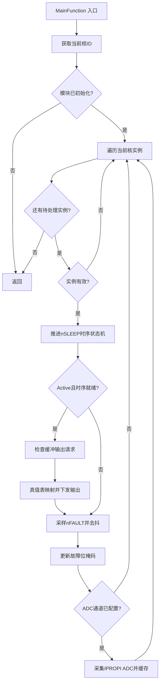

---

### 6.2 内部接口设计

> **完整性规则：** 所有内部接口（不论复杂度高低）均按与外部接口相同的格式逐一完整展开。9 个内部函数各有独立的子章节，含接口原型表、子功能拆分、执行步骤、调用关系表和流程图。

#### 6.2.1 `Gp_Drv8876_CheckInitAndId`

| Function Prototype | Description | Scope | Trigger Point | Dependency/Callout |
| --- | --- | --- | --- | --- |
| `static Std_ReturnType Gp_Drv8876_CheckInitAndId(uint16 Id_u16)` | 校验模块已初始化、Id_u16 有效、当前核 ID 与实例配置核匹配 | `static` | 所有接收 Id_u16 的外部 API | `Gp_Drv8876_CalloutGetCoreId` |

##### 6.2.1.1 子功能拆分

| 步骤 | 子功能 | 输入 | 输出 | 关键检查/约束 | 依赖对象 |
| --- | --- | --- | --- | --- | --- |
| 1 | 校验模块初始化状态 | 全局初始化标志 | E_NOT_OK / 继续 | 未初始化则返回 E_NOT_OK | — |
| 2 | 校验 Id_u16 有效性 | Id_u16、实例数配置 | E_NOT_OK / 实例配置指针 | ID 须小于 CFG_MAX_INSTANCE_COUNT | CalloutGetCoreId |
| 3 | 校验核归属 | 实例配置中的 CoreId、当前核 ID | E_NOT_OK / E_OK | 实例核归属须匹配当前核 | CalloutGetCoreId |

##### 6.2.1.2 执行步骤

1. 读取全局初始化标志，若未初始化则返回 E_NOT_OK。
2. 调用 CalloutGetCoreId 获取当前核 ID。
3. 根据核 ID 和 Id_u16 查找对应实例配置。
4. 若 Id_u16 超出范围或实例配置不可用，返回 E_NOT_OK。
5. 若实例配置的 CoreId 与当前核 ID 不匹配，返回 E_NOT_OK。
6. 所有检查通过，返回 E_OK。

##### 6.2.1.3 调用关系

| 调用对象 | 类别 | 作用 | 调用时机 |
| --- | --- | --- | --- |
| `Gp_Drv8876_CalloutGetCoreId` | 依赖接口 | 获取当前核 ID | 步骤 2 |

##### 6.2.1.4 流程图

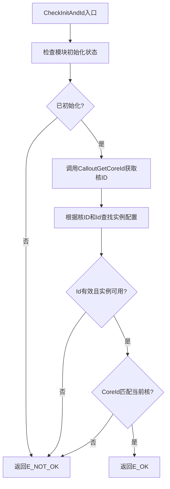

---

#### 6.2.2 `Gp_Drv8876_CheckInitIdAndPtr`

| Function Prototype | Description | Scope | Trigger Point | Dependency/Callout |
| --- | --- | --- | --- | --- |
| `static Std_ReturnType Gp_Drv8876_CheckInitIdAndPtr(uint16 Id_u16, void *Ptr_p)` | 校验模块已初始化、Id_u16 有效、核匹配、输出指针非空 | `static` | GetDevModeInSig / GetDevFaultSig / GetCurrentRaw | `Gp_Drv8876_CalloutGetCoreId` |

##### 6.2.2.1 子功能拆分

| 步骤 | 子功能 | 输入 | 输出 | 关键检查/约束 | 依赖对象 |
| --- | --- | --- | --- | --- | --- |
| 1 | 校验初始化与 Id 有效性 | 全局初始化标志、Id_u16 | E_NOT_OK / 继续 | 复用 CheckInitAndId 逻辑 | CalloutGetCoreId |
| 2 | 校验输出指针非空 | Ptr_p | E_NOT_OK / E_OK | NULL 时返回 E_NOT_OK | — |

##### 6.2.2.2 执行步骤

1. 执行与 CheckInitAndId 相同的初始化、ID 有效性和核归属检查。
2. 若以上检查失败，返回 E_NOT_OK。
3. 检查 Ptr_p 是否为 NULL。
4. 若为 NULL，返回 E_NOT_OK。
5. 所有检查通过，返回 E_OK。

##### 6.2.2.3 调用关系

| 调用对象 | 类别 | 作用 | 调用时机 |
| --- | --- | --- | --- |
| `Gp_Drv8876_CalloutGetCoreId` | 依赖接口 | 获取当前核 ID | 步骤 1 |

##### 6.2.2.4 流程图

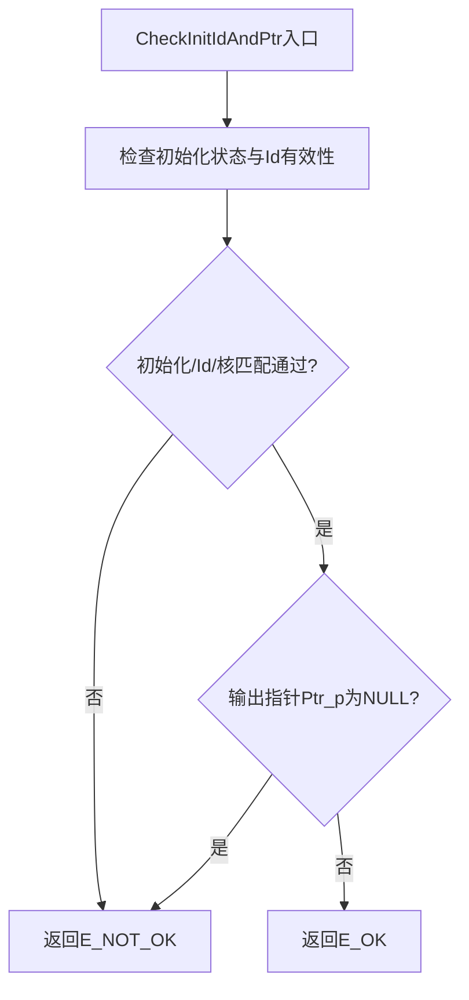

---

#### 6.2.3 `Gp_Drv8876_GetRumtime`

| Function Prototype | Description | Scope | Trigger Point | Dependency/Callout |
| --- | --- | --- | --- | --- |
| `static Gp_Drv8876_InstanceRuntimeType* Gp_Drv8876_GetRumtime(uint16 Id_u16)` | 根据 Id_u16 查找对应实例运行时容器指针 | `static` | 所有接收 Id_u16 的外部 API、MainFunction | N/A |

##### 6.2.3.1 子功能拆分

| 步骤 | 子功能 | 输入 | 输出 | 关键检查/约束 | 依赖对象 |
| --- | --- | --- | --- | --- | --- |
| 1 | 按 ID 索引运行时数组 | Id_u16、运行时数组 | 运行时容器指针或 NULL | ID 须在数组范围内 | — |
| 2 | 校验实例有效性 | 实例 InstanceValid 标志 | 有效指针或 NULL | 无效实例返回 NULL | — |

##### 6.2.3.2 执行步骤

1. 以 Id_u16 为索引访问当前核的运行时数组。
2. 若索引超出数组范围，返回 NULL。
3. 读取实例的 InstanceValid 标志。
4. 若实例无效，返回 NULL。
5. 返回该实例的运行时容器指针。

##### 6.2.3.3 调用关系

| 调用对象 | 类别 | 作用 | 调用时机 |
| --- | --- | --- | --- |
| N/A | — | 纯数据访问，不调用其他接口 | — |

##### 6.2.3.4 流程图

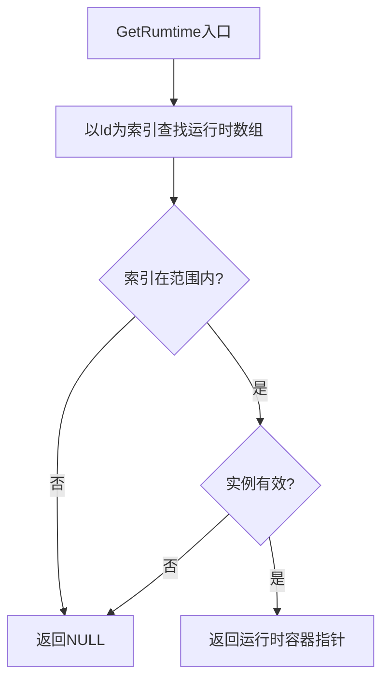

---

#### 6.2.4 `Gp_Drv8876_GetCfgData`

| Function Prototype | Description | Scope | Trigger Point | Dependency/Callout |
| --- | --- | --- | --- | --- |
| `static const Gp_Drv8876_InstanceConfigType* Gp_Drv8876_GetCfgData(uint16 Id_u16)` | 根据 Id_u16 查找对应实例配置容器指针 | `static` | Init、MainFunction | N/A |

##### 6.2.4.1 子功能拆分

| 步骤 | 子功能 | 输入 | 输出 | 关键检查/约束 | 依赖对象 |
| --- | --- | --- | --- | --- | --- |
| 1 | 按 ID 索引配置数组 | Id_u16、配置数组 | 配置容器指针或 NULL | ID 须在数组范围内 | — |
| 2 | 校验配置完整性 | 配置字段 | 有效指针或 NULL | 关键配置字段非空 | — |

##### 6.2.4.2 执行步骤

1. 以 Id_u16 为索引访问当前核的配置数组。
2. 若索引超出数组范围，返回 NULL。
3. 若配置容器的关键字段未填充，返回 NULL。
4. 返回该实例的配置容器指针。

##### 6.2.4.3 调用关系

| 调用对象 | 类别 | 作用 | 调用时机 |
| --- | --- | --- | --- |
| N/A | — | 纯数据访问，不调用其他接口 | — |

##### 6.2.4.4 流程图

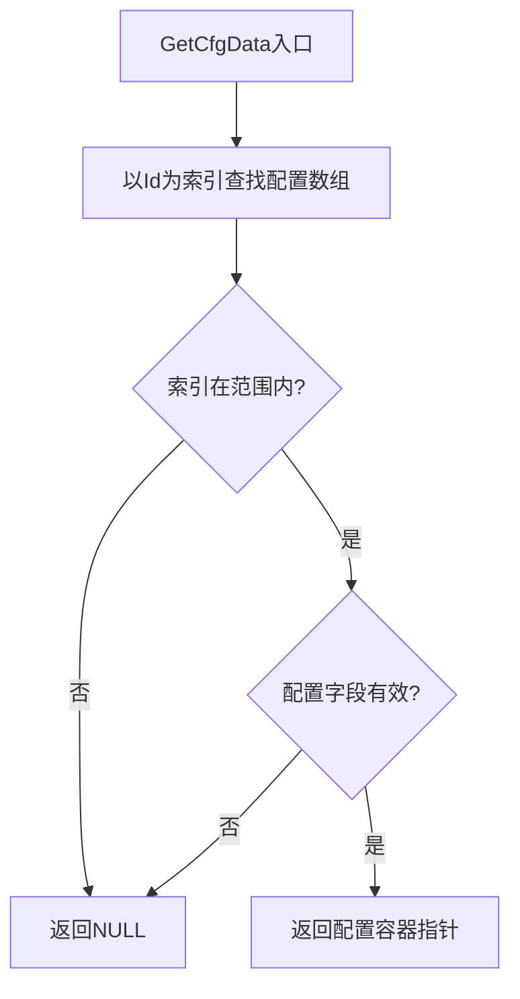

---

#### 6.2.5 `Gp_Drv8876_CheckInstanceActive`

| Function Prototype | Description | Scope | Trigger Point | Dependency/Callout |
| --- | --- | --- | --- | --- |
| `static Std_ReturnType Gp_Drv8876_CheckInstanceActive(uint16 Id_u16)` | 校验目标实例当前软件模式为 Active | `static` | SetHbOutSig / SetHalfBridgeOutSig / MainFunction | N/A |

##### 6.2.5.1 子功能拆分

| 步骤 | 子功能 | 输入 | 输出 | 关键检查/约束 | 依赖对象 |
| --- | --- | --- | --- | --- | --- |
| 1 | 获取运行时容器 | Id_u16 | 运行时容器指针或 NULL | 调用 GetRumtime | — |
| 2 | 检查软件模式 | DevMode 字段 | E_NOT_OK / E_OK | DevMode 须为 Active | — |

##### 6.2.5.2 执行步骤

1. 调用 GetRumtime 获取实例运行时容器。
2. 若返回 NULL，返回 E_NOT_OK。
3. 读取运行时容器的 DevMode 字段。
4. 若 DevMode 不为 Active，返回 E_NOT_OK。
5. 返回 E_OK。

##### 6.2.5.3 调用关系

| 调用对象 | 类别 | 作用 | 调用时机 |
| --- | --- | --- | --- |
| `Gp_Drv8876_GetRumtime` | 内部函数 | 获取实例运行时容器 | 步骤 1 |

##### 6.2.5.4 流程图

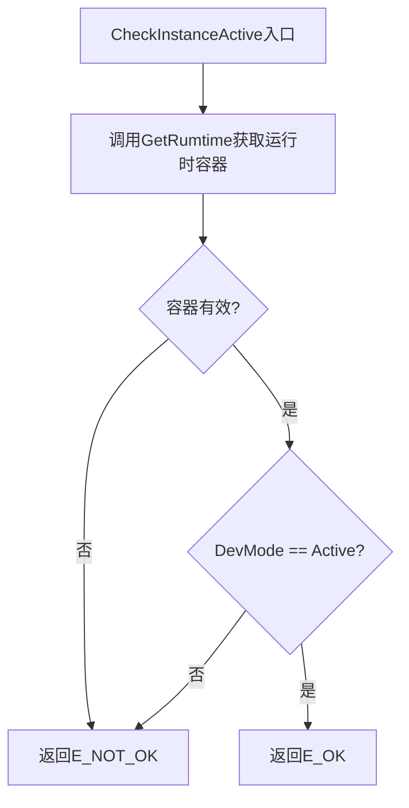

#### 6.2.6 `Gp_Drv8876_ProcessModeTransition`

| Function Prototype | Description | Scope | Trigger Point | Dependency/Callout |
| --- | --- | --- | --- | --- |
| `static void Gp_Drv8876_ProcessModeTransition(Gp_Drv8876_InstanceRuntimeType *Rt_p, const Gp_Drv8876_InstanceConfigType *Cfg_p)` | 管理 nSLEEP 时序状态机推进：根据当前状态和缓冲模式请求执行状态切换、启动延时、检查延时完成、标记时序就绪 | `static` | MainFunction | `Gp_Drv8876_CalloutWrDioCh`, `Gp_Drv8876_CalloutDelayUs` |

##### 6.2.6.1 子功能拆分

| 步骤 | 子功能 | 输入 | 输出 | 关键检查/约束 | 依赖对象 |
| --- | --- | --- | --- | --- | --- |
| 1 | 读取当前时序状态和缓冲模式请求 | 运行时容器 | 当前状态、请求模式 | 状态枚举值合法 | — |
| 2 | 评估状态切换条件 | 当前状态、请求模式 | 目标状态和动作 | 按 §7 状态切换表判断 | — |
| 3 | 执行时序动作 | 目标动作类型 | nSLEEP 引脚电平、延时启动 | 按需拉高/拉低 nSLEEP | CalloutWrDioCh, CalloutDelayUs |
| 4 | 检查延时完成 | 延时启动时间、配置值 | 时序就绪标志 | tSLEEP ≥ 1ms, tWAKE ≥ 1ms | — |
| 5 | 更新时序状态 | 目标状态 | 更新后的时序状态 | — | — |

##### 6.2.6.2 执行步骤

1. 从运行时容器读取当前 nSLEEP 时序状态和缓冲模式请求。
2. 若缓冲请求与当前实际模式一致，无需切换，标记时序就绪并返回。
3. 若缓冲请求为 Sleep 且当前实际为 Active：
   a. 调用 CalloutWrDioCh 将 nSLEEP 拉低。
   b. 调用 CalloutDelayUs 启动 tSLEEP 延时。
   c. 切换时序状态为 SLEEP_WAIT。
4. 若当前状态为 SLEEP_WAIT：
   a. 检查延时是否已达到 tSLEEP_Us_u32 配置值（≥ 1ms）。
   b. 若已达到，更新实际模式为 Sleep，标记时序就绪，切换状态为 IDLE。
5. 若缓冲请求为 Active 且当前实际为 Sleep：
   a. 调用 CalloutWrDioCh 将 nSLEEP 拉高。
   b. 调用 CalloutDelayUs 启动 tWAKE 延时。
   c. 切换时序状态为 WAKE_WAIT。
6. 若当前状态为 WAKE_WAIT：
   a. 检查延时是否已达到 tWAKE_Us_u32 配置值（≥ 1ms）。
   b. 若已达到，更新实际模式为 Active，标记时序就绪，切换状态为 IDLE。

##### 6.2.6.3 调用关系

| 调用对象 | 类别 | 作用 | 调用时机 |
| --- | --- | --- | --- |
| `Gp_Drv8876_CalloutWrDioCh` | 依赖接口 | 拉高/拉低 nSLEEP 引脚 | 步骤 3、5 |
| `Gp_Drv8876_CalloutDelayUs` | 依赖接口 | 启动延时计时 | 步骤 3、5 |

##### 6.2.6.4 流程图

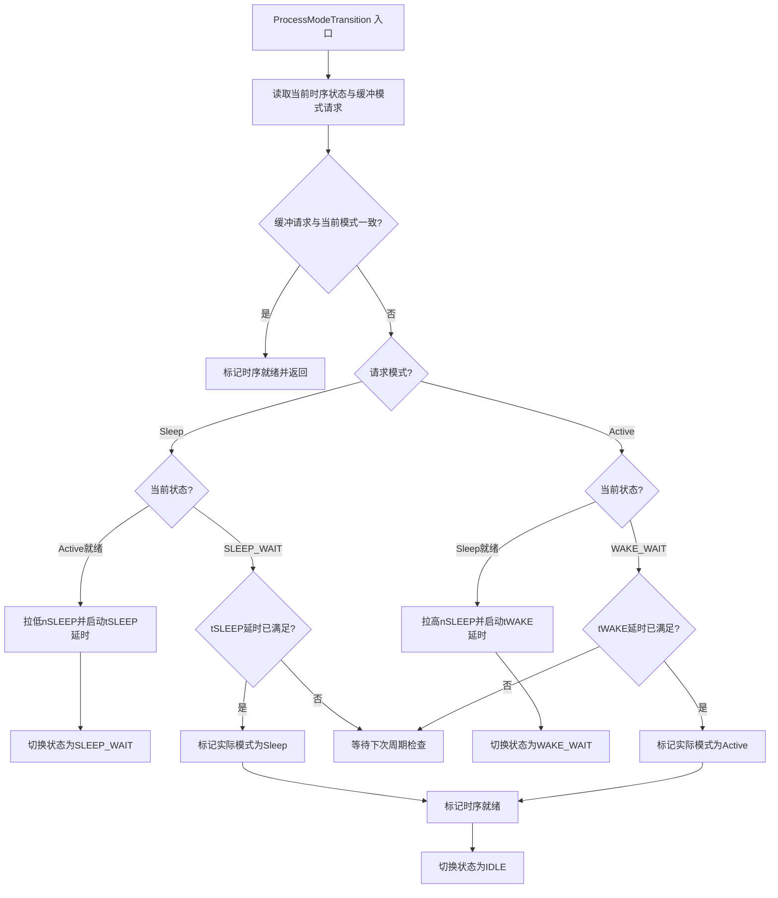

---

#### 6.2.7 `Gp_Drv8876_MapHbOutput`

| Function Prototype | Description | Scope | Trigger Point | Dependency/Callout |
| --- | --- | --- | --- | --- |
| `static void Gp_Drv8876_MapHbOutput(Gp_Drv8876_InstanceRuntimeType *Rt_p, const Gp_Drv8876_InstanceConfigType *Cfg_p)` | 根据 PMODE 配置和 H 桥输出请求查真值表，映射为 EN/IN1 和 PH/IN2 控制序列并下发 | `static` | MainFunction | `Gp_Drv8876_CalloutWrDioCh`, `Gp_Drv8876_CalloutSetPwmPerdAndDuty` |

##### 6.2.7.1 子功能拆分

| 步骤 | 子功能 | 输入 | 输出 | 关键检查/约束 | 依赖对象 |
| --- | --- | --- | --- | --- | --- |
| 1 | 获取 PMODE 配置 | 实例配置容器 | PMODE 枚举值 | PH_EN / PWM / INDEP_HB | — |
| 2 | 查真值表映射 | PMODE、HbState | EN/IN1 和 PH/IN2 电平 | PH/EN 与 PWM 真值表不同 | — |
| 3 | 下发 EN/IN1 控制 | EN 电平/PWM 参数 | EN/IN1 引脚输出 | PH/EN 用 DIO；PWM 用 PWM Callout | CalloutWrDioCh / CalloutSetPwmPerdAndDuty |
| 4 | 下发 PH/IN2 控制 | PH 电平 | PH/IN2 引脚输出 | PH/IN2 为 DIO 输出 | CalloutWrDioCh |
| 5 | 更新实际输出状态 | HbState | 运行时容器 ActualHbState | — | — |

##### 6.2.7.2 执行步骤

1. 从实例配置容器获取 PMODE_u8 枚举值。
2. 从运行时容器获取缓冲的 H 桥输出请求（BufferedHbState_u8、BufferedPeriod_u32、BufferedDuty_u32）。
3. 若 PMODE 为 PH/EN 模式，按 PH/EN 真值表映射：
   - Coast: EN=0, PH=X（不关心）
   - Brake: EN=1, PH=0（低侧慢速衰减）
   - Forward: EN=1, PH=1
   - Reverse: EN=1, PH=0
4. 若 PMODE 为 PWM 模式，按 PWM 真值表映射：
   - Coast: IN1=0, IN2=0
   - Brake: IN1=1, IN2=1
   - Forward: IN1=1, IN2=0
   - Reverse: IN1=0, IN2=1
5. 根据映射结果调用 CalloutWrDioCh 设置 EN/IN1 和 PH/IN2 电平，或调用 CalloutSetPwmPerdAndDuty 设置 PWM 波形。
6. 更新运行时容器中 ActualHbState_u8 为 HbState。

##### 6.2.7.3 调用关系

| 调用对象 | 类别 | 作用 | 调用时机 |
| --- | --- | --- | --- |
| `Gp_Drv8876_CalloutWrDioCh` | 依赖接口 | 设置 EN/IN1 或 PH/IN2 DIO 电平 | 步骤 5 |
| `Gp_Drv8876_CalloutSetPwmPerdAndDuty` | 依赖接口 | 设置 PWM 波形（PWM 模式） | 步骤 5 |

##### 6.2.7.4 流程图

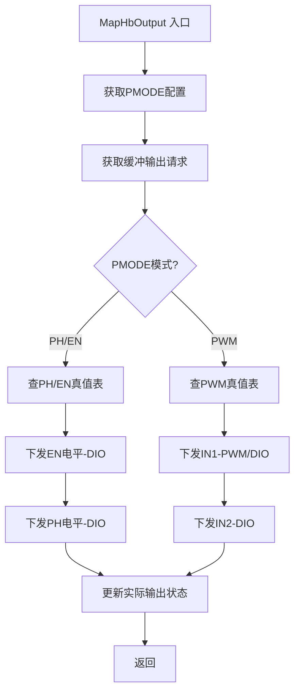

---

#### 6.2.8 `Gp_Drv8876_SampleFaultPin`

| Function Prototype | Description | Scope | Trigger Point | Dependency/Callout |
| --- | --- | --- | --- | --- |
| `static void Gp_Drv8876_SampleFaultPin(Gp_Drv8876_FaultRuntimeType *Fault_p, uint8 nFaultDioChId_u8)` | 采样 nFAULT 引脚电平，执行故障确认与恢复迟滞去抖，更新故障位掩码和锁存状态 | `static` | MainFunction | `Gp_Drv8876_CalloutReadDioCh` |

##### 6.2.8.1 子功能拆分

| 步骤 | 子功能 | 输入 | 输出 | 关键检查/约束 | 依赖对象 |
| --- | --- | --- | --- | --- | --- |
| 1 | 读取 nFAULT 引脚 | nFaultDioChId_u8 | 逻辑故障电平 | 0 = 故障有效 | CalloutReadDioCh |
| 2 | 更新确认/恢复计数器 | 采样值、当前计数器 | 更新后的 FaultConfirmCnt / FaultRecoveryCnt | 按 §9.4 确认/恢复阈值 | — |
| 3 | 评估故障确认/恢复决策 | 计数器、阈值 | 确认/恢复决策 | 确认：连续 N 次故障；恢复：连续 N 次正常 | — |
| 4 | 更新故障位掩码与锁存标志 | 决策结果 | FaultBitmask, FaultLatched | 自恢复使能时自动清除；未使能时锁存 | — |

##### 6.2.8.2 执行步骤

1. 调用 CalloutReadDioCh 读取 nFAULT 引脚逻辑电平。
2. 若读回值为故障有效（逻辑低电平）：
   a. 递增 FaultConfirmCnt_u8（上限为 CFG_FAULT_CONFIRM_THRESHOLD）。
   b. 重置 FaultRecoveryCnt_u8 为 0。
   c. 若 FaultConfirmCnt_u8 达到确认阈值，置位 FaultBitmask_u32 聚合故障位（bit0），并检查自恢复配置：若自恢复未使能，置位 FaultLatched_b。
3. 若读回值为无故障（逻辑高电平）：
   a. 若自恢复使能且故障已确认：递增 FaultRecoveryCnt_u8，若达到 CFG_FAULT_RECOVERY_THRESHOLD，清除聚合故障位和 FaultLatched_b，重置计数器。
   b. 递减 FaultConfirmCnt_u8（下限为 0）。
4. 更新运行时故障容器中的 FaultConfirmCnt_u8、FaultRecoveryCnt_u8、FaultBitmask_u32 和 FaultLatched_b。

##### 6.2.8.3 调用关系

| 调用对象 | 类别 | 作用 | 调用时机 |
| --- | --- | --- | --- |
| `Gp_Drv8876_CalloutReadDioCh` | 依赖接口 | 读取 nFAULT 引脚电平 | 步骤 1 |

##### 6.2.8.4 流程图

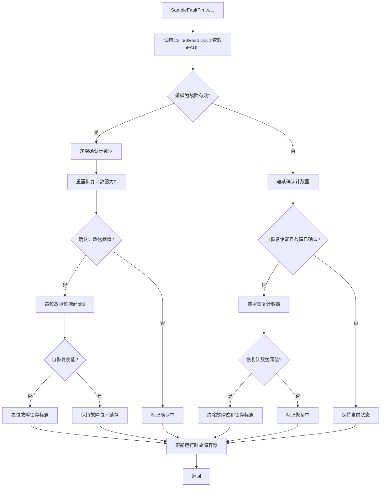

---

#### 6.2.9 `Gp_Drv8876_SampleAdcRaw`

| Function Prototype | Description | Scope | Trigger Point | Dependency/Callout |
| --- | --- | --- | --- | --- |
| `static void Gp_Drv8876_SampleAdcRaw(Gp_Drv8876_MonitorRuntimeType *Monitor_p, uint8 AdcChId_u8)` | 读取 IPROPI ADC 通道原始值，校验有效性后更新运行时缓存 | `static` | MainFunction | `Gp_Drv8876_CalloutGetAdcRaw` |

##### 6.2.9.1 子功能拆分

| 步骤 | 子功能 | 输入 | 输出 | 关键检查/约束 | 依赖对象 |
| --- | --- | --- | --- | --- | --- |
| 1 | 检查 ADC 通道已配置 | AdcChId_u8 | 继续/跳过 | ChId = 0 表示未配置 | — |
| 2 | 读取 ADC 原始值 | AdcChId_u8 | 原始采样值 + 有效标志 | — | CalloutGetAdcRaw |
| 3 | 更新 ADC 缓存 | 有效采样值 | AdcRawCache_u16 | 仅有效值更新缓存 | — |

##### 6.2.9.2 执行步骤

1. 若 AdcChId_u8 为 0（未配置 ADC），直接返回。
2. 调用 CalloutGetAdcRaw 读取 ADC 通道原始值。
3. 若 Callout 返回无效标志，保持上一次缓存值不变（标记为驱动逻辑故障，见 §9.5）。
4. 若 Callout 返回有效值，更新 Monitor 容器中的 AdcRawCache_u16。
5. 返回。

##### 6.2.9.3 调用关系

| 调用对象 | 类别 | 作用 | 调用时机 |
| --- | --- | --- | --- |
| `Gp_Drv8876_CalloutGetAdcRaw` | 依赖接口 | 读取 ADC 原始值 | 步骤 2 |

##### 6.2.9.4 流程图

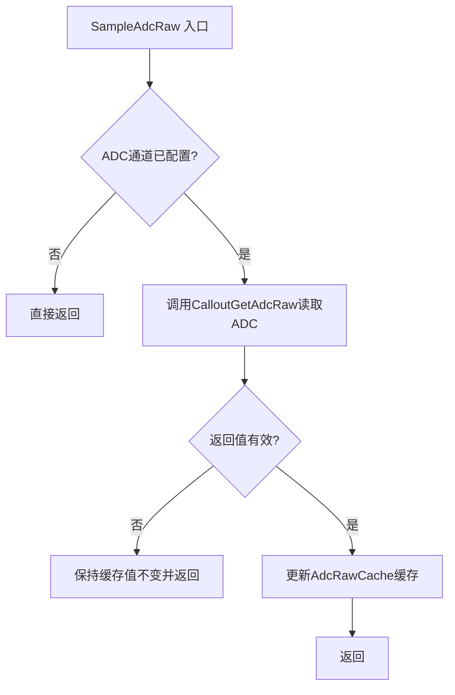

---

### 6.3 依赖接口与Callout设计

#### 6.3.1 `Gp_Drv8876_CalloutGetCoreId`

| Interface Prototype | Description | Implemented By | Sync/Async | Reentrancy | Basic Constraints |
| --- | --- | --- | --- | --- | --- |
| `uint32 Gp_Drv8876_CalloutGetCoreId(void)` | 返回当前执行核的标识符。所有接收 Id_u16 的外部 API 在入口处调用以校验调用核身份与目标实例的配置核归属一致，防止跨核访问。 | 项目适配层 / BswSys_Gp | 同步 | 可重入 | 必须在 Gp_Drv8876_Init 调用前可用；返回值在调用期间稳定。 |

##### 6.3.1.1 关联接口

| 调用方 | 类别 | 调用场景 |
| --- | --- | --- |
| `Gp_Drv8876_Init` | 外部接口 | 获取核 ID 以选择配置表 |
| `Gp_Drv8876_CheckInitAndId` | 内部函数 | 校验调用核与实例配置核一致 |
| `Gp_Drv8876_CheckInitIdAndPtr` | 内部函数 | 校验调用核与实例配置核一致 |
| `Gp_Drv8876_MainFunction` | 外部接口 | 获取核 ID 以索引运行时数据区 |

##### 6.3.1.2 执行步骤

1. 读取硬件核 ID 寄存器或 OS 提供的当前核标识。
2. 返回核 ID 值。

##### 6.3.1.3 流程图

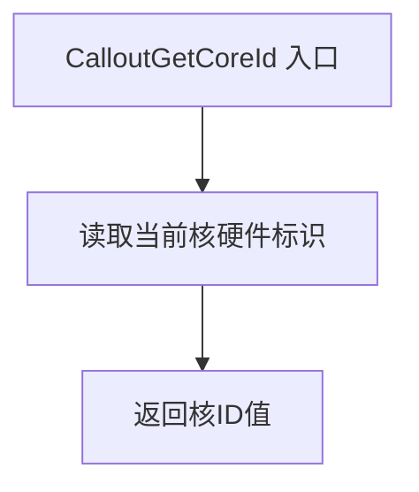

#### 6.3.2 `Gp_Drv8876_CalloutWrDioCh`

| Interface Prototype | Description | Implemented By | Sync/Async | Reentrancy | Basic Constraints |
| --- | --- | --- | --- | --- | --- |
| `void Gp_Drv8876_CalloutWrDioCh(uint16 ChId_u16, uint8 Lvl_u8)` | 设置指定 DIO 通道的逻辑输出电平。FC 通过此接口控制 nSLEEP、EN/IN1、PH/IN2、PMODE、IMODE 引脚。板级反相和引脚映射在 Callout 内部处理。 | MCAL / IoMcu / 项目适配层 | 同步 | 可重入 | ChId_u16 必须是项目集成中配置的有效 DIO 通道；Lvl_u8 为逻辑电平（0=低，非零=高），物理反相由 Callout 负责。 |

##### 6.3.2.1 关联接口

| 调用方 | 类别 | 调用场景 |
| --- | --- | --- |
| `Gp_Drv8876_Init` | 外部接口 | 初始化时设置各控制引脚默认输出 |
| `Gp_Drv8876_MainFunction` | 外部接口 | 周期下发 nSLEEP/EN/PH/PMODE/IMODE 控制输出 |
| `Gp_Drv8876_ProcessModeTransition` | 内部函数 | nSLEEP 时序状态机中拉高/拉低 nSLEEP |
| `Gp_Drv8876_MapHbOutput` | 内部函数 | 真值表映射后设置 EN/IN1 和 PH/IN2 引脚 |

##### 6.3.2.2 执行步骤

1. 根据 ChId_u16 查找对应的 DIO 硬件通道和引脚配置。
2. 若需要反相，将逻辑电平 Lvl_u8 转换为物理电平。
3. 写 DIO 输出寄存器设置引脚电平。
4. 返回。

##### 6.3.2.3 流程图

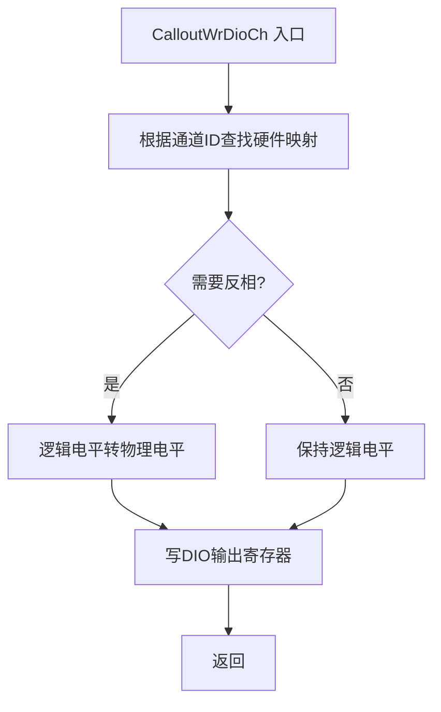

#### 6.3.3 `Gp_Drv8876_CalloutReadDioCh`

| Interface Prototype | Description | Implemented By | Sync/Async | Reentrancy | Basic Constraints |
| --- | --- | --- | --- | --- | --- |
| `uint8 Gp_Drv8876_CalloutReadDioCh(uint16 ChId_u16)` | 读取指定 DIO 通道的逻辑输入电平。FC 通过此接口采样 nFAULT 引脚。板级反相由 Callout 内部处理，保证返回值为逻辑故障语义（0=故障有效，非零=无故障）。 | MCAL / IoMcu / 项目适配层 | 同步 | 可重入 | ChId_u16 必须是配置为输入的 DIO 通道；Callout 必须处理反相使返回值反映逻辑故障语义而非原始引脚电压。 |

##### 6.3.3.1 关联接口

| 调用方 | 类别 | 调用场景 |
| --- | --- | --- |
| `Gp_Drv8876_SampleFaultPin` | 内部函数 | 周期采样 nFAULT 引脚用于故障去抖 |
| `Gp_Drv8876_MainFunction` | 外部接口 | 通过 SampleFaultPin 间接调用 |

##### 6.3.3.2 执行步骤

1. 根据 ChId_u16 查找对应的 DIO 硬件通道和引脚配置。
2. 读 DIO 输入寄存器获取物理引脚电平。
3. 若需要反相，将物理电平转换为逻辑电平（使故障有效为 0）。
4. 返回逻辑电平值。

##### 6.3.3.3 流程图

```mermaid
flowchart TD
    A[CalloutReadDioCh 入口] --> B[根据通道ID查找硬件映射]
    B --> C[读DIO输入寄存器]
    C --> D{需要反相?}
    D -->|是| E[物理电平反相为逻辑电平]
    D -->|否| F[保持原电平]
    E --> G[返回逻辑电平值]
    F --> G
```

#### 6.3.4 `Gp_Drv8876_CalloutSetPwmPerdAndDuty`

| Interface Prototype | Description | Implemented By | Sync/Async | Reentrancy | Basic Constraints |
| --- | --- | --- | --- | --- | --- |
| `void Gp_Drv8876_CalloutSetPwmPerdAndDuty(uint16 ChId_u16, uint32 Perd_u32, uint32 Duty_u32)` | 设置指定 PWM 通道的周期和占空比。FC 在 PWM 控制模式下通过此接口驱动 EN/IN1 和 PH/IN2 的 PWM 波形。 | MCAL / IoMcu / 项目适配层 | 同步 | 可重入 | ChId_u16 必须是有效 PWM 通道；Perd_u32 和 Duty_u32 单位由项目配置定义；Duty_u32 ≤ Perd_u32 由 FC 在调用前校验。 |

##### 6.3.4.1 关联接口

| 调用方 | 类别 | 调用场景 |
| --- | --- | --- |
| `Gp_Drv8876_MapHbOutput` | 内部函数 | PWM 控制模式下下发 H 桥 PWM 波形 |
| `Gp_Drv8876_MainFunction` | 外部接口 | 通过 MapHbOutput 间接调用 |

##### 6.3.4.2 执行步骤

1. 根据 ChId_u16 查找对应的 PWM 硬件通道。
2. 将 Perd_u32 和 Duty_u32 写入 PWM 模块的周期和占空比寄存器。
3. 若 PWM 未启动，启动 PWM 输出。
4. 返回。

##### 6.3.4.3 流程图

```mermaid
flowchart TD
    A[CalloutSetPwmPerdAndDuty 入口] --> B[根据通道ID查找PWM硬件]
    B --> C[写入周期和占空比寄存器]
    C --> D{PWM已启动?}
    D -->|否| E[启动PWM输出]
    D -->|是| F[返回]
    E --> F
```

#### 6.3.5 `Gp_Drv8876_CalloutGetAdcRaw`

| Interface Prototype | Description | Implemented By | Sync/Async | Reentrancy | Basic Constraints |
| --- | --- | --- | --- | --- | --- |
| `void Gp_Drv8876_CalloutGetAdcRaw(uint16 ChId_u16, uint16* Raw_pu16, boolean* RawVld_pb)` | 读取指定 ADC 通道的原始转换结果并指示有效性。FC 通过此接口采集 IPROPI 电流反馈。 | MCAL / IoMcu / Signal Service | 同步 | 可重入 | ChId_u16 必须是有效 ADC 通道；Raw_pu16 和 RawVld_pb 非空；Callout 写入原始值和有效性标志。 |

##### 6.3.5.1 关联接口

| 调用方 | 类别 | 调用场景 |
| --- | --- | --- |
| `Gp_Drv8876_SampleAdcRaw` | 内部函数 | 周期采集 IPROPI ADC 反馈 |
| `Gp_Drv8876_MainFunction` | 外部接口 | 通过 SampleAdcRaw 间接调用 |

##### 6.3.5.2 执行步骤

1. 根据 ChId_u16 查找对应的 ADC 硬件通道。
2. 读取 ADC 转换结果寄存器。
3. 检查转换完成标志和有效性。
4. 将原始值和有效性标志写入输出参数。
5. 返回。

##### 6.3.5.3 流程图

```mermaid
flowchart TD
    A[CalloutGetAdcRaw 入口] --> B[根据通道ID查找ADC硬件]
    B --> C[读取ADC转换结果]
    C --> D{转换完成且有效?}
    D -->|是| E[写入原始值并标记有效]
    D -->|否| F[标记无效]
    E --> G[返回]
    F --> G
```

#### 6.3.6 `Gp_Drv8876_CalloutDelayUs`

| Interface Prototype | Description | Implemented By | Sync/Async | Reentrancy | Basic Constraints |
| --- | --- | --- | --- | --- | --- |
| `void Gp_Drv8876_CalloutDelayUs(uint32 DelayUs_u32)` | 提供指定微秒级阻塞或非阻塞延时。FC 在 nSLEEP 时序管理中使用以满足 tSLEEP/tWAKE 约束。实现可以是硬件定时器延时或依赖 MainFunction 调用周期自然满足。 | 项目适配层 / MCAL | 同步/异步（实现定义） | 可重入 | DelayUs_u32 最小值为 1000（1ms），对应数据手册 tSLEEP/tWAKE。Callout 必须保证至少达到请求延时。 |

##### 6.3.6.1 关联接口

| 调用方 | 类别 | 调用场景 |
| --- | --- | --- |
| `Gp_Drv8876_ProcessModeTransition` | 内部函数 | nSLEEP 时序状态机延时等待 |
| `Gp_Drv8876_MainFunction` | 外部接口 | 通过 ProcessModeTransition 间接调用 |

##### 6.3.6.2 执行步骤

1. 若 DelayUs_u32 < 1000，将其钳位至 1000（最小 1ms）。
2. 启动硬件定时器或采用忙等待实现指定延时。
3. 延时到达后返回。

##### 6.3.6.3 流程图

```mermaid
flowchart TD
    A[CalloutDelayUs 入口] --> B{延时值 < 1ms?}
    B -->|是| C[钳位至1ms]
    B -->|否| D[使用指定延时值]
    C --> E[执行延时等待]
    D --> E
    E --> F[延时到达后返回]
```

---

## 7. 状态机设计

> **设计选型说明：** 当前采用**芯片硬件状态机**方案，完整复刻 DRV8876 芯片手册定义的 nSLEEP 时序状态与切换规则。芯片状态模型（Sleep/Active 模式 + tSLEEP/tWAKE 时序约束）已足够覆盖驱动行为，无需额外抽象软件驱动状态机。
>
> 若后续需要管理驱动生命周期（如 UNINIT/IDLE/ACTIVE/FAULT 等独立于芯片的状态），可升级为软件驱动状态机方案，届时需补充软件状态与芯片状态的映射关系。

### 7.1 状态定义

模块核心状态机为 nSLEEP 时序状态机，管理 Sleep/Active 模式切换中必须满足的 tSLEEP ≥ 1ms 和 tWAKE ≥ 1ms 芯片时序约束。

| 状态名 | 含义 | 进入条件 | 退出条件 |
| --- | --- | --- | --- |
| IDLE | 时序就绪，无进行中的模式切换 | 初始化完成或时序切换完成 | 收到与当前实际模式不同的模式请求 |
| SLEEP_WAIT | nSLEEP 已拉低，等待 tSLEEP 满足 | 当前实际为 Active，收到 Sleep 请求并已拉低 nSLEEP | tSLEEP 延时满足 |
| WAKE_WAIT | nSLEEP 已拉高，等待 tWAKE 满足 | 当前实际为 Sleep，收到 Active 请求并已拉高 nSLEEP | tWAKE 延时满足 |
| SLEEP_DONE | Sleep 模式实际生效 | tSLEEP 满足后 | 收到 Active 请求（将启动 WAKE_WAIT） |
| ACTIVE_DONE | Active 模式实际生效 | tWAKE 满足后 | 收到 Sleep 请求（将启动 SLEEP_WAIT） |

### 7.2 状态切换表

| 当前状态 | 条件函数 | 动作函数 | 下一状态 | 备注 |
| --- | --- | --- | --- | --- |
| IDLE | 缓冲请求为 Sleep 且当前模式为 Active | 拉低 nSLEEP，记录延时起点 | SLEEP_WAIT | 启动 Sleep 转换 |
| IDLE | 缓冲请求为 Active 且当前模式为 Sleep | 拉高 nSLEEP，记录延时起点 | WAKE_WAIT | 启动 Wake 转换 |
| SLEEP_WAIT | 延时 < tSLEEP | 等待 | SLEEP_WAIT | 继续等待 |
| SLEEP_WAIT | 延时 ≥ tSLEEP | 标记实际模式为 Sleep | IDLE | Sleep 转换完成 |
| WAKE_WAIT | 延时 < tWAKE | 等待 | WAKE_WAIT | 继续等待 |
| WAKE_WAIT | 延时 ≥ tWAKE | 标记实际模式为 Active | IDLE | Wake 转换完成 |

### 7.3 状态机主流程图

```mermaid
flowchart TD
    A[状态机入口] --> B[读取当前时序状态]
    B --> C{当前状态?}
    C -->|IDLE| D{缓冲请求与当前模式不同?}
    D -->|否| E[保持IDLE并返回]
    D -->|是-请求Sleep| F[拉低nSLEEP并启动tSLEEP延时]
    F --> G[切换至SLEEP_WAIT]
    D -->|是-请求Active| H[拉高nSLEEP并启动tWAKE延时]
    H --> I[切换至WAKE_WAIT]
    C -->|SLEEP_WAIT| J{tSLEEP延时已满足?}
    J -->|否| K[保持SLEEP_WAIT等待]
    J -->|是| L[标记实际模式为Sleep]
    L --> M[切换至IDLE]
    C -->|WAKE_WAIT| N{tWAKE延时已满足?}
    N -->|否| O[保持WAKE_WAIT等待]
    N -->|是| P[标记实际模式为Active]
    P --> M
```

---

## 8. DET设计

| 检查点 | 触发条件 | 记录方式 | 返回策略 | 适用API |
| --- | --- | --- | --- | --- |
| 模块未初始化 | 外部 API 被调用时模块全局初始化标志为假 | 若 `GP_DRV8876_CFG_DEV_ERROR_DETECT = STD_ON`，调用 `Det_ReportError` 上报 DET 事件；否则设置内部错误标志 | 返回 `E_NOT_OK` | 所有外部 API（除 Init） |
| Id_u16 无效或跨核 | Id_u16 无法解析为当前核有效实例，或 ID 解析后核归属不匹配 | 同 DET 上报机制 | 返回 `E_NOT_OK` | SetDevModeOutSig / GetDevModeInSig / SetHbOutSig / SetHalfBridgeOutSig / GetDevFaultSig / GetCurrentRaw |
| 空指针 | Get 类 API 的输出指针为 NULL | 同 DET 上报机制 | 返回 `E_NOT_OK`，不写入输出参数 | GetDevModeInSig / GetDevFaultSig / GetCurrentRaw |
| 参数值非法 | DevMode_u8 非 Sleep/Active；HbState_u8 非 Coast/Brake/Forward/Reverse；HalfBridge_u8 非法；OutState_u8 非法 | 同 DET 上报机制 | 返回 `E_NOT_OK`，保持原状态不变 | SetDevModeOutSig / SetHbOutSig / SetHalfBridgeOutSig |
| PWM 参数非法 | Duty_u32 > Period_u32 或 Period/Duty 超出配置范围 | 同 DET 上报机制 | 返回 `E_NOT_OK`，保持原输出状态 | SetHbOutSig |
| 实例配置不可用 | 配置缺失、资源冲突或控制模式不支持导致实例标记为不可用 | Init 阶段标记；后续 API 调用返回错误 | 返回 `E_NOT_OK` | 所有接收 Id_u16 的外部 API |

---

## 9. 故障处理设计

故障处理设计覆盖两类故障：

- **芯片故障** — DRV8876 芯片硬件自身产生的故障（nFAULT 引脚拉低、过流、过温），由芯片硬件触发，驱动通过 CalloutReadDioCh 采样并上报。
- **驱动逻辑故障** — 驱动内部逻辑检测到的异常（DIO/ADC/PWM Callout 调用失败、配置不可用），由驱动周期检测逻辑判定。

### 9.1 故障确认策略

| 策略 | 说明 | 适用场景 | 所需配置 | 所需运行参数 |
| --- | --- | --- | --- | --- |
| 单次确认 | 检测到一次异常即确认故障 | 配置错误（Init 阶段一次性检测） | 无 | 故障确认标志 |
| 连续多次 | 连续 N 次检测到异常才确认；中间若有一次正常则重置计数 | nFAULT 芯片故障（需迟滞去抖） | `GP_DRV8876_CFG_FAULT_CONFIRM_THRESHOLD` | `FaultConfirmCnt_u8` |
| 单次确认 | Callout 调用失败 | DIO/ADC/PWM Callout 失败（逐周期独立判断） | 无 | 故障确认标志 |

### 9.2 故障恢复策略

| 策略 | 说明 | 适用场景 | 所需配置 | 所需运行参数 |
| --- | --- | --- | --- | --- |
| 不可恢复 | 故障确认后永久锁存，仅 Init 清除 | 配置错误（需修正配置后重新 Init） | 无 | 故障锁存标志 |
| 连续多次自恢复 | 连续 N 次检测正常才恢复；中间一次异常则重置恢复计数 | nFAULT 芯片故障（芯片硬件恢复后软件确认稳定） | `GP_DRV8876_CFG_FAULT_SELF_RECOVERY_ENABLE` + `GP_DRV8876_CFG_FAULT_RECOVERY_THRESHOLD` | `FaultRecoveryCnt_u8` |
| 单次自恢复 | 检测到一次正常即恢复 | Callout 失败（下一周期 Callout 恢复即可） | `GP_DRV8876_CFG_FAULT_SELF_RECOVERY_ENABLE` | 恢复标志 |

> **自恢复配置约束：** 若 `GP_DRV8876_CFG_FAULT_SELF_RECOVERY_ENABLE = STD_ON`，nFAULT 故障支持连续多次自恢复；若 `STD_OFF`，nFAULT 故障确认后锁存，仅能通过重新 Init 清除。

### 9.3 故障锁存与清除

故障确认后进入锁存状态：即使故障条件消除，已确认的故障仍保持上报（通过 `GetDevFaultSig` 可读），直至显式清除。

| 清除方式 | 说明 | 本模块适用 |
| --- | --- | --- |
| Init 清除 | 模块重新初始化时清除所有锁存故障 | 是（当前唯一清除方式） |
| 故障清除接口 | 外部调用专用 API 清除锁存故障 | 否（当前未设计故障清除接口） |

> **关键约束：** 本模块未设计故障清除接口，锁存故障一旦确认将永久保持，只能通过 `Gp_Drv8876_Init` 重新初始化清除。若项目需要运行时清除故障，须在 §6.1 中新增 `Gp_Drv8876_ClearFault` 外部接口。

### 9.4 故障自恢复配置

| Macro | Category | Purpose | Default Value | Status |
| --- | --- | --- | --- | --- |
| `GP_DRV8876_CFG_FAULT_SELF_RECOVERY_ENABLE` | feature | nFAULT 故障自恢复总开关 | `STD_OFF` | pending-confirm |
| `GP_DRV8876_CFG_FAULT_CONFIRM_THRESHOLD` | threshold | nFAULT 连续确认次数阈值 | `3` | pending-confirm |
| `GP_DRV8876_CFG_FAULT_RECOVERY_THRESHOLD` | threshold | nFAULT 连续恢复次数阈值 | `3` | pending-confirm |

### 9.5 故障项设计

| 故障项 | 故障类型 | 检测条件 | 确认策略 | 确认阈值/配置 | 确认状态 | 响应动作 | 是否可恢复 | 是否可自恢复 | 恢复策略 | 恢复阈值/配置 | 恢复状态 | 触发状态跳转 | 锁存策略 | 清除方式 |
| --- | --- | --- | --- | --- | --- | --- | --- | --- | --- | --- | --- | --- | --- | --- |
| nFAULT 芯片故障 | 芯片故障 | MainFunction 中 CalloutReadDioCh 采样 nFAULT 引脚为逻辑低电平 | 连续多次 | `GP_DRV8876_CFG_FAULT_CONFIRM_THRESHOLD`（默认 3） | 未确认 → 确认中（计数 < 阈值）→ 已确认（计数达阈值） | 置位故障位掩码聚合故障位；GetDevFaultSig 可读出 | 是 | 取决于配置 | 连续多次自恢复（若自恢复使能）/ 不适用（若未使能） | `GP_DRV8876_CFG_FAULT_RECOVERY_THRESHOLD`（默认 3） | 恢复中 / 已恢复（自恢复使能时）；不可恢复（自恢复未使能时） | 否 | 锁存（自恢复未使能）/ 不锁存（自恢复使能，自动清除） | Init清除（自恢复未使能）/ 自恢复清除（自恢复使能） |
| DIO 通道读写失败 | 驱动逻辑故障 | CalloutWrDioCh / CalloutReadDioCh 返回失败 | 单次确认 | N/A | 未确认 / 已确认（单次即确认） | 跳过当次采样/输出，保留上一个有效值 | 是 | 是 | 单次自恢复 | N/A | 恢复中 / 已恢复 | 否 | 不锁存 | 自恢复清除（下一周期 Callout 成功自动清除） |
| ADC 采集无效 | 驱动逻辑故障 | CalloutGetAdcRaw 返回无效标志 | 单次确认 | N/A | 未确认 / 已确认（单次即确认） | 丢弃当次采样值，保留上一个有效 ADC 缓存值 | 是 | 是 | 单次自恢复 | N/A | 恢复中 / 已恢复 | 否 | 不锁存 | 自恢复清除（下一周期 ADC 有效自动清除） |
| 配置错误 | 驱动逻辑故障 | Init 阶段检测到配置缺失、资源冲突或参数非法 | 单次确认 | N/A | 未确认 / 已确认（Init 时一次性确认） | 标记实例为不可用，禁止该实例所有输出控制 | 否 | 否 | 不适用 | N/A | 不适用 | 否（不影响状态机） | 锁存（实例级别） | Init清除（修正配置后重新 Init） |

**列说明：**
- **故障类型** — `芯片故障`：DRV8876 硬件触发；`驱动逻辑故障`：驱动内部逻辑检测
- **确认策略** — 见 §9.1
- **确认阈值/配置** — 多次确认的次数阈值，标注关联宏参
- **确认状态** — 运行时状态：`未确认` → `确认中` → `已确认`
- **是否可恢复** — `否` 表示永久锁存，只能重新 Init
- **是否可自恢复** — 是否支持驱动自动恢复；nFAULT 取决于 `FAULT_SELF_RECOVERY_ENABLE`
- **恢复策略** — 见 §9.2
- **恢复状态** — 运行时恢复计数器状态
- **触发状态跳转** — 故障确认后是否触发 §7 状态机跳转
- **锁存策略** — `锁存`：确认后保持上报直至显式清除；`不锁存`：条件消除即自动清除
- **清除方式** — `Init清除` / `自恢复清除`；本模块无故障清除接口，见 §9.3

### 9.6 故障相关运行参数

故障确认与恢复所需的运行时计数器及状态变量在 §10.1 中统一列出：

| 变量名 | 类别 | 说明 |
| --- | --- | --- |
| `FaultConfirmCnt_u8` | fault | nFAULT 连续确认计数器（0..CFG_FAULT_CONFIRM_THRESHOLD） |
| `FaultRecoveryCnt_u8` | fault | nFAULT 连续恢复计数器（0..CFG_FAULT_RECOVERY_THRESHOLD） |
| `FaultBitmask_u32` | fault | 故障位掩码，bit0=聚合故障，bit1=DIO 失败，bit2=ADC 无效，bit3=配置错误 |
| `FaultLatched_b` | fault | nFAULT 故障锁存标志（自恢复未使能时锁存） |

---

## 10. 运行参数设计

运行参数设计分为两个维度：

1. **运行变量** — 运行时的变量清单
2. **运行参数类型** — 运行时数据的结构化类型定义

### 10.1 运行变量

| 变量名 | 类别 | 类型 | 所属Core | 写方 | 读方 | 生命周期 | MemMap | NoClear | 设计依据 |
| --- | --- | --- | --- | --- | --- | --- | --- | --- | --- |
| `Gp_Drv8876_GblInitSts_b` | status | `boolean` | 每核 | Init | 所有外部 API | 模块加载至下电 | `CLEAR_FAR_DATA` (per-core) | 否 | architecture |
| `Gp_Drv8876_DETErrCode_u32` | status | `uint32` | 每核 | 外部 API (校验点) | DET 上报/调试 | 模块加载至下电 | `CLEAR_FAR_DATA` (per-core) | 否 | architecture |
| `Gp_Drv8876_Runtime[]` | 复合 | `Gp_Drv8876_InstanceRuntimeType` 数组 | 每核 | Init/MainFunction/Set API | MainFunction/Get API | 模块加载至下电 | `CLEAR_FAR_DATA` (per-core) | 否 | architecture |
| `Gp_Drv8876_FaultConfirmCnt_u8` | fault | `uint8` | 每核 | MainFunction | MainFunction/GetDevFaultSig | 模块加载至下电 | `CLEAR_FAR_DATA` (per-core) | 否 | design-addition (R9) |
| `Gp_Drv8876_FaultRecoveryCnt_u8` | fault | `uint8` | 每核 | MainFunction | MainFunction/GetDevFaultSig | 模块加载至下电 | `CLEAR_FAR_DATA` (per-core) | 否 | design-addition (R10) |
| `Gp_Drv8876_FaultBitmask_u32` | fault | `uint32` | 每核 | MainFunction | MainFunction/GetDevFaultSig | 模块加载至下电 | `CLEAR_FAR_DATA` (per-core) | 否 | architecture |
| `Gp_Drv8876_FaultLatched_b` | fault | `boolean` | 每核 | MainFunction | MainFunction/GetDevFaultSig | 模块加载至下电 | `CLEAR_FAR_DATA` (per-core) | 否 | design-addition (R11) |

### 10.2 运行参数类型

#### 10.2.1 运行参数类型拆分

| 类型名 | 类别 | 所属文件 | 关键字段 | 字段类型 | 字段描述 | 关联变量 | 设计依据 | Status |
| --- | --- | --- | --- | --- | --- | --- | --- | --- |
| `Gp_Drv8876_GlobalRuntimeType` | global | `Gp_Drv8876_Types.h` | `InitSts_b` | `boolean` | 模块初始化完成标志，TRUE=已初始化 | `GblInitSts_b` | architecture | formal |
| | | | `DETErrCode_u32` | `uint32` | 最近一次 DET 错误码，0=无错误 | `DETErrCode_u32` | architecture | formal |
| `Gp_Drv8876_InstanceRuntimeType` | per-instance | `Gp_Drv8876_Types.h` | `InstanceValid_b` | `boolean` | 实例是否有效可用 | — | architecture | formal |
| | | | `DevMode_u8` | `uint8` | 当前软件模式（0=Sleep, 1=Active） | — | architecture | formal |
| | | | `BufferedDevMode_u8` | `uint8` | 缓冲待处理的模式请求 | — | architecture | formal |
| | | | `BufferedHbState_u8` | `uint8` | 缓冲的 H 桥输出状态请求 | — | architecture | formal |
| | | | `BufferedPeriod_u32` | `uint32` | 缓冲的 PWM 周期 | — | architecture | formal |
| | | | `BufferedDuty_u32` | `uint32` | 缓冲的 PWM 占空比 | — | architecture | formal |
| | | | `ActualHbState_u8` | `uint8` | 已生效的 H 桥输出状态 | — | architecture | formal |
| | | | `SleepTimingState_u8` | `uint8` | 时序状态枚举（IDLE/SLEEP_WAIT/WAKE_WAIT） | — | design-addition (R7) | formal |
| | | | `SleepTimingStart_u32` | `uint32` | 延时计时起点（tick 或周期计数） | — | design-addition (R7) | formal |
| `Gp_Drv8876_FaultRuntimeType` | fault | `Gp_Drv8876_Types.h` | `FaultConfirmCnt_u8` | `uint8` | nFAULT 连续确认计数器，0..确认阈值 | `FaultConfirmCnt_u8` | design-addition (R9) | formal |
| | | | `FaultRecoveryCnt_u8` | `uint8` | nFAULT 连续恢复计数器，0..恢复阈值 | `FaultRecoveryCnt_u8` | design-addition (R10) | formal |
| | | | `FaultBitmask_u32` | `uint32` | 故障位掩码：bit0=聚合故障，bit1=DIO失败，bit2=ADC无效，bit3=配置错误 | `FaultBitmask_u32` | architecture | formal |
| | | | `FaultLatched_b` | `boolean` | nFAULT 故障锁存标志（自恢复未使能时锁存） | `FaultLatched_b` | design-addition (R11) | formal |
| `Gp_Drv8876_MonitorRuntimeType` | monitor | `Gp_Drv8876_Types.h` | `AdcRawCache_u16` | `uint16` | 最近有效 ADC 原始采样值 | — | architecture | formal |

#### 10.2.2 运行参数类型设计说明

- 按语义边界拆分：全局（模块级状态）、每实例（运行态+缓冲）、故障（去抖/确认）和监控（ADC 缓存）。
- `Gp_Drv8876_GlobalRuntimeType` 承载模块级初始化和 DET 状态。
- `Gp_Drv8876_InstanceRuntimeType` 聚合实例所有运行态字段，包括缓冲请求、确认状态和时序状态机字段。
- 故障和监控子结构独立便于 MainFunction 按职责分别处理。

---

## 11. 配置参数设计

### 11.1 配置宏参（`Gp_Drv8876_Cfg.h`）

| Macro | Category | Purpose | Default Value | Source | Usage Location | Status |
| --- | --- | --- | --- | --- | --- | --- |
| `GP_DRV8876_CFG_DEV_ERROR_DETECT` | feature | DET 功能开关 | `STD_ON` | architecture | `Cfg.h`，外部 API 校验点 | formal |
| `GP_DRV8876_CFG_SW_MAJOR_VERSION` | platform | 主版本号 | `1` | architecture | `Cfg.h` | formal |
| `GP_DRV8876_CFG_SW_MINOR_VERSION` | platform | 次版本号 | `0` | architecture | `Cfg.h` | formal |
| `GP_DRV8876_CFG_MAINFUNCTION_ENABLE` | feature | MainFunction 编译开关 | `STD_ON` | architecture | `Cfg.h`，`Gp_Drv8876.c` | conditional |
| `GP_DRV8876_CFG_HALF_BRIDGE_ENABLE` | feature | 独立半桥编译开关 | `STD_OFF` | architecture | `Cfg.h`，`Gp_Drv8876.c` | conditional |
| `GP_DRV8876_CFG_MAX_INSTANCE_COUNT_COREx` | count | 每核最大实例数 | 项目定义 | coding-standard | `Cfg.h`，运行时数组 | pending-confirm |
| `GP_DRV8876_CFG_FAULT_SELF_RECOVERY_ENABLE` | feature | nFAULT 故障自恢复总开关 | `STD_OFF` | design-addition (R10) | `Cfg.h`，`SampleFaultPin` | pending-confirm |
| `GP_DRV8876_CFG_FAULT_CONFIRM_THRESHOLD` | threshold | nFAULT 连续确认次数阈值 | `3` | design-addition (R9) | `Cfg.h`，`SampleFaultPin` | pending-confirm |
| `GP_DRV8876_CFG_FAULT_RECOVERY_THRESHOLD` | threshold | nFAULT 连续恢复次数阈值 | `3` | design-addition (R10) | `Cfg.h`，`SampleFaultPin` | pending-confirm |

### 11.2 配置类型

#### 11.2.1 配置类型

| 类型名 | 类别 | 所属文件 | 关键字段 | 字段类型 | 字段描述 | 关联宏参 | 设计依据 | Status |
| --- | --- | --- | --- | --- | --- | --- | --- | --- |
| `Gp_Drv8876_ConfigContainerType` | top-level | `Gp_Drv8876_Types.h` | `InstanceCount_u8` | `uint8` | 当前核实例数 | `MAX_INSTANCE_COUNT` | architecture | formal |
| | | | `InstanceCfgs_p` | `Gp_Drv8876_InstanceConfigType*` | 每实例配置数组指针 | — | architecture | formal |
| `Gp_Drv8876_InstanceConfigType` | per-instance | `Gp_Drv8876_Types.h` | `CoreId_u8` | `uint8` | 实例所属核 ID | — | architecture | formal |
| | | | `PMODE_u8` | `uint8` | 控制模式枚举（PH_EN/PWM/INDEP_HB） | — | architecture | formal |
| | | | `IMODE_u8` | `uint8` | 电流调节模式枚举 | — | architecture | formal |
| | | | `DefaultDevMode_u8` | `uint8` | 默认软件模式，0=Sleep,1=Active | — | design-addition (R1) | pending-confirm |
| | | | `DefaultHbState_u8` | `uint8` | 默认 H 桥输出，0=Coast,1=Brake | — | design-addition (R1) | pending-confirm |
| `Gp_Drv8876_SigMappingType` | hardware | `Gp_Drv8876_Types.h` | `Id_u16` | `uint16` | 外部接口使用的实例 ID | — | architecture | formal |
| | | | `nSleepDioChId_u8` | `uint8` | nSLEEP DIO 通道 ID | — | architecture | formal |
| | | | `EnIn1DioChId_u8` | `uint8` | EN/IN1 DIO 通道 ID | — | architecture | formal |
| | | | `PhIn2DioChId_u8` | `uint8` | PH/IN2 DIO 通道 ID | — | architecture | formal |
| | | | `nFaultDioChId_u8` | `uint8` | nFAULT DIO 通道 ID | — | architecture | formal |
| `Gp_Drv8876_TimingConfigType` | timing | `Gp_Drv8876_Types.h` | `tSLEEP_Us_u32` | `uint32` | Sleep 等待时间（μs），min=1000 | — | architecture | pending-confirm |
| | | | `tWAKE_Us_u32` | `uint32` | Wake 等待时间（μs），min=1000 | — | architecture | pending-confirm |
| | | | `FaultConfirmThreshold_u8` | `uint8` | nFAULT 连续确认次数 | `FAULT_CONFIRM_THRESHOLD` | design-addition (R9) | pending-confirm |
| | | | `FaultRecoveryThreshold_u8` | `uint8` | nFAULT 连续恢复次数 | `FAULT_RECOVERY_THRESHOLD` | design-addition (R10) | pending-confirm |
| `Gp_Drv8876_AdcConfigType` | hardware | `Gp_Drv8876_Types.h` | `IpropiAdcChId_u8` | `uint8` | IPROPI ADC 通道 ID，0=未配置 | — | architecture | formal |
| `Gp_Drv8876_PwmConfigType` | hardware | `Gp_Drv8876_Types.h` | `PwmChId_u8` | `uint8` | PWM 通道 ID | — | architecture | formal |
| | | | `PeriodMin_u32` | `uint32` | 最小有效周期 | — | design-addition (R4) | pending-confirm |
| | | | `PeriodMax_u32` | `uint32` | 最大有效周期 | — | design-addition (R4) | pending-confirm |

#### 11.2.2 配置类型实例化

| 对象名 | 类型 | 所属文件 | 初始化方式 | 关联配置类型 | Status |
| --- | --- | --- | --- | --- | --- |
| `Gp_Drv8876_Core0Config` | `Gp_Drv8876_ConfigContainerType` | `Gp_Drv8876_Cfg.c` | const-init | `ConfigContainerType` | formal |
| `Gp_Drv8876_Core1Config` | `Gp_Drv8876_ConfigContainerType` | `Gp_Drv8876_Cfg.c` | const-init | `ConfigContainerType` | formal |
| `Gp_Drv8876_Core0SigMapping[]` | `Gp_Drv8876_SigMappingType[]` | `Gp_Drv8876_Cfg.c` | const-init | `SigMappingType` | formal |
| `Gp_Drv8876_Core1SigMapping[]` | `Gp_Drv8876_SigMappingType[]` | `Gp_Drv8876_Cfg.c` | const-init | `SigMappingType` | formal |

#### 11.2.3 配置类型设计说明

- 配置类型按语义边界：顶层容器、每实例、硬件资源（SigMapping/ADC/PWM）、时序阈值。
- `SigMappingType` 聚合所有 DIO 通道 ID，Init 一次性加载校验。
- tSLEEP/tWAKE 来源于芯片数据手册（≥1ms），具体值待项目确认。
- PWM 周期/占空比范围和 DefaultDevMode/DefaultHbState 待项目确认后填入。
- 每核独立的 ConfigContainer 和 SigMapping 数组在 Cfg.c 中以 const 定义，编译期固定。

---

## 12. MemMap设计

| Memory Section | Target Content | Start Macro | Stop Macro | Used Files | Notes |
| --- | --- | --- | --- | --- | --- |
| CODE | 全部外部/内部函数实现 | `GP_DRV8876_CODE_START` | `GP_DRV8876_CODE_STOP` | `Gp_Drv8876.c`, `Gp_Drv8876_Callout.c` | 标准 CODE 段 |
| CLEAR_FAR_DATA (per-core) | 每核全局运行时状态、运行时数组、故障/监控数据 | `GP_DRV8876_CLEAR_FAR_DATA_ALIGN4_COREx_START` | `GP_DRV8876_CLEAR_FAR_DATA_ALIGN4_COREx_STOP` | `Gp_Drv8876.c` | 每核独立，Init 时清零 |
| CONST (per-core) | 每核配置表、SigMapping 数组 | `GP_DRV8876_CONST_FAR_DATA_ALIGN4_COREx_START` | `GP_DRV8876_CONST_FAR_DATA_ALIGN4_COREx_STOP` | `Gp_Drv8876_Cfg.c` | 每核独立，编译期固定 |
| CONST (global shared) | 版本信息、共享常量 | `GP_DRV8876_CONST_FAR_DATA_ALIGN4_GLOBAL_START` | `GP_DRV8876_CONST_FAR_DATA_ALIGN4_GLOBAL_STOP` | `Gp_Drv8876_Cfg.c` | 所有核可读 |

---

## 13. 代码编写限制要求

- **接口一致性**：外部 API 原型必须与 §6.1 各接口表定义完全一致，不得增加额外参数或修改返回值类型。
- **配置边界**：所有编译期可配置参数必须通过 `Cfg.h` 宏参或 `Cfg.c` 配置表承载，不得硬编码。
- **硬件访问隔离**：严禁在 `Gp_Drv8876.c` 中直接访问 MCAL/DIO/PWM/ADC 寄存器或驱动 API。所有硬件访问必须通过 Callout。
- **跨核访问禁止**：运行时数据访问必须通过 Core ID 校验，不得越界访问其他核的运行时容器。
- **状态机一致性**：nSLEEP 时序状态机定义和逻辑必须与 §7 完全一致。
- **DET 与 Fault 分离**：DET 和 Fault 代码必须分离，不得将运行时 nFAULT 故障当作 DET 上报。
- **MemMap 规范**：所有受控文件必须正确使用段宏对，不得在段边界外放置受控数据。
- **NoClear 审慎使用**：本模块当前不涉及 NoClear 数据，若后续新增必须经过设计评审。

---

## 14. 架构与详细设计覆盖表

| 架构对象 | 架构分类 | DD 落位章节 | DD 对象名 | 覆盖状态 | 备注 |
| --- | --- | --- | --- | --- | --- |
| `Gp_Drv8876_Init` | 外部接口 | §6.1.1 | `Gp_Drv8876_Init` | Covered | 子功能拆分、步骤、调用关系、流程图完整 |
| `Gp_Drv8876_SetDevModeOutSig` | 外部接口 | §6.1.2 | `Gp_Drv8876_SetDevModeOutSig` | Covered | 同上 |
| `Gp_Drv8876_GetDevModeInSig` | 外部接口 | §6.1.3 | `Gp_Drv8876_GetDevModeInSig` | Covered | 同上 |
| `Gp_Drv8876_SetHbOutSig` | 外部接口 | §6.1.4 | `Gp_Drv8876_SetHbOutSig` | Covered | 同上 |
| `Gp_Drv8876_SetHalfBridgeOutSig` | 外部接口 | §6.1.5 | `Gp_Drv8876_SetHalfBridgeOutSig` | Covered | 启用取决于 HALF_BRIDGE_ENABLE |
| `Gp_Drv8876_GetDevFaultSig` | 外部接口 | §6.1.6 | `Gp_Drv8876_GetDevFaultSig` | Covered | 同上 |
| `Gp_Drv8876_GetCurrentRaw` | 外部接口 | §6.1.7 | `Gp_Drv8876_GetCurrentRaw` | Covered | 同上 |
| `Gp_Drv8876_MainFunction` | 外部接口 | §6.1.8 | `Gp_Drv8876_MainFunction` | Covered | 同上 |
| `Gp_Drv8876_CalloutGetCoreId` | 依赖接口 | §6.3.1 | `Gp_Drv8876_CalloutGetCoreId` | Covered | 关联接口、步骤、流程图完整 |
| `Gp_Drv8876_CalloutWrDioCh` | 依赖接口 | §6.3.2 | `Gp_Drv8876_CalloutWrDioCh` | Covered | 同上 |
| `Gp_Drv8876_CalloutReadDioCh` | 依赖接口 | §6.3.3 | `Gp_Drv8876_CalloutReadDioCh` | Covered | 同上 |
| `Gp_Drv8876_CalloutSetPwmPerdAndDuty` | 依赖接口 | §6.3.4 | `Gp_Drv8876_CalloutSetPwmPerdAndDuty` | Covered | 同上 |
| `Gp_Drv8876_CalloutGetAdcRaw` | 依赖接口 | §6.3.5 | `Gp_Drv8876_CalloutGetAdcRaw` | Covered | 同上 |
| `Gp_Drv8876_CalloutDelayUs` | 依赖接口 | §6.3.6 | `Gp_Drv8876_CalloutDelayUs` | Covered | 条件性依赖 |
| `GP_DRV8876_CFG_DEV_ERROR_DETECT` | 配置宏参 | §11.1 | `GP_DRV8876_CFG_DEV_ERROR_DETECT` | Covered | 与架构一致 |
| `GP_DRV8876_CFG_MAINFUNCTION_ENABLE` | 配置宏参 | §11.1 | `GP_DRV8876_CFG_MAINFUNCTION_ENABLE` | Covered | 与架构一致 |
| `GP_DRV8876_CFG_HALF_BRIDGE_ENABLE` | 配置宏参 | §11.1 | `GP_DRV8876_CFG_HALF_BRIDGE_ENABLE` | Covered | 与架构一致 |
| Per-core runtime container | 运行态策略 | §10.1, §10.2 | `Gp_Drv8876_InstanceRuntimeType` | Covered | 类型+变量完整 |
| Per-core config tables | 运行态策略 | §11.2 | `ConfigContainerType`, SigMapping | Covered | 配置类型+实例化完整 |
| MemMap: CODE / CLEAR / CONST | MemMap | §12 | 4 个 MemMap 段 | Covered | 与架构一致 |
| 文件族：9 文件 | 文件列表 | §4 | 9 个文件 | Covered | 与架构一致 |

---

## 15. 编码起步建议

- 首先创建文件: `Gp_Drv8876_Types.h` → `Gp_Drv8876_Cfg.h` → `Gp_Drv8876_MemMap.h`
- 首先实现接口: `Gp_Drv8876_Init` → `Gp_Drv8876_MainFunction` → `Gp_Drv8876_SetDevModeOutSig`
- 首先落配置: `Cfg.h` 宏参 → `Types.h` 配置类型结构体 → `Cfg.c` 配置表实例化
- 首先落 runtime: `Types.h` 运行时类型结构体 → `Gp_Drv8876.c` 每核静态数组
- 首先验证点: Init 实例可用性 → SetDevModeOutSig/GetDevModeInSig 基本通路 → MainFunction 时序状态机

### 15.1 推荐实现顺序

1. 建文件族与基础类型（`Types.h`、`Cfg.h`、`MemMap.h`）
2. 建 `CfgData.h` / `Cfg.c`（配置表 const 定义）
3. 建外部接口原型（`Gp_Drv8876.h`）与返回策略
4. 建内部函数骨架（参数校验、运行时访问、状态检查）
5. 建 nSLEEP 时序状态机（`ProcessModeTransition`）
6. 建真值表映射（`MapHbOutput`)
7. 接入 Callout（`Callout.h` / `Callout.c`）
8. 接入 DET / fault 去抖 / ADC 监控
9. 接入 MemMap

---

## 16. 伴生评审与追溯产物

| 产物 | 文件名 | 用途 |
| --- | --- | --- |
| Review 评审记录 | `Review_Gp_Drv8876_详细设计规范.md` | 评审重点、阻断项、风险关闭、评审结论 |
| Check 检查清单 | `Check_Gp_Drv8876_详细设计规范.md` | 检查项、结果、证据、主要问题 |
| Trace 追溯矩阵 | `Trace_Gp_Drv8876_详细设计规范.md` | SRS/SDD → DD 覆盖对象、状态、落点 |

---

## 17. 风险与待确认项

| 索引 | 问题项 | 影响 | 关联设计增量 | 建议动作 | 状态 |
| --- | --- | --- | --- | --- | --- |
| R1 | 默认安全状态 | §11.2.1 DefaultDevMode_u8/DefaultHbState_u8 | `DefaultDevMode_u8`, `DefaultHbState_u8` | 项目确认 Sleep/Coast/Brake | `待评审` |
| R2 | PMODE/IMODE 控制方式 | CalloutWrDioCh 通道数、重锁存逻辑 | — | 项目确认 DIO 控制或硬件固定 | `待评审` |
| R3 | 独立半桥启用 | §6.1.5 SetHalfBridgeOutSig | — | 项目确认是否需要 | `待评审` |
| R4 | PWM 参数单位与范围 | §6.1.4 SetHbOutSig 校验 | `PeriodMin_u32`, `PeriodMax_u32` | 项目确认 Period/Duty 单位和范围 | `待评审` |
| R5 | 电流反馈形态 | §6.1.7 GetCurrentRaw | — | 项目确认 ADC 原始值或 mA 换算 | `待评审` |
| R6 | nFAULT 故障位定义 | §6.1.6 Fault_pu32 位定义 | — | 项目确认故障位掩码具体 bit | `待评审` |
| R7 | Delay Callout 必要性 | §6.3.6 CalloutDelayUs | `SleepTimingState_u8`, `SleepTimingStart_u32` | 若周期 ≥1ms 可移除；若移除则关联运行变量一并移除 | `待评审` |
| R8 | 去抖阈值 | §9 故障处理、§11.1 | — | 项目确认去抖次数（默认 3） | `待评审` |
| R9 | nFAULT 故障连续确认策略 | §12.2 确认阈值与计数器 | `FaultConfirmCnt_u8`, `FaultConfirmThreshold_u8`, `GP_DRV8876_CFG_FAULT_CONFIRM_THRESHOLD` | 项目确认连续确认次数阈值（默认 3）；不采纳则故障判定退化为单次采样 | `待评审` |
| R10 | nFAULT 故障自恢复策略 | §12.3 自恢复使能与阈值 | `FaultRecoveryCnt_u8`, `FaultRecoveryThreshold_u8`, `GP_DRV8876_CFG_FAULT_SELF_RECOVERY_ENABLE`, `GP_DRV8876_CFG_FAULT_RECOVERY_THRESHOLD` | 项目确认是否使能自恢复及恢复次数阈值（默认 3）；不使能则故障锁存直至 Init 清除 | `待评审` |
| R11 | nFAULT 故障锁存标志 | §12.4 锁存语义与清除 | `FaultLatched_b` | 项目确认锁存标志是否需要（自恢复未使能时保持故障状态）；不采纳则故障状态仅由确认计数器表达 | `待评审` |
| R12 | 驱动逻辑故障响应 | §12.1 故障分类-DIO/ADC/Callout | — | DIO/ADC Callout 失败时降级策略确认（记录+DET 或触发芯片关断） | `待评审` |
| R13 | 配置错误实例隔离 | §8 DET-配置不可用 | — | 确认单实例配置错误是否影响其他同芯片实例 | `待评审` |

> **设计增量与评审项关联规则：** 凡在运行变量（§10.1）、运行参数类型（§10.2.1）、配置宏参（§11.1）、配置类型（§11.2.1）中标注 `design-addition (Rx)` 的项，必须在本表中有对应的 Rx 行，并在 "关联设计增量" 列中列出具体的对象名。此关联在 Review 评审记录中可被逐项追溯和关闭。设计增量项必须解释"为何需要此增量"（见"问题项"列）和"不采纳的后果"（见"建议动作"列）。
