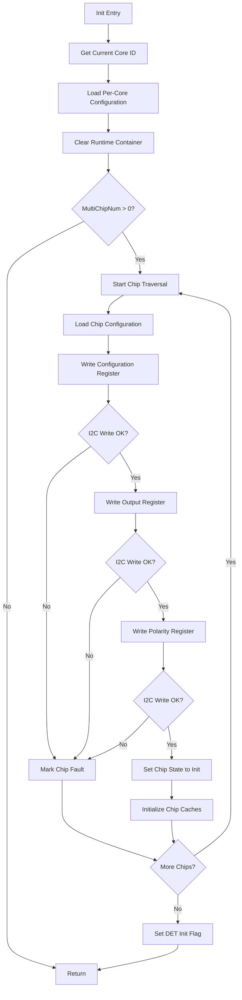
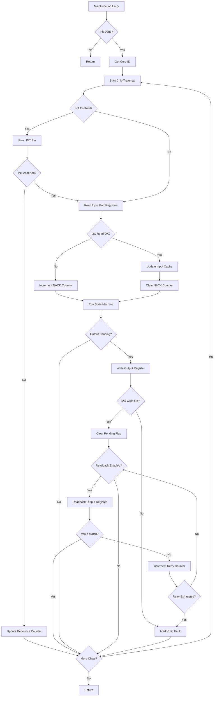
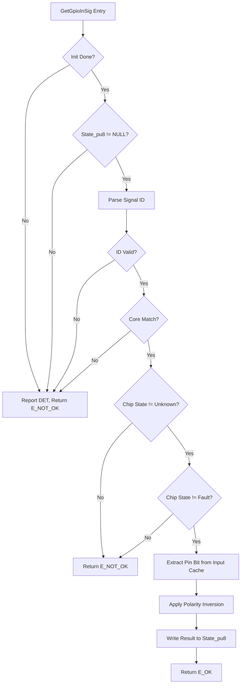
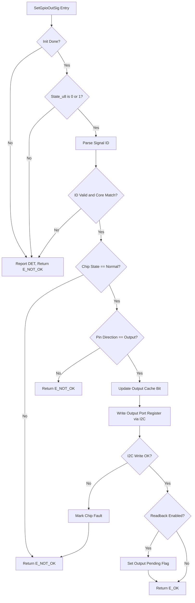
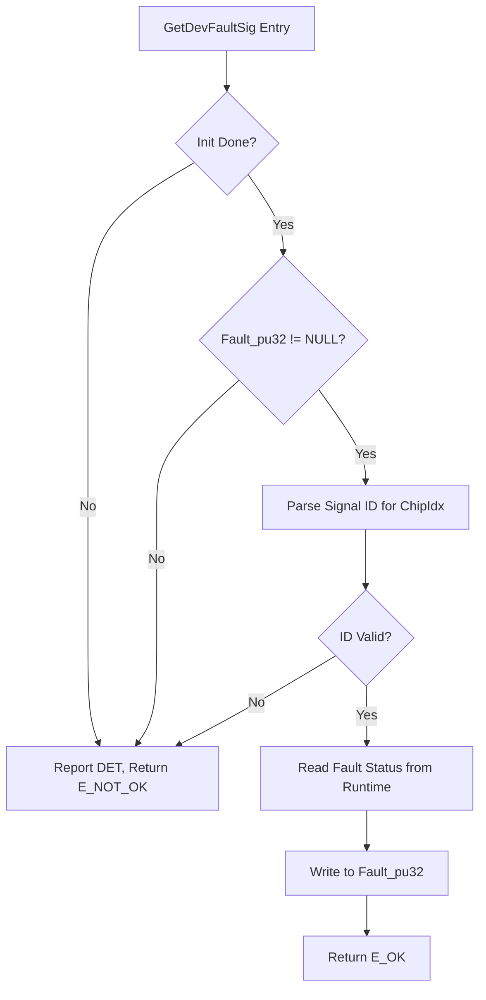
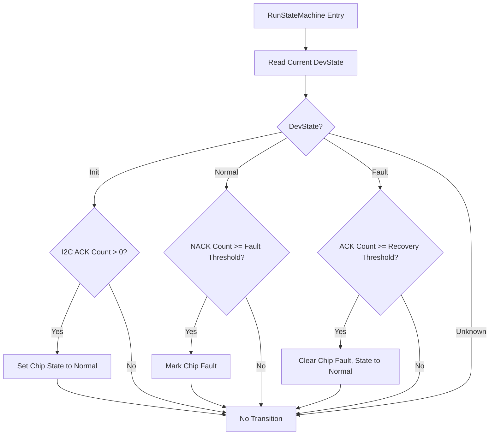
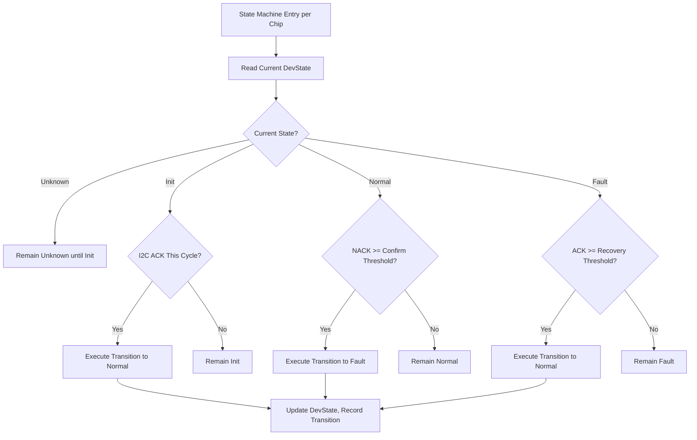

# Gp_NCA95xx 模块详细设计规范

## 文档元信息

- 详细设计版本: `V1`
- 详细设计状态: `Draft`
- 输出模式: `Formal Draft`
- 生成时间: 2026-05-26
- 生成/修订说明: 初版生成，基于 Gp_NCA95xx SRS V0.1.0 和架构 V1 Released 生成正式详细设计。
- 变更点总结: 初版生成。覆盖 7 个外部接口（含 1 条件接口）、6 个依赖接口、6 个配置宏参、4 状态设备状态机、9 类运行态变量、完整 DET 和故障处理设计。

---

## 1. FC概述

- FC名称: `Gp_NCA95xx`
- 当前软件层级: `IoExtDev`（外部 IO 扩展器设备层）
- 核心职责: 通过 I2C 总线驱动 NCA9539-Q1 16 位 GPIO 扩展器，提供信号 ID 解耦的 GPIO 输入读取和输出设置接口，管理芯片设备状态机，检测 I2C 通信故障，执行 ASIL_B 安全输出回读校验。
- 运行模型: 周期驱动（MainFunction）+ 同步外部服务接口。MainFunction 承担输入刷新、状态机推进、I2C 通信连续性监测、pending 输出处理和安全回读校验。
- 单核/多核: 多核。每个核独立管理各自的芯片实例集合，运行态完全按核隔离。通过 `CalloutGetCoreId` 获取当前核 ID，用于信号映射表过滤。

---

## 2. 设计输入

- 需求文档: `Gp_NCA95xx_软件需求规范.md` V0.1.0 (2026-05-26)
- 架构文档: `Gp_NCA95xx_软件架构设计.md` V1 Released (2026-05-26)
- 芯片/平台约束: NCA9539-Q1 Datasheet Rev1.0，I2C Fast-mode ≤ 400 kHz，16 位 GPIO（Port 0: P00-P07, Port 1: P10-P17），7 位 I2C 地址（0x74-0x77），RESET 脉冲 ≥ 6 ns，RESET 恢复 ≥ 200 ns
- 公司规则/命名规则: Fc_Stack 命名规范（`Gp_NCA95xx_<Action><Target>` 函数前缀，`_u8/_u16/_u32` 类型后缀，`_pu8` 指针后缀，ALL_CAPS 宏标识符）
- 其他输入: 无

---

## 3. 假设与待确认项

- 假设: INT 引脚接入 MCU GPIO 并由本驱动通过 MainFunction 轮询（若后续确认不接入，降级为全量 Input Port 轮询）
- 假设: RESET 引脚由本驱动控制（若后续确认不归属，移除 ResetChip 接口及 WriteDio/DelayUs callout）
- 假设: 上层 ASW 通过周期调用 GetGpioInSig 获取输入变化，不依赖主动回调通知
- 假设: 运行时方向变更功能默认不需要（`GP_NCA95xx_CFG_RUNTIME_DIR_CHANGE_ENABLE` = `STD_OFF`）
- 假设: Fault→Normal 恢复后仅清除故障状态，不重新回写配置寄存器
- 缺失信息: 硬件原理图（INT/RESET 引脚连接确认）、项目需求文档（安全目标、资源预算确认）
- 待确认项: 见第 17 章风险与待确认项

---

## 4. 实现总策略

- 代码组织策略:
  - 采用标准 FC 三层结构：Realize Interface Layer（外部接口入口）→ Function Layer（内部静态函数）→ Dependency Interface Layer（Callout）
  - 外部接口全部收敛于 `Gp_NCA95xx.c/.h`，不做多文件拆分
  - 内部函数按职责分类：参数校验、Id 解析、配置访问、运行态访问、状态条件检查、状态动作、I2C 通信辅助、故障检测、故障确认、故障恢复
  - 所有内部函数使用 `static` 作用域，不对外暴露

- cfg 与 runtime 分界:
  - `Gp_NCA95xx_Cfg.h`: 功能开关宏 + 版本宏
  - `Gp_NCA95xx_CfgData.h`: 配置表 extern 声明
  - `Gp_NCA95xx_Cfg.c`: 每核配置表常量定义（SigMapCfg、ChipCfg、INT 配置、故障阈值）
  - 运行态变量全部在 `Gp_NCA95xx.c` 内部定义，通过 `static` 变量 + 结构体容器组织

- callout 策略:
  - I2C 读写操作抽象为 Callout（不与 MCAL I2C 驱动直接耦合）
  - DIO 读写操作抽象为 Callout（INT 引脚采样、RESET 引脚控制）
  - 核 ID 获取抽象为 Callout（多核部署基础）
  - 微秒延时抽象为 Callout（ResetChip 时序控制）
  - Callout 实现由 Project Adaptation 层提供，MCAL 绑定在集成阶段填充

- DET 与 fault 分界:
  - DET 用于 API 误用检测：NULL 指针、无效 Id、非法 State 值、未初始化访问、无效 DevMode_pu8/Fault_pu32 参数
  - Fault 用于运行时异常：I2C 通信 NACK 连续失败、输出回读校验失败
  - DET 检查点在每个外部接口入口处执行；Fault 检测在 MainFunction 和 SetGpioOutSig 中执行

- MemMap 策略:
  - CODE: 所有函数实现
  - RUNTIME RAM: CLEAR_FAR_DATA_ALIGN4_COREx，上电清零，每核独立
  - CONST GLOBAL: 全局共享常量（Reg.h 寄存器定义）
  - CONST PER-CORE: 每核配置表
  - CALIB: 保留段宏，当前无标定内容
  - 不使用 NO_CLEAR（无 reset 连续数据需求）
  - 不使用 NEAR（无高频中断访问路径）

---

## 5. 文件列表设计

| 文件名 | 必需/可选 | 职责 | 关键内容 |
| --- | --- | --- | --- |
| `Gp_NCA95xx.c` | 必需 | 模块主实现文件。 | 7 个外部接口实现（Init、MainFunction、GetGpioInSig、SetGpioOutSig、GetDevFaultSig、GetDevModeInSig、ResetChip）；内部静态函数（Id 解析、寄存器读写辅助、状态机条件/动作函数、I2C 通信逻辑、回读校验、DET 记录）；每核运行态容器定义和访问。 |
| `Gp_NCA95xx.h` | 必需 | 对外接口头文件。 | 外部 API 原型声明。 |
| `Gp_NCA95xx_Types.h` | 必需 | 类型定义头文件。 | 设备状态枚举 `Gp_NCA95xx_DevStateType`（Unknown/Init/Normal/Fault）；故障码位掩码宏（`GP_NCA95xx_FAULT_I2C_ERROR` 等）；芯片配置容器类型 `Gp_NCA95xx_ChipCfgType`；信号映射类型 `Gp_NCA95xx_SigMapType`；运行态容器类型 `Gp_NCA95xx_RuntimeType`。 |
| `Gp_NCA95xx_Cfg.h` | 必需 | 配置宏头文件。 | 功能开关宏（DEV_ERROR_DETECT、REG_READBACK_VERIFY_ENABLE、RUNTIME_DIR_CHANGE_ENABLE、RESET_PIN_OWNED）；软件版本宏（SW_MAJOR_VERSION、SW_MINOR_VERSION）。 |
| `Gp_NCA95xx_Cfg.c` | 必需 | 配置数据实现文件。 | 每核信号映射表 `Gp_NCA95xx_cfgSigMap_*`；每核芯片配置表 `Gp_NCA95xx_cfgChip_*`（DevAddr、DefaultDir、DefaultOut、I2cChnId、I2cSpeed、IntEnable、IntDebounce、PollPeriod）；故障阈值常量（FaultConfirmThreshold、FaultRecoveryThreshold）。 |
| `Gp_NCA95xx_CfgData.h` | 必需 | 配置数据声明头文件。 | 配置表类型 extern 声明；MultiChipNum 声明。 |
| `Gp_NCA95xx_Reg.h` | 必需 | 外设寄存器定义头文件。 | NCA9539-Q1 寄存器地址宏（`GP_NCA95xx_REG_INPUT_PORT0` 等）、寄存器默认值宏、I2C 设备地址常量（0x74-0x77）。 |
| `Gp_NCA95xx_Callout.h` | 必需 | 平台适配接口头文件。 | 6 个 Callout 原型声明（I2cWrite、I2cRead、ReadDio、WriteDio、GetCoreId、DelayUs）。 |
| `Gp_NCA95xx_Callout.c` | 必需 | 平台适配实现/stub 文件。 | Callout 实现框架或集成 stub。项目集成阶段填充 MCAL I2C/DIO 绑定和平台延时实现。 |
| `Gp_NCA95xx_MemMap.h` | 必需 | 内存段映射头文件。 | 模块所有 MemMap 宏（CODE、CLEAR_FAR_DATA_COREx、CONST_GLOBAL、CONST_COREx、CALIB）。 |

---

## 6. 单核/多核框架设计

### 6.1 核模型

| Core | 职责 | Init入口 | 周期任务 | 共享对象 |
| --- | --- | --- | --- | --- |
| CORE0 | 管理 CORE0 的芯片实例集合、信号映射和运行态 | `Gp_NCA95xx_Init`（获取 CoreId=0，初始化本核容器） | `Gp_NCA95xx_MainFunction`（获取 CoreId=0，执行本核周期处理） | 无（每核完全隔离） |
| CORE1 | 管理 CORE1 的芯片实例集合、信号映射和运行态 | 同上（获取 CoreId=1） | 同上（获取 CoreId=1） | 无 |
| COREx | 同构扩展，每核独立 | 同上 | 同上 | 无 |

每核独立原则:
- 每核拥有独立的配置表副本（CONST PER-CORE）
- 每核拥有独立的运行态容器（RUNTIME RAM PER-CORE）
- 核间不共享状态，无同步点
- `CalloutGetCoreId` 在每次 Init 和 MainFunction 调用时获取当前核 ID，用于配置表和运行态容器的索引

### 6.2 任务模型

| Task | Core | 周期 | 优先级类别 | 调用对象 | 监控动作 |
| --- | --- | --- | --- | --- | --- |
| Task_1ms / Task_5ms | 各核独立 | 1-10 ms（可配 PollPeriod_u16） | 周期任务 | `Gp_NCA95xx_MainFunction` | MainFunction 内部 I2C 通信连续性检查、状态机推进 |
| ASW 调用任务 | 各核独立 | 事件驱动 | ASW 线程 | `GetGpioInSig`、`SetGpioOutSig`、`GetDevFaultSig`、`GetDevModeInSig` | DET 参数校验 |

### 6.3 同步点与共享对象

| 对象/同步点 | 写方 | 读方 | 用途 | 一致性要求 |
| --- | --- | --- | --- | --- |
| 无 | — | — | 每核运行态完全隔离，无跨核共享对象 | 无需同步 |

---

## 7. 外部接口设计

### 7.1 `Gp_NCA95xx_Init`

| Interface Prototype | Description | Sync/Async | Reentrancy | Return Value | Basic Constraints |
| --- | --- | --- | --- | --- | --- |
| `void Gp_NCA95xx_Init(void)` | Initializes all configured chip instances on the current core. Loads per-core configuration, writes Configuration/Output/Polarity Inversion registers to default values via I2C, sets each chip state to Init. Partial failure isolates faulty chips. | Synchronous | Non-reentrant | `void` | Called once during ECU startup. MCAL I2C must be ready. Must precede all other Gp_NCA95xx APIs. |

#### 7.1.1 子功能拆分

| 步骤 | 子功能 | 输入 | 输出 | 关键检查/约束 | 依赖对象 |
| --- | --- | --- | --- | --- | --- |
| 1 | 获取当前核 ID | 无 | CoreId | CalloutGetCoreId 返回值有效 | CalloutGetCoreId |
| 2 | 加载本核配置 | CoreId | ChipCfg[] 表、MultiChipNum | MultiChipNum ≤ 4 | CfgData（每核配置表） |
| 3 | 初始化本核运行态容器 | ChipCfg[] | Runtime container 清零 | 所有运行态变量初始化 | Runtime container |
| 4 | 遍历芯片实例，逐芯片初始化 | ChipCfg[i] | 寄存器回写完成 | I2C 总线可用 | CalloutI2cWrite、Reg.h 寄存器地址 |
| 5 | 标记各芯片状态 | I2C 写入结果 | DevState = Init 或 Fault | 仅 I2C ACK 的芯片标记 Init | Runtime container |
| 6 | 记录初始化完成 | 全部芯片处理完毕 | DET init flag 置位 | 后续 API 依赖此 flag | Runtime container |

#### 7.1.2 执行步骤

1. 调用 `CalloutGetCoreId` 获取当前核 ID
2. 据 CoreId 索引本核配置表（`cfgChip[]`）和 `MultiChipNum`
3. 将本核运行态容器清零（DevState、caches、counters、fault status）
4. 若 `MultiChipNum == 0`，无芯片实例，直接返回
5. 遍历 `chipIndex = 0 .. MultiChipNum-1`：
   a. 从配置表加载 `DevAddr`、`DefaultDir`、`DefaultOut`、`DefaultPolarity`
   b. 调用 `CalloutI2cWrite` 写入 Configuration Register 0/1 → 若失败，标记该芯片 Fault，continue 下一芯片
   c. 调用 `CalloutI2cWrite` 写入 Output Register 0/1 → 若失败，标记 Fault，continue
   d. 调用 `CalloutI2cWrite` 写入 Polarity Inversion Register 0/1 → 若失败，标记 Fault，continue
   e. 全部写入成功 → 标记芯片 DevState = Init
   f. 初始化该芯片的运行态缓存（input cache = 0xFFFF, output cache = DefaultOut, direction cache = DefaultDir）
6. 置位 DET init flag（本核已初始化）

#### 7.1.3 参与内部函数

| 内部函数 | 作用 | 调用时机 |
| --- | --- | --- |
| `GetCoreId` | 获取当前核 ID（封装 CalloutGetCoreId） | 步骤 1 |
| `LoadChipConfig` | 按核 ID 和芯片索引加载配置表项 | 步骤 2 |
| `InitRuntimeContainer` | 清零本核运行态容器 | 步骤 3 |
| `WriteConfigRegs` | 写入单个芯片的 Configuration Register | 步骤 5b |
| `WriteOutputRegs` | 写入单个芯片的 Output Register | 步骤 5c |
| `WritePolarityRegs` | 写入单个芯片的 Polarity Inversion Register | 步骤 5d |
| `SetChipState` | 更新芯片 DevState 并记录 | 步骤 5e/5f |

#### 7.1.4 流程图

---

### 7.2 `Gp_NCA95xx_MainFunction`

| Interface Prototype | Description | Sync/Async | Reentrancy | Return Value | Basic Constraints |
| --- | --- | --- | --- | --- | --- |
| `void Gp_NCA95xx_MainFunction(void)` | Periodic processing. Detects INT, refreshes input cache, monitors I2C communication continuity, drives state machine, processes pending outputs, and executes readback verification for safety-critical pins. | Synchronous | Non-reentrant | `void` | Called periodically after Init. Must not be called before Init. Period 1-10 ms. |

#### 7.2.1 子功能拆分

| 步骤 | 子功能 | 输入 | 输出 | 关键检查/约束 | 依赖对象 |
| --- | --- | --- | --- | --- | --- |
| 1 | 初始化检查 | DET init flag | — | 本核已 Init | Runtime container |
| 2 | 获取核 ID | 无 | CoreId | — | CalloutGetCoreId |
| 3 | INT 检测与输入刷新 | INT 引脚状态 | Input cache 更新 | INT 去抖；若 INT 未接入则全量轮询 | CalloutReadDio / CalloutI2cRead |
| 4 | I2C 通信连续性监测 | I2C 操作结果历史 | NACK/ACK 计数器更新 | 故障确认阈值 / 恢复阈值 | Runtime counters |
| 5 | 状态机推进 | DevState + NACK/ACK 计数器 | DevState 更新 | 见状态机设计章节 | Runtime container |
| 6 | Pending 输出处理 | Output cache dirty flag | Output Register 写入 | 仅 Normal 状态执行 | CalloutI2cWrite |
| 7 | 输出回读校验 | 安全关键输出引脚标记 | 回读比较结果 | 仅 REG_READBACK_VERIFY_ENABLE 启用时执行 | CalloutI2cRead |

#### 7.2.2 执行步骤

1. 若 DET init flag 未置位，直接返回
2. 调用 `CalloutGetCoreId` 获取当前核 ID，索引本核运行态容器
3. 遍历本核所有芯片实例：
   a. **INT 检测**: 若 `IntEnable_b == TRUE`，调用 `CalloutReadDio` 读取 INT 引脚；若为低电平（中断触发），清零去抖计数器；若为高电平，递增去抖计数器。若去抖计数器 ≥ `IntDebounce_u8`，确认 INT 未触发。若 `IntEnable_b == FALSE`，跳过本步，执行全量轮询。
   b. **输入刷新**: 若中断确认触发或全量轮询模式，调用 `CalloutI2cRead` 读取 Input Port Register 0/1，更新 input cache。若 I2C 读失败，递增 NACK 计数器。
   c. **I2C 通信监测**: 若本次 MainFunction 中有 I2C 操作且成功，递增 ACK 计数器，清零 NACK 计数器；若失败，清零 ACK 计数器，递增 NACK 计数器。
   d. **状态机推进**: 调用内部状态机处理函数（见第 10 章）。
   e. **Pending 输出处理**: 若 output cache 有 pending 标志，调用 `CalloutI2cWrite` 写入 Output Register 0/1。写入成功则清除 pending 标志。
   f. **回读校验**: 若 `REG_READBACK_VERIFY_ENABLE == STD_ON` 且本周期执行了输出写入，调用 `CalloutI2cRead` 读取 Output Register，与 output cache 比较。若不一致，递增 readback retry 计数器。若连续 3 次不一致，标记芯片 Fault，置位故障码 Bit3（配置/回读错误）。

#### 7.2.3 参与内部函数

| 内部函数 | 作用 | 调用时机 |
| --- | --- | --- |
| `ProcessIntDetection` | INT 去抖和触发判定 | 每周期每芯片 |
| `RefreshInputCache` | I2C 读取 Input Port 并更新缓存 | INT 触发或全量轮询时 |
| `MonitorI2cHealth` | NACK/ACK 计数器更新 | 每周期每芯片 |
| `RunStateMachine` | 状态机条件检测和状态跳转 | 每周期每芯片 |
| `ProcessPendingOutput` | 处理 pending 输出写入 | Output cache dirty 时 |
| `VerifyOutputReadback` | 回读 Output Register 并与缓存比较 | 本周期有输出写入时 |

#### 7.2.4 流程图

---

### 7.3 `Gp_NCA95xx_GetGpioInSig`

| Interface Prototype | Description | Sync/Async | Reentrancy | Return Value | Basic Constraints |
| --- | --- | --- | --- | --- | --- |
| `Std_ReturnType Gp_NCA95xx_GetGpioInSig(uint16 Id_u16, uint8* State_pu8)` | Reads the cached input state of a GPIO pin identified by signal ID. Applies polarity inversion. | Synchronous | Reentrant | `E_OK` / `E_NOT_OK` | Id must be valid. State_pu8 non-NULL. Chip not in Unknown state. |

#### 7.3.1 子功能拆分

| 步骤 | 子功能 | 输入 | 输出 | 关键检查/约束 | 依赖对象 |
| --- | --- | --- | --- | --- | --- |
| 1 | DET: 初始化检查 | DET init flag | — | 本核已 Init | Runtime container |
| 2 | DET: 参数校验 | Id_u16, State_pu8 | — | State_pu8 ≠ NULL; Id 在映射表范围内 | SigMapCfg |
| 3 | Id 解析 | Id_u16 | CoreId, ChipIdx, PinIdx | CoreId 匹配当前核 | SigMapCfg |
| 4 | 状态校验 | DevState | — | DevState ≠ Unknown；若 Fault 则返回 E_NOT_OK（或仍允许读取，按 SRS 约束） | Runtime container |
| 5 | 读取输入缓存 + 极性处理 | PinIdx, polarity cache | State_pu8 | 根据 polarity cache 的决定是否反相 | Runtime container |

#### 7.3.2 执行步骤

1. 检查本核 DET init flag，未初始化 → 报告 DET，返回 `E_NOT_OK`
2. 检查 `State_pu8 != NULL`，为 NULL → 报告 DET，返回 `E_NOT_OK`
3. 在 SigMapCfg 中查找 `Id_u16`，解析出 `CoreId`、`ChipIdx`、`PinIdx`。若 Id 不在映射表中或 CoreId 不匹配当前核 → 报告 DET，返回 `E_NOT_OK`
4. 读取 `runtime[ChipIdx].DevState`，若为 Unknown → 返回 `E_NOT_OK`；若为 Fault → 返回 `E_NOT_OK`
5. 从 `runtime[ChipIdx].InputCache` 中提取 PinIdx 对应的 bit 值（PinIdx 0-7 → Port 0, PinIdx 8-15 → Port 1）
6. 根据 `runtime[ChipIdx].PolarityCache` 对应 bit 决定是否反相：polarity bit = 1 → 反相；polarity bit = 0 → 保持
7. 将结果写入 `*State_pu8`（0 或 1），返回 `E_OK`

#### 7.3.3 参与内部函数

| 内部函数 | 作用 | 调用时机 |
| --- | --- | --- |
| `ParseSignalId` | 解析 Id → CoreId + ChipIdx + PinIdx | 步骤 3 |
| `GetCachedInputBit` | 从 input cache 提取指定引脚 bit | 步骤 5 |
| `ApplyPolarityInversion` | 据 polarity cache 决定是否反相 | 步骤 6 |

#### 7.3.4 流程图

---

### 7.4 `Gp_NCA95xx_SetGpioOutSig`

| Interface Prototype | Description | Sync/Async | Reentrancy | Return Value | Basic Constraints |
| --- | --- | --- | --- | --- | --- |
| `Std_ReturnType Gp_NCA95xx_SetGpioOutSig(uint16 Id_u16, uint8 State_u8)` | Sets the output level of a GPIO pin. Updates output cache and writes to Output Port register via I2C. | Synchronous | Reentrant | `E_OK` / `E_NOT_OK` | Id valid. State_u8 = 0 or 1. Pin direction = output. Chip state = Normal. |

#### 7.4.1 子功能拆分

| 步骤 | 子功能 | 输入 | 输出 | 关键检查/约束 | 依赖对象 |
| --- | --- | --- | --- | --- | --- |
| 1 | DET: 初始化 + 参数校验 | Id_u16, State_u8 | — | Init done; State_u8 ∈ {0,1} | Runtime container, SigMapCfg |
| 2 | Id 解析 | Id_u16 | CoreId, ChipIdx, PinIdx | CoreId 匹配当前核 | SigMapCfg |
| 3 | 状态与方向校验 | DevState, DirectionCache | — | DevState = Normal; PinIdx 方向为输出 | Runtime container |
| 4 | 更新输出缓存 | State_u8 | OutputCache 对应 bit | — | Runtime container |
| 5 | I2C 输出写入 + 故障处理 | OutputCache | Output Register | 写入失败 → Fault | CalloutI2cWrite |

#### 7.4.2 执行步骤

1. DET 检查：Init done? State_u8 ∈ {0,1}? → 失败则报告 DET，返回 `E_NOT_OK`
2. 解析 Id → CoreId + ChipIdx + PinIdx。无效/核不匹配 → 报告 DET，返回 `E_NOT_OK`
3. 读取 `runtime[ChipIdx].DevState`，若 ≠ Normal → 返回 `E_NOT_OK`
4. 读取 `runtime[ChipIdx].DirectionCache`，检查 PinIdx 对应 bit 是否为 0（输出）。若为 1（输入）→ 返回 `E_NOT_OK`
5. 更新 `runtime[ChipIdx].OutputCache`：将 PinIdx 对应 bit 设为 State_u8
6. 构造 I2C 写缓冲（Register Address + Output Port Data），调用 `CalloutI2cWrite` 写入 Output Port Register
7. 若 I2C 写入失败 → 标记芯片 Fault（DevState = Fault, FaultStatus Bit0 置位），返回 `E_NOT_OK`
8. 若成功 → 若 `REG_READBACK_VERIFY_ENABLE == STD_ON`，标记该芯片 output pending 为 TRUE（由 MainFunction 下一周期执行回读），返回 `E_OK`

#### 7.4.3 参与内部函数

| 内部函数 | 作用 | 调用时机 |
| --- | --- | --- |
| `ParseSignalId` | Id → CoreId + ChipIdx + PinIdx | 步骤 2 |
| `CheckPinDirection` | 校验引脚方向是否为输出 | 步骤 4 |
| `UpdateOutputCacheBit` | 设置 OutputCache 中指定 bit | 步骤 5 |
| `WriteOutputPort` | 构造 I2C 缓冲并写入 Output Register | 步骤 6 |
| `MarkChipFault` | 标记芯片 Fault 状态并置位故障码 | 步骤 7 |

#### 7.4.4 流程图

---

### 7.5 `Gp_NCA95xx_GetDevFaultSig`

| Interface Prototype | Description | Sync/Async | Reentrancy | Return Value | Basic Constraints |
| --- | --- | --- | --- | --- | --- |
| `Std_ReturnType Gp_NCA95xx_GetDevFaultSig(uint16 Id_u16, uint32* Fault_pu32)` | Returns the current fault status bitmask for the chip instance identified by signal ID. | Synchronous | Reentrant | `E_OK` / `E_NOT_OK` | Id valid. Fault_pu32 non-NULL. |

#### 7.5.1 子功能拆分

| 步骤 | 子功能 | 输入 | 输出 | 关键检查/约束 | 依赖对象 |
| --- | --- | --- | --- | --- | --- |
| 1 | DET: 初始化 + NULL 指针检查 | Fault_pu32 | — | Init done; Fault_pu32 ≠ NULL | Runtime container |
| 2 | Id 解析 | Id_u16 | ChipIdx | Id 有效（不需要 PinIdx） | SigMapCfg |
| 3 | 读取故障状态 | ChipIdx | Fault_pu32 | — | Runtime container |

#### 7.5.2 执行步骤

1. DET: Init done? Fault_pu32 ≠ NULL? → 失败则报告 DET，返回 `E_NOT_OK`
2. 解析 Id → ChipIdx。无效 → 报告 DET，返回 `E_NOT_OK`
3. 读取 `runtime[ChipIdx].FaultStatus`，写入 `*Fault_pu32`，返回 `E_OK`

#### 7.5.3 流程图

---

### 7.6 `Gp_NCA95xx_GetDevModeInSig`

| Interface Prototype | Description | Sync/Async | Reentrancy | Return Value | Basic Constraints |
| --- | --- | --- | --- | --- | --- |
| `Std_ReturnType Gp_NCA95xx_GetDevModeInSig(uint16 Id_u16, uint8* DevMode_pu8)` | Returns the current device state of the chip instance. | Synchronous | Reentrant | `E_OK` / `E_NOT_OK` | Id valid. DevMode_pu8 non-NULL. |

#### 7.6.1 子功能拆分

| 步骤 | 子功能 | 输入 | 输出 | 关键检查/约束 | 依赖对象 |
| --- | --- | --- | --- | --- | --- |
| 1 | DET: 初始化 + NULL 指针 | DevMode_pu8 | — | Init done; DevMode_pu8 ≠ NULL | Runtime container |
| 2 | Id 解析 | Id_u16 | ChipIdx | Id 有效 | SigMapCfg |
| 3 | 读取设备状态 | ChipIdx | DevMode_pu8 | — | Runtime container |

#### 7.6.2 执行步骤

1. DET: Init done? DevMode_pu8 ≠ NULL? → 失败则报告 DET，返回 `E_NOT_OK`
2. 解析 Id → ChipIdx。无效 → 报告 DET，返回 `E_NOT_OK`
3. 读取 `runtime[ChipIdx].DevState`，写入 `*DevMode_pu8`（0x00=Unknown, 0x11=Init, 0x21=Normal, 0x71=Fault），返回 `E_OK`

---

### 7.7 `Gp_NCA95xx_ResetChip`（条件接口）

| Interface Prototype | Description | Sync/Async | Reentrancy | Return Value | Basic Constraints |
| --- | --- | --- | --- | --- | --- |
| `Std_ReturnType Gp_NCA95xx_ResetChip(uint16 Id_u16)` | Performs hardware reset of the specified chip. Drives RESET pin low ≥ 6 ns, waits ≥ 200 ns recovery, then re-initializes chip registers to default values. | Synchronous | Non-reentrant | `E_OK` / `E_NOT_OK` | `GP_NCA95xx_CFG_RESET_PIN_OWNED == STD_ON`. Id valid. |

**编译条件**: 仅当 `GP_NCA95xx_CFG_RESET_PIN_OWNED == STD_ON` 时编译此接口。

#### 7.7.1 子功能拆分

| 步骤 | 子功能 | 输入 | 输出 | 关键检查/约束 | 依赖对象 |
| --- | --- | --- | --- | --- | --- |
| 1 | DET: 初始化 + Id 校验 | Id_u16 | — | Init done; Id 有效 | Runtime container, SigMapCfg |
| 2 | RESET 引脚拉低 | — | RESET = 0 | t_w(rst) ≥ 6 ns | CalloutWriteDio, CalloutDelayUs |
| 3 | RESET 恢复等待 | — | RESET = 1, 等待 ≥ 200 ns | t_rec(rst) ≥ 200 ns | CalloutWriteDio, CalloutDelayUs |
| 4 | 重新初始化寄存器 | ChipCfg | 寄存器回写 | 同 Init 的寄存器写入流程 | CalloutI2cWrite |

#### 7.7.2 执行步骤

1. DET: Init done? Id 有效? → 失败则报告 DET，返回 `E_NOT_OK`
2. 调用 `CalloutWriteDio` 拉低 RESET 引脚（State_u8 = 0）
3. 调用 `CalloutDelayUs(1)` 确保 ≥ 6 ns 低电平宽度（1 μs >> 6 ns，满足约束）
4. 调用 `CalloutWriteDio` 拉高 RESET 引脚（State_u8 = 1）
5. 调用 `CalloutDelayUs(1)` 确保 ≥ 200 ns 恢复时间（1 μs >> 200 ns，满足约束）
6. 重新执行 Init 中的寄存器回写流程：写入 Configuration → Output → Polarity Inversion 寄存器至默认值
7. 若全部写入成功 → 清除该芯片的 FaultStatus，DevState = Init，返回 `E_OK`
8. 若任一写入失败 → 标记 Fault，返回 `E_NOT_OK`

---

## 8. 依赖接口与Callout设计

### 8.1 `Gp_NCA95xx_CalloutI2cWrite`

| Interface Prototype | Description | Implemented By | Sync/Async | Reentrancy | Basic Constraints |
| --- | --- | --- | --- | --- | --- |
| `Std_ReturnType Gp_NCA95xx_CalloutI2cWrite(uint16 Id_u16, const uint8* Data_pcu8, uint16 Size_u16)` | Writes Size_u16 bytes to the I2C device. Data_pcu8 carries the register address + payload. | Project Adaptation (MCAL I2C binding) | Synchronous | Reentrant | Data_pcu8 non-NULL. Size_u16 > 0. Returns E_OK on ACK, E_NOT_OK on NACK. |

#### 8.1.1 子功能拆分

| 步骤 | 子功能 | 输入 | 输出 | 失败路径 | 备注 |
| --- | --- | --- | --- | --- | --- |
| 1 | Id → I2C 地址 + 通道解析 | Id_u16 | DevAddr, I2cChnId | Id 无效 → E_NOT_OK | 由 Callout 实现内部查表 |
| 2 | I2C START + 器件地址 + 数据发送 | DevAddr, Data_pcu8, Size_u16 | ACK/NACK | NACK → E_NOT_OK | MCAL I2C 驱动调用 |
| 3 | I2C STOP | — | — | — | — |

#### 8.1.2 执行步骤

1. 从 Id_u16 解析目标芯片的 I2C 设备地址和通道索引
2. 调用 MCAL I2C 驱动：发送 START → 器件地址（Write）→ 逐字节发送 Data_pcu8[0..Size_u16-1] → 检测每字节 ACK
3. 发送 STOP
4. 若所有字节 ACK → 返回 `E_OK`；任一字节 NACK → 返回 `E_NOT_OK`

---

### 8.2 `Gp_NCA95xx_CalloutI2cRead`

| Interface Prototype | Description | Implemented By | Sync/Async | Reentrancy | Basic Constraints |
| --- | --- | --- | --- | --- | --- |
| `Std_ReturnType Gp_NCA95xx_CalloutI2cRead(uint16 Id_u16, uint8 RegAddr_u8, uint8* Data_pu8, uint16 Size_u16)` | Reads Size_u16 bytes from register RegAddr_u8 of the I2C device. Performs I2C write (register address) then read sequence. | Project Adaptation (MCAL I2C binding) | Synchronous | Reentrant | Data_pu8 non-NULL. RegAddr_u8 valid. Returns E_OK on success, E_NOT_OK on NACK. |

#### 8.2.1 子功能拆分

| 步骤 | 子功能 | 输入 | 输出 | 失败路径 | 备注 |
| --- | --- | --- | --- | --- | --- |
| 1 | Id → I2C 地址 + 通道解析 | Id_u16 | DevAddr, I2cChnId | Id 无效 → E_NOT_OK | — |
| 2 | I2C 写寄存器地址 | DevAddr, RegAddr_u8 | ACK/NACK | NACK → E_NOT_OK | — |
| 3 | I2C 读数据 | DevAddr, Size_u16 | Data_pu8[0..Size_u16-1] | NACK → E_NOT_OK | 使用 Repeated START 或 STOP-START |

---

### 8.3 `Gp_NCA95xx_CalloutReadDio`（条件接口）

| Interface Prototype | Description | Implemented By | Sync/Async | Reentrancy | Basic Constraints |
| --- | --- | --- | --- | --- | --- |
| `Std_ReturnType Gp_NCA95xx_CalloutReadDio(uint16 Id_u16, uint8* State_pu8)` | Reads the logic level of the DIO pin (INT pin sampling). Returns 0 for low, 1 for high. | IoMcu / Project Adaptation | Synchronous | Reentrant | State_pu8 non-NULL. Id maps to configured INT DIO channel. |

**编译条件**: 当 INT 引脚接入 MCU GPIO 且需要本驱动采样时启用。若 INT 未接入，此 Callout 不编译，MainFunction 使用全量轮询降级路径。

---

### 8.4 `Gp_NCA95xx_CalloutWriteDio`（条件接口）

| Interface Prototype | Description | Implemented By | Sync/Async | Reentrancy | Basic Constraints |
| --- | --- | --- | --- | --- | --- |
| `Std_ReturnType Gp_NCA95xx_CalloutWriteDio(uint16 Id_u16, uint8 State_u8)` | Sets the logic level of the DIO pin (RESET pin control). State_u8 = 0 low, 1 high. | IoMcu / Project Adaptation | Synchronous | Reentrant | State_u8 ∈ {0,1}. Id maps to configured RESET DIO channel. |

**编译条件**: 仅当 `GP_NCA95xx_CFG_RESET_PIN_OWNED == STD_ON` 时编译。

---

### 8.5 `Gp_NCA95xx_CalloutGetCoreId`

| Interface Prototype | Description | Implemented By | Sync/Async | Reentrancy | Basic Constraints |
| --- | --- | --- | --- | --- | --- |
| `uint32 Gp_NCA95xx_CalloutGetCoreId(void)` | Returns the current core ID for SigMapCfg lookup and per-core runtime container indexing. | MCAL / Platform Adaptation | Synchronous | Reentrant | Callable at any time after platform startup. |

---

### 8.6 `Gp_NCA95xx_CalloutDelayUs`（条件接口）

| Interface Prototype | Description | Implemented By | Sync/Async | Reentrancy | Basic Constraints |
| --- | --- | --- | --- | --- | --- |
| `void Gp_NCA95xx_CalloutDelayUs(uint32 DelayUs_u32)` | Blocking microsecond delay for RESET timing enforcement (pulse width ≥ 6 ns, recovery ≥ 200 ns). | MCAL / Platform Adaptation | Synchronous | Non-reentrant | DelayUs_u32 supports microsecond resolution. Used only in ResetChip path. |

**编译条件**: 仅当 `GP_NCA95xx_CFG_RESET_PIN_OWNED == STD_ON` 时编译。

---

## 9. 内部函数设计

| 函数名 | 类别 | 作用域 | 职责 | 触发点 |
| --- | --- | --- | --- | --- |
| `ParseSignalId` | 配置访问 | `static` | 将 uint16 Id 查表解析为 CoreId + ChipIdx + PinIdx，校验 CoreId 匹配 | GetGpioInSig, SetGpioOutSig, GetDevFaultSig, GetDevModeInSig, ResetChip |
| `GetCoreId` | 依赖封装 | `static` | 封装 `CalloutGetCoreId`，返回 uint32 CoreId | Init, MainFunction, ParseSignalId |
| `LoadChipConfig` | 配置访问 | `static` | 按 CoreId + ChipIdx 加载芯片配置表项 | Init, ResetChip |
| `InitRuntimeContainer` | 运行态访问 | `static` | 清零本核运行态容器 | Init |
| `WriteConfigRegs` | I2C 通信 | `static` | 构造 Configuration Register I2C 写缓冲并调用 CalloutI2cWrite | Init, ResetChip |
| `WriteOutputRegs` | I2C 通信 | `static` | 构造 Output Register I2C 写缓冲并调用 CalloutI2cWrite | Init, ResetChip |
| `WritePolarityRegs` | I2C 通信 | `static` | 构造 Polarity Inversion Register I2C 写缓冲并调用 CalloutI2cWrite | Init, ResetChip |
| `ReadInputRegs` | I2C 通信 | `static` | 调用 CalloutI2cRead 读取 Input Port Register 0/1 | MainFunction |
| `ReadOutputRegs` | I2C 通信 | `static` | 调用 CalloutI2cRead 读取 Output Register 0/1（回读校验用） | MainFunction |
| `ProcessIntDetection` | 状态条件检查 | `static` | INT 引脚去抖逻辑，返回是否确认触发 | MainFunction |
| `RefreshInputCache` | 运行态访问 | `static` | 将 I2C 读取的 Input Port 数据更新到 input cache | MainFunction |
| `MonitorI2cHealth` | 故障检测 | `static` | 更新 NACK/ACK 计数器 | MainFunction |
| `RunStateMachine` | 状态机 | `static` | 检查跳转条件，执行状态切换（见第 10 章） | MainFunction |
| `ProcessPendingOutput` | I2C 通信 | `static` | 将 output cache 写入 Output Register | MainFunction |
| `VerifyOutputReadback` | 故障检测 | `static` | 回读 Output Register 并与 output cache 比较 | MainFunction |
| `GetCachedInputBit` | 数据转换 | `static` | 从 input cache 提取指定引脚 bit 值 | GetGpioInSig |
| `ApplyPolarityInversion` | 数据转换 | `static` | 根据 polarity cache 决定是否反相 | GetGpioInSig |
| `CheckPinDirection` | 状态条件检查 | `static` | 校验指定引脚方向是否为输出 | SetGpioOutSig |
| `UpdateOutputCacheBit` | 运行态访问 | `static` | 设置 output cache 中指定 bit | SetGpioOutSig |
| `MarkChipFault` | 故障响应 | `static` | 将芯片 DevState 设为 Fault，置位 FaultStatus 对应 bit | SetGpioOutSig, MainFunction, WriteConfigRegs, WriteOutputRegs, WritePolarityRegs |
| `ClearChipFault` | 故障恢复 | `static` | 清除芯片 FaultStatus，DevState 恢复为 Normal | MainFunction（恢复路径） |
| `CheckDETInit` | DET | `static` | 检查本核 DET init flag | 所有外部接口入口 |
| `CheckDETPtr` | DET | `static` | 检查指针非 NULL | GetGpioInSig, GetDevFaultSig, GetDevModeInSig |
| `CheckDETRange` | DET | `static` | 检查参数取值范围（State_u8, Id_u16） | SetGpioOutSig, 各接口 Id 校验 |
| `ReportDET` | DET | `static` | 记录 DET 错误并返回 E_NOT_OK | 各 DET 检查点 |
| `SetChipState` | 状态机 | `static` | 原子更新 DevState 并记录状态变更 | Init, MainFunction, ResetChip |

### 9.1 关键内部控制流拆分

#### 9.1.1 `RunStateMachine`

设备状态机的主驱动函数，在 MainFunction 每周期每芯片调用。负责基于当前状态和 I2C 通信计数器判断是否执行状态跳转。

| 步骤 | 子功能 | 调用函数 | 输入/读取 | 输出/写入 | 说明 |
| --- | --- | --- | --- | --- | --- |
| 1 | 读取当前状态 | — | DevState | — | 确定合法的跳转路径集合 |
| 2 | Init → Normal 条件检查 | — | DevState, I2C ACK 计数器 | — | DevState == Init 且 I2C 通信正常 |
| 3 | Normal → Fault 条件检查 | `MonitorI2cHealth` | NACK 计数器 ≥ 故障确认阈值 | — | — |
| 4 | Fault → Normal 条件检查 | `MonitorI2cHealth` | ACK 计数器 ≥ 恢复阈值 | — | — |
| 5 | 执行状态跳转动作 | `SetChipState` / `ClearChipFault` / `MarkChipFault` | 跳转目标状态 | DevState 更新, FaultStatus 更新 | 每个周期最多一次跳转 |

##### 9.1.1.1 执行步骤

1. 读取 `runtime[ChipIdx].DevState`
2. **若 DevState == Init**: 检查本周期 I2C 操作结果。若 ACK 计数器 > 0（本周期有成功通信），执行 `SetChipState(Normal)`，跳转到 Normal
3. **若 DevState == Normal**: 检查 NACK 计数器是否 ≥ `FaultConfirmThreshold`（默认 3）。若是，执行 `MarkChipFault(I2C_ERROR)`，跳转到 Fault
4. **若 DevState == Fault**: 检查 ACK 计数器是否 ≥ `FaultRecoveryThreshold`（默认 2）。若是，执行 `ClearChipFault()`，跳转到 Normal
5. **若 DevState == Unknown**: 不执行任何跳转（仅 Init 调用可触发 Unknown → Init）

##### 9.1.1.2 流程图

#### 9.1.2 `VerifyOutputReadback`

输出回读校验流程，在 MainFunction 中本周期有输出写入且 `REG_READBACK_VERIFY_ENABLE == STD_ON` 时执行。

| 步骤 | 子功能 | 调用函数 | 输入/读取 | 输出/写入 | 说明 |
| --- | --- | --- | --- | --- | --- |
| 1 | 读回 Output Register | `ReadOutputRegs` | I2C 读 | OutputRegVal | 读取 Output Register 0 和 1 |
| 2 | 与 output cache 比较 | — | OutputRegVal, OutputCache | — | 只比较安全关键输出引脚 |
| 3 | 不一致处理 | `MarkChipFault` | 比较结果 | FaultStatus Bit3, retry 计数 | 连续 3 次不一致 → Fault |
| 4 | 一致处理 | — | — | retry 计数清零 | 回读通过 |

---

## 10. 状态机设计

### 10.1 状态定义

| 状态名 | 含义 | 进入条件 | 退出条件 |
| --- | --- | --- | --- |
| Unknown (0x00) | 未初始化或状态未知 | 系统上电 / 复位后默认 | Init 调用成功（寄存器回写完成） |
| Init (0x11) | 初始化完成，寄存器已按配置回写 | Init 执行完成且 I2C 无错误 | MainFunction 确认 I2C 通信正常 |
| Normal (0x21) | 正常运行，I2C 通信正常 | Init 完成且 I2C ACK；或 Fault 后 I2C 恢复 | I2C NACK 连续超过阈值 |
| Fault (0x71) | I2C 通信故障或回读校验失败 | I2C NACK 连续超阈值；或回读校验连续 3 次失败 | I2C ACK 连续达到恢复阈值；或 ResetChip / 重新 Init |

### 10.2 状态切换表

| 当前状态 | 条件函数 | 动作函数 | 下一状态 | 备注 |
| --- | --- | --- | --- | --- |
| Unknown | `CheckInitComplete` | `SetChipState(Init)` | Init | 仅在 Init 中触发 |
| Init | `CheckI2cAlive` | `SetChipState(Normal)` | Normal | MainFunction 首次确认 I2C 通信正常 |
| Normal | `CheckNackThreshold` | `MarkChipFault(I2C_ERROR)` | Fault | NACK 计数器 ≥ FaultConfirmThreshold |
| Fault | `CheckAckThreshold` | `ClearChipFault()` | Normal | ACK 计数器 ≥ FaultRecoveryThreshold |
| Fault | `CheckResetComplete` | `SetChipState(Init)` | Init | ResetChip 成功后 |
| Any | `CheckReInit` | `SetChipState(Init)` 或 `MarkChipFault` | Init 或 Fault | 重新调用 Init |

### 10.3 状态机主流程图

---

## 11. DET设计

| 检查点 | 触发条件 | 记录方式 | 返回策略 | 适用API |
| --- | --- | --- | --- | --- |
| DET-01: 未初始化访问 | DET init flag == FALSE，但调用了非 Init 的外部接口 | 内部 DET flag 置位，记录错误码 | 返回 `E_NOT_OK` | MainFunction, GetGpioInSig, SetGpioOutSig, GetDevFaultSig, GetDevModeInSig, ResetChip |
| DET-02: NULL 指针参数 | `State_pu8 == NULL` | 同 DET-01 | 返回 `E_NOT_OK`，不修改 *State_pu8 | GetGpioInSig |
| DET-03: NULL 指针参数 | `Fault_pu32 == NULL` | 同 DET-01 | 返回 `E_NOT_OK` | GetDevFaultSig |
| DET-04: NULL 指针参数 | `DevMode_pu8 == NULL` | 同 DET-01 | 返回 `E_NOT_OK` | GetDevModeInSig |
| DET-05: 无效 Id | Id_u16 不在 SigMapCfg 映射表范围内 | 同 DET-01 | 返回 `E_NOT_OK` | GetGpioInSig, SetGpioOutSig, GetDevFaultSig, GetDevModeInSig, ResetChip |
| DET-06: 非法 State 值 | `State_u8 ∉ {0, 1}` | 同 DET-01 | 返回 `E_NOT_OK` | SetGpioOutSig |
| DET-07: 核不匹配 | Id 解析的 CoreId ≠ 当前核 ID | 同 DET-01 | 返回 `E_NOT_OK` | GetGpioInSig, SetGpioOutSig |

**DET 总开关**: 所有 DET 检查点受 `GP_NCA95xx_CFG_DEV_ERROR_DETECT` 宏控制。当 `STD_OFF` 时，所有 DET 检查编译移除，直接执行功能逻辑。

**DET 检查执行顺序**: 每个外部接口入口按以下顺序执行 DET 检查：
1. 初始化状态检查（DET-01）
2. 指针参数检查（DET-02/03/04）
3. 参数范围检查（DET-05/06）
4. 核归属检查（DET-07）

任一步失败即记录并返回，不执行后续检查。

---

## 12. 故障处理设计

| 故障项 | 检测条件 | 确认规则 | 响应动作 | 恢复条件 | 保留策略 |
| --- | --- | --- | --- | --- | --- |
| FLT-01: I2C 通信错误 | 连续 `CalloutI2cWrite` 或 `CalloutI2cRead` 返回 `E_NOT_OK`（NACK） | NACK 计数器 ≥ `FaultConfirmThreshold`（默认 3） | 芯片 DevState → Fault；FaultStatus Bit0 置位；停止对该芯片的新 I2C 操作（输出不再写入）；保留 output cache 不变 | ACK 计数器 ≥ `FaultRecoveryThreshold`（默认 2），DevState → Normal，FaultStatus Bit0 清除 | FaultStatus 保留至恢复或 Reset |
| FLT-02: 输出回读校验失败 | Output Register 回读值与 output cache 不一致 | 连续 3 次回读不一致（retry 计数器 ≥ 3） | 芯片 DevState → Fault；FaultStatus Bit3 置位；停止新输出操作 | ResetChip 或重新 Init（需重新回写寄存器） | FaultStatus 保留至 Reset |
| FLT-03: 初始化 I2C 写入失败 | Init 阶段 Configuration/Output/Polarity Register 写入返回 NACK | 立即确认（不 debounce） | 该芯片 DevState → Fault；FaultStatus Bit0 置位；其余芯片继续初始化 | 后续 MainFunction 或 ResetChip 恢复 | FaultStatus 保留 |

---

## 13. 运行时变量设计

| 变量名 | 类别 | 类型 | 所属Core | 写方 | 读方 | 生命周期 | MemMap | NoClear |
| --- | --- | --- | --- | --- | --- | --- | --- | --- |
| `Gp_NCA95xx_Runtime[MultiChipNum]` | 容器 | `Gp_NCA95xx_RuntimeType[]` | 各核独立 | Init, MainFunction, SetGpioOutSig | GetGpioInSig, GetDevFaultSig, GetDevModeInSig, MainFunction | Init 分配/清零 → 运行期更新 | `CLEAR_FAR_DATA_ALIGN4_COREx` | 否 |
| `Runtime[i].DevState` | 状态 | `uint8` (enum) | 各核独立 | Init, MainFunction, ResetChip | GetDevModeInSig, GetDevFaultSig, SetGpioOutSig, GetGpioInSig | Init → 0x00; 运行期按状态机更新 | 同上 | 否 |
| `Runtime[i].InputCache` | 输入 | `uint16` (bitmask) | 各核独立 | MainFunction | GetGpioInSig | Init → 0xFFFF; 每周期 MainFunction 刷新 | 同上 | 否 |
| `Runtime[i].OutputCache` | 输出 | `uint16` (bitmask) | 各核独立 | Init, SetGpioOutSig | MainFunction (I2C 写入 + 回读) | Init → DefaultOut_u16; SetGpioOutSig 更新 | 同上 | 否 |
| `Runtime[i].DirectionCache` | 配置缓存 | `uint16` (bitmask) | 各核独立 | Init, SetGpioDirSig (条件) | SetGpioOutSig (方向校验) | Init → DefaultDir_u16 | 同上 | 否 |
| `Runtime[i].PolarityCache` | 配置缓存 | `uint16` (bitmask) | 各核独立 | Init | GetGpioInSig | Init → DefaultPolarity_u16 | 同上 | 否 |
| `Runtime[i].FaultStatus` | 故障 | `uint32` (bitmask) | 各核独立 | Init, MainFunction, SetGpioOutSig, MarkChipFault, ClearChipFault | GetDevFaultSig, MainFunction | Init → 0; 运行期置位/清除 | 同上 | 否 |
| `Runtime[i].I2cNackCnt` | 监测 | `uint8` | 各核独立 | MainFunction | MainFunction, RunStateMachine | Init → 0; 每周期更新 | 同上 | 否 |
| `Runtime[i].I2cAckCnt` | 监测 | `uint8` | 各核独立 | MainFunction | MainFunction, RunStateMachine | Init → 0; 每周期更新 | 同上 | 否 |
| `Runtime[i].IntDebounceCnt` | 监测 | `uint8` | 各核独立 | MainFunction | MainFunction, ProcessIntDetection | Init → 0; 每周期更新 | 同上 | 否 |
| `Runtime[i].ReadbackRetryCnt` | 故障 | `uint8` | 各核独立 | MainFunction | MainFunction, VerifyOutputReadback | Init → 0; 回读不一致时递增 | 同上 | 否 |
| `Runtime[i].OutputPending` | 输出 | `boolean` | 各核独立 | SetGpioOutSig | MainFunction | Init → FALSE; SetGpioOutSig 且回读启用时置位 | 同上 | 否 |
| `DET_InitFlag` | DET | `boolean` | 各核独立 | Init | 所有外部接口入口 | 上电 → FALSE; Init 末尾 → TRUE | 同上 | 否 |
| `DET_ErrorFlags` | DET | `uint32` (bitmask) | 各核独立 | ReportDET | 内部 DET 查询 | Init → 0; DET 触发时置位 | 同上 | 否 |

**NoClear 说明**: 无 Reset 连续数据需求，所有运行态变量使用 CLEAR_FAR_DATA，上电/复位后由 Init 显式初始化，不依赖 NoClear 保留数据。

---

## 14. 配置设计

### 14.1 配置宏参

| Macro | Purpose | Default Value | Usage Location | Status |
| --- | --- | --- | --- | --- |
| `GP_NCA95xx_CFG_DEV_ERROR_DETECT` | DET 功能总开关 | `STD_ON` | `Gp_NCA95xx_Cfg.h`；所有外部接口入口 DET 检查点的 `#if` 编译条件 | `Formal` |
| `GP_NCA95xx_CFG_REG_READBACK_VERIFY_ENABLE` | 输出回读校验功能开关 | `STD_ON` | `Gp_NCA95xx_Cfg.h`；MainFunction 回读校验逻辑的 `#if` 编译条件 | `Formal` |
| `GP_NCA95xx_CFG_RUNTIME_DIR_CHANGE_ENABLE` | 运行时方向变更功能开关 | `STD_OFF` | `Gp_NCA95xx_Cfg.h`；SetGpioDirSig 接口和内部函数的 `#if` 编译条件 | `Formal` |
| `GP_NCA95xx_CFG_RESET_PIN_OWNED` | RESET 引脚归属本驱动 | `STD_OFF` | `Gp_NCA95xx_Cfg.h`；ResetChip 接口、WriteDio/DelayUs Callout 的 `#if` 编译条件 | `Conditional` |
| `GP_NCA95xx_CFG_SW_MAJOR_VERSION` | 主版本号 | `0` | `Gp_NCA95xx_Cfg.h` | `Formal` |
| `GP_NCA95xx_CFG_SW_MINOR_VERSION` | 次版本号 | `1` | `Gp_NCA95xx_Cfg.h` | `Formal` |

### 14.2 配置表

| 表名 | 作用域 | 行含义 | 关键字段 | 所属文件 |
| --- | --- | --- | --- | --- |
| `Gp_NCA95xx_cfgSigMap[]` | 每核 | 一条信号 ID → 硬件位置的映射 | `MapCoreId_u32`, `MapChipIdx_u8`, `MapPinIdx_u8` | `Gp_NCA95xx_Cfg.c`（按核分数组，如 `_Core0`） |
| `Gp_NCA95xx_cfgChip[]` | 每核 | 一个芯片实例的完整配置 | `DevAddr_u8`, `DefaultDir_u16`, `DefaultOut_u16`, `DefaultPolarity_u16`, `I2cChnId_u8`, `I2cSpeed_u32`, `IntEnable_b`, `IntDebounce_u8`, `PollPeriod_u16` | `Gp_NCA95xx_Cfg.c`（按核分数组） |
| `MultiChipNum` | 每核 | 本核管理的芯片实例数量 | `MultiChipNum_u8` (0-4) | `Gp_NCA95xx_CfgData.h`（extern 声明）, `Gp_NCA95xx_Cfg.c`（定义） |
| `FaultConfirmThreshold` | 每核 | I2C 故障确认阈值 | `FaultConfirmThreshold_u8` (默认 3) | `Gp_NCA95xx_Cfg.c` |
| `FaultRecoveryThreshold` | 每核 | I2C 故障恢复阈值 | `FaultRecoveryThreshold_u8` (默认 2) | `Gp_NCA95xx_Cfg.c` |

---

## 15. MemMap设计

| Memory Section | Target Content | Start Macro | Stop Macro | Used Files | Notes |
| --- | --- | --- | --- | --- | --- |
| CODE | 外部接口实现和内部静态函数 | `GP_NCA95xx_CODE_START` | `GP_NCA95xx_CODE_STOP` | `Gp_NCA95xx.c`, `Gp_NCA95xx_Callout.c` | 所有可执行代码段 |
| RUNTIME RAM | 每核运行态容器（`Gp_NCA95xx_Runtime[]` 数组、DET_InitFlag、DET_ErrorFlags） | `GP_NCA95xx_CLEAR_FAR_DATA_ALIGN4_COREx_START` | `GP_NCA95xx_CLEAR_FAR_DATA_ALIGN4_COREx_STOP` | `Gp_NCA95xx.c` | 默认 CLEAR_FAR_DATA；上电清零保证启动状态确定性；COREx 代表 CORE0-CORE5 同构段 |
| CONST GLOBAL | 寄存器地址和位定义（`Gp_NCA95xx_Reg.h`）、共享类型定义 | `GP_NCA95xx_CONST_FAR_DATA_ALIGN4_GLOBAL_START` | `GP_NCA95xx_CONST_FAR_DATA_ALIGN4_GLOBAL_STOP` | `Gp_NCA95xx_Cfg.c` | 跨核共享常量 |
| CONST PER-CORE | 每核独立配置表（SigMapCfg、ChipCfg、故障阈值） | `GP_NCA95xx_CONST_FAR_DATA_ALIGN4_COREx_START` | `GP_NCA95xx_CONST_FAR_DATA_ALIGN4_COREx_STOP` | `Gp_NCA95xx_Cfg.c` | 每个核拥有独立的配置表副本；COREx 代表 CORE0-CORE5 同构段 |
| CALIB | 保留段，当前无内容 | `GP_NCA95xx_CONST_FAR_DATA_ALIGN4_CALI_START` | `GP_NCA95xx_CONST_FAR_DATA_ALIGN4_CALI_STOP` | `Gp_NCA95xx_Cali.c`（可选） | 当前无确认标定参数；保留段宏以备扩展 |

---

## 16. 编码起步建议

- 首先创建文件: `Gp_NCA95xx_Reg.h`（纯常量，零依赖）→ `Gp_NCA95xx_Cfg.h` → `Gp_NCA95xx_Types.h` → 其余头文件
- 首先实现接口: `Gp_NCA95xx_Init`（模块生命周期起点）→ `Gp_NCA95xx_MainFunction`（核心周期逻辑）→ Get/Set 接口
- 首先落配置: `Gp_NCA95xx_CfgData.h` 配置表 extern 声明 → `Gp_NCA95xx_Cfg.c` 配置表定义 → `Gp_NCA95xx_Cfg.h` 宏定义
- 首先落runtime: 在 `Gp_NCA95xx.c` 中定义 `Gp_NCA95xx_RuntimeType` 结构体和每核运行态数组，实现 InitRuntimeContainer
- 首先验证点: Init 单芯片正常初始化 → Init 多芯片并行初始化 → SetGpioOutSig + GetGpioInSig 端到端 → I2C 故障注入

### 16.1 推荐实现顺序

1. 建文件族与基础类型（`Reg.h` → `Cfg.h` → `Types.h`）
2. 建 `CfgData.h` 和 `Cfg.c`（配置表定义）
3. 建 `Callout.h` 和 `Callout.c`（依赖接口 stub）
4. 建 `MemMap.h`（MemMap 宏定义）
5. 建 `Gp_NCA95xx.h`（外部接口声明）
6. 建 `Gp_NCA95xx.c`：
   a. 定义运行态容器结构和每核数组
   b. 实现内部辅助函数（ParseSignalId、GetCoreId、DET 检查函数）
   c. 实现 `Gp_NCA95xx_Init`
   d. 实现 `Gp_NCA95xx_MainFunction` + 状态机
   e. 实现 Get/Set 接口（`GetGpioInSig`、`SetGpioOutSig`、`GetDevFaultSig`、`GetDevModeInSig`）
   f. 条件编译功能（`ResetChip`、`SetGpioDirSig`）
7. 接入 MemMap 段宏到所有 .c 文件
8. 接入 DET 检查点到所有外部接口
9. 接入故障处理（I2C NACK 计数、回读校验、故障标记/恢复）

---

## 17. 风险与待确认项

| 索引 | 问题项 | 影响 | 建议动作 | 状态 |
| --- | --- | --- | --- | --- |
| R1 | INT 引脚接入确认 | MainFunction 使用 INT 触发模式还是全量轮询降级模式，影响 `CalloutReadDio` 是否编译 | 确认硬件原理图 INT 引脚连接 | `待评审` |
| R2 | RESET 引脚归属确认 | 影响 `ResetChip` 接口、`CalloutWriteDio` 和 `CalloutDelayUs` 是否编译 | 确认硬件原理图 RESET 引脚连接和驱动归属 | `待评审` |
| R3 | 上层通知机制 | 若需回调通知，需新增 Callout 或回调接口 | 确认是否需要主动通知机制 | `待评审` |
| R4 | 运行时方向变更需求 | 影响 `SetGpioDirSig` 接口和 `RUNTIME_DIR_CHANGE_ENABLE` 宏默认值 | 确认项目是否需要运行时方向变更 | `待评审` |
| R5 | 故障恢复后寄存器回写策略 | 影响 `ClearChipFault` 是否需要重新回写配置寄存器 | 当前默认仅清除故障状态；若需回写则需扩展恢复动作 | `待评审` |
| R6 | 多核配置数据归属 | 影响 CONST 段布局（GLOBAL vs COREx）和运行态容器索引策略 | 确认每核独立芯片实例 vs 跨核共享 | `待评审` |
| R-OTHER | 其他 | 用户补充建议或风险 | — | `待评审` |

---

## 附录：详细设计元信息

- 详细设计版本: `V1`
- 详细设计状态: `Draft`
- 生成时间: 2026-05-26
- 生成/修订说明: 初版生成。覆盖全部外部接口的子功能拆分和执行步骤、内部函数职责定义、4 状态设备状态机完整跳转表、DET 7 检查点 + 故障 3 类处理设计、13 个运行态变量定义、6 配置宏参 + 5 配置表、MemMap 5 段布局。
- 输入文档:
  - `Gp_NCA95xx_软件需求规范.md` V0.1.0 (2026-05-26)
  - `Gp_NCA95xx_软件架构设计.md` V1 Released (2026-05-26)
