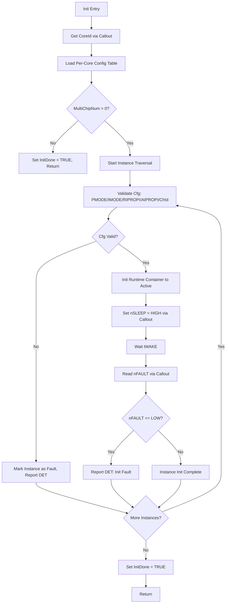
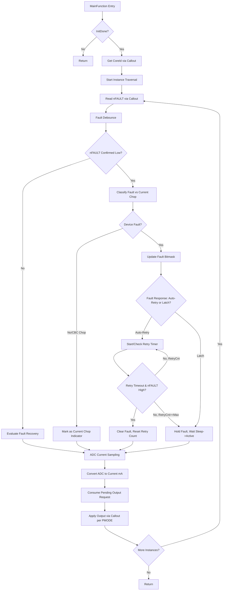
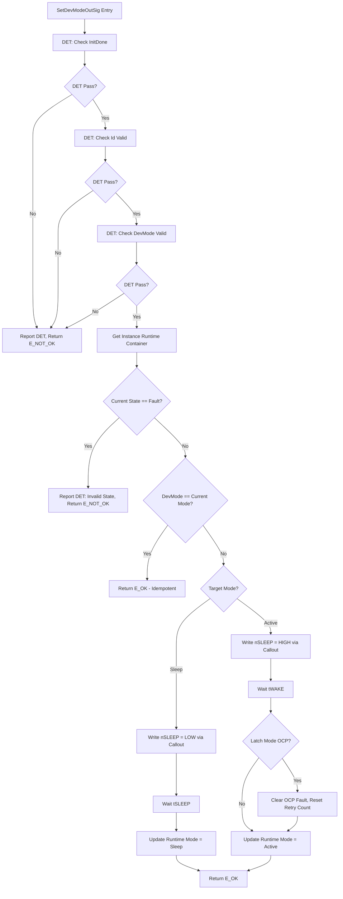
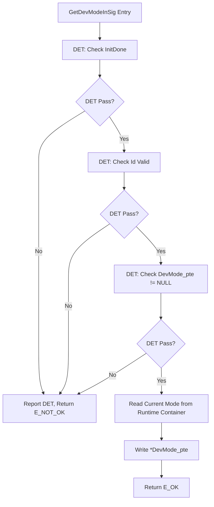
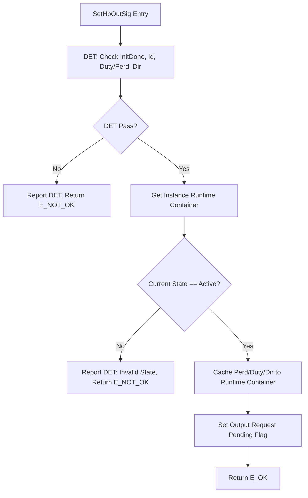
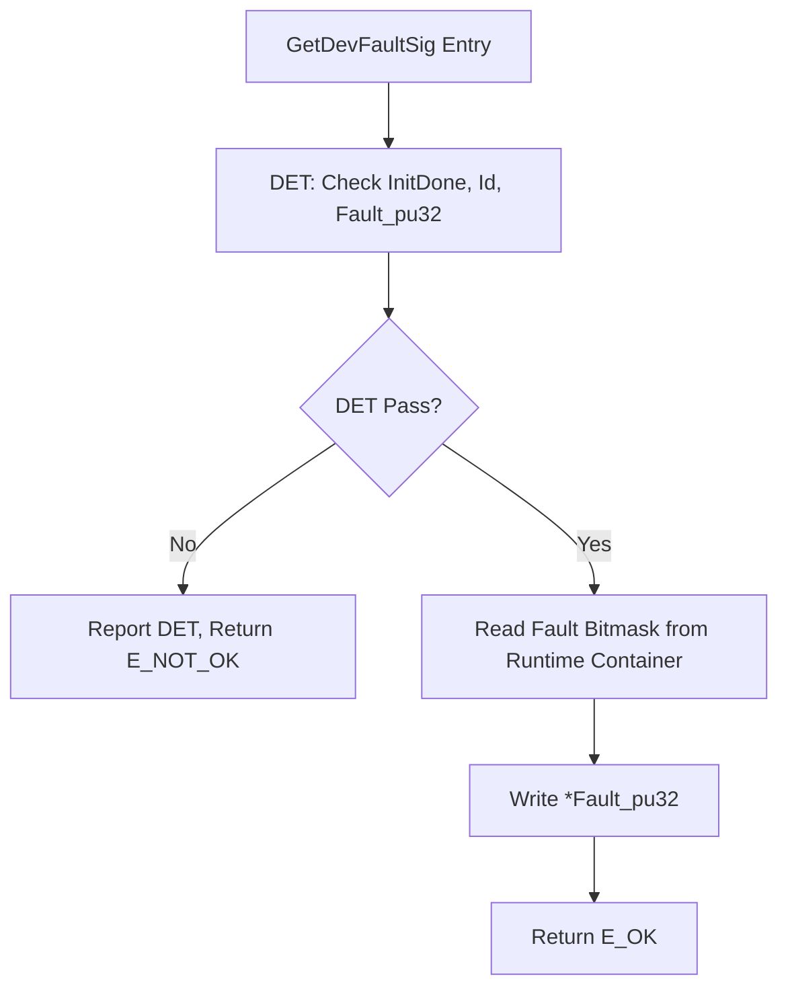
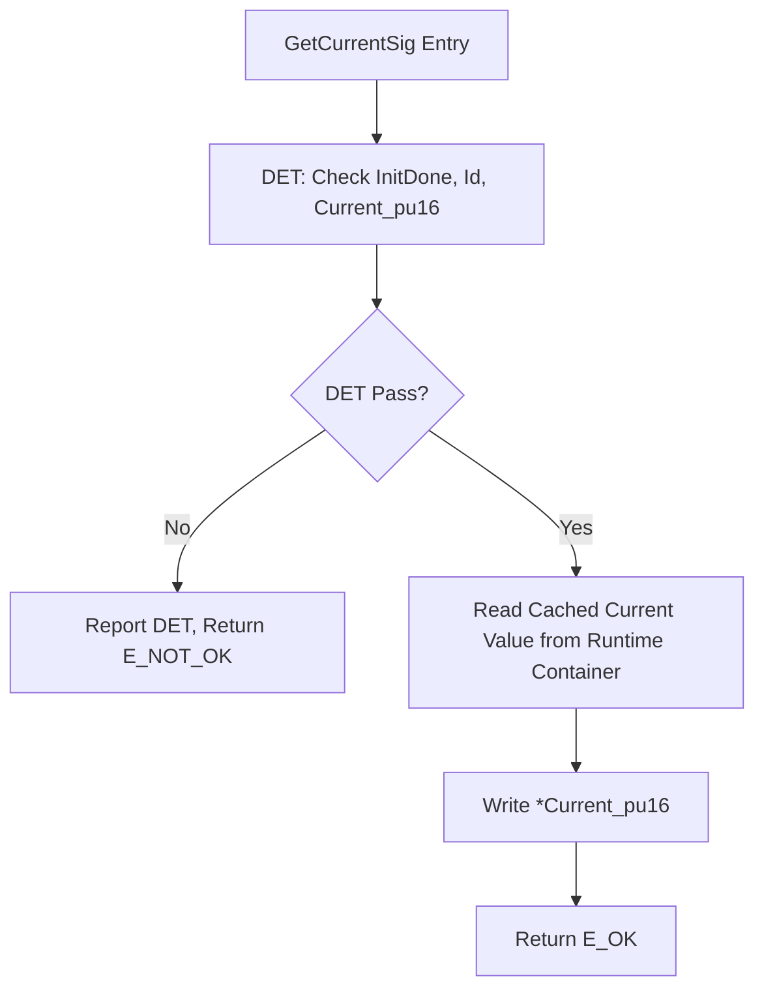
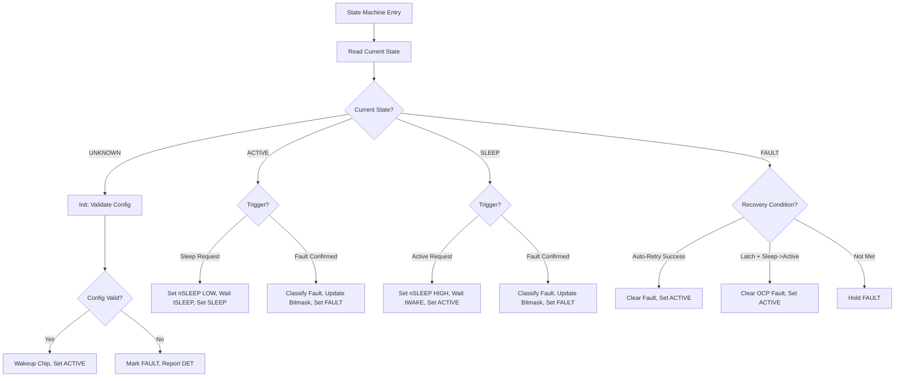
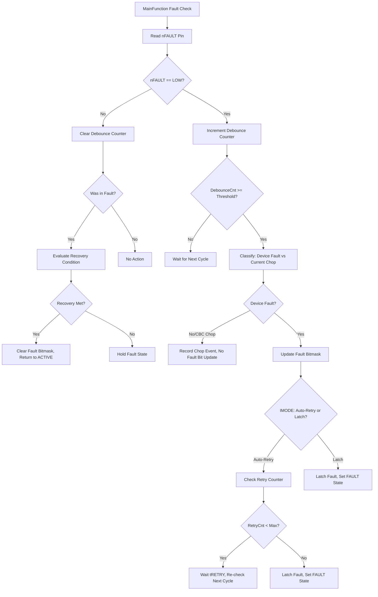

# Gp_DRV8876 FC 详细设计文档

## 文档元信息

- **详细设计版本**: V1
- **详细设计状态**: Draft
- **输出模式**: Formal Draft
- **生成时间**: 2026-05-25
- **生成/修订说明**: 初版发布。基于 DRV8876 SRS V0.1.0、Gp_DRV8876 Architecture V1、DRV8876 Datasheet ZHCSJR0A 生成详细设计。
- **变更点总结**:
  - 初版发布。
  - 定义 7 个外部接口的详细执行步骤与子功能拆分。
  - 定义 5 个依赖接口 (Callout) 的调用契约。
  - 定义 14 个内部静态函数，覆盖参数检查、配置访问、运行时访问、状态条件、状态动作、数据转换、故障检测/确认/响应/恢复。
  - 定义 3 状态 (Active/Sleep/Fault) 软件状态机及切换表。
  - 定义 DET 检查点 5 类，覆盖所有外部接口。
  - 定义故障处理 4 类 (UVLO/CPUV/OCP/TSD) + 电流斩波指示分类。
  - 定义多核框架：每核独立运行时容器与配置表，核间无共享。
  - MemMap: CODE / CONST PER-CORE / RUNTIME RAM PER-CORE / CALIB 预留。

---

## 1. FC概述

- **FC名称**: Gp_DRV8876
- **当前软件层级**: BSW / IoExtDev (AUTOSAR IoExtDev 层)
- **核心职责**:
  - 通过 DIO 控制 DRV8876 芯片的 nSLEEP、EN/IN1、PH/IN2 引脚，管理器件 Active/Sleep/Fault 模式。
  - 通过 DIO 读取 nFAULT 引脚，周期性检测器件故障并区分器件故障与电流斩波指示。
  - 通过 ADC 读取 IPROPI 引脚电压，转换为负载电流值 (mA)。
  - 识别硬件静态配置的 PMODE (控制模式) 和 IMODE (电流调节模式)，适配 H 桥控制逻辑和 nFAULT 语义解析。
  - 管理 OCP 自动重试/锁存恢复策略。
- **运行模型**: 异步接口 + 周期轮询 (Hybrid)。Setter 接口缓存用户请求到运行时容器，MainFunction 周期执行实际硬件操作与状态更新，Getter 接口返回缓存状态值。
- **单核/多核**: 多核支持。每核独立管理其配置的芯片实例，运行时容器和配置表按核分区 (COREx)，核间无共享对象。若项目为单核绑定，每核实例数退化为 1 组。

---

## 2. 设计输入

- **需求文档**: `DRV8876_SRS.md` V0.1.0 (2026-05-25)，包含 7 功能需求 + 7 接口需求 + 5 配置需求 + 3 诊断需求 + 3 时序需求 + 安全/编码/资源/可追溯性需求。
- **架构文档**: `Gp_DRV8876_Architecture.md` V1 Released (2026-05-25)，冻结了 7 外部接口、5 依赖接口、3 配置宏、MemMap 策略、10 文件列表。
- **芯片/平台约束**: `drv8876.md` DRV8876 Datasheet ZHCSJR0A。PMODE 硬件上拉 (PWM 控制模式)，IMODE 硬件浮空 (固定关断时间 + 输出锁存)。关键时序: tWAKE ≤ 1ms, tSLEEP ≤ 1ms, tRETRY = 2ms, AIPROPI = 1000μA/A。
- **公司规则/命名规则**: G-C045 模块命名、G-C046 接口命名、G-C047 软件命名、G-C119 FC开发指南、MemoryLayout 段定义。
- **其他输入**: FC Demo 模板 (OneCore / MultiCore)，fixed_assets 规则资产。

---

## 3. 假设与待确认项

### 3.1 假设

| 索引 | 假设内容 | 影响范围 | 依据 |
| --- | --- | --- | --- |
| A1 | PMODE = PWM (逻辑高电平)，IMODE = 固定关断时间 + 输出锁存 (四电平4，高阻抗)。 | H 桥输出控制逻辑、nFAULT 语义解析、OCP 恢复策略。 | 架构文档已确认硬件配置。 |
| A2 | 项目采用多核绑定，每个芯片实例固定由一个核管理，不存在跨核调用。 | 运行时容器和配置表按 COREx 分区，无需核间同步机制。 | 架构文档 R6 已评审确认。 |
| A3 | SetHbOutSig 接口包含 Perd (PWM Period) 参数，支持 PWM 调速。 | 接口参数设计。 | 架构文档 R2 已评审，按本架构实现。 |
| A4 | 默认 QM 安全等级，不含 ASIL 特定设计 (输出回读、E2E 等)。 | 故障处理策略、DET 范围、冗余设计。 | SRS SRS-DRV8876-SAFE-0001。 |
| A5 | 电流检测仅在 H 桥驱动或制动期间有效，滑行/独立半桥低侧关断时不可检测。GetCurrentSig 在不可检测场景下返回 0mA 且调用方应知悉。 | GetCurrentSig 返回值语义。 | 架构文档 R4 已评审。 |

### 3.2 缺失信息

| 索引 | 缺失项 | 影响 | 建议动作 |
| --- | --- | --- | --- |
| M1 | 硬件原理图与 Pin 分配表未提供。 | DIO/ADC Channel ID 具体值、RIPROPI 电阻值无法填充。 | 从硬件团队获取后填充配置表。 |
| M2 | 项目资源预算 (ROM/RAM/CPU) 未确认。 | 资源消耗约束无法定量验证。 | 从架构团队获取预算值。 |
| M3 | 最终 ASIL 等级未确认。 | 若升级为 ASIL-A/B 需增加安全机制。 | 从功能安全团队确认。 |

### 3.3 待确认项

| 索引 | 待确认项 | 当前处理 | 确认时机 |
| --- | --- | --- | --- |
| P1 | OCP 锁存模式连续 Sleep→Active 重试最大次数和间隔。 | 配置表预留 MaxRetryCnt 和 RetryInterval，默认值 MaxRetryCnt=3, RetryInterval=10ms。 | 项目评审时确认。 |
| P2 | MainFunction 默认周期 5ms 是否满足系统响应要求。 | 配置表可设，默认 5ms。 | 集成测试时验证。 |
| P3 | 是否需要电流有效性标志 (CurrentVld) 作为 GetCurrentSig 的额外输出参数。 | 当前设计在不可检测场景下返回 0mA，调用方通过文档约定知悉。 | 上层调用方评审时确认。 |

---

## 4. 实现总策略

### 4.1 代码组织策略

- 采用文件族分层：外部接口层 (FC.c/FC.h) → 功能层 (内部静态函数) → 依赖接口层 (FC_Callout.c/FC_Callout.h)。
- 模块按功能职责拆分为 14 个内部静态函数，不创建 `FC_Internal.h`（当前为单 .c 文件实现，无跨文件内部共享需求）。
- 类型定义集中在 `FC_Types.h`：模式枚举、方向枚举、控制模式枚举、电流调节模式枚举、故障位掩码宏、运行时容器结构体、配置容器结构体。

### 4.2 cfg 与 runtime 分界

- **cfg (const)**：PMODE/IMODE 设定、RIPROPI/AIPROPI/VADC/ADC 分辨率、DIO/ADC Channel ID 映射、时序参数 (tWAKE/tSLEEP/tRETRY)、去抖次数、OCP 最大重试次数。放在 `FC_Cfg.c` / `FC_CfgData.h`，Init 时加载后只读。
- **runtime (ram)**：Init 状态标志、每实例运行时容器数组（模式状态、输出请求缓存、电流值、故障位掩码、去抖计数器、OCP 重试计数器、DET 错误标志）。放在 `FC.c` 静态区，通过 CLEAR_FAR_DATA 段管理。

### 4.3 callout 策略

- 5 个 Callout 接口抽象所有硬件/平台依赖：`CalloutGetCoreId`、`CalloutWriteDio`、`CalloutReadDio`、`CalloutSetPwmDuty`、`CalloutReadAdc`。
- Callout 实现由项目适配层提供，FC 不直接调用 MCAL API、不直接操作寄存器。
- 板级信号翻转（如 nFAULT 外部上拉导致逻辑反转）在 Callout 内部处理，FC 逻辑层使用语义化电平 (HIGH/LOW)。

### 4.4 DET 与 fault 分界

- **DET**：开发期 API 误用检测（未初始化、无效 Id、NULL 指针、无效参数、无效状态），通过 `GP_DRV8876_CFG_DEV_ERROR_DETECT` 宏控制编译。
- **Fault**：运行时硬件/环境异常（nFAULT 拉低 → UVLO/CPUV/OCP/TSD），通过 MainFunction 周期检测、去抖确认、分类响应、恢复管理。

### 4.5 MemMap 策略

- CODE: 外部接口 + 内部静态函数。
- CONST PER-CORE: 每核实例配置表。
- RUNTIME RAM PER-CORE: 运行时容器 + Init 状态标志。
- CALIB: 条件预留，当前无确认标定参数。

---

## 5. 文件列表设计

| 文件名 | 必需/可选 | 职责 | 关键内容 |
| --- | --- | --- | --- |
| `Gp_DRV8876.c` | 必需 | 模块实现文件。 | 7 个外部接口实现、14 个内部静态函数、运行时容器定义与访问。 |
| `Gp_DRV8876.h` | 必需 | 对外接口头文件。 | 7 个外部 API 原型声明、对外类型引用 (通过 CfgData.h 间接引用)。 |
| `Gp_DRV8876_Types.h` | 必需 | 类型定义头文件。 | `Gp_DRV8876_DrvModType` / `Gp_DRV8876_DrvDirType` / `Gp_DRV8876_CtrlModType` / `Gp_DRV8876_CurRegModType` 枚举、故障位掩码宏、运行时容器结构体、配置容器结构体、DET 错误码宏。 |
| `Gp_DRV8876_Cfg.h` | 必需 | 配置宏头文件。 | `GP_DRV8876_CFG_DEV_ERROR_DETECT`、`GP_DRV8876_CFG_SW_MAJOR_VERSION`、`GP_DRV8876_CFG_SW_MINOR_VERSION`；包含 `Std_Types.h`。 |
| `Gp_DRV8876_Cfg.c` | 必需 | 配置数据实现文件。 | 每核配置常量表定义：PMODE/IMODE 设定、RIPROPI/AIPROPI/VADC/ADC 分辨率、DIO/ADC Channel ID 映射、tWAKE/tSLEEP/tRETRY、去抖次数、OCP 最大重试次数。 |
| `Gp_DRV8876_CfgData.h` | 必需 | 配置数据声明头文件。 | 配置表结构体类型的 extern 声明、配置表数组的 extern 声明。 |
| `Gp_DRV8876_Callout.h` | 必需 | 平台适配接口头文件。 | 5 个 Callout 原型声明。 |
| `Gp_DRV8876_Callout.c` | 条件必需 | 平台适配实现文件。 | Callout 适配实现或集成 stub：DIO/PWM/ADC 通道绑定、CoreId 获取、板级信号翻转。 |
| `Gp_DRV8876_MemMap.h` | 必需 | 内存段映射头文件。 | 所有 FC 文件的段宏定义与编译器映射入口 (CODE_START/STOP, CONST_FAR_DATA_ALIGN4_COREx_START/STOP, CLEAR_FAR_DATA_ALIGN4_COREx_START/STOP, CONST_FAR_DATA_ALIGN4_CALI_START/STOP)。 |
| `Gp_DRV8876_Cali.c` | 可选 | 标定参数文件。 | 当前空文件，仅在项目确认存在标定参数时创建。 |

### 5.1 文件包含关系

```
Gp_DRV8876_Cfg.h ──→ Std_Types.h (external)
Gp_DRV8876_Types.h ──→ Gp_DRV8876_Cfg.h
Gp_DRV8876_CfgData.h ──→ Gp_DRV8876_Types.h
Gp_DRV8876_Callout.h ──→ Gp_DRV8876_Types.h
Gp_DRV8876.h ──→ Gp_DRV8876_CfgData.h
Gp_DRV8876.c ──→ Gp_DRV8876.h, Gp_DRV8876_Callout.h, Gp_DRV8876_MemMap.h
Gp_DRV8876_Cfg.c ──→ Gp_DRV8876_CfgData.h, Gp_DRV8876_MemMap.h
Gp_DRV8876_Callout.c ──→ Gp_DRV8876_Callout.h, Gp_DRV8876_MemMap.h
Gp_DRV8876_Cali.c ──→ Gp_DRV8876_CfgData.h, Gp_DRV8876_MemMap.h
```

---

## 6. 单核/多核框架设计

### 6.1 核模型

| Core | 职责 | Init入口 | 周期任务 | 共享对象 |
| --- | --- | --- | --- | --- |
| Core0 | 管理 Core0 绑定的芯片实例 (0 ~ N0-1) | `Gp_DRV8876_Init` (由 Core0 调用) | `Gp_DRV8876_MainFunction` (由 Core0 调度器调用) | 无 |
| Core1 | 管理 Core1 绑定的芯片实例 (0 ~ N1-1) | `Gp_DRV8876_Init` (由 Core1 调用) | `Gp_DRV8876_MainFunction` (由 Core1 调度器调用) | 无 |
| ... | ... | ... | ... | 无 |

### 6.2 任务模型

| Task | Core | 周期 | 优先级类别 | 调用对象 | 监控动作 |
| --- | --- | --- | --- | --- | --- |
| DRV8876_MainTask_Core0 | Core0 | 5ms (默认，可配置) | 周期任务 | `Gp_DRV8876_MainFunction` | 执行时间不超过周期 80%，超时通过 DET 报告 |
| DRV8876_MainTask_Core1 | Core1 | 5ms (默认，可配置) | 周期任务 | `Gp_DRV8876_MainFunction` | 同上 |
| DRV8876_InitTask_Core0 | Core0 | 一次性 (Startup) | 初始化任务 | `Gp_DRV8876_Init` | Init 完成后不再调用 |
| DRV8876_InitTask_Core1 | Core1 | 一次性 (Startup) | 初始化任务 | `Gp_DRV8876_Init` | Init 完成后不再调用 |

### 6.3 同步点与共享对象

当前设计为每核独立管理，核间无共享对象、无同步点。

---

## 7. 外部接口设计

### 7.1 `Gp_DRV8876_Init`

| Interface Prototype | Description | Sync/Async | Reentrancy | Return Value | Basic Constraints | 关联接口 |
| --- | --- | --- | --- | --- | --- | --- |
| `void Gp_DRV8876_Init(void)` | 初始化当前核所有已配置芯片实例：加载配置表、识别 PMODE/IMODE、初始化运行时容器为 Active、将 nSLEEP 置 HIGH 唤醒器件、等待 tWAKE。 | Synchronous | Non-reentrant | `void` (配置错误通过 DET 报告) | 必须在 MCAL DIO/ADC Init 之后调用。必须在其他 Gp_DRV8876 API 之前调用。每核调用一次。 | SRS-DRV8876-INTF-0001; CalloutGetCoreId; CalloutWriteDio; CalloutReadDio |

#### 7.1.1 子功能拆分

| 步骤 | 子功能 | 输入 | 输出 | 关键检查/约束 | 依赖对象 |
| --- | --- | --- | --- | --- | --- |
| 1 | 获取当前 CoreId | 无 | CoreId (0-based) | Callout 必须已就绪 | `CalloutGetCoreId` |
| 2 | 加载当前核配置表 | CoreId | 配置表指针、实例数量 | 配置表指针非 NULL，MultiChipNum 有效 | cfg table |
| 3 | 遍历实例、校验 PMODE/IMODE | 配置表中的 PMODE/IMODE | 校验结果 | PMODE ∈ {0,1,2}，IMODE ∈ {1,2,3,4} | cfg table |
| 4 | 初始化运行时容器 | 配置表、实例数量 | 运行时容器数组 (模式=Active, 故障=0, 电流=0) | 每个实例独立初始化 | runtime container |
| 5 | 设置 nSLEEP = HIGH (唤醒) | DIO ChId, HIGH | DIO 输出 | 每个已配置实例逐一唤醒 | `CalloutWriteDio` |
| 6 | 等待 tWAKE | tWAKE_us | 等待完成 | 等待时间 ≥ 1ms (建议 2ms) | cfg table (tWAKE) |
| 7 | 检查 nFAULT (tWAKE 后) | DIO ChId | nFAULT 电平 | 若 nFAULT = LOW → DET 报告初始化故障 | `CalloutReadDio` |
| 8 | 设置 Init 完成标志 | 无 | `InitDone = TRUE` | 标志设置后其他 API 方可使用 | runtime |

#### 7.1.2 执行步骤

1. 调用 `CalloutGetCoreId` 获取当前核 ID。
2. 根据 CoreId 索引当前核配置表指针和实例数量 (MultiChipNum)。
3. 若 MultiChipNum = 0，直接设置 InitDone = TRUE 并返回。
4. 遍历每个实例：
   a. 校验配置表中的 PMODE 值是否在有效枚举范围内 (0/1/2)。
   b. 校验配置表中的 IMODE 值是否在有效枚举范围内 (1/2/3/4)。
   c. 校验 RIPROPI 和 AIPROPI 是否为非零值。
   d. 校验 DIO/ADC Channel ID 是否非冲突。
   e. 若任一校验失败，该实例标记为 Fault 状态，通过 DET 报告，跳过后续步骤。
5. 遍历每个有效实例：
   a. 调用 `CalloutWriteDio(nSLEEP_ChId, HIGH)` 唤醒芯片。
   b. 等待 tWAKE 时间（延时函数或调度器延时）。
   c. 调用 `CalloutReadDio(nFAULT_ChId, &level)` 读取 nFAULT。
   d. 若 nFAULT = LOW，通过 DET 报告初始化故障 (DEV_ERR_INIT_FAULT_NFAULT_LOW)。
6. 设置运行时容器中每个实例的初始状态为 Active。
7. 设置模块 InitDone 标志为 TRUE。

#### 7.1.3 参与内部函数

| 内部函数 | 作用 | 调用时机 |
| --- | --- | --- |
| `Gp_DRV8876_Prv_GetCoreId` | 封装 `CalloutGetCoreId` 调用，获取当前 CoreId | 步骤 1 |
| `Gp_DRV8876_Prv_LoadCfg` | 根据 CoreId 加载配置表指针和实例数 | 步骤 2 |
| `Gp_DRV8876_Prv_ValidateCfg` | 校验单实例配置有效性 (PMODE/IMODE/RIPROPI/AIPROPI/ChId) | 步骤 4 |
| `Gp_DRV8876_Prv_WakeupChip` | 执行 nSLEEP=HIGH + 等待 tWAKE + 检查 nFAULT | 步骤 5-7 |
| `Gp_DRV8876_Prv_InitRuntime` | 初始化单实例运行时容器为默认值 | 步骤 6 |

#### 7.1.4 流程图



---

### 7.2 `Gp_DRV8876_MainFunction`

| Interface Prototype | Description | Sync/Async | Reentrancy | Return Value | Basic Constraints | 关联接口 |
| --- | --- | --- | --- | --- | --- | --- |
| `void Gp_DRV8876_MainFunction(void)` | 周期主函数：轮询 nFAULT 故障检测与去抖、根据 IMODE 和控制输入状态区分器件故障与电流斩波指示、读取 IPROPI ADC 并转换为负载电流、管理 OCP 重试状态机。 | Synchronous | Non-reentrant | `void` | 必须在 Init 之后调用。由周期调度器按配置周期 (默认 5ms) 调用。执行时间不超过周期 80%。内部异常不阻塞周期调度。 | SRS-DRV8876-INTF-0002; CalloutReadDio; CalloutReadAdc; CalloutWriteDio; CalloutGetCoreId |

#### 7.2.1 子功能拆分

| 步骤 | 子功能 | 输入 | 输出 | 关键检查/约束 | 依赖对象 |
| --- | --- | --- | --- | --- | --- |
| 1 | 模块初始化检查 | 无 | InitDone 状态 | 未初始化则直接返回 | runtime InitDone flag |
| 2 | 获取 CoreId | 无 | CoreId | Callout 必须已就绪 | `CalloutGetCoreId` |
| 3 | 遍历实例、读取 nFAULT | DIO ChId (nFAULT) | nFAULT 电平 | 每个实例逐一读取 | `CalloutReadDio` |
| 4 | nFAULT 故障去抖 | nFAULT 电平, 历史计数器 | 去抖后故障状态 | 连续 LowCnt ≥ DebounceThreshold → 确认故障 | runtime debounce counter |
| 5 | 故障分类 (器件故障 vs 电流斩波指示) | nFAULT=Low, EN/IN1 状态, PH/IN2 状态, IMODE | 故障原因分类 | 逐周期模式下前进/后退 + nFAULT=Low → 电流斩波指示 | runtime output state, cfg IMODE |
| 6 | 故障响应与恢复管理 | 故障类型, IMODE, OCP 重试计数器 | 故障位掩码更新, OCP 重试状态 | 自动重试: 等待 tRETRY 后重新检查; 锁存: 等待 Sleep→Active 序列 | runtime fault state, OCP retry counter |
| 7 | ADC 电流采样与转换 | ADC ChId (IPROPI) | 负载电流值 (mA) | 仅在 Active 模式下采样; 使用 RIPROPI/AIPROPI 转换 | `CalloutReadAdc`, cfg RIPROPI/AIPROPI/VADC |
| 8 | 消费 Setter 输出请求 | 运行时容器中缓存的输出请求 | DIO/PWM 控制输出 | 根据 PMODE 适配输出控制逻辑 | `CalloutWriteDio`, `CalloutSetPwmDuty` |

#### 7.2.2 执行步骤

1. 检查 InitDone 标志，若未初始化则直接返回。
2. 调用 `CalloutGetCoreId` 获取当前 CoreId。
3. 根据 CoreId 获取实例数量和运行时容器数组。
4. 遍历每个已配置实例，执行以下子步骤 5-9。
5. 调用 `CalloutReadDio(nFAULT_ChId, &nFaultLevel)` 读取 nFAULT 电平。
6. 故障去抖处理：若 nFAULT = LOW，LowCnt++; 若 LowCnt ≥ DebounceThreshold，确认故障。
   若 nFAULT = HIGH，LowCnt 清零，若此前为故障状态则触发故障恢复评估。
7. 故障分类：若 nFAULT 确认为 LOW：
   a. 读取当前实例的 EN/IN1 和 PH/IN2 输出状态。
   b. 若 IMODE ∈ {CBC_AR, CBC_Latch} (逐周期) 且控制输入要求前进或后退 → 分类为电流斩波指示（非故障）。
   c. 否则 → 分类为器件故障，根据当前已知信息推断具体故障类型 (无法通过 nFAULT 直接区分，使用排除法)。
8. 故障响应/恢复：
   a. 器件故障确认后，更新故障位掩码。
   b. 自动重试模式 (IMODE=1 或 2)：启动 OCP 重试计时，tRETRY + 余量 (3ms) 后重新检查 nFAULT。
      - 若恢复 → 清除故障位。
      - 若未恢复且重试次数 < MaxRetryCnt → 继续重试。
      - 若重试次数 ≥ MaxRetryCnt → 锁存故障。
   c. 锁存模式 (IMODE=3 或 4)：保持故障状态，等待 Sleep→Active 序列清除。
9. ADC 电流采样：若实例为 Active 模式：
   a. 调用 `CalloutReadAdc(IPROPI_ChId, &raw, &valid)`。
   b. 若 valid = TRUE，根据公式 `I_LOAD(mA) = (V_ADC / RIPROPI) / AIPROPI × 1000` 计算电流值。
   c. 更新运行时容器的电流值和有效性标志。
10. 消费输出请求：若实例为 Active 模式且运行时容器中有待处理的输出请求：
    a. 根据 PMODE 选择输出控制方案。
    b. PWM 模式 (PMODE=1)：调用 `CalloutSetPwmDuty` 设置 PWM 占空比，或调用 `CalloutWriteDio` 设置静态电平。
    c. PH/EN 模式 (PMODE=0)：调用 `CalloutWriteDio` 设置 EN (PWM 或静态) 和 PH (方向)。
    d. 独立半桥模式 (PMODE=2)：调用 `CalloutWriteDio` 分别控制 OUT1/OUT2。
    e. 清除运行时容器中的待处理标志。
11. 返回。

#### 7.2.3 参与内部函数

| 内部函数 | 作用 | 调用时机 |
| --- | --- | --- |
| `Gp_DRV8876_Prv_DebounceFault` | nFAULT 去抖：连续 N 次 Low 确认故障，恢复时清零计数 | 步骤 6 |
| `Gp_DRV8876_Prv_ClassifyFault` | 区分器件故障与电流斩波指示 | 步骤 7 |
| `Gp_DRV8876_Prv_FaultResponse` | 执行故障响应：更新位掩码、启动/管理 OCP 重试或锁存 | 步骤 8 |
| `Gp_DRV8876_Prv_FaultRecovery` | 故障恢复评估：自动重试超时检查、锁存清除条件检查 | 步骤 8 |
| `Gp_DRV8876_Prv_AdcToCurrent` | ADC 原始值 → 负载电流 (mA) 转换 | 步骤 9 |
| `Gp_DRV8876_Prv_ApplyOutput` | 根据 PMODE 消费输出请求，调用对应 Callout 驱动硬件 | 步骤 10 |

#### 7.2.4 流程图



---

### 7.3 `Gp_DRV8876_SetDevModeOutSig`

| Interface Prototype | Description | Sync/Async | Reentrancy | Return Value | Basic Constraints | 关联接口 |
| --- | --- | --- | --- | --- | --- | --- |
| `Std_ReturnType Gp_DRV8876_SetDevModeOutSig(uint16 Id_u16, Gp_DRV8876_DrvModType DevMode_te)` | 设置指定芯片实例的目标模式 (Active / Sleep)。Active: nSLEEP=HIGH + 等待 tWAKE。Sleep: nSLEEP=LOW + 等待 tSLEEP。 | Synchronous | Reentrant | `E_OK` / `E_NOT_OK` | Init 必须已完成。Id_u16 必须有效。DevMode_te 必须为 Active 或 Sleep。Fault 状态实例拒绝切换。Sleep→Active 在锁存模式下作为故障清除序列。 | SRS-DRV8876-INTF-0003; CalloutWriteDio; GetDevModeInSig |

#### 7.3.1 子功能拆分

| 步骤 | 子功能 | 输入 | 输出 | 关键检查/约束 | 依赖对象 |
| --- | --- | --- | --- | --- | --- |
| 1 | DET 参数检查 | Id_u16, DevMode_te | DET 报告 / E_NOT_OK | 未初始化、无效 Id、无效 DevMode → DET | DET |
| 2 | 获取实例运行时容器 | Id_u16 | 运行时容器指针 | 实例必须已初始化 | runtime container |
| 3 | 状态条件检查 | 当前模式, DevMode_te | 检查结果 | 当前为 Fault 状态 → 拒绝; DevMode = 当前模式 → 直接返回 E_OK | runtime state |
| 4 | Sleep 模式动作 | 无 | nSLEEP = LOW, 等待 tSLEEP | EN/IN1 和 PH/IN2 自动失能 (芯片内部下拉) | `CalloutWriteDio` |
| 5 | Active 模式动作 (唤醒) | 无 | nSLEEP = HIGH, 等待 tWAKE | 锁存模式下此为故障清除序列 | `CalloutWriteDio` |
| 6 | 更新运行时模式状态 | DevMode_te | 运行时模式更新 | 写入新的目标模式 | runtime container |

#### 7.3.2 执行步骤

1. DET 检查：检查 InitDone、Id_u16 有效范围、DevMode_te ∈ {Active, Sleep}。
   - 任一失败 → 报告 DET，返回 E_NOT_OK。
2. 获取实例运行时容器指针。
3. 若当前模式 = Fault → 报告 DET (DEV_ERR_INVALID_STATE)，返回 E_NOT_OK。
4. 若当前模式 = DevMode_te → 直接返回 E_OK (幂等)。
5. 若 DevMode_te = Sleep：
   a. 调用 `CalloutWriteDio(nSLEEP_ChId, LOW)`。
   b. 等待 tSLEEP (≥ 1ms，建议 2ms)。
   c. 更新运行时模式为 Sleep。
6. 若 DevMode_te = Active：
   a. 调用 `CalloutWriteDio(nSLEEP_ChId, HIGH)`。
   b. 等待 tWAKE (≥ 1ms，建议 2ms)。
   c. 若 IMODE 为锁存模式 (3 或 4) 且之前存在 OCP 故障 → 清除故障位、重置 OCP 重试计数器。
   d. 更新运行时模式为 Active。
7. 返回 E_OK。

#### 7.3.3 参与内部函数

| 内部函数 | 作用 | 调用时机 |
| --- | --- | --- |
| `Gp_DRV8876_Prv_CheckInit` | DET: 检查模块初始化状态 | 步骤 1 |
| `Gp_DRV8876_Prv_CheckId` | DET: 检查 Id 有效性 | 步骤 1 |
| `Gp_DRV8876_Prv_CheckDevMode` | DET: 检查 DevMode 值有效性 | 步骤 1 |
| `Gp_DRV8876_Prv_CheckState` | DET: 检查当前状态是否允许操作 | 步骤 3 |
| `Gp_DRV8876_Prv_SetSleep` | 执行 Sleep 模式硬件操作 | 步骤 5 |
| `Gp_DRV8876_Prv_SetActive` | 执行 Active 模式硬件操作 + 锁存故障清除 | 步骤 6 |

#### 7.3.4 流程图



---

### 7.4 `Gp_DRV8876_GetDevModeInSig`

| Interface Prototype | Description | Sync/Async | Reentrancy | Return Value | Basic Constraints | 关联接口 |
| --- | --- | --- | --- | --- | --- | --- |
| `Std_ReturnType Gp_DRV8876_GetDevModeInSig(uint16 Id_u16, Gp_DRV8876_DrvModType* DevMode_pte)` | 读取指定芯片实例的当前软件模式状态。返回最近一次软件接受的目标模式 (非芯片物理确认)。 | Synchronous | Reentrant | `E_OK` / `E_NOT_OK` | Init 必须已完成。Id_u16 必须有效。DevMode_pte 必须非 NULL。 | SRS-DRV8876-INTF-0004 |

#### 7.4.1 子功能拆分

| 步骤 | 子功能 | 输入 | 输出 | 关键检查/约束 | 依赖对象 |
| --- | --- | --- | --- | --- | --- |
| 1 | DET 参数检查 | Id_u16, DevMode_pte | DET 报告 / E_NOT_OK | 未初始化、无效 Id、NULL 指针 → DET | DET |
| 2 | 读取运行时模式 | 运行时容器 | DevMode_te | 直接返回缓存值 | runtime container |

#### 7.4.2 执行步骤

1. DET 检查：检查 InitDone、Id_u16 有效范围、DevMode_pte != NULL。
   - 任一失败 → 报告 DET，返回 E_NOT_OK。
2. 从实例运行时容器中读取当前软件模式。
3. 写入 `*DevMode_pte`。
4. 返回 E_OK。

#### 7.4.3 参与内部函数

| 内部函数 | 作用 | 调用时机 |
| --- | --- | --- |
| `Gp_DRV8876_Prv_CheckInit` | DET: 检查模块初始化状态 | 步骤 1 |
| `Gp_DRV8876_Prv_CheckId` | DET: 检查 Id 有效性 | 步骤 1 |
| `Gp_DRV8876_Prv_CheckPtr` | DET: 检查指针非 NULL | 步骤 1 |

#### 7.4.4 流程图



---

### 7.5 `Gp_DRV8876_SetHbOutSig`

| Interface Prototype | Description | Sync/Async | Reentrancy | Return Value | Basic Constraints | 关联接口 |
| --- | --- | --- | --- | --- | --- | --- |
| `Std_ReturnType Gp_DRV8876_SetHbOutSig(uint16 Id_u16, uint32 Perd_u32, uint32 Duty_u32, Gp_DRV8876_DrvDirType Dir_te)` | 设置指定芯片实例的 H 桥输出方向和占空比。缓存输出请求到运行时容器，由 MainFunction 消费并执行硬件操作。 | Asynchronous | Reentrant | `E_OK` / `E_NOT_OK` | Init 必须已完成。实例必须为 Active 模式。Id_u16 必须有效。Duty_u32 ≤ Perd_u32。Dir_te 必须为有效枚举值。 | SRS-DRV8876-INTF-0005; MainFunction (消费请求); CalloutWriteDio; CalloutSetPwmDuty |

#### 7.5.1 子功能拆分

| 步骤 | 子功能 | 输入 | 输出 | 关键检查/约束 | 依赖对象 |
| --- | --- | --- | --- | --- | --- |
| 1 | DET 参数检查 | Id_u16, Perd_u32, Duty_u32, Dir_te | DET 报告 / E_NOT_OK | 未初始化、无效 Id、Duty > Perd、无效 Dir → DET | DET |
| 2 | 状态条件检查 | 当前模式 | 检查结果 | 非 Active 模式 → 拒绝 | runtime state |
| 3 | 缓存输出请求 | Perd_u32, Duty_u32, Dir_te | 写入运行时容器 | 设置请求待处理标志 | runtime container |

#### 7.5.2 执行步骤

1. DET 检查：检查 InitDone、Id_u16 有效范围、Duty_u32 ≤ Perd_u32、Dir_te ∈ {Forward, Reverse, Brake, Coast}。
   - 任一失败 → 报告 DET，返回 E_NOT_OK。
2. 获取实例运行时容器指针。
3. 若当前模式 ≠ Active → 报告 DET (DEV_ERR_INVALID_STATE)，返回 E_NOT_OK。
4. 将 {Perd_u32, Duty_u32, Dir_te} 缓存至运行时容器的输出请求区。
5. 设置输出请求待处理标志 = TRUE。
6. 返回 E_OK。
   (实际硬件操作在 MainFunction 中根据 PMODE 消费此请求)。

#### 7.5.3 参与内部函数

| 内部函数 | 作用 | 调用时机 |
| --- | --- | --- |
| `Gp_DRV8876_Prv_CheckInit` | DET: 检查模块初始化状态 | 步骤 1 |
| `Gp_DRV8876_Prv_CheckId` | DET: 检查 Id 有效性 | 步骤 1 |
| `Gp_DRV8876_Prv_CheckRange` | DET: 检查 Duty ≤ Perd | 步骤 1 |
| `Gp_DRV8876_Prv_CheckDir` | DET: 检查 Dir 枚举有效性 | 步骤 1 |
| `Gp_DRV8876_Prv_CheckState` | DET: 检查当前状态为 Active | 步骤 2 |

#### 7.5.4 流程图



---

### 7.6 `Gp_DRV8876_GetDevFaultSig`

| Interface Prototype | Description | Sync/Async | Reentrancy | Return Value | Basic Constraints | 关联接口 |
| --- | --- | --- | --- | --- | --- | --- |
| `Std_ReturnType Gp_DRV8876_GetDevFaultSig(uint16 Id_u16, uint32* Fault_pu32)` | 读取指定芯片实例的当前故障状态位掩码。Bit0=UVLO, Bit1=CPUV, Bit2=OCP, Bit3=TSD。电流斩波指示不包含在内。 | Synchronous | Reentrant | `E_OK` / `E_NOT_OK` | Init 必须已完成。Id_u16 必须有效。Fault_pu32 必须非 NULL。返回 MainFunction 上一周期更新后的缓存值。 | SRS-DRV8876-INTF-0006; MainFunction (更新故障状态) |

#### 7.6.1 子功能拆分

| 步骤 | 子功能 | 输入 | 输出 | 关键检查/约束 | 依赖对象 |
| --- | --- | --- | --- | --- | --- |
| 1 | DET 参数检查 | Id_u16, Fault_pu32 | DET 报告 / E_NOT_OK | 未初始化、无效 Id、NULL 指针 → DET | DET |
| 2 | 读取故障位掩码 | 运行时容器 | Fault_pu32 | 返回 MainFunction 缓存值 | runtime container |

#### 7.6.2 执行步骤

1. DET 检查：检查 InitDone、Id_u16 有效范围、Fault_pu32 != NULL。
   - 任一失败 → 报告 DET，返回 E_NOT_OK。
2. 从实例运行时容器中读取故障位掩码。
3. 写入 `*Fault_pu32`。
4. 返回 E_OK。

#### 7.6.3 参与内部函数

| 内部函数 | 作用 | 调用时机 |
| --- | --- | --- |
| `Gp_DRV8876_Prv_CheckInit` | DET: 检查模块初始化状态 | 步骤 1 |
| `Gp_DRV8876_Prv_CheckId` | DET: 检查 Id 有效性 | 步骤 1 |
| `Gp_DRV8876_Prv_CheckPtr` | DET: 检查指针非 NULL | 步骤 1 |

#### 7.6.4 流程图



---

### 7.7 `Gp_DRV8876_GetCurrentSig`

| Interface Prototype | Description | Sync/Async | Reentrancy | Return Value | Basic Constraints | 关联接口 |
| --- | --- | --- | --- | --- | --- | --- |
| `Std_ReturnType Gp_DRV8876_GetCurrentSig(uint16 Id_u16, uint16* Current_pu16)` | 读取指定芯片实例的最新负载电流值 (mA)。电流值由 MainFunction 中 ADC 采样 IPROPI 电压计算得出。 | Synchronous | Reentrant | `E_OK` / `E_NOT_OK` | Init 必须已完成。ADC 必须已校准。Id_u16 必须有效。Current_pu16 必须非 NULL。返回 MainFunction 上一周期缓存值。Sleep/滑行模式下返回 0。 | SRS-DRV8876-INTF-0007; MainFunction (更新电流值) |

#### 7.7.1 子功能拆分

| 步骤 | 子功能 | 输入 | 输出 | 关键检查/约束 | 依赖对象 |
| --- | --- | --- | --- | --- | --- |
| 1 | DET 参数检查 | Id_u16, Current_pu16 | DET 报告 / E_NOT_OK | 未初始化、无效 Id、NULL 指针 → DET | DET |
| 2 | 读取电流值 | 运行时容器 | Current_pu16 | 返回 MainFunction 缓存值。Sleep 模式下返回 0。 | runtime container |

#### 7.7.2 执行步骤

1. DET 检查：检查 InitDone、Id_u16 有效范围、Current_pu16 != NULL。
   - 任一失败 → 报告 DET，返回 E_NOT_OK。
2. 从实例运行时容器中读取缓存的电流值 (mA)。
3. 写入 `*Current_pu16`。
4. 返回 E_OK。

#### 7.7.3 参与内部函数

| 内部函数 | 作用 | 调用时机 |
| --- | --- | --- |
| `Gp_DRV8876_Prv_CheckInit` | DET: 检查模块初始化状态 | 步骤 1 |
| `Gp_DRV8876_Prv_CheckId` | DET: 检查 Id 有效性 | 步骤 1 |
| `Gp_DRV8876_Prv_CheckPtr` | DET: 检查指针非 NULL | 步骤 1 |

#### 7.7.4 流程图



---

## 8. 依赖接口与Callout设计

### 8.1 `Gp_DRV8876_CalloutGetCoreId`

| Interface Prototype | Description | Implemented By | Sync/Async | Reentrancy | Basic Constraints |
| --- | --- | --- | --- | --- | --- |
| `uint32 Gp_DRV8876_CalloutGetCoreId(void)` | 返回当前 Core ID (0-based)。用于 Init 和 MainFunction 索引每核配置表和运行时容器。 | 项目适配层 / MCAL | Synchronous | Reentrant | 必须在 Init 之前可用。必须总是成功，返回值正确性由平台适配层保证。 |

#### 8.1.1 执行步骤

1. 从平台硬件寄存器或 MCAL API 获取当前 Core ID。
2. 返回 Core ID (0-based uint32)。

---

### 8.2 `Gp_DRV8876_CalloutWriteDio`

| Interface Prototype | Description | Implemented By | Sync/Async | Reentrancy | Basic Constraints |
| --- | --- | --- | --- | --- | --- |
| `Std_ReturnType Gp_DRV8876_CalloutWriteDio(uint16 ChId_u16, uint8 Lvl_u8)` | 设置 DIO 通道输出电平。用于控制 nSLEEP、EN/IN1、PH/IN2 引脚。Lvl_u8: 0=LOW, 非0=HIGH。 | IoMcu / 项目适配层 | Synchronous | Reentrant | ChId_u16 必须为有效 DIO Channel ID。板级信号翻转在 Callout 内部处理。 |

#### 8.2.1 执行步骤

1. 验证 ChId_u16 为有效 DIO Channel ID。
2. 根据 ChId 索引 DIO 通道配置。
3. 如有板级信号翻转需求，反转 Lvl_u8。
4. 调用 MCAL DIO WriteChannel 或等效接口输出电平。
5. 返回 E_OK 或 E_NOT_OK。

---

### 8.3 `Gp_DRV8876_CalloutReadDio`

| Interface Prototype | Description | Implemented By | Sync/Async | Reentrancy | Basic Constraints |
| --- | --- | --- | --- | --- | --- |
| `Std_ReturnType Gp_DRV8876_CalloutReadDio(uint16 ChId_u16, uint8* Lvl_pu8)` | 读取 DIO 通道输入电平。用于读取 nFAULT 引脚状态。Lvl_pu8: 0=LOW, 非0=HIGH。 | IoMcu / 项目适配层 | Synchronous | Reentrant | ChId_u16 必须为有效 DIO Channel ID。Lvl_pu8 必须非 NULL。nFAULT 需要外部上拉电阻。 |

#### 8.3.1 执行步骤

1. 验证 ChId_u16 为有效 DIO Channel ID。
2. 调用 MCAL DIO ReadChannel 或等效接口读取引脚电平。
3. 如有板级信号翻转需求，反转读取值。
4. 写入 `*Lvl_pu8`。
5. 返回 E_OK 或 E_NOT_OK。

---

### 8.4 `Gp_DRV8876_CalloutSetPwmDuty`

| Interface Prototype | Description | Implemented By | Sync/Async | Reentrancy | Basic Constraints |
| --- | --- | --- | --- | --- | --- |
| `Std_ReturnType Gp_DRV8876_CalloutSetPwmDuty(uint16 ChId_u16, uint32 Perd_u32, uint32 Duty_u32)` | 设置 PWM 通道的周期和占空比。用于在 EN/IN1 或 PH/IN2 引脚上生成 PWM 信号以控制电机转速。 | IoMcu / 项目适配层 | Synchronous | Reentrant | ChId_u16 必须为有效 PWM Channel ID。Duty_u32 ≤ Perd_u32。静态 100%/0% 占空比时 Callout 实现可退化为 DIO 输出。 |

#### 8.4.1 执行步骤

1. 验证 ChId_u16 为有效 PWM Channel ID。
2. 根据 Duty_u32 和 Perd_u32 计算占空比。
3. 若 Duty = 0 (0%)：退化为 DIO 输出 LOW。
4. 若 Duty = Perd (100%)：退化为 DIO 输出 HIGH。
5. 若 0 < Duty < Perd：调用 MCAL PWM SetDutyCycle 设置占空比。
6. 返回 E_OK 或 E_NOT_OK。

---

### 8.5 `Gp_DRV8876_CalloutReadAdc`

| Interface Prototype | Description | Implemented By | Sync/Async | Reentrancy | Basic Constraints |
| --- | --- | --- | --- | --- | --- |
| `Std_ReturnType Gp_DRV8876_CalloutReadAdc(uint16 ChId_u16, uint16* Raw_pu16, boolean* RawVld_pb)` | 读取 ADC 通道的原始转换值。用于读取 IPROPI 引脚电压。RawVld_pb: TRUE=有效, FALSE=转换未完成或错误。 | IoMcu / 项目适配层 | Synchronous | Reentrant | ChId_u16 必须为有效 ADC Channel ID。Raw_pu16 和 RawVld_pb 必须非 NULL。即使返回 E_OK，RawVld_pb 仍可能为 FALSE。 |

#### 8.5.1 执行步骤

1. 验证 ChId_u16 为有效 ADC Channel ID。
2. 调用 MCAL ADC ReadGroup 或等效接口获取转换结果。
3. 检查转换完成状态和有效性。
4. 写入 `*Raw_pu16` (原始 ADC 值) 和 `*RawVld_pb` (有效性标志)。
5. 返回 E_OK 或 E_NOT_OK。

---

## 9. 内部函数设计

| 函数名 | 类别 | 作用域 | 职责 | 触发点 |
| --- | --- | --- | --- | --- |
| `Gp_DRV8876_Prv_GetCoreId` | cfg access | `static` | 封装 `CalloutGetCoreId` 调用，返回当前 CoreId | Init, MainFunction |
| `Gp_DRV8876_Prv_LoadCfg` | cfg access | `static` | 根据 CoreId 获取配置表指针和实例数量 | Init |
| `Gp_DRV8876_Prv_ValidateCfg` | parameter check | `static` | 校验单实例配置 (PMODE/IMODE/RIPROPI/AIPROPI/ChId) | Init |
| `Gp_DRV8876_Prv_WakeupChip` | state action | `static` | 执行 nSLEEP=HIGH + 等待 tWAKE + 检查 nFAULT | Init, SetDevModeOutSig |
| `Gp_DRV8876_Prv_InitRuntime` | runtime access | `static` | 初始化单实例运行时容器为默认值 | Init |
| `Gp_DRV8876_Prv_CheckInit` | parameter check | `static` | DET: 检查模块 InitDone 标志 | 所有外部 API |
| `Gp_DRV8876_Prv_CheckId` | parameter check | `static` | DET: 检查实例 Id 有效性 (0 ≤ Id < MultiChipNum) | 所有 Id 参数的 API |
| `Gp_DRV8876_Prv_CheckPtr` | parameter check | `static` | DET: 检查输出指针非 NULL | GetDevModeInSig, GetDevFaultSig, GetCurrentSig |
| `Gp_DRV8876_Prv_CheckRange` | parameter check | `static` | DET: 检查 Duty ≤ Perd | SetHbOutSig |
| `Gp_DRV8876_Prv_CheckDir` | parameter check | `static` | DET: 检查 Dir 枚举有效性 | SetHbOutSig |
| `Gp_DRV8876_Prv_CheckDevMode` | parameter check | `static` | DET: 检查 DevMode 值为 Active 或 Sleep | SetDevModeOutSig |
| `Gp_DRV8876_Prv_CheckState` | state condition check | `static` | DET: 检查实例当前状态是否允许 API 操作 | SetDevModeOutSig, SetHbOutSig |
| `Gp_DRV8876_Prv_SetSleep` | state action | `static` | 执行 Sleep 模式: nSLEEP=LOW + 等待 tSLEEP + 更新运行时状态 | SetDevModeOutSig |
| `Gp_DRV8876_Prv_SetActive` | state action | `static` | 执行 Active 模式: nSLEEP=HIGH + 等待 tWAKE + 锁存模式 OCP 清除 | SetDevModeOutSig |
| `Gp_DRV8876_Prv_DebounceFault` | fault confirm | `static` | nFAULT 去抖确认: 连续 N 次 Low 确认故障; 恢复时清零 | MainFunction |
| `Gp_DRV8876_Prv_ClassifyFault` | fault detect | `static` | 区分器件故障 (UVLO/CPUV/OCP/TSD) 与电流斩波指示 | MainFunction |
| `Gp_DRV8876_Prv_FaultResponse` | fault response | `static` | 故障响应: 更新位掩码、启动 OCP 重试或锁存 | MainFunction |
| `Gp_DRV8876_Prv_FaultRecovery` | fault recovery | `static` | 故障恢复评估: 自动重试超时检查、锁存清除条件 | MainFunction |
| `Gp_DRV8876_Prv_AdcToCurrent` | data conversion | `static` | ADC 原始值 → 负载电流 (mA) 转换: `I_LOAD = (V_ADC / RIPROPI) / AIPROPI × 1000` | MainFunction |
| `Gp_DRV8876_Prv_ApplyOutput` | state action | `static` | 根据 PMODE 消费输出请求，调用对应 Callout 驱动硬件 | MainFunction |

### 9.1 关键内部控制流拆分

#### 9.1.1 `Gp_DRV8876_Prv_AdcToCurrent` (电流转换)

| 步骤 | 子功能 | 调用函数 | 输入/读取 | 输出/写入 | 说明 |
| --- | --- | --- | --- | --- | --- |
| 1 | 计算 ADC 电压 | 无 | Raw ADC value, VADC, ADC resolution | V_IPROPI (mV) | `V_IPROPI = Raw × VADC / (2^Resolution)` |
| 2 | 计算 IPROPI 电流 | 无 | V_IPROPI, RIPROPI | I_IPROPI (μA) | `I_IPROPI = V_IPROPI / RIPROPI` |
| 3 | 计算负载电流 | 无 | I_IPROPI, AIPROPI | I_LOAD (mA) | `I_LOAD = I_IPROPI / AIPROPI × 1000` |
| 4 | 饱和检查 | 无 | I_LOAD, ADC max range | Clamped I_LOAD | 超出量程时返回饱和值并标记警告 |

#### 9.1.2 `Gp_DRV8876_Prv_ApplyOutput` (输出消费)

| 步骤 | 子功能 | 调用函数 | 输入/读取 | 输出/写入 | 说明 |
| --- | --- | --- | --- | --- | --- |
| 1 | 读取 PMODE | 无 | cfg table PMODE | PMODE value | 确定控制方案 |
| 2 | 读取输出请求 | 无 | runtime container | Perd, Duty, Dir | 从缓存读取 |
| 3 | 按 PMODE 分发控制 | CalloutWriteDio / CalloutSetPwmDuty | PMODE, Perd, Duty, Dir | DIO/PWM 输出 | PMODE=0: PH/EN; PMODE=1: PWM; PMODE=2: 独立半桥 |
| 4 | 清除待处理标志 | 无 | runtime container pending flag | pending = FALSE | 请求已消费 |

#### 9.1.3 `Gp_DRV8876_Prv_ClassifyFault` (故障分类)

| 步骤 | 子功能 | 调用函数 | 输入/读取 | 输出/写入 | 说明 |
| --- | --- | --- | --- | --- | --- |
| 1 | 读取 IMODE | 无 | cfg table IMODE | IMODE value | 确定 nFAULT 语义 |
| 2 | 读取控制输入状态 | 无 | runtime container | EN/IN1 state, PH/IN2 state | 确定当前 H 桥状态 |
| 3 | 判断 nFAULT 原因 | 无 | IMODE, control state, nFAULT=Low | fault classification | 逐周期 + 前进/后退 → 电流斩波; 否则 → 器件故障 |
| 4 | 返回分类结果 | 无 | classification | return value | 供 MainFunction 后续处理 |

---

## 10. 状态机设计

### 10.1 状态定义

| 状态名 | 枚举值 | 含义 | 进入条件 | 退出条件 |
| --- | --- | --- | --- | --- |
| UNKNOWN | 0x00 | 未初始化或未知状态 | 模块未 Init / 实例无效 | Init 完成 |
| ACTIVE | 0x21 | H 桥激活，器件准备接收输入 | nSLEEP=HIGH 且 tWAKE 已过，或故障恢复条件满足 | nSLEEP 设为 LOW，或故障发生 |
| SLEEP | 0x61 | 低功耗模式，H 桥/电荷泵禁用 | nSLEEP=LOW 且 tSLEEP 已过 | nSLEEP 设为 HIGH (唤醒) |
| FAULT | 0x71 | 故障保护状态，H 桥禁用，nFAULT 拉低 | 故障条件满足 (UVLO/CPUV/OCP/TSD) 且去抖确认 | 满足对应故障的恢复条件 |

### 10.2 状态切换表

| 当前状态 | 条件函数 | 动作函数 | 下一状态 | 备注 |
| --- | --- | --- | --- | --- |
| UNKNOWN | `Prv_ValidateCfg` 通过 | `Prv_InitRuntime` → `Prv_WakeupChip` | ACTIVE | Init 时设置 |
| UNKNOWN | `Prv_ValidateCfg` 失败 | 记录 DET，保持 UNKNOWN | FAULT | 配置无效 |
| ACTIVE | `SetDevModeOutSig(Sleep)` | `Prv_SetSleep` | SLEEP | nSLEEP=LOW |
| ACTIVE | MainFunction 确认故障 | `Prv_FaultResponse` | FAULT | nFAULT 去抖确认 + 分类为器件故障 |
| SLEEP | `SetDevModeOutSig(Active)` | `Prv_SetActive` | ACTIVE | nSLEEP=HIGH + 等待 tWAKE |
| SLEEP | MainFunction 确认故障 | `Prv_FaultResponse` | FAULT | 睡眠模式下的故障 (如 UVLO) |
| FAULT | 自动重试: MainFunction `Prv_FaultRecovery` 成功 | 清除故障位掩码 | ACTIVE | IMODE=1 或 2，nFAULT 恢复 HIGH |
| FAULT | 锁存: `SetDevModeOutSig(Active)` (Sleep→Active) | `Prv_SetActive` 清除 OCP 故障 | ACTIVE | IMODE=3 或 4，nSLEEP 复位序列 |

### 10.3 状态机主流程图



---

## 11. DET设计

### 11.1 DET 检查点定义

| 检查点 | 触发条件 | 记录方式 | 返回策略 | 适用API |
| --- | --- | --- | --- | --- |
| `DEV_ERR_NOT_INIT` | 模块 InitDone = FALSE | DET 位掩码 Bit0 置位 | 返回 E_NOT_OK (void API 直接 return) | 所有外部 API (除 Init) |
| `DEV_ERR_INVALID_ID` | Id_u16 ≥ MultiChipNum 或 Id 未配置 | DET 位掩码 Bit1 置位 | 返回 E_NOT_OK | SetDevModeOutSig, GetDevModeInSig, SetHbOutSig, GetDevFaultSig, GetCurrentSig |
| `DEV_ERR_NULL_PTR` | 输出指针参数 = NULL | DET 位掩码 Bit2 置位 | 返回 E_NOT_OK | GetDevModeInSig, GetDevFaultSig, GetCurrentSig |
| `DEV_ERR_INVALID_PARAM` | DevMode ∉ {Active,Sleep} 或 Duty > Perd 或 Dir 无效 | DET 位掩码 Bit3 置位 | 返回 E_NOT_OK | SetDevModeOutSig, SetHbOutSig |
| `DEV_ERR_INVALID_STATE` | 当前状态不允许 API 操作 (Fault 状态拒绝模式切换、Sleep 状态拒绝输出控制) | DET 位掩码 Bit4 置位 | 返回 E_NOT_OK | SetDevModeOutSig, SetHbOutSig |
| `DEV_ERR_INIT_FAULT_NFAULT_LOW` | Init 时 tWAKE 后 nFAULT = LOW | DET 位掩码 Bit5 置位 | void (Init 不返回错误) | Init |
| `DEV_ERR_CFG_INVALID` | 配置表中 PMODE/IMODE/RIPROPI/AIPROPI/ChId 无效 | DET 位掩码 Bit6 置位 | void (Init 不返回错误，标记实例 Fault) | Init |
| `DEV_ERR_PERF_WARNING` | MainFunction 执行时间 > 周期 80% | DET 位掩码 Bit7 置位 | void (不阻塞周期调度) | MainFunction |

### 11.2 DET 执行流程

所有外部 API (除 Init 和 MainFunction) 遵循统一的 DET 执行顺序：

1. 检查模块初始化状态 (`Prv_CheckInit`)。
2. 检查 Id 参数有效性 (`Prv_CheckId`)，如 API 包含 Id 参数。
3. 检查输出指针非 NULL (`Prv_CheckPtr`)，如 API 包含输出指针参数。
4. 检查输入参数范围有效性 (`Prv_CheckDevMode` / `Prv_CheckRange` / `Prv_CheckDir`)。
5. 检查当前状态是否允许操作 (`Prv_CheckState`)。
6. 任一步骤失败 → 记录 DET 错误位、返回 E_NOT_OK、不执行业务逻辑。

### 11.3 DET 编译控制

```c
#if (GP_DRV8876_CFG_DEV_ERROR_DETECT == STD_ON)
    // DET check code included
#else
    // DET check code excluded (production build)
#endif
```

---

## 12. 故障处理设计

### 12.1 故障项定义

| 故障项 | 检测条件 | 确认规则 | 响应动作 | 恢复条件 | 保留策略 |
| --- | --- | --- | --- | --- | --- |
| UVLO (VM 欠压) | nFAULT = LOW，非电流斩波指示 | 去抖 N 次 (可配置) 连续 Low | 故障位 Bit0 置位；H 桥已由硬件禁用 | VM > VUVLO，nFAULT 恢复 HIGH (自动恢复) | 故障位由 MainFunction 更新，可通过 GetDevFaultSig 查询 |
| CPUV (电荷泵欠压) | nFAULT = LOW，非电流斩波指示 | 去抖 N 次连续 Low | 故障位 Bit1 置位；H 桥已由硬件禁用 | VCP > VCPUV，nFAULT 恢复 HIGH (自动恢复) | 同上 |
| OCP (过流) - 自动重试 | nFAULT = LOW，非电流斩波指示，IMODE=1 或 2 | 去抖 N 次连续 Low | 故障位 Bit2 置位；芯片在 tRETRY (2ms) 后自动重试；软件在 tRETRY+余量 (3ms) 后重新检查 | nFAULT 恢复 HIGH 且 重试次数 < MaxRetryCnt | OCP 重试计数器保留；连续失败超 MaxRetryCnt → 实例锁存 FAULT |
| OCP (过流) - 输出锁存 | nFAULT = LOW，非电流斩波指示，IMODE=3 或 4 | 去抖 N 次连续 Low | 故障位 Bit2 置位；H 桥已由硬件禁用并锁存 | 需 Sleep→Active 序列 (nSLEEP 复位) | 锁存状态保留直到 Sleep→Active 序列执行 |
| TSD (热关断) | nFAULT = LOW，非电流斩波指示 | 去抖 N 次连续 Low | 故障位 Bit3 置位；H 桥已由硬件禁用 | TJ < TTSD - THYS (自动恢复) | 故障位由 MainFunction 更新 |
| 电流斩波指示 (非故障) | nFAULT = LOW，IMODE=2 或 3 (逐周期)，控制输入要求前进/后退 | 无需去抖 (芯片硬件行为) | 不更新故障位掩码，仅记录电流斩波事件 (可选记录) | 控制输入沿自动恢复 | 不计入故障位掩码 |

### 12.2 故障处理主流程



---

## 13. 运行时变量设计

| 变量名 | 类别 | 类型 | 所属Core | 写方 | 读方 | 生命周期 | MemMap | NoClear |
| --- | --- | --- | --- | --- | --- | --- | --- | --- |
| `Gp_DRV8876_InitDone_b` | status | `boolean` | Per-Core | `Init` | 所有外部 API, `MainFunction` | Init 中设为 TRUE，运行期不清除 | CLEAR_FAR_DATA_COREx | No |
| `Gp_DRV8876_Runtime_s[ChipCnt]` | runtime container | `struct Gp_DRV8876_RuntimeType` | Per-Core | `Init` (初始化), Setter API (写请求), `MainFunction` (写状态) | Getter API (读状态), `MainFunction` (读请求) | Init 中分配和初始化，运行期持续更新 | CLEAR_FAR_DATA_COREx | No |
| `Gp_DRV8876_Runtime_s[].DevMode_te` | status | `Gp_DRV8876_DrvModType` | Per-Core | `Init`, `SetDevModeOutSig`, `MainFunction` (故障时) | `GetDevModeInSig`, `MainFunction` | 运行期持续更新 | 同上 | No |
| `Gp_DRV8876_Runtime_s[].OutReq_s` | input | `struct Gp_DRV8876_OutReqType` (Perd, Duty, Dir, Pending) | Per-Core | `SetHbOutSig` | `MainFunction` (消费) | Setter 写入 → MainFunction 消费后清除 | 同上 | No |
| `Gp_DRV8876_Runtime_s[].Current_u16` | output | `uint16` | Per-Core | `MainFunction` (ADC 采样转换后) | `GetCurrentSig` | 每周期更新 | 同上 | No |
| `Gp_DRV8876_Runtime_s[].Fault_u32` | fault | `uint32` (bitmask) | Per-Core | `MainFunction` (故障确认/恢复) | `GetDevFaultSig`, `MainFunction` | 故障发生时更新，恢复时清除 | 同上 | No |
| `Gp_DRV8876_Runtime_s[].DebounceCnt_u8` | intermediate | `uint8` | Per-Core | `MainFunction` (故障检测) | `MainFunction` | 每周期更新 (nFAULT=Low 递增, High 清零) | 同上 | No |
| `Gp_DRV8876_Runtime_s[].OcpRetryCnt_u8` | fault | `uint8` | Per-Core | `MainFunction` (OCP 故障响应) | `MainFunction` | OCP 故障时递增，恢复或锁存清除时清零 | 同上 | No |
| `Gp_DRV8876_Runtime_s[].DetErr_u8` | status | `uint8` (bitmask) | Per-Core | 所有外部 API (DET 触发时) | 调试/诊断 | 运行期累计 | 同上 | No |

### 13.1 运行时容器结构体定义

```c
typedef struct
{
    Gp_DRV8876_DrvModType DevMode_te;       /* 当前软件模式 */
    Gp_DRV8876_OutReqType OutReq_s;          /* 输出请求缓存 (Perd/Duty/Dir/Pending) */
    uint16 Current_u16;                      /* 负载电流值 (mA) */
    boolean CurrentVld_b;                    /* 电流值有效性 (TRUE=有效) */
    uint32 Fault_u32;                        /* 故障位掩码 */
    uint8 DebounceCnt_u8;                    /* nFAULT 去抖计数器 */
    uint8 OcpRetryCnt_u8;                    /* OCP 重试计数器 */
    uint8 DetErr_u8;                         /* DET 错误位掩码 */
} Gp_DRV8876_RuntimeType;
```

---

## 14. 配置设计

### 14.1 配置宏参

| Macro | Purpose | Type | Default Value | Usage Location | Status |
| --- | --- | --- | --- | --- | --- |
| `GP_DRV8876_CFG_DEV_ERROR_DETECT` | DET 功能全局开关，控制编译期包含参数校验和 DET 报告代码 | Macro | `STD_ON` | `Gp_DRV8876_Cfg.h`; 所有外部 API DET 检查块 | Formal |
| `GP_DRV8876_CFG_SW_MAJOR_VERSION` | FC 软件主版本号 | Macro | `1` | `Gp_DRV8876_Cfg.h` | Formal |
| `GP_DRV8876_CFG_SW_MINOR_VERSION` | FC 软件次版本号 | Macro | `0` | `Gp_DRV8876_Cfg.h` | Formal |
| `GP_DRV8876_CFG_MULTI_CHIP_NUM_COREx` | 每核管理的芯片实例数量 (x=0,1,...) | Macro | 项目定义 | `Gp_DRV8876_Cfg.h` (核内配置) | Formal |

### 14.2 配置表

| 表名 | 作用域 | 行含义 | 关键字段 | 所属文件 |
| --- | --- | --- | --- | --- |
| `Gp_DRV8876_CfgTable_Core0[]` | Core0 CONST | 每个芯片实例一行的完整配置 | `PMODE_te`, `IMODE_te`, `nSLEEP_ChId_u16`, `EN_IN1_ChId_u16`, `PH_IN2_ChId_u16`, `nFAULT_ChId_u16`, `IPROPI_ChId_u16`, `RIPROPI_u32` (Ω), `AIPROPI_u16` (μA/A), `VADC_u16` (mV), `AdcResolution_u8` (bits), `tWAKE_us_u16`, `tSLEEP_us_u16`, `tRETRY_us_u16`, `DebounceThr_u8`, `OcpMaxRetry_u8`, `MainFunctionPeriod_us_u16` | `Gp_DRV8876_Cfg.c` |
| `Gp_DRV8876_CfgTable_Core1[]` | Core1 CONST | 同上 (Core1 绑定的实例) | 同上 | `Gp_DRV8876_Cfg.c` |

### 14.3 配置表结构体定义

```c
typedef struct
{
    Gp_DRV8876_CtrlModType  PMODE_te;           /* 控制模式 (0=PH/EN, 1=PWM, 2=IndependentHalfBridge) */
    Gp_DRV8876_CurRegModType IMODE_te;          /* 电流调节模式 (1=FixedOffTime_AR, 2=CBC_AR, 3=CBC_Latch, 4=FixedOffTime_Latch) */
    uint16 nSLEEP_ChId_u16;                      /* nSLEEP DIO Channel ID */
    uint16 EN_IN1_ChId_u16;                      /* EN/IN1 DIO Channel ID */
    uint16 PH_IN2_ChId_u16;                      /* PH/IN2 DIO Channel ID */
    uint16 nFAULT_ChId_u16;                      /* nFAULT DIO Channel ID */
    uint16 IPROPI_ChId_u16;                      /* IPROPI ADC Channel ID */
    uint32 RIPROPI_u32;                          /* RIPROPI 电阻值 (Ω) */
    uint16 AIPROPI_u16;                          /* AIPROPI 电流镜比例因数 (μA/A, 典型值 1000) */
    uint16 VADC_u16;                             /* ADC 基准电压 (mV) */
    uint8  AdcResolution_u8;                     /* ADC 分辨率 (bits, 典型值 10 或 12) */
    uint16 tWAKE_us_u16;                         /* 唤醒等待时间 (μs, 建议 2000) */
    uint16 tSLEEP_us_u16;                        /* 睡眠等待时间 (μs, 建议 2000) */
    uint16 tRETRY_us_u16;                        /* OCP 重试间隔 (μs, 建议 3000) */
    uint8  DebounceThr_u8;                       /* nFAULT 去抖次数 (建议 3) */
    uint8  OcpMaxRetry_u8;                       /* OCP 最大重试次数 (建议 3) */
    uint16 MainFunctionPeriod_us_u16;            /* MainFunction 周期 (μs, 建议 5000) */
} Gp_DRV8876_CfgType;
```

---

## 15. MemMap设计

| Memory Section | Target Content | Start Macro | Stop Macro | Used Files | Notes |
| --- | --- | --- | --- | --- | --- |
| CODE | 外部接口函数实现 + 内部静态函数 | `GP_DRV8876_CODE_START` | `GP_DRV8876_CODE_STOP` | `Gp_DRV8876.c`, `Gp_DRV8876.h` | 正式推荐 |
| CONST PER-CORE | 每核实例配置常量表 | `GP_DRV8876_CONST_FAR_DATA_ALIGN4_COREx_START` | `GP_DRV8876_CONST_FAR_DATA_ALIGN4_COREx_STOP` | `Gp_DRV8876_Cfg.c`, `Gp_DRV8876_CfgData.h` | 每核独立配置表。若项目单核或所有核共享配置，可改为 GLOBAL CONST |
| RUNTIME RAM PER-CORE | 运行时变量：InitDone 标志 + 每实例运行时容器数组 | `GP_DRV8876_CLEAR_FAR_DATA_ALIGN4_COREx_START` | `GP_DRV8876_CLEAR_FAR_DATA_ALIGN4_COREx_STOP` | `Gp_DRV8876.c` | 默认使用 CLEAR_FAR_DATA；Init 中显式赋初值 |
| CALIB (预留) | 标定常量段 | `GP_DRV8876_CONST_FAR_DATA_ALIGN4_CALI_START` | `GP_DRV8876_CONST_FAR_DATA_ALIGN4_CALI_STOP` | `Gp_DRV8876_Cali.c` (如存在) | 条件预留。当前无确认标定参数，QM 等级 BSW FC 通常无需标定 |

### 15.1 MemMap 段决策说明

- **不使用 NO_CLEAR**：当前无热复位保留数据需求（无保留故障历史、无复位原因分析、无安全状态连续性需求）。
- **不使用 NEAR**：无高频中断访问运行时数据的路径，所有访问通过周期 MainFunction 或同步 API。
- **CONST 使用 COREx 而非 GLOBAL**：每核管理的实例和引脚映射不同，配置数据按核分区。若项目确认所有核共享相同配置表，可调整为 GLOBAL。
- **CALIB 为条件预留**：当前无确认标定参数。电流限制阈值通过 VREF 硬件电阻分压器设定，不通过软件标定。

---

## 16. 编码起步建议

### 16.1 推荐实现顺序

1. **建文件族与基础类型**：创建 10 个文件的骨架，定义所有枚举类型、结构体类型、故障位掩码宏。
2. **建 `Cfg.h` / `CfgData.h` / `Cfg.c`**：定义配置宏 (DEV_ERROR_DETECT, VERSION, MULTI_CHIP_NUM)、配置表结构体、配置表数组声明与定义。
3. **建外部接口原型与 DET 策略**：在 `FC.h` 中声明 7 个外部 API 原型，实现统一的 DET 检查函数族。
4. **建内部函数骨架与子功能拆分**：实现 14 个内部静态函数的签名和空壳。
5. **建状态机和主流程**：实现 Init → MainFunction 核心路径，连通状态切换表。
6. **接入 Callout / 依赖接口**：实现 Callout stub 或集成项目适配层代码。
7. **接入 DET / fault / runtime / MemMap**：填充完整的 DET 检查、故障处理生命周期、运行时变量读写、MemMap 段放置。

### 16.2 首先创建文件

1. `Gp_DRV8876_Cfg.h`
2. `Gp_DRV8876_Types.h`
3. `Gp_DRV8876_CfgData.h`
4. `Gp_DRV8876_MemMap.h`
5. `Gp_DRV8876.h`
6. `Gp_DRV8876_Callout.h`
7. `Gp_DRV8876.c`
8. `Gp_DRV8876_Cfg.c`
9. `Gp_DRV8876_Callout.c`
10. `Gp_DRV8876_Cali.c` (可选)

### 16.3 首先实现接口

1. `Gp_DRV8876_Init` — 初始化骨架
2. `Gp_DRV8876_GetDevModeInSig` — 最简单的 Getter，验证 DET 流程
3. `Gp_DRV8876_SetDevModeOutSig` — 模式管理核心
4. `Gp_DRV8876_MainFunction` — 周期任务核心
5. `Gp_DRV8876_GetDevFaultSig` + `GetCurrentSig` — 其余 Getter
6. `Gp_DRV8876_SetHbOutSig` — 输出控制（异步 Setter）

### 16.4 首先验证点

1. Init → GetDevModeInSig 返回 Active → SetDevModeOutSig(Sleep) → GetDevModeInSig 返回 Sleep → SetDevModeOutSig(Active) 恢复。
2. MainFunction 周期调用 → nFAULT 模拟 LOW → GetDevFaultSig 确认故障位。
3. SetHbOutSig 缓存请求 → MainFunction 消费 → DIO/PWM 输出正确。

---

## 17. 风险与待确认项

| 索引 | 问题项 | 影响 | 建议动作 | 状态 |
| --- | --- | --- | --- | --- |
| R1 | 硬件原理图与引脚映射未确认 | 配置表 DIO/ADC Channel ID、RIPROPI 等具体值无法填充 | 从硬件团队获取原理图和 Pin 分配表后填充配置表 | `待评审` |
| R2 | SetHbOutSig 接口参数形式 (Perd_u32) | 若上层不使用 PWM 调速，Perd 参数可简化 | 与上层控制逻辑确认 PWM 调速需求 | `待评审` |
| R3 | PMODE/IMODE 硬件一致性校验策略 | 软件无法直接回读芯片 PMODE/IMODE 状态，配置与硬件不一致只能间接发现 | 确认是否增加自检序列或在集成测试中验证 | `待评审` |
| R4 | 电流检测在 Sleep/滑行/独立半桥模式下的返回值语义 | GetCurrentSig 返回 0mA，调用方需知悉不可用 | 确认是否增加 CurrentVld 标志作为额外输出参数 | `待评审` |
| R5 | OCP 锁存模式连续重试次数和间隔 | 无限重试可能损坏芯片，次数过少无法恢复瞬态过流 | 配置表预留 MaxRetryCnt=3, RetryInterval=10ms，待项目确认 | `待评审` |
| R6 | 多核跨核调用场景 | 当前设计不支持跨核调用，若存在跨核需求需增加核间通信 | 确认项目为单核绑定还是存在跨核访问 | `待评审` |
| R7 | 功能安全等级最终确认 | 当前设计为 QM 等级，若升级 ASIL 需增加安全机制 | 从功能安全团队确认最终 ASIL 分配 | `待评审` |
| R8 | MainFunction 执行时间与周期约束 | 默认 5ms 周期，执行时间需不超过 80% (4ms) | 实现后通过 CPU 负载测量验证 | `待评审` |

---

## 附录A: 类型定义汇总

### A.1 模式枚举

```c
typedef enum
{
    GP_DRV8876_DRV_MOD_UNKNOWN = 0x00,
    GP_DRV8876_DRV_MOD_ACTIVE  = 0x21,
    GP_DRV8876_DRV_MOD_SLEEP   = 0x61,
    GP_DRV8876_DRV_MOD_FAULT   = 0x71
} Gp_DRV8876_DrvModType;
```

### A.2 方向枚举

```c
typedef enum
{
    GP_DRV8876_DRV_DIR_FORWARD = 0,
    GP_DRV8876_DRV_DIR_REVERSE = 1,
    GP_DRV8876_DRV_DIR_BRAKE   = 2,
    GP_DRV8876_DRV_DIR_COAST   = 3
} Gp_DRV8876_DrvDirType;
```

### A.3 控制模式枚举

```c
typedef enum
{
    GP_DRV8876_CTRL_MOD_PH_EN                = 0,
    GP_DRV8876_CTRL_MOD_PWM                  = 1,
    GP_DRV8876_CTRL_MOD_INDEPENDENT_HALF_BRIDGE = 2
} Gp_DRV8876_CtrlModType;
```

### A.4 电流调节模式枚举

```c
typedef enum
{
    GP_DRV8876_CUR_REG_MOD_FIXED_OFF_TIME_AR  = 1,
    GP_DRV8876_CUR_REG_MOD_CBC_AR             = 2,
    GP_DRV8876_CUR_REG_MOD_CBC_LATCH          = 3,
    GP_DRV8876_CUR_REG_MOD_FIXED_OFF_TIME_LATCH = 4
} Gp_DRV8876_CurRegModType;
```

### A.5 故障位掩码宏

```c
#define GP_DRV8876_FAULT_NONE   ((uint32)0x00000000U)
#define GP_DRV8876_FAULT_UVLO   ((uint32)0x00000001U)
#define GP_DRV8876_FAULT_CPUV   ((uint32)0x00000002U)
#define GP_DRV8876_FAULT_OCP    ((uint32)0x00000004U)
#define GP_DRV8876_FAULT_TSD    ((uint32)0x00000008U)
```

### A.6 DET 错误码宏

```c
#define GP_DRV8876_DET_ERR_NOT_INIT             ((uint8)0x01U)
#define GP_DRV8876_DET_ERR_INVALID_ID           ((uint8)0x02U)
#define GP_DRV8876_DET_ERR_NULL_PTR             ((uint8)0x04U)
#define GP_DRV8876_DET_ERR_INVALID_PARAM        ((uint8)0x08U)
#define GP_DRV8876_DET_ERR_INVALID_STATE        ((uint8)0x10U)
#define GP_DRV8876_DET_ERR_INIT_FAULT_NFAULT_LOW ((uint8)0x20U)
#define GP_DRV8876_DET_ERR_CFG_INVALID          ((uint8)0x40U)
#define GP_DRV8876_DET_ERR_PERF_WARNING         ((uint8)0x80U)
```

---

## 附录B: 外部接口汇总

| 接口 | 原型 | 类别 | 同步/异步 | 可重入 |
| --- | --- | --- | --- | --- |
| Init | `void Gp_DRV8876_Init(void)` | 初始化 | Sync | No |
| MainFunction | `void Gp_DRV8876_MainFunction(void)` | 周期任务 | Sync | No |
| SetDevModeOutSig | `Std_ReturnType Gp_DRV8876_SetDevModeOutSig(uint16 Id_u16, Gp_DRV8876_DrvModType DevMode_te)` | Setter | Sync | Yes |
| GetDevModeInSig | `Std_ReturnType Gp_DRV8876_GetDevModeInSig(uint16 Id_u16, Gp_DRV8876_DrvModType* DevMode_pte)` | Getter | Sync | Yes |
| SetHbOutSig | `Std_ReturnType Gp_DRV8876_SetHbOutSig(uint16 Id_u16, uint32 Perd_u32, uint32 Duty_u32, Gp_DRV8876_DrvDirType Dir_te)` | Setter (Async) | Async | Yes |
| GetDevFaultSig | `Std_ReturnType Gp_DRV8876_GetDevFaultSig(uint16 Id_u16, uint32* Fault_pu32)` | Getter | Sync | Yes |
| GetCurrentSig | `Std_ReturnType Gp_DRV8876_GetCurrentSig(uint16 Id_u16, uint16* Current_pu16)` | Getter | Sync | Yes |

## 附录C: 依赖接口汇总

| 接口 | 原型 | 实现方 | 用途 |
| --- | --- | --- | --- |
| CalloutGetCoreId | `uint32 Gp_DRV8876_CalloutGetCoreId(void)` | 项目适配层 / MCAL | 获取当前 CoreId |
| CalloutWriteDio | `Std_ReturnType Gp_DRV8876_CalloutWriteDio(uint16 ChId_u16, uint8 Lvl_u8)` | IoMcu / 项目适配层 | 控制 nSLEEP/EN/IN1/PH/IN2 引脚 |
| CalloutReadDio | `Std_ReturnType Gp_DRV8876_CalloutReadDio(uint16 ChId_u16, uint8* Lvl_pu8)` | IoMcu / 项目适配层 | 读取 nFAULT 引脚 |
| CalloutSetPwmDuty | `Std_ReturnType Gp_DRV8876_CalloutSetPwmDuty(uint16 ChId_u16, uint32 Perd_u32, uint32 Duty_u32)` | IoMcu / 项目适配层 | PWM 调速输出 |
| CalloutReadAdc | `Std_ReturnType Gp_DRV8876_CalloutReadAdc(uint16 ChId_u16, uint16* Raw_pu16, boolean* RawVld_pb)` | IoMcu / 项目适配层 | IPROPI ADC 采样 |

---

## 附录D: 需求追溯矩阵

| 需求ID | 需求名称 | 详细设计覆盖 | 覆盖状态 |
| --- | --- | --- | --- |
| SRS-DRV8876-FUNC-0001 | 器件模式管理 | SetDevModeOutSig (§7.3) + GetDevModeInSig (§7.4) + 状态机 (§10) | Covered |
| SRS-DRV8876-FUNC-0002 | H 桥输出控制 | SetHbOutSig (§7.5) + Prv_ApplyOutput (§9.1.2) | Covered |
| SRS-DRV8876-FUNC-0003 | 控制模式适配 | Init (§7.1) + CfgTable PMODE (§14.2) + Prv_ApplyOutput (§9.1.2) | Covered |
| SRS-DRV8876-FUNC-0004 | 负载电流检测 | GetCurrentSig (§7.7) + Prv_AdcToCurrent (§9.1.1) + CalloutReadAdc (§8.5) | Covered |
| SRS-DRV8876-FUNC-0005 | 电流调节感知 | Init (§7.1) + Prv_ClassifyFault (§9.1.3) + CfgTable IMODE (§14.2) | Covered |
| SRS-DRV8876-INTF-0001 | Init 接口 | §7.1 | Covered |
| SRS-DRV8876-INTF-0002 | MainFunction 接口 | §7.2 | Covered |
| SRS-DRV8876-INTF-0003 | SetDevModeOutSig 接口 | §7.3 | Covered |
| SRS-DRV8876-INTF-0004 | GetDevModeInSig 接口 | §7.4 | Covered |
| SRS-DRV8876-INTF-0005 | SetHbOutSig 接口 | §7.5 | Covered |
| SRS-DRV8876-INTF-0006 | GetDevFaultSig 接口 | §7.6 | Covered |
| SRS-DRV8876-INTF-0007 | GetCurrentSig 接口 | §7.7 | Covered |
| SRS-DRV8876-CFG-0001 ~ CFG-0005 | 配置需求 | §14 配置设计 | Covered |
| SRS-DRV8876-DIAG-0001 ~ DIAG-0003 | 诊断需求 | §11 DET设计 + §12 故障处理设计 | Covered |
| SRS-DRV8876-TIM-0001 ~ TIM-0003 | 时序需求 | §7.1 Init + §7.3 SetDevModeOutSig + §12 故障处理 (tRETRY) + §14.2 配置表时序参数 | Covered |

---

*详细设计版本: V1 | 状态: Draft | 生成时间: 2026-05-25*
