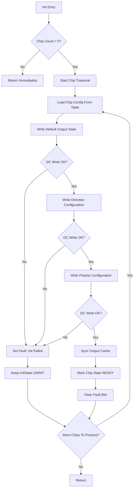
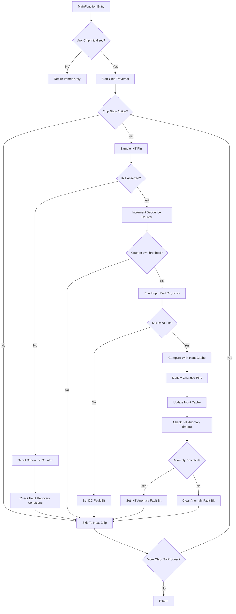
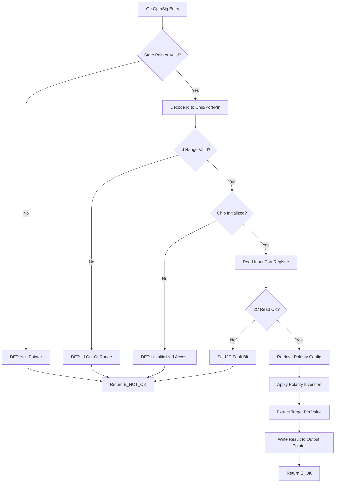
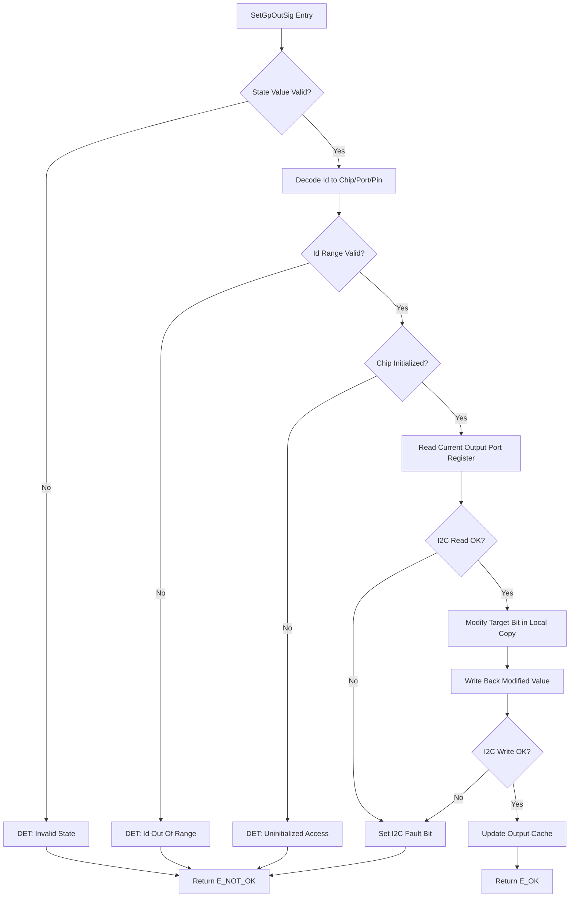
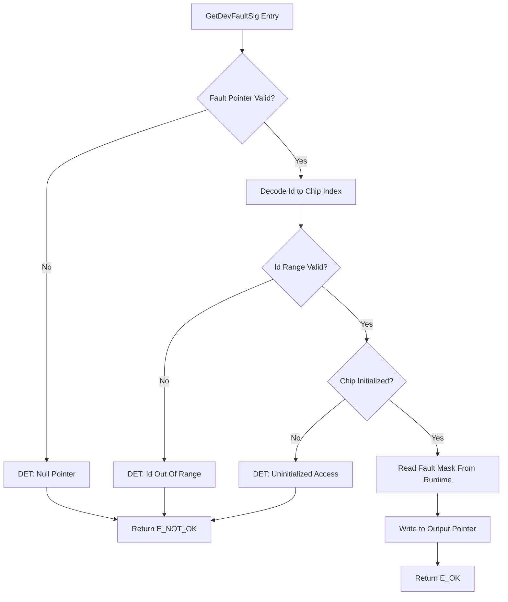
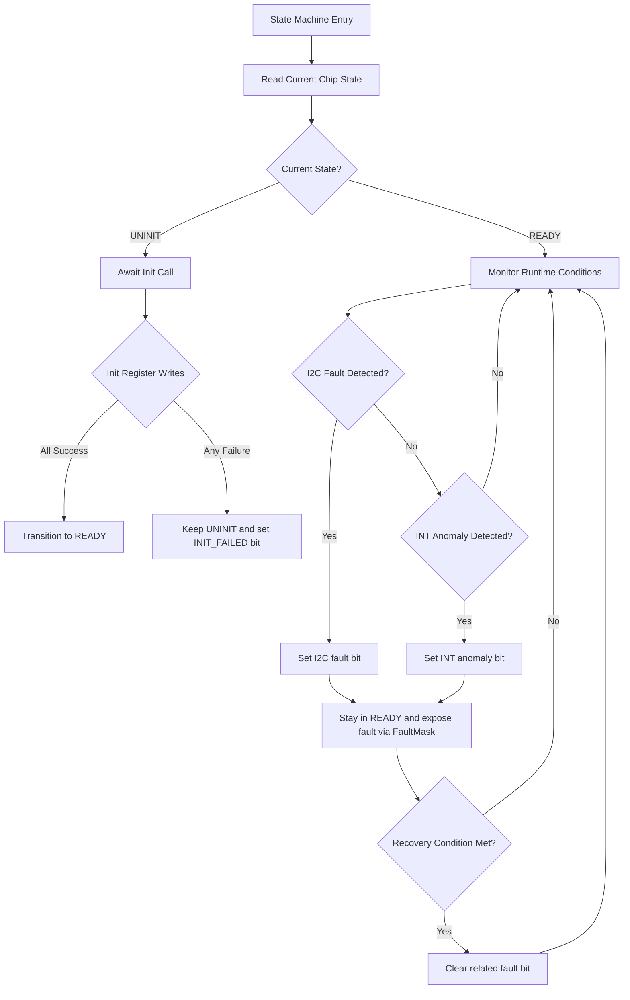
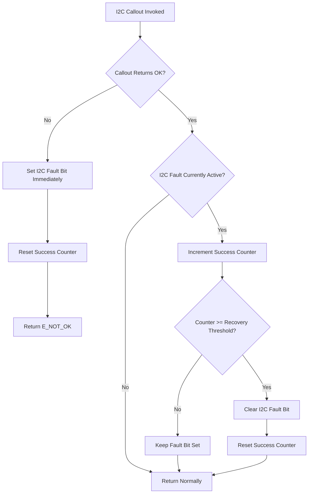
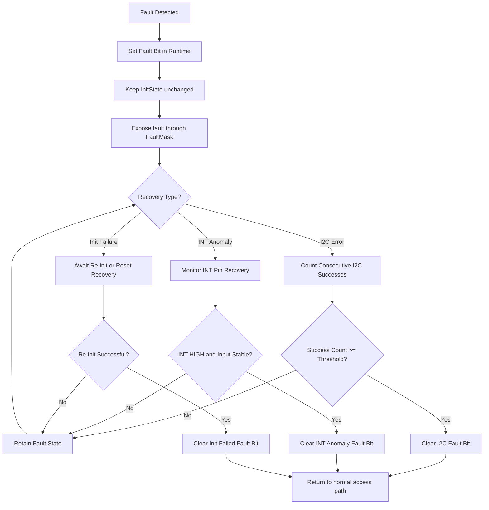

# 《Gp_NCA95yy 详细设计》

**Gp_NCA95yy_Detailed Design**

项目编号/Project number: Gp_NCA95yy
保密性/Security: **内部使用**

**Document Properties**
Status: **Draft**
详细设计版本: **V1**
详细设计状态: **Draft**
输出模式: **Formal Draft**
生成时间: 2026-05-23

---

## 文档修订记录

| 版本 | 日期 | 作者 | 变更说明 | 状态 |
| --- | --- | --- | --- | --- |
| V1 | 2026-05-23 | AI-generated | 初版生成，基于 SRS V1 Draft + Arch V1 Draft | Draft |

---

## 1. FC概述

- **FC名称**: `Gp_NCA95yy`
- **当前软件层级**: IoExtDev (ECU Abstraction Layer)
- **核心职责**: 封装 NCA9539-Q1 16-bit I2C GPIO 扩展器芯片驱动，提供引脚级 GPIO 读写、中断检测和故障诊断。通过配置表管理最多 4 片同总线芯片实例；通过 I2C Callout 抽象底层通信；通过 MainFunction 周期性检测 INT 中断。
- **运行模型**: 同步外部接口 + 周期 MainFunction；无异步回调，无中断 ISR。
- **单核/多核**: 单核独立部署（per-core 配置和运行态，核间无共享状态）。每个核独立管理其配置的芯片实例。
- **设计思路**: 对外提供语义化读写接口 + 故障查询接口；内部以 per-chip 运行态容器统一管理芯片状态/缓存/故障；Init 做全量寄存器初始化，MainFunction 做 INT 采样和输入变化检测；所有对外接口入口统一 DET 检查。
- **Id 编码约定** (假设，待项目确认): `Id_u16` 采用 [ChipIdx:2][PortIdx:1][PinIdx:3] 紧凑编码，位布局如下：

| 位段 | 位范围 | 含义 | 有效值 |
| --- | --- | --- | --- |
| ChipIdx | [7:6] | 芯片实例索引 | 0..3 |
| PortIdx | [5] | Port 选择 | 0=Port0, 1=Port1 |
| PinIdx | [2:0] | 引脚索引 | 0..7 |
| Reserved | [15:8] | 保留（多核场景用于 Core ID） | 0 |

---

## 2. 设计输入

| 输入类型 | 文档 | 版本 | 用途 |
| --- | --- | --- | --- |
| 需求文档 | `artifacts/srs_Gp_NCA95yy.md` | Draft | 功能需求、接口需求、配置需求、诊断需求、时序需求 |
| 架构文档 | `artifacts/arch_Gp_NCA95yy.md` | V1 Draft | 外部接口定义、依赖接口定义、配置宏、MemMap、文件列表 |
| 芯片手册 | NCA9539-Q1 Datasheet Rev1.0 (Novosense) | Rev1.0 | 寄存器地址、位定义、I2C 时序、电气特性 |
| 平台规则 | AURIX2G 平台规范经验库 | — | 接口命名、MainFunction 规则、状态机模式 |

---

## 3. 假设与待确认项

| 索引 | 类别 | 内容 | 影响范围 |
| --- | --- | --- | --- |
| A1 | 假设 | 运行时方向/极性修改默认关闭，仅 Init 阶段生效。 | `SetGpDirection`/`SetGpPolarity` 接口条件编译。 |
| A2 | 假设 | RESET 引脚不由本模块控制，由硬件或上层复位管理模块处理。 | 复位恢复仅通过 MainFunction 内部检测触发，无外部 Reset API。 |
| A3 | 假设 | INT 引脚通过 `CalloutReadDio` 读取；若项目已有标准 IoExtDev INT 机制，Callout 形式需调整。 | MainFunction INT 采样路径。 |
| A4 | 假设 | 中断事件通过 `MainFunction` 更新内部状态缓存 + `GetDevFaultSig` 暴露异常，上层轮询读取。 | 无独立回调注册机制。 |
| A5 | 假设 | I2C 故障恢复阈值为连续 3 次成功通信。 | `FaultConfirm` 内部逻辑。 |
| A6 | 假设 | 单核独立部署，不同核不共享 I2C 总线或芯片实例。 | per-core 运行态和配置表，无跨核同步点。 |
| A7 | 待确认 | 去抖时间单位（MainFunction 周期数 vs 毫秒）。 | `DebounceCounter` 阈值来源。 |
| A8 | 待确认 | MainFunction 调用周期精确值。 | 去抖绝对时间计算。 |

---

## 4. 实现总策略

### 4.1 代码组织策略

- 所有外部接口集中在 `Gp_NCA95yy.c` / `Gp_NCA95yy.h`
- 内部 `static` 函数按职责分组：Id 解码、寄存器读写、RMW 位操作、故障管理、DET 检查
- `Gp_NCA95yy_Internal.h` 仅在需要跨 `.c` 共享内部符号时创建

### 4.2 cfg 与 runtime 分界

| 类别 | 存储位置 | 可变性 | 示例 |
| --- | --- | --- | --- |
| 配置宏 | `Gp_NCA95yy_Cfg.h` | 编译期固定 | `GP_NCA95YY_CFG_DEV_ERROR_DETECT` |
| 配置常量表 | `Gp_NCA95yy_Cfg.c` / `Gp_NCA95yy_CfgData.h` | 编译期固定，const | I2C 地址表、默认方向/输出/极性表、中断使能表 |
| 运行态变量 | `Gp_NCA95yy.c` (static) | 运行时变化 | InitState, InputCache, FaultMask 等 |

### 4.3 callout 策略

- I2C 读写：通过 `CalloutI2cWrite` / `CalloutI2cRead` 抽象，由 Project Adaptation 层实现
- INT 引脚读取：通过 `CalloutReadDio` 抽象（Conditional）
- DET ReportError：由平台提供（标准 AUTOSAR `Det_ReportError`），不作为 Callout

### 4.4 DET 与 fault 分界

| 类别 | 触发条件 | 返回策略 | 记录方式 |
| --- | --- | --- | --- |
| DET | API 参数非法、空指针、未初始化、Id 越界 | 返回 `E_NOT_OK` | `Det_ReportError` |
| Runtime Fault | I2C NACK/超时、INT 持续异常 | 返回 `E_NOT_OK` + 更新 FaultMask | `GetDevFaultSig` 可读 |

### 4.5 MemMap 策略

- CODE: `GP_NCA95YY_CODE_START/STOP`
- RUNTIME RAM: `GP_NCA95YY_CLEAR_FAR_DATA_ALIGN4_COREx_START/STOP`（per-core，上电清零）
- CONST PER-CORE: `GP_NCA95YY_CONST_FAR_DATA_ALIGN4_COREx_START/STOP`（配置表，per-core）
- 无 NO_CLEAR 段，无 NEAR 段，无 CALIB 段

---

## 5. 文件列表设计

| 文件名 | 必需/可选 | 职责 | 关键内容 |
| --- | --- | --- | --- |
| `Gp_NCA95yy.c` | 必需 | 模块主实现文件。 | 5 个外部接口实现 + 全部内部 `static` 函数 + per-chip 运行态容器定义。 |
| `Gp_NCA95yy.h` | 必需 | 对外接口头文件。 | 外部 API 原型声明；`GP_NCA95YY_CODE_START/STOP` 宏引用。 |
| `Gp_NCA95yy_Types.h` | 必需 | 类型定义头文件。 | `Gp_NCA95yy_ChipStateType`（状态枚举）、`Gp_NCA95yy_FaultMaskType`（故障位定义）、`Gp_NCA95yy_RuntimeContainerType`（per-chip 运行态结构体）、`Gp_NCA95yy_CfgTableType`（配置表结构体）。 |
| `Gp_NCA95yy_Cfg.h` | 必需 | 配置宏头文件。 | `GP_NCA95YY_CFG_DEV_ERROR_DETECT`、版本宏、`GP_NCA95YY_CFG_RUNTIME_DIRECTION_CHANGE`、`GP_NCA95YY_CFG_RUNTIME_POLARITY_CHANGE`、`GP_NCA95YY_MULTI_CHIP_NUM`。 |
| `Gp_NCA95yy_Cfg.c` | 必需 | 配置数据实现文件。 | Per-core 配置表常量定义：芯片 I2C 地址表、默认方向表、默认输出表、默认极性表、中断使能表、去抖阈值表。 |
| `Gp_NCA95yy_CfgData.h` | 必需 | 配置数据声明头文件。 | 配置表 `extern` 声明；配置结构体类型引用。 |
| `Gp_NCA95yy_Reg.h` | 必需 | 寄存器定义头文件。 | NCA9539-Q1 Command Byte 地址宏（`NCA9539_REG_INPUT_PORT0` ~ `NCA9539_REG_CONFIG1`）、位掩码、I2C 地址枚举、寄存器上电默认值宏。 |
| `Gp_NCA95yy_Callout.h` | 必需 | Callout 接口头文件。 | `CalloutI2cWrite`、`CalloutI2cRead`、`CalloutReadDio` 原型。 |
| `Gp_NCA95yy_Callout.c` | 必需 | Callout 实现桩文件。 | 项目适配层 I2C 事务绑定、INT DIO 路由实现或集成说明。 |
| `Gp_NCA95yy_MemMap.h` | 必需 | MemMap 段映射头文件。 | 所有段宏的 `START/STOP` 定义。 |

---

## 6. 单核/多核框架设计

### 6.1 核模型

| Core | 职责 | Init 入口 | 周期任务 | 共享对象 |
| --- | --- | --- | --- | --- |
| Core[x] | 管理当前核配置的全部芯片实例。 | `Gp_NCA95yy_Init` | `Gp_NCA95yy_MainFunction`（由上层任务周期调用） | 无跨核共享对象。 |

### 6.2 任务模型

| Task | Core | 周期 | 优先级类别 | 调用对象 | 监控动作 |
| --- | --- | --- | --- | --- | --- |
| 待项目定义 | Core[x] | 待项目确认（建议 1-10ms） | 待项目定义 | `Gp_NCA95yy_MainFunction` | INT 引脚采样 + 输入变化识别 + 中断异常监控 |

### 6.3 同步点与共享对象

无跨核共享对象。每个核的 `Init` 和 `MainFunction` 仅操作本核配置的芯片实例和本核运行态容器。

---

## 7. 外部接口设计

### 7.1 `Gp_NCA95yy_Init`

| Interface Prototype | Description | Sync/Async | Reentrancy | Return Value | Basic Constraints |
| --- | --- | --- | --- | --- | --- |
| `void Gp_NCA95yy_Init(void)` | Initializes all configured chip instances on the current core: for each chip, writes the default direction, output level, and polarity inversion values from the configuration table to the chip registers and transitions the chip to the READY state. | Synchronous | Non-reentrant | `void` | Configuration table must be valid and linked. Underlying I2C driver must be initialized. |

#### 7.1.1 子功能拆分

| 步骤 | 子功能 | 输入 | 输出 | 关键检查/约束 | 依赖对象 |
| --- | --- | --- | --- | --- | --- |
| 1 | 获取芯片数量 | `GP_NCA95YY_MULTI_CHIP_NUM` (macro) | `chipCount` | 若为 0，直接返回。 | `Gp_NCA95yy_Cfg.h` |
| 2 | 遍历每片芯片 | `chipIndex = 0..chipCount-1` | — | — | — |
| 3 | 写 Configuration 寄存器 | `cfgTable[chipIndex].defaultDirection[2]` | 芯片 Configuration 寄存器更新 | I2C 写失败 → 标记 INIT_FAILED，继续下一个芯片（不阻断其他芯片）。 | `CalloutI2cWrite` |
| 4 | 写 Output Port 寄存器 | `cfgTable[chipIndex].defaultOutput[2]` | 芯片 Output Port 寄存器更新 | 先写默认输出值，再写方向（避免输出 Glitch）。 | `CalloutI2cWrite` |
| 5 | 写 Polarity Inversion 寄存器 | `cfgTable[chipIndex].defaultPolarity[2]` | 芯片 Polarity 寄存器更新 | — | `CalloutI2cWrite` |
| 6 | 更新运行态 | — | `runtime[chipIndex].InitState = READY`；初始化 OutputCache/DirectionCache/PolarityCache | — | Runtime container |
| 7 | 读回验证（可选） | — | 读回寄存器与配置表比对 | 不一致 → 标记 FAULT。可由 `GP_NCA95YY_CFG_REG_READBACK_VERIFY_ENABLE` 控制。 | `CalloutI2cRead` |

#### 7.1.2 执行步骤

1. 从 `GP_NCA95YY_MULTI_CHIP_NUM` 获取当前核芯片数量；若为 0，直接返回。
2. 对 `chipIndex = 0` 到 `chipCount - 1`，依次执行：
   a. 从配置表读取该芯片的 I2C 地址、默认输出值（Port 0/1）、默认方向（Port 0/1）、默认极性（Port 0/1）。
   b. 调用 `CalloutI2cWrite` 写入 Output Port 0/1 寄存器（先出后方向）。
   c. 调用 `CalloutI2cWrite` 写入 Configuration Port 0/1 寄存器。
   d. 调用 `CalloutI2cWrite` 写入 Polarity Inversion Port 0/1 寄存器。
   e. 更新 `runtime[chipIndex].OutputCache`、`DirectionCache`、`PolarityCache`。
   f. 设置 `runtime[chipIndex].InitState = READY`。
   g. 若任一步骤 I2C 写入失败：设置 `runtime[chipIndex].FaultMask` 中 `INIT_FAILED` 位；`InitState` 保持 `UNINIT`；记录故障但不阻断后续芯片。
3. 所有芯片遍历完成后返回。

#### 7.1.3 参与内部函数

| 内部函数 | 作用 | 调用时机 |
| --- | --- | --- |
| `Gp_NCA95yy_Prv_InitChip(uint8 chipIndex)` | 初始化单个芯片：写寄存器 + 更新运行态。 | Init 主循环对每芯片调用。 |
| `Gp_NCA95yy_Prv_WriteChipRegs(uint8 chipIndex, const uint8* dirs, const uint8* outs, const uint8* pols)` | 按顺序写 Output / Config / Polarity 寄存器对。 | `InitChip` 调用。 |
| `Gp_NCA95yy_Prv_UpdateFaultState(uint8 chipIndex, uint32 faultBit, boolean faultActive)` | 统一记录/清除初始化失败和运行时故障。 | 初始化写失败或恢复时。 |

#### 7.1.4 流程图



---

### 7.2 `Gp_NCA95yy_MainFunction`

| Interface Prototype | Description | Sync/Async | Reentrancy | Return Value | Basic Constraints |
| --- | --- | --- | --- | --- | --- |
| `void Gp_NCA95yy_MainFunction(void)` | Periodic drive function: samples the INT pin state for each initialized chip, evaluates pending interrupt conditions, reads Input Port registers to identify changed input pins, and monitors interrupt anomaly (INT stuck low). | Synchronous | Non-reentrant | `void` | Must be called periodically. Returns immediately if no chip is initialized. |

#### 7.2.1 子功能拆分

| 步骤 | 子功能 | 输入 | 输出 | 关键检查/约束 | 依赖对象 |
| --- | --- | --- | --- | --- | --- |
| 1 | 遍历已初始化芯片 | `runtime[].InitState == READY` | — | 跳过 UNINIT 芯片。 | Runtime container |
| 2 | 采样 INT 引脚 | `chipIndex` | INT 引脚电平 (0/1) | INT 为低有效。 | `CalloutReadDio` |
| 3 | INT 状态评估 | INT 电平 + 中断使能 + `runtime[].InputCache` | 是否需读 Input Port | INT=LOW 且中断使能 → 进入中断处理。 | Config table (中断使能) |
| 4 | 读 Input Port 寄存器 | `chipIndex` | Port 0/1 当前输入值 | 读取后芯片硬件自动清除 INT。 | `CalloutI2cRead` |
| 5 | 输入变化识别 | 当前 Input Port vs `runtime[].InputCache` | 变化的 pin 位图 | 仅对配置为输入的 pin 有意义。 | `runtime[].DirectionCache` |
| 6 | 更新输入缓存 | 当前 Input Port 值 | `runtime[].InputCache` | — | Runtime container |
| 7 | 中断异常监控 | INT 持续有效 + debounce 计数器 | `FaultMask` INT_ANOMALY 位 | INT=LOW 且读 Input Port 后未恢复 → 计数累加 → 超阈值置故障。 | Runtime container |
| 8 | 芯片复位恢复检测 | 寄存器 vs 缓存不一致 | 触发内部恢复 | 可选，由配置宏控制。 | Runtime container + `CalloutI2cRead` |

#### 7.2.2 执行步骤

1. 遍历 `chipIndex = 0..chipCount-1`，若 `runtime[chipIndex].InitState != READY` 则跳过。
2. 若该芯片中断禁用，跳过 INT 采样。
3. 调用 `CalloutReadDio` 读取 INT 引脚电平。
4. 若 INT == LOW：
   a. 递增 `debounceCounter`。
   b. 若 `debounceCounter >= debounceThreshold`（中断使能且 INT 持续有效），调用 `CalloutI2cRead` 读取 Input Port 0 和 Port 1。
   c. 与 `InputCache` 比较，识别变化 pin；更新 `InputCache`。
   d. 若 I2C 读成功，芯片硬件自动清除 INT，`debounceCounter` 清零。
   e. 若 I2C 读失败 → 标记 I2C_COMM_ERROR 故障；保持 `debounceCounter` 待下周期重试。
5. 若 INT == HIGH：
   a. `debounceCounter` 清零。
6. 若 `debounceCounter > anomalyThreshold`（INT 持续有效且读回 Input Port 后仍不恢复）→ 标记 INT_ANOMALY 故障位。
7. 可选：读回 Configuration 寄存器与 `DirectionCache` 比对，不一致则触发内部恢复（假设 A2 下，记录异常但不主动复位芯片）。

#### 7.2.3 参与内部函数

| 内部函数 | 作用 | 调用时机 |
| --- | --- | --- |
| `Gp_NCA95yy_Prv_SampleInt(uint8 chipIndex)` | 读取指定芯片 INT 引脚状态。 | 每芯片每周期。 |
| `Gp_NCA95yy_Prv_HandleInt(uint8 chipIndex)` | 完成一次中断处理：读取 Input Port、比较缓存、更新输入缓存。 | INT 去抖确认后。 |
| `Gp_NCA95yy_Prv_UpdateFaultState(uint8 chipIndex, uint32 faultBit, boolean faultActive)` | 统一记录/清除 I2C 通信故障和 INT 异常故障。 | 故障检测和恢复时。 |

#### 7.2.4 流程图



---

### 7.3 `Gp_NCA95yy_GetGpInSig`

| Interface Prototype | Description | Sync/Async | Reentrancy | Return Value | Basic Constraints |
| --- | --- | --- | --- | --- | --- |
| `Std_ReturnType Gp_NCA95yy_GetGpInSig(uint16 Id_u16, uint8* State_pu8)` | Reads the input state of the specified GPIO pin: resolves Id to chip/port/pin, reads the Input Port register via I2C, applies polarity inversion, and returns the logical pin state. | Synchronous | Reentrant | `E_OK` on success; `E_NOT_OK` on failure. | `State_pu8` must be non-null. |

#### 7.3.1 子功能拆分

| 步骤 | 子功能 | 输入 | 输出 | 关键检查/约束 | 依赖对象 |
| --- | --- | --- | --- | --- | --- |
| 1 | 统一访问检查 | `Id_u16`, `State_pu8` | 检查结果 + `chipIndex`, `port`, `pin` | 指针非空；Id 合法；芯片已初始化。 | Access checker |
| 2 | 读 Input Port 寄存器 | `chipIndex`, `port` | 8-bit 寄存器原始值 | I2C 失败 → 返回 E_NOT_OK。 | `CalloutI2cRead` |
| 3 | 极性反转 | raw bit + `runtime[].PolarityCache[port]` bit | 逻辑值 (0/1) | XOR: `(raw >> pin) ^ (pol >> pin) & 0x01`。 | Runtime container |
| 4 | 输出结果 | 逻辑值 | `*State_pu8 = 逻辑值` | — | — |

#### 7.3.2 执行步骤

1. `Prv_CheckAccess(Id_u16, State_pu8, GP_NCA95YY_API_GET_INPUT, &chipIndex, &port, &pin)`。
2. 若访问检查失败：记录 DET 错误并返回 `E_NOT_OK`。
3. `CalloutI2cRead(i2cAddr, REG_INPUT_PORT[port], &rawValue, 1)` → I2C 读单字节。
4. 若 I2C 失败 → `Prv_UpdateFaultState(chipIndex, I2C_COMM_ERROR, TRUE)` + return `E_NOT_OK`。
5. `polInvert = (runtime[chipIndex].PolarityCache[port] >> pin) & 0x01`。
6. `logicalValue = ((rawValue >> pin) & 0x01) ^ polInvert`。
7. `*State_pu8 = (uint8)logicalValue`；return `E_OK`。

#### 7.3.3 参与内部函数

| 内部函数 | 作用 | 调用时机 |
| --- | --- | --- |
| `Gp_NCA95yy_Prv_CheckAccess(...)` | 统一完成 Id 解码、指针检查、初始化检查和参数范围检查。 | 接口入口。 |
| `Gp_NCA95yy_Prv_ReadRegister(...)` | 通用寄存器读取，封装 I2C Callout。 | Input Port 读取。 |
| `Gp_NCA95yy_Prv_UpdateFaultState(...)` | 统一记录/清除 I2C 故障。 | I2C 失败或恢复时。 |

#### 7.3.4 流程图



---

### 7.4 `Gp_NCA95yy_SetGpOutSig`

| Interface Prototype | Description | Sync/Async | Reentrancy | Return Value | Basic Constraints |
| --- | --- | --- | --- | --- | --- |
| `Std_ReturnType Gp_NCA95yy_SetGpOutSig(uint16 Id_u16, uint8 State_u8)` | Sets the output level of the specified GPIO pin using a read-modify-write sequence. | Synchronous | Reentrant | `E_OK` on success; `E_NOT_OK` on failure. | `State_u8` must be 0 or 1. On failure, the hardware register is not modified. |

#### 7.4.1 子功能拆分

| 步骤 | 子功能 | 输入 | 输出 | 关键检查/约束 | 依赖对象 |
| --- | --- | --- | --- | --- | --- |
| 1 | 统一访问检查 | `Id_u16`, `State_u8` | 检查结果 + `chipIndex`, `port`, `pin` | Id 合法；芯片已初始化；`State_u8 ∈ {0,1}`。 | Access checker |
| 2 | 读改写 Output Port | `chipIndex`, `port`, `pin`, `State_u8` | 新寄存器值 | 同 port 其他 bit 不变；I2C 失败返回 `E_NOT_OK`。 | `CalloutI2cRead` / `CalloutI2cWrite` |
| 3 | 更新输出缓存 | `newValue` | `runtime[].OutputCache[port]` | 仅在写回成功后更新。 | Runtime container |

#### 7.4.2 执行步骤

1. `Prv_CheckAccess(Id_u16, &State_u8, GP_NCA95YY_API_SET_OUTPUT, &chipIndex, &port, &pin)`。
2. 若访问检查失败：记录 DET 错误并返回 `E_NOT_OK`。
3. `Prv_RmwWriteOutput(chipIndex, port, pin, State_u8, &newValue)`。
4. 若 RMW 序列失败：`Prv_UpdateFaultState(chipIndex, I2C_COMM_ERROR, TRUE)` + return `E_NOT_OK`。
5. `runtime[chipIndex].OutputCache[port] = newValue`。
6. return `E_OK`。

#### 7.4.3 参与内部函数

| 内部函数 | 作用 | 调用时机 |
| --- | --- | --- |
| `Gp_NCA95yy_Prv_CheckAccess(...)` | 统一完成 Id 解码、初始化检查和参数范围检查。 | 接口入口。 |
| `Gp_NCA95yy_Prv_RmwWriteOutput(...)` | 完整输出读改写序列。 | 输出写入核心逻辑。 |
| `Gp_NCA95yy_Prv_UpdateFaultState(...)` | 统一记录/清除 I2C 故障。 | I2C 失败或恢复时。 |

#### 7.4.4 流程图



---

### 7.5 `Gp_NCA95yy_GetDevFaultSig`

| Interface Prototype | Description | Sync/Async | Reentrancy | Return Value | Basic Constraints |
| --- | --- | --- | --- | --- | --- |
| `Std_ReturnType Gp_NCA95yy_GetDevFaultSig(uint16 Id_u16, uint32* Fault_pu32)` | Returns the current fault and diagnostic status for the specified chip instance as a bit-mask. | Synchronous | Reentrant | `E_OK` on success; `E_NOT_OK` on failure. | `Fault_pu32` must be non-null. |

#### 7.5.1 子功能拆分

| 步骤 | 子功能 | 输入 | 输出 | 关键检查/约束 | 依赖对象 |
| --- | --- | --- | --- | --- | --- |
| 1 | 统一访问检查 | `Id_u16`, `Fault_pu32` | 检查结果 + `chipIndex` | 指针非空；Id 合法；芯片已初始化。 | Access checker |
| 2 | 读取 FaultMask | `chipIndex` | `runtime[].FaultMask` | — | Runtime container |
| 3 | 输出结果 | `FaultMask` | `*Fault_pu32 = FaultMask` | — | — |

#### 7.5.2 执行步骤

1. `Prv_CheckAccess(Id_u16, Fault_pu32, GP_NCA95YY_API_GET_FAULT, &chipIndex, NULL_PTR, NULL_PTR)`。
2. 若访问检查失败：记录 DET 错误并返回 `E_NOT_OK`。
3. `*Fault_pu32 = runtime[chipIndex].FaultMask`。
4. return `E_OK`。

#### 7.5.3 流程图



---

## 8. 内部函数设计

| 函数名 | 类别 | 作用域 | 职责 | 触发点 | 归并理由 |
| --- | --- | --- | --- | --- | --- |
| `Gp_NCA95yy_Prv_CheckAccess` | 访问检查 | `static` | 统一完成 Id 解码、指针检查、初始化检查和参数范围检查，并在失败时记录 DET。 | 所有非 Init 外部接口入口。 | 合并原 `DecodeId`、`CheckInit`、`CheckPtr`、`CheckIdRange`、`CheckStateRange`，减少低价值小函数和重复验证路径。 |
| `Gp_NCA95yy_Prv_InitChip` | 初始化 | `static` | 初始化单个芯片，调用寄存器写入并同步运行态缓存。 | `Init` 主循环。 | 保留芯片级完整动作，避免把初始化写序列切得过碎。 |
| `Gp_NCA95yy_Prv_WriteChipRegs` | 寄存器写入 | `static` | 按既定顺序写 Output / Config / Polarity 寄存器。 | `InitChip`。 | 归并初始化期间连续寄存器写动作。 |
| `Gp_NCA95yy_Prv_ReadRegister` | 寄存器访问 | `static` | 通用 I2C 读寄存器封装。 | `GetGpInSig`、`MainFunction`、输出 RMW 读阶段。 | 保留统一寄存器读路径，避免每个接口重复展开 Callout 处理。 |
| `Gp_NCA95yy_Prv_WriteRegister` | 寄存器访问 | `static` | 通用 I2C 写寄存器封装。 | `Init`、`SetGpOutSig`。 | 保留统一寄存器写路径。 |
| `Gp_NCA95yy_Prv_RmwWriteOutput` | 输出处理 | `static` | 执行 Output Port 的读改写序列并返回新值。 | `SetGpOutSig`。 | 以一个中颗粒函数承载完整输出写动作，避免拆成读/改/写多个微函数。 |
| `Gp_NCA95yy_Prv_HandleInt` | 中断处理 | `static` | 读 Input Port、比较缓存、识别变化并更新缓存。 | `MainFunction` INT 确认后。 | 归并中断处理主动作，避免“采样/比较/更新”过度拆散。 |
| `Gp_NCA95yy_Prv_UpdateFaultState` | 故障处理 | `static` | 统一记录或清除故障位，并维护必要的恢复计数。 | 初始化失败、I2C 失败、INT 异常、恢复路径。 | 合并原 `MarkFault`、`ClearFault`、`ConfirmFault`，降低验证面。 |

### 8.1 关键控制流归并说明

- `DET` 相关逻辑不再拆成多个细粒度 `Check*` 函数，而由 `Gp_NCA95yy_Prv_CheckAccess` 统一承载。
- 故障处理不再拆成 `Mark` / `Clear` / `Confirm` 三个以上小函数，而由 `Gp_NCA95yy_Prv_UpdateFaultState` 统一承载。
- `SetGpOutSig` 的输出写入动作保持为一个完整的 `RMW` 内部函数，避免把读、改、写拆成多个低复用 helper。
- `MainFunction` 的中断处理保持为一个完整的 `HandleInt` 动作，不再把缓存比较、变化识别和缓存更新拆成多个微函数。

### 8.2 与外部接口的关联

| 内部函数 | 关联外部接口 | 关联依赖接口 |
| --- | --- | --- |
| `Gp_NCA95yy_Prv_CheckAccess` | `GetGpInSig`, `SetGpOutSig`, `GetDevFaultSig` | `Det_ReportError`（平台） |
| `Gp_NCA95yy_Prv_InitChip` | `Init` | `Gp_NCA95yy_CalloutI2cWrite` |
| `Gp_NCA95yy_Prv_WriteChipRegs` | `Init` | `Gp_NCA95yy_CalloutI2cWrite` |
| `Gp_NCA95yy_Prv_ReadRegister` | `GetGpInSig`, `MainFunction`, `SetGpOutSig` | `Gp_NCA95yy_CalloutI2cRead` |
| `Gp_NCA95yy_Prv_WriteRegister` | `Init`, `SetGpOutSig` | `Gp_NCA95yy_CalloutI2cWrite` |
| `Gp_NCA95yy_Prv_RmwWriteOutput` | `SetGpOutSig` | `Gp_NCA95yy_CalloutI2cRead`, `Gp_NCA95yy_CalloutI2cWrite` |
| `Gp_NCA95yy_Prv_HandleInt` | `MainFunction` | `Gp_NCA95yy_CalloutI2cRead` |
| `Gp_NCA95yy_Prv_UpdateFaultState` | `Init`, `MainFunction`, `GetGpInSig`, `SetGpOutSig` | — |

---

## 9. 依赖接口与Callout设计

### 9.1 `Gp_NCA95yy_CalloutI2cWrite`

| Interface Prototype | Description | Implemented By | Sync/Async | Reentrancy | Basic Constraints | 关联接口 |
| --- | --- | --- | --- | --- | --- | --- |
| `Std_ReturnType Gp_NCA95yy_CalloutI2cWrite(uint8 Addr_u8, uint8 Reg_u8, const uint8* Data_pcu8, uint16 Size_u16)` | Writes `Size_u16` bytes starting from register `Reg_u8` to the I2C device at address `Addr_u8`. | Project Adaptation / IoExtDev | Synchronous | Reentrant | `Addr_u8` is 7-bit I2C address. `Reg_u8` is the Command Byte. `Data_pcu8` must be non-null. `Size_u16` is 1 or 2. | `Prv_WriteRegister`, `Prv_WriteChipRegs`, `Prv_RmwWriteOutput` |

### 9.2 `Gp_NCA95yy_CalloutI2cRead`

| Interface Prototype | Description | Implemented By | Sync/Async | Reentrancy | Basic Constraints | 关联接口 |
| --- | --- | --- | --- | --- | --- | --- |
| `Std_ReturnType Gp_NCA95yy_CalloutI2cRead(uint8 Addr_u8, uint8 Reg_u8, uint8* Data_pu8, uint16 Size_u16)` | Reads `Size_u16` bytes starting from register `Reg_u8` from the I2C device at address `Addr_u8`. | Project Adaptation / IoExtDev | Synchronous | Reentrant | `Data_pu8` must be non-null. `Size_u16` is 1 or 2. | `Prv_ReadRegister`, `Prv_HandleInt`, `Prv_RmwWriteOutput` |

### 9.3 `Gp_NCA95yy_CalloutReadDio`

| Interface Prototype | Description | Implemented By | Sync/Async | Reentrancy | Basic Constraints | 关联接口 |
| --- | --- | --- | --- | --- | --- | --- |
| `Std_ReturnType Gp_NCA95yy_CalloutReadDio(uint16 Id_u16, uint8* State_pu8)` | Reads the logical state of the INT pin for the chip instance identified by `Id_u16`. Returns the raw MCU GPIO state (0 = LOW, 1 = HIGH). | IoMcu / Project Adaptation | Synchronous | Reentrant | `Id_u16` resolves to the chip whose INT pin is to be read. `State_pu8` must be non-null. | `Prv_SampleInt`, `MainFunction` |

---

## 10. 内部控制流摘要

### 10.1 统一访问检查控制流

| 步骤 | 子功能 | 调用函数 | 输入/读取 | 输出/写入 | 说明 |
| --- | --- | --- | --- | --- | --- |
| 1 | 解码并检查 Id | `Prv_CheckAccess` | `Id_u16` | `chipIndex`, `port`, `pin` | 完成 Id 解析和合法性检查。 |
| 2 | 检查指针/参数 | `Prv_CheckAccess` | 输出指针或 `State_u8` | 访问检查结果 | 仅对当前接口需要的参数进行检查。 |
| 3 | 检查初始化状态 | `Prv_CheckAccess` | `InitState` | 访问检查结果 | `Init` 之外的接口统一在此检查。 |
| 4 | 记录 DET | `Prv_CheckAccess` | 失败原因 | `Det_ReportError` | 失败即统一上报并返回。 |

### 10.2 I2C 故障处理控制流

| 步骤 | 子功能 | 调用函数 | 输入/读取 | 输出/写入 | 说明 |
| --- | --- | --- | --- | --- | --- |
| 1 | 调用寄存器访问 | `Prv_ReadRegister` / `Prv_WriteRegister` / `Prv_RmwWriteOutput` | Callout 返回值 | I2C 成功/失败结果 | 通用寄存器访问函数不再内部分裂故障处理。 |
| 2 | 更新故障位 | `Prv_UpdateFaultState` | 故障位 + active 标志 | `FaultMask`、恢复计数 | 一个函数统一完成置位、清位和恢复计数维护。 |

---

## 11. 状态机设计

### 11.1 状态定义

| 状态名 | 枚举值 | 含义 | 进入条件 | 退出条件 |
| --- | --- | --- | --- | --- |
| `UNINIT` | `0` | 芯片未初始化。 | 上电默认 / Init 失败。 | `Init` 成功完成。 |
| `READY` | `1` | 芯片已初始化，可正常操作。 | `Init` 所有寄存器写入成功。 | 重新初始化失败或项目定义的严重错误。 |

> 注：本设计不再将 `FAULT` 作为独立主状态处理。实际实现推荐使用 `InitState`（UNINIT/READY）+ `FaultMask`（各故障位）组合表达；运行时故障通过 `FaultMask` 反映，而不额外引入第三主状态。

### 11.2 状态切换表

| 当前 InitState | 条件函数 | 动作函数 | 下一 InitState | 备注 |
| --- | --- | --- | --- | --- |
| `UNINIT` | `Prv_InitChip` 全部寄存器写成功 | 更新 caches，清 FaultMask | `READY` | 正常初始化路径 |
| `UNINIT` | `Prv_InitChip` 任一寄存器写失败 | `Prv_UpdateFaultState` 置 `INIT_FAILED` | `UNINIT` | 初始化失败但不提升为独立主状态 |
| `READY` | 任意 I2C 操作失败 | `Prv_UpdateFaultState` 置 `I2C_COMM_ERROR` | `READY` | 运行时通信故障通过 `FaultMask` 表达 |
| `READY` | INT 持续有效超时 | `Prv_UpdateFaultState` 置 `INT_ANOMALY` | `READY` | 中断异常通过 `FaultMask` 表达 |
| `READY` | 故障恢复条件满足 | `Prv_UpdateFaultState` 清故障位 | `READY` | 不改变主状态 |
| 任意 | 芯片硬件复位 (RESET/POR) | 待检测 → 重新初始化 | `UNINIT` | 硬件复位路径 |

### 11.3 状态机主流程图



---

## 12. DET设计

| 检查点 | 触发条件 | 记录方式 | 返回策略 | 适用API |
| --- | --- | --- | --- | --- |
| `Prv_CheckAccess - InitState` | `runtime[chipIndex].InitState != READY` | `Det_ReportError(ModuleId, chipIndex, ApiId, ERR_UNINIT)` | `E_NOT_OK` | `GetGpInSig`, `SetGpOutSig`, `GetDevFaultSig` |
| `Prv_CheckAccess - Ptr` | 输出指针为 `NULL` | `Det_ReportError(ModuleId, 0, ApiId, ERR_NULL_PTR)` | `E_NOT_OK` | `GetGpInSig`, `GetDevFaultSig` |
| `Prv_CheckAccess - Id` | chipIndex >= chipCount 或 port > 1 或 pin > 7 | `Det_ReportError(ModuleId, chipIndex, ApiId, ERR_INV_ID)` | `E_NOT_OK` | `GetGpInSig`, `SetGpOutSig`, `GetDevFaultSig` |
| `Prv_CheckAccess - State` | `State_u8 ∉ {0, 1}` | `Det_ReportError(ModuleId, chipIndex, ApiId, ERR_INV_PARAM)` | `E_NOT_OK` | `SetGpOutSig` |

**DET 错误码定义（待项目确认标准错误码分配）:**

| 错误码宏 | 含义 |
| --- | --- |
| `GP_NCA95YY_E_UNINIT` | 芯片实例未初始化。 |
| `GP_NCA95YY_E_NULL_PTR` | 输出指针为 NULL。 |
| `GP_NCA95YY_E_INV_ID` | Id 越界或非法。 |
| `GP_NCA95YY_E_INV_PARAM` | 参数值非法（如 State 非 0/1）。 |

**DET 执行宏控制:**
当 `GP_NCA95YY_CFG_DEV_ERROR_DETECT == STD_OFF` 时，`Prv_CheckAccess` 仅保留最小必要访问解析，不调用 `Det_ReportError`。

**DET 执行流程** (每个外部 API 入口统一遵循):

1. 检查 `GP_NCA95YY_CFG_DEV_ERROR_DETECT == STD_ON`，否则跳过全部 DET 检查。
2. 在 `Prv_CheckAccess` 内按接口需要依次完成：`Id` 解析与检查 → 指针检查 → 初始化检查 → 参数范围检查。
3. 任一检查失败：调用 `Det_ReportError`，返回 `E_NOT_OK`。
4. 全部通过：进入正常业务逻辑。

**DET 检查与故障返回差异**:

- DET 检查失败：仅通过 `Det_ReportError` 记录开发错误，**不**更新 `FaultMask`
- 运行时故障：更新 `FaultMask` 对应位，可通过 `GetDevFaultSig` 查询
- 两者均返回 `E_NOT_OK`，但记录路径不同

---

## 13. 故障处理设计

| 故障项 | 检测条件 | 确认规则 | 响应动作 | 恢复条件 | 保留策略 |
| --- | --- | --- | --- | --- | --- |
| I2C 通信错误 (Bit 0) | `CalloutI2cWrite` / `CalloutI2cRead` 返回 `E_NOT_OK`（NACK / 仲裁丢失 / 超时）。 | 发生即置位（不 debounce）。 | 1. `FaultMask` Bit 0 置位。2. 当前接口返回 `E_NOT_OK`。3. 不修改芯片寄存器。 | 连续 `GP_NCA95YY_CFG_I2C_RECOVERY_SUCCESS_COUNT`（默认 3）次 I2C 操作成功后清除 Bit 0。 | `FaultMask` 可被 `GetDevFaultSig` 读取。 |
| 芯片未初始化 (Bit 1) | API 调用时 `InitState != READY`。 | DET 路径处理，不进入 FaultMask。 | DET + return E_NOT_OK。 | 调用 `Init` 成功后清除。 | DET 报告；FaultMask 中 Bit 1 反映当前 InitState。 |
| 初始化失败 (Bit 2) | `Init` 过程中任一芯片 I2C 写失败。 | 发生即置位。 | 1. `FaultMask` Bit 2 置位。2. `InitState` 保持 UNINIT。 | 下次 `Init` 成功后清除 Bit 2。 | `FaultMask` 可被 `GetDevFaultSig` 读取。 |
| 中断异常 (Bit 3) | INT 引脚持续 LOW 超过 `anomalyDebounceThreshold`，且读 Input Port 后 INT 未恢复。 | debounce 计数器 >= 阈值。 | 1. `FaultMask` Bit 3 置位。2. 不影响其他接口操作。 | INT 恢复 HIGH 且连续 `MainFunction` 周期正常后清除 Bit 3。 | `FaultMask` 可被 `GetDevFaultSig` 读取。 |

### 13.1 故障响应分级

| 故障 | 响应级别 | 当前操作 | 芯片状态 | 后续操作 |
| --- | --- | --- | --- | --- |
| I2C 通信错误 | 拒绝当前操作 | 立即返回 `E_NOT_OK` | READY + FaultMask 置位 | 后续通过恢复条件清位 |
| 初始化失败 | 拒绝芯片操作 | 跳过故障芯片 | UNINIT + FaultMask 置位 | 下次 `Init` 重试 |
| 中断异常 (INT 持续有效) | 标记异常 | 继续监控 | READY + FaultMask 置位 | MainFunction 持续监控，等待 INT 恢复 |

### 13.2 I2C 故障恢复流程图



### 13.3 整体故障恢复流程



---

## 14. 运行时变量设计

| 变量名 | 类别 | 类型 | 所属Core | 写方 | 读方 | 生命周期 | MemMap | NoClear |
| --- | --- | --- | --- | --- | --- | --- | --- | --- |
| `Gp_NCA95yy_Rt_InitState_au8[CHIP_MAX]` | 状态 | `uint8` (enum) | Core[x] | `Init` | 所有外部接口 | Init 设置，复位清零。 | `CLEAR_FAR_DATA_ALIGN4_COREx` | No |
| `Gp_NCA95yy_Rt_InputCache_aau8[CHIP_MAX][2]` | 输入缓存 | `uint8[2]` | Core[x] | `MainFunction` | `GetGpInSig`, `MainFunction` | MainFunction 周期更新。 | `CLEAR_FAR_DATA_ALIGN4_COREx` | No |
| `Gp_NCA95yy_Rt_OutputCache_aau8[CHIP_MAX][2]` | 输出缓存 | `uint8[2]` | Core[x] | `Init`, `SetGpOutSig` | `SetGpOutSig` (RMW 源) | Init 初始化，SetGpOutSig 更新。 | `CLEAR_FAR_DATA_ALIGN4_COREx` | No |
| `Gp_NCA95yy_Rt_DirectionCache_aau8[CHIP_MAX][2]` | 方向缓存 | `uint8[2]` | Core[x] | `Init` | `MainFunction`（输入变化识别）, `SetGpOutSig`（方向校验） | Init 初始化。 | `CLEAR_FAR_DATA_ALIGN4_COREx` | No |
| `Gp_NCA95yy_Rt_PolarityCache_aau8[CHIP_MAX][2]` | 极性缓存 | `uint8[2]` | Core[x] | `Init` | `GetGpInSig` | Init 初始化。 | `CLEAR_FAR_DATA_ALIGN4_COREx` | No |
| `Gp_NCA95yy_Rt_FaultMask_au32[CHIP_MAX]` | 故障状态 | `uint32` | Core[x] | `Init`, `MainFunction`, 故障标记/清除路径 | `GetDevFaultSig`, 内部故障检查 | Init 清零，运行时更新。 | `CLEAR_FAR_DATA_ALIGN4_COREx` | No |
| `Gp_NCA95yy_Rt_DebounceCnt_au16[CHIP_MAX]` | 去抖计数器 | `uint16` | Core[x] | `MainFunction` | `MainFunction` | MainFunction 周期更新。 | `CLEAR_FAR_DATA_ALIGN4_COREx` | No |
| `Gp_NCA95yy_Rt_I2cSuccessCnt_au8[CHIP_MAX]` | I2C 恢复计数器 | `uint8` | Core[x] | I2C 读写路径 | 故障恢复逻辑 | 故障后计数，恢复后清零。 | `CLEAR_FAR_DATA_ALIGN4_COREx` | No |

> `CHIP_MAX` 由 `GP_NCA95YY_MULTI_CHIP_NUM` 宏决定（0..4）。

---

## 15. 配置设计

### 15.1 配置宏参

| Macro | Purpose | Default Value | Usage Location | Status |
| --- | --- | --- | --- | --- |
| `GP_NCA95YY_CFG_DEV_ERROR_DETECT` | 全局 DET 开关。 | `STD_ON` | `Gp_NCA95yy_Cfg.h`；`Prv_CheckAccess`。 | Formal |
| `GP_NCA95YY_CFG_RUNTIME_DIRECTION_CHANGE` | 启用运行时方向修改接口 `SetGpDirection`。 | `STD_OFF` | `Gp_NCA95yy_Cfg.h`；条件编译 `SetGpDirection`。 | Conditional |
| `GP_NCA95YY_CFG_RUNTIME_POLARITY_CHANGE` | 启用运行时极性修改接口 `SetGpPolarity`。 | `STD_OFF` | `Gp_NCA95yy_Cfg.h`；条件编译 `SetGpPolarity`。 | Conditional |
| `GP_NCA95YY_MULTI_CHIP_NUM` | 当前核管理的 NCA9539-Q1 芯片实例数量。 | `1` | `Gp_NCA95yy_Cfg.h`；所有遍历芯片的循环边界；运行态数组维度。 | Formal |
| `GP_NCA95YY_CFG_I2C_RECOVERY_SUCCESS_COUNT` | I2C 故障恢复所需的连续成功次数阈值。 | `3` | `Gp_NCA95yy_Cfg.h`；`Prv_UpdateFaultState` 恢复判断。 | Conditional |
| `GP_NCA95YY_SW_MAJOR_VERSION` | 模块主版本号。 | `1` | `Gp_NCA95yy_Cfg.h`。 | Formal |
| `GP_NCA95YY_SW_MINOR_VERSION` | 模块次版本号。 | `0` | `Gp_NCA95yy_Cfg.h`。 | Formal |
| `GP_NCA95YY_SW_PATCH_VERSION` | 模块补丁版本号。 | `0` | `Gp_NCA95yy_Cfg.h`。 | Formal |

### 15.2 配置表

| 表名 | 作用域 | 行含义 | 关键字段 | 所属文件 |
| --- | --- | --- | --- | --- |
| `Gp_NCA95yy_Ct_ChipConfig_ast[CHIP_MAX]` | Per-core const | 每芯片实例的完整配置。 | `I2cAddr_u8`（7-bit I2C 地址）；`DefaultDir_au8[2]`（Port 0/1 默认方向位图）；`DefaultOut_au8[2]`（Port 0/1 默认输出位图）；`DefaultPol_au8[2]`（Port 0/1 默认极性位图）；`IntEnable_b`（中断使能开关）；`DebounceThreshold_u16`（去抖阈值，MainFunction 周期数）。 | `Gp_NCA95yy_Cfg.c` / `Gp_NCA95yy_CfgData.h` |
| `Gp_NCA95yy_Ct_IdMap_ast[ID_MAX]` | Per-core const | Id→芯片/端口/引脚 映射表。 | `ChipIndex_u8`；`Port_u8`；`Pin_u8`。 | `Gp_NCA95yy_Cfg.c` / `Gp_NCA95yy_CfgData.h` |

> `ID_MAX` 为当前核管理的最大信号 Id 数量，由集成工具生成。

---

## 16. MemMap设计

| Memory Section | Target Content | Start Macro | Stop Macro | Used Files | Notes |
| --- | --- | --- | --- | --- | --- |
| CODE | 外部接口实现 + 内部 `static` 函数。 | `GP_NCA95YY_CODE_START` | `GP_NCA95YY_CODE_STOP` | `Gp_NCA95yy.c`, `Gp_NCA95yy_Callout.c` | 标准代码段。 |
| CONST PER-CORE | 配置常量表：`ChipConfig` 表、`IdMap` 表。 | `GP_NCA95YY_CONST_FAR_DATA_ALIGN4_COREx_START` | `GP_NCA95YY_CONST_FAR_DATA_ALIGN4_COREx_STOP` | `Gp_NCA95yy_Cfg.c` | Per-core，固化为 const。 |
| RUNTIME RAM | 全部运行时变量（见第 14 节）。 | `GP_NCA95YY_CLEAR_FAR_DATA_ALIGN4_COREx_START` | `GP_NCA95YY_CLEAR_FAR_DATA_ALIGN4_COREx_STOP` | `Gp_NCA95yy.c` | 上电清零，per-core。 |
| CALIB | 无标定参数。 | `GP_NCA95YY_CONST_FAR_DATA_ALIGN4_CALI_START` | `GP_NCA95YY_CONST_FAR_DATA_ALIGN4_CALI_STOP` | — | 预留，当前空。 |

---

## 17. 类型设计汇总

### 17.1 状态枚举

```c
typedef enum Gp_NCA95yy_ChipStateType
{
    GP_NCA95YY_CHIP_STATE_UNINIT = 0,
    GP_NCA95YY_CHIP_STATE_READY  = 1
} Gp_NCA95yy_ChipStateType;
```

### 17.2 故障位掩码

```c
/* Fault Mask Bit Definitions */
#define GP_NCA95YY_FAULT_I2C_COMM_ERROR  0x00000001u  /* Bit 0 */
#define GP_NCA95YY_FAULT_CHIP_UNINIT     0x00000002u  /* Bit 1 */
#define GP_NCA95YY_FAULT_INIT_FAILED     0x00000004u  /* Bit 2 */
#define GP_NCA95YY_FAULT_INT_ANOMALY     0x00000008u  /* Bit 3 */
/* Bits 4-31 reserved */
```

### 17.3 配置表结构体

```c
typedef struct Gp_NCA95yy_ChipCfgType
{
    uint8  I2cAddr_u8;
    uint8  DefaultDir_au8[2];
    uint8  DefaultOut_au8[2];
    uint8  DefaultPol_au8[2];
    boolean IntEnable_b;
    uint16 DebounceThreshold_u16;
} Gp_NCA95yy_ChipCfgType;
```

### 17.4 运行态容器结构体

```c
typedef struct Gp_NCA95yy_RuntimeType
{
    Gp_NCA95yy_ChipStateType InitState;
    uint8  InputCache_au8[2];
    uint8  OutputCache_au8[2];
    uint8  DirectionCache_au8[2];
    uint8  PolarityCache_au8[2];
    uint32 FaultMask_u32;
    uint16 DebounceCnt_u16;
    uint8  I2cSuccessCnt_u8;
} Gp_NCA95yy_RuntimeType;
```

### 17.5 寄存器地址宏（Gp_NCA95yy_Reg.h）

```c
/* NCA9539-Q1 Command Byte (Register Address) */
#define NCA9539_REG_INPUT_PORT0     0x00u
#define NCA9539_REG_INPUT_PORT1     0x01u
#define NCA9539_REG_OUTPUT_PORT0    0x02u
#define NCA9539_REG_OUTPUT_PORT1    0x03u
#define NCA9539_REG_POLARITY_PORT0  0x04u
#define NCA9539_REG_POLARITY_PORT1  0x05u
#define NCA9539_REG_CONFIG_PORT0    0x06u
#define NCA9539_REG_CONFIG_PORT1    0x07u

/* Register Reset Defaults */
#define NCA9539_RESET_DEFAULT_INPUT     0xFFu
#define NCA9539_RESET_DEFAULT_OUTPUT    0xFFu
#define NCA9539_RESET_DEFAULT_POLARITY  0x00u
#define NCA9539_RESET_DEFAULT_CONFIG    0xFFu

/* I2C 7-bit Address Enumerations (A1, A0) */
#define NCA9539_I2C_ADDR_00            0x74u  /* A1=0, A0=0 */
#define NCA9539_I2C_ADDR_01            0x75u  /* A1=0, A0=1 */
#define NCA9539_I2C_ADDR_10            0x76u  /* A1=1, A0=0 */
#define NCA9539_I2C_ADDR_11            0x77u  /* A1=1, A0=1 */
```

---

## 18. 编码起步建议

### 18.1 推荐实现顺序

1. **建文件族与基础类型**: 创建全部 10 个文件骨架；定义 `Gp_NCA95yy_Reg.h`（寄存器宏）、`Gp_NCA95yy_Types.h`（枚举/结构体/故障位定义）。
2. **建配置层**: 定义 `Gp_NCA95yy_Cfg.h`（全部宏）、`Gp_NCA95yy_CfgData.h`（配置表 extern）、`Gp_NCA95yy_Cfg.c`（配置表常量）。
3. **建 Callout 层**: 定义 `Gp_NCA95yy_Callout.h`（原型）、`Gp_NCA95yy_Callout.c`（集成桩）。
4. **建内部基础函数**: `Prv_CheckAccess`、`Prv_UpdateFaultState`。
5. **建 I2C 封装函数**: `Prv_ReadRegister`、`Prv_WriteRegister`、`Prv_RmwWriteOutput`。
6. **建 Init 接口**: `Gp_NCA95yy_Init` → `Prv_InitChip` → `Prv_WriteChipRegs`。
7. **建 MainFunction 接口**: `Gp_NCA95yy_MainFunction` → `Prv_SampleInt`、`Prv_HandleInt`。
8. **建 GetGpInSig / SetGpOutSig**: 带 DET + I2C 调用 + 故障处理。
9. **建 GetDevFaultSig**: 纯读取 FaultMask。
10. **接 MemMap**: 在所有 `.c` 文件中加入段宏引用。
11. **静态分析**: MISRA-C:2012 检查。

### 18.2 优先验证点

- `Init` 后读回寄存器与配置表比对。
- `SetGpOutSig` 对同 port 不同 pin 连续写入，验证 RMW 正确性。
- `MainFunction` 模拟 INT 引脚变化，验证中断检测和输入缓存更新。
- 注入 I2C NACK，验证故障置位/恢复逻辑和 `GetDevFaultSig` 输出。
- 各接口注入非法 Id / NULL 指针 / 越界参数，验证 DET 触发。

---

## 19. 风险与待确认项

| 索引 | 问题项 | 影响 | 建议动作 | 状态 |
| --- | --- | --- | --- | --- |
| R1 | Id 编码约定（chip/port/pin 在 `uint16` 中的位分配） | `Prv_CheckAccess` 中的 Id 解析依赖具体编码格式。 | 与集成工具和信号命名规范对齐，确定 Id 位域定义。 | 待评审 |
| R2 | DET Error Code 分配 | `Det_ReportError` 的 ApiId/ErrorId 参数值未定义。 | 与项目 DET 管理规范对齐，分配正式错误码。 | 待评审 |
| R3 | 去抖阈值单位（MainFunction 周期数 vs 毫秒） | 若为毫秒，需 `DebounceThreshold_ms / MainFunctionPeriod_ms` 转换为周期数。 | 确认项目去抖配置习惯。当前设计假设为 MainFunction 周期数。 | 待评审 |
| R4 | 配置表由工具生成还是手写 | `ChipConfig` 表和 `IdMap` 表的生成方式和维护流程。 | 确认项目配置工具链和生成流程。 | 待评审 |
| R5 | 中断事件是否需要主动回调通知上层 | 当前设计为被动查询模式（上层通过 `MainFunction` 更新状态 + `GetDevFaultSig` 读取）。 | 若需要主动通知，需增加回调注册接口和回调调用点。 | 待评审 |
| R6 | 运行时方向/极性修改的需求确认 | 当前默认 `STD_OFF`，仅 Init 阶段生效。 | 与项目确认是否需要运行时修改能力。 | 待评审 |
| R8 | I2C 故障恢复阈值 | 影响 I2C 故障恢复速度。当前默认值 3 次连续成功。 | 确认项目对 I2C 恢复敏感度的要求。 | 待评审 |
| R9 | INT 异常超时阈值 | 影响中断异常故障的触发灵敏度。 | 确认超时阈值（MainFunction 周期数）。 | 待评审 |
| R10 | MainFunction 调用周期精确值 | 影响 INT 响应延迟和去抖绝对时间计算。 | 确认项目调度周期（建议 1-10ms）。 | 待评审 |
| R11 | 多核部署下 I2C 总线并发保护 | 若多核共享同一 I2C 总线，需底层 I2C 驱动提供互斥保护。 | 确认多核场景下总线资源的并发访问策略。 | 待评审 |
| R-OTHER | 其他 | 用户补充的其他建议或风险。 | 用户填写。 | 待评审 |

---

## 附录：文档元信息

- 详细设计版本: V1
- 详细设计状态: Draft
- 生成时间: 2026-05-23
- 生成/修订说明: 基于 SRS V1 Draft + Arch V1 Draft 初版生成。
- 变更点总结:
  - 初版生成。
  - 5 个外部接口的完整子功能拆分、执行步骤和流程图。
  - 3 个依赖接口设计。
  - 内部函数收敛为 8 个中颗粒函数，统一访问检查和故障处理入口。
  - 芯片状态设计采用 `InitState`（UNINIT/READY）+ `FaultMask` 叠加模型。
  - DET 检查由统一 `Prv_CheckAccess` 承载。
  - 4 类运行时故障（I2C 错误/未初始化/初始化失败/INT 异常）的完整生命周期。
  - 8 个运行时变量 + 2 张配置表 + 完整类型定义。
  - 10 条待评审风险项（含 R-OTHER）。
