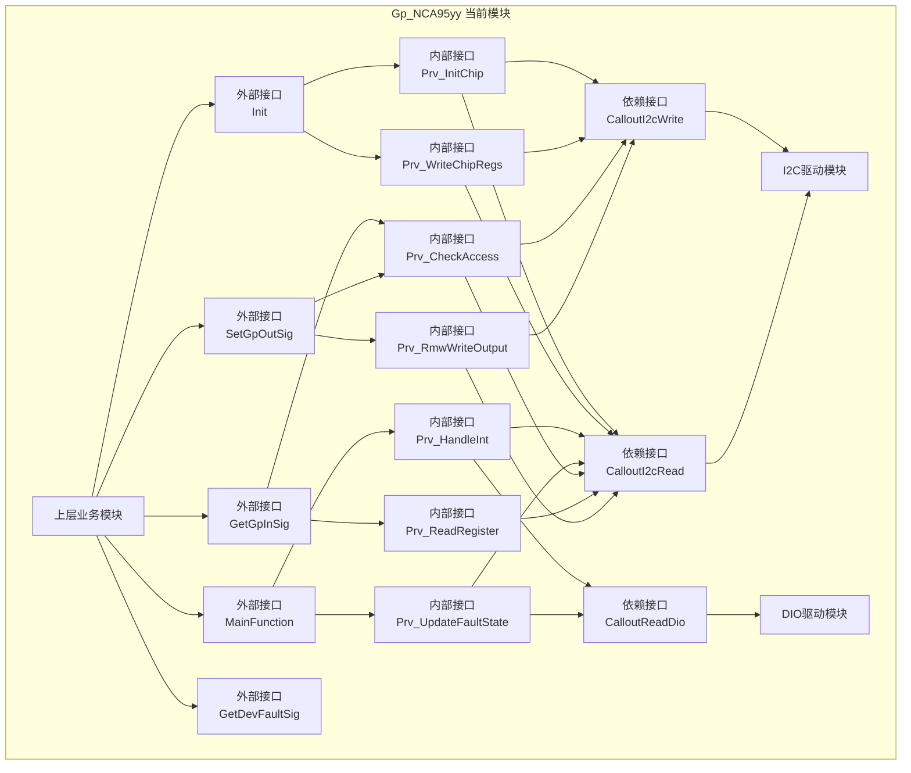
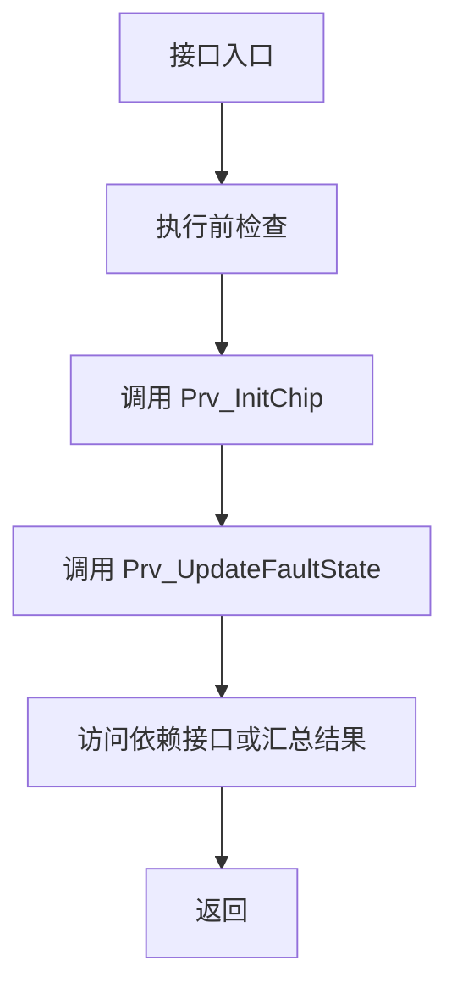
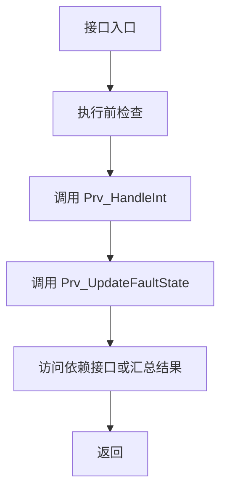
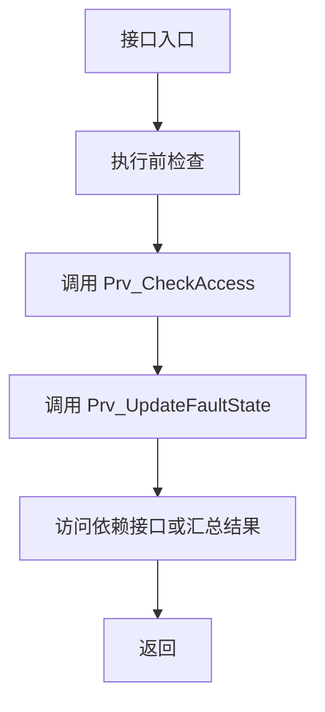

# Gp_NCA95yy 详细设计（Rendered Draft）

## 文档元信息

- 详细设计版本: `V1`
- 详细设计状态: `Draft`
- 生成时间: `2026-05-24 13:21:41`
- 生成/修订说明: 基于结构化设计对象自动生成第一版正文初稿。

## 1. FC概述

- FC名称: `Gp_NCA95yy`
- 功能介绍: 负责对外部芯片能力进行初始化、输入输出访问、故障诊断和周期状态维护。
- 所属层级: `IoExtDev / IoMcu adapted FC`
- 实现方案: 采用 `周期轮询 + 事件采样` 方式组织初始化、周期任务、内部接口和底层 callout 协作。

## 2. 设计输入

- 需求输入: `SRS_Gp_NCA95yy` 及其接口/功能需求条目。
- 架构输入: `Architecture_Gp_NCA95yy` 已冻结的 external interface、dependency interface 和配置边界。
- 平台约束: 芯片访问依赖 I2C / DIO / CoreId 等平台能力，具体由项目适配层提供。
- 项目约束: 当前版本遵循已冻结接口集合，不在详细设计阶段擅自扩展未确认能力。

## 4. 功能设计

### 4.1 功能设计说明

- 通过 `Init` 完成芯片初始化、配置加载和运行态建立。
- 通过 `MainFunction` 周期轮询中断/状态输入，并驱动故障确认与运行态更新。
- 通过 external interface 暴露业务能力，通过 dependency callout 隔离底层资源访问。
- 方向/极性等运行时能力当前通过配置保留，不作为本版本正式外部接口开放。

### 4.2 功能框图

### 4.3 分层设计思想

- external interface 只承载业务入口和对外契约，不直接承担底层访问细节。
- internal interface 承载访问检查、寄存器访问、故障更新、状态同步等实现动作。
- dependency interface / callout 只负责资源适配边界，不在业务层分散展开平台细节。
- MainFunction 采用周期轮询模型，将输入采样、故障处理和状态更新集中在统一节拍内完成。
- 当前主要依赖接口包括 `CalloutI2cWrite`, `CalloutI2cRead`, `CalloutReadDio`, `CalloutGetCoreId`。

## 5. 文件列表设计

| 文件名 | 必需/可选 | 职责 | 关键内容 | 依赖头文件 |
| --- | --- | --- | --- | --- |
| `Gp_NCA95yy.c` | Required | 实现 external API 与内部接口主体。 | public API, internal logic, runtime | `Gp_NCA95yy.h`, `Gp_NCA95yy_Cfg.h`, `Gp_NCA95yy_Callout.h`, `Gp_NCA95yy_MemMap.h` |
| `Gp_NCA95yy.h` | Required | 对外发布 external API。 | formal interfaces | `Std_Types.h`, `Compiler.h` |
| `Gp_NCA95yy_Cfg.h` | Required | 声明配置宏参和参数边界。 | formal / reserved config | `Std_Types.h` |
| `Gp_NCA95yy_Cfg.c` | Required | 定义配置参数与映射表。 | cfg params / bindings | `Gp_NCA95yy_Cfg.h`, `Gp_NCA95yy_MemMap.h` |
| `Gp_NCA95yy_Callout.h/.c` | Required | 承载 dependency interface 适配边界。 | callout contract / adaptation | `Gp_NCA95yy.h`, `IoMcu` / platform headers |
| `Gp_NCA95yy_MemMap.h` | Required | 承载 MemMap section 映射。 | section boundaries | project MemMap base headers |

## 6. 单核/多核框架设计

### 6.1 框架结论

- 当前按 `单核` 方案展开详细设计。
- 接口层负责对外契约，内部接口层负责实现动作归并，依赖接口层负责平台资源适配。
- 周期任务和运行时变量的组织方式必须服从 architecture freeze 和已确认项目约束。

### 6.2 任务与执行框架

| 任务/入口 | 执行主体 | 触发方式 | 作用 | 说明 |
| --- | --- | --- | --- | --- |
| `Init` | Gp_NCA95yy | 上电初始化 | 建立配置与运行态 | 初始化阶段入口 |
| `MainFunction` | Gp_NCA95yy | 周期调度 | 输入采样、故障确认、运行态刷新 | 若项目未启用周期任务则不实现 |

### 6.3 共享对象与一致性

| 对象 | 写方 | 读方 | 用途 | 一致性要求 |
| --- | --- | --- | --- | --- |
| `Gp_NCA95yy_Runtime` | `Init` / `MainFunction` | public APIs / internal interfaces | 保持运行态与缓存一致 | 禁止绕过统一更新路径直接改写 |

## 7. 外部接口设计

### 7.1 `Gp_NCA95yy_Init`
| Interface Prototype | 功能说明 | 同步属性 | 重入性 | 返回值 | 基本约束 | 关联接口 | 需求追踪 |
| --- | --- | --- | --- | --- | --- | --- | --- |
| void Gp_NCA95yy_Init | Init 为 architecture 已冻结 external interface，本节展开其实现动作、依赖调用和内部接口协作关系。 | Synchronous | Non-reentrant | 遵循 architecture 定义。 | 必须保持与 formal architecture interface、关联内部接口和依赖接口一致。 | `Gp_NCA95yy_Prv_InitChip`, `Gp_NCA95yy_Prv_WriteChipRegs`, `Gp_NCA95yy_Prv_UpdateFaultState`, `CalloutI2cWrite`, `CalloutI2cRead` | `SRS-GPNCA95YY-IF-0001` |

#### 7.1.1 子功能拆分
| 步骤 | 子功能 | 输入 | 输出 | 关键检查/约束 | 依赖对象 |
| --- | --- | --- | --- | --- | --- |
| 1 | 入口约束检查 | 接口输入与运行条件 | 访问合法性结论 | DET / 初始化 / 指针 / 范围检查 | `Prv_CheckAccess` 或等效实现 |
| 2 | Prv_InitChip | 接口上下文 | 内部动作结果 | 按内部接口职责执行 | `Prv_InitChip` |
| 3 | Prv_WriteChipRegs | 接口上下文 | 内部动作结果 | 按内部接口职责执行 | `Prv_WriteChipRegs` |
| 4 | Prv_UpdateFaultState | 接口上下文 | 内部动作结果 | 按内部接口职责执行 | `Prv_UpdateFaultState` |
| 5 | CalloutI2cWrite | 内部接口或接口上下文 | 依赖访问结果 | formal dependency callout | `CalloutI2cWrite` |
| 6 | CalloutI2cRead | 内部接口或接口上下文 | 依赖访问结果 | formal dependency callout | `CalloutI2cRead` |

#### 7.1.2 执行步骤

1. 进入接口并完成边界检查，确保调用场景满足 formal 约束。
2. 调用 `Prv_InitChip` 执行该接口的主要内部职责。
3. 调用 `Prv_WriteChipRegs` 执行该接口的主要内部职责。
4. 调用 `Prv_UpdateFaultState` 执行该接口的主要内部职责。
5. 通过 `CalloutI2cWrite` 完成对底层资源的访问。
6. 通过 `CalloutI2cRead` 完成对底层资源的访问。
7. 汇总结果并按 `Gp_NCA95yy_Init` 的返回策略结束接口。

#### 7.1.3 参与内部接口
| 内部接口 | 作用 | 调用时机 |
| --- | --- | --- |
| `Gp_NCA95yy_Prv_InitChip` | 初始化单个芯片，调用寄存器写入并同步运行态缓存。 | 由 relationship_links 推导 |
| `Gp_NCA95yy_Prv_WriteChipRegs` | 按既定顺序写 Output / Config / Polarity 寄存器。 | 由 relationship_links 推导 |
| `Gp_NCA95yy_Prv_UpdateFaultState` | 统一记录或清除故障位，并维护必要的恢复计数。 | 由 relationship_links 推导 |

#### 7.1.4 流程图

### 7.2 `Gp_NCA95yy_MainFunction`
| Interface Prototype | 功能说明 | 同步属性 | 重入性 | 返回值 | 基本约束 | 关联接口 | 需求追踪 |
| --- | --- | --- | --- | --- | --- | --- | --- |
| void Gp_NCA95yy_MainFunction | MainFunction 为 architecture 已冻结 external interface，本节展开其实现动作、依赖调用和内部接口协作关系。 | Synchronous | Non-reentrant | 遵循 architecture 定义。 | 必须保持与 formal architecture interface、关联内部接口和依赖接口一致。 | `Gp_NCA95yy_Prv_HandleInt`, `Gp_NCA95yy_Prv_UpdateFaultState`, `CalloutReadDio`, `CalloutI2cRead` | `SRS-GPNCA95YY-IF-0002` |

#### 7.2.1 子功能拆分
| 步骤 | 子功能 | 输入 | 输出 | 关键检查/约束 | 依赖对象 |
| --- | --- | --- | --- | --- | --- |
| 1 | 入口约束检查 | 接口输入与运行条件 | 访问合法性结论 | DET / 初始化 / 指针 / 范围检查 | `Prv_CheckAccess` 或等效实现 |
| 2 | Prv_HandleInt | 接口上下文 | 内部动作结果 | 按内部接口职责执行 | `Prv_HandleInt` |
| 3 | Prv_UpdateFaultState | 接口上下文 | 内部动作结果 | 按内部接口职责执行 | `Prv_UpdateFaultState` |
| 4 | CalloutReadDio | 内部接口或接口上下文 | 依赖访问结果 | formal dependency callout | `CalloutReadDio` |
| 5 | CalloutI2cRead | 内部接口或接口上下文 | 依赖访问结果 | formal dependency callout | `CalloutI2cRead` |

#### 7.2.2 执行步骤

1. 进入接口并完成边界检查，确保调用场景满足 formal 约束。
2. 调用 `Prv_HandleInt` 执行该接口的主要内部职责。
3. 调用 `Prv_UpdateFaultState` 执行该接口的主要内部职责。
4. 通过 `CalloutReadDio` 完成对底层资源的访问。
5. 通过 `CalloutI2cRead` 完成对底层资源的访问。
6. 汇总结果并按 `Gp_NCA95yy_MainFunction` 的返回策略结束接口。

#### 7.2.3 参与内部接口
| 内部接口 | 作用 | 调用时机 |
| --- | --- | --- |
| `Gp_NCA95yy_Prv_HandleInt` | 读 Input Port、比较缓存、识别变化并更新缓存。 | 由 relationship_links 推导 |
| `Gp_NCA95yy_Prv_UpdateFaultState` | 统一记录或清除故障位，并维护必要的恢复计数。 | 由 relationship_links 推导 |

#### 7.2.4 流程图

#### 7.2.5 待修正文档关系
- `Prv_SampleInt` 目前未在内部接口/依赖接口定义中落地，需补定义或删关系。

### 7.3 `Gp_NCA95yy_GetGpInSig`
| Interface Prototype | 功能说明 | 同步属性 | 重入性 | 返回值 | 基本约束 | 关联接口 | 需求追踪 |
| --- | --- | --- | --- | --- | --- | --- | --- |
| Std_ReturnType Gp_NCA95yy_GetGpInSig | GetGpInSig 为 architecture 已冻结 external interface，本节展开其实现动作、依赖调用和内部接口协作关系。 | Synchronous | Reentrant | 遵循 architecture 定义。 | 必须保持与 formal architecture interface、关联内部接口和依赖接口一致。 | `Gp_NCA95yy_Prv_CheckAccess`, `Gp_NCA95yy_Prv_ReadRegister`, `Gp_NCA95yy_Prv_UpdateFaultState`, `CalloutI2cRead` | `SRS-GPNCA95YY-IF-0003` |

#### 7.3.1 子功能拆分
| 步骤 | 子功能 | 输入 | 输出 | 关键检查/约束 | 依赖对象 |
| --- | --- | --- | --- | --- | --- |
| 1 | 入口约束检查 | 接口输入与运行条件 | 访问合法性结论 | DET / 初始化 / 指针 / 范围检查 | `Prv_CheckAccess` 或等效实现 |
| 2 | Prv_CheckAccess | 接口上下文 | 内部动作结果 | 按内部接口职责执行 | `Prv_CheckAccess` |
| 3 | Prv_ReadRegister | 接口上下文 | 内部动作结果 | 按内部接口职责执行 | `Prv_ReadRegister` |
| 4 | Prv_UpdateFaultState | 接口上下文 | 内部动作结果 | 按内部接口职责执行 | `Prv_UpdateFaultState` |
| 5 | CalloutI2cRead | 内部接口或接口上下文 | 依赖访问结果 | formal dependency callout | `CalloutI2cRead` |

#### 7.3.2 执行步骤

1. 进入接口并完成边界检查，确保调用场景满足 formal 约束。
2. 调用 `Prv_CheckAccess` 执行该接口的主要内部职责。
3. 调用 `Prv_ReadRegister` 执行该接口的主要内部职责。
4. 调用 `Prv_UpdateFaultState` 执行该接口的主要内部职责。
5. 通过 `CalloutI2cRead` 完成对底层资源的访问。
6. 汇总结果并按 `Gp_NCA95yy_GetGpInSig` 的返回策略结束接口。

#### 7.3.3 参与内部接口
| 内部接口 | 作用 | 调用时机 |
| --- | --- | --- |
| `Gp_NCA95yy_Prv_CheckAccess` | 统一完成 Id 解码、指针检查、初始化检查和参数范围检查，并在失败时记录 DET。 | 由 relationship_links 推导 |
| `Gp_NCA95yy_Prv_ReadRegister` | 通用 I2C 读寄存器封装。 | 由 relationship_links 推导 |
| `Gp_NCA95yy_Prv_UpdateFaultState` | 统一记录或清除故障位，并维护必要的恢复计数。 | 由 relationship_links 推导 |

#### 7.3.4 流程图

### 7.4 `Gp_NCA95yy_SetGpOutSig`
| Interface Prototype | 功能说明 | 同步属性 | 重入性 | 返回值 | 基本约束 | 关联接口 | 需求追踪 |
| --- | --- | --- | --- | --- | --- | --- | --- |
| Std_ReturnType Gp_NCA95yy_SetGpOutSig | SetGpOutSig 为 architecture 已冻结 external interface，本节展开其实现动作、依赖调用和内部接口协作关系。 | Synchronous | Reentrant | 遵循 architecture 定义。 | 必须保持与 formal architecture interface、关联内部接口和依赖接口一致。 | `Gp_NCA95yy_Prv_CheckAccess`, `Gp_NCA95yy_Prv_RmwWriteOutput`, `Gp_NCA95yy_Prv_UpdateFaultState`, `CalloutI2cRead`, `CalloutI2cWrite` | `SRS-GPNCA95YY-IF-0004` |

#### 7.4.1 子功能拆分
| 步骤 | 子功能 | 输入 | 输出 | 关键检查/约束 | 依赖对象 |
| --- | --- | --- | --- | --- | --- |
| 1 | 入口约束检查 | 接口输入与运行条件 | 访问合法性结论 | DET / 初始化 / 指针 / 范围检查 | `Prv_CheckAccess` 或等效实现 |
| 2 | Prv_CheckAccess | 接口上下文 | 内部动作结果 | 按内部接口职责执行 | `Prv_CheckAccess` |
| 3 | Prv_RmwWriteOutput | 接口上下文 | 内部动作结果 | 按内部接口职责执行 | `Prv_RmwWriteOutput` |
| 4 | Prv_UpdateFaultState | 接口上下文 | 内部动作结果 | 按内部接口职责执行 | `Prv_UpdateFaultState` |
| 5 | CalloutI2cRead | 内部接口或接口上下文 | 依赖访问结果 | formal dependency callout | `CalloutI2cRead` |
| 6 | CalloutI2cWrite | 内部接口或接口上下文 | 依赖访问结果 | formal dependency callout | `CalloutI2cWrite` |

#### 7.4.2 执行步骤

1. 进入接口并完成边界检查，确保调用场景满足 formal 约束。
2. 调用 `Prv_CheckAccess` 执行该接口的主要内部职责。
3. 调用 `Prv_RmwWriteOutput` 执行该接口的主要内部职责。
4. 调用 `Prv_UpdateFaultState` 执行该接口的主要内部职责。
5. 通过 `CalloutI2cRead` 完成对底层资源的访问。
6. 通过 `CalloutI2cWrite` 完成对底层资源的访问。
7. 汇总结果并按 `Gp_NCA95yy_SetGpOutSig` 的返回策略结束接口。

#### 7.4.3 参与内部接口
| 内部接口 | 作用 | 调用时机 |
| --- | --- | --- |
| `Gp_NCA95yy_Prv_CheckAccess` | 统一完成 Id 解码、指针检查、初始化检查和参数范围检查，并在失败时记录 DET。 | 由 relationship_links 推导 |
| `Gp_NCA95yy_Prv_RmwWriteOutput` | 执行 Output Port 的读改写序列并返回新值。 | 由 relationship_links 推导 |
| `Gp_NCA95yy_Prv_UpdateFaultState` | 统一记录或清除故障位，并维护必要的恢复计数。 | 由 relationship_links 推导 |

#### 7.4.4 流程图

### 7.5 `Gp_NCA95yy_GetDevFaultSig`
| Interface Prototype | 功能说明 | 同步属性 | 重入性 | 返回值 | 基本约束 | 关联接口 | 需求追踪 |
| --- | --- | --- | --- | --- | --- | --- | --- |
| Std_ReturnType Gp_NCA95yy_GetDevFaultSig | GetDevFaultSig 为 architecture 已冻结 external interface，本节展开其实现动作、依赖调用和内部接口协作关系。 | Synchronous | Reentrant | 遵循 architecture 定义。 | 必须保持与 formal architecture interface、关联内部接口和依赖接口一致。 | — | `SRS-GPNCA95YY-IF-0005` |

#### 7.5.1 子功能拆分
| 步骤 | 子功能 | 输入 | 输出 | 关键检查/约束 | 依赖对象 |
| --- | --- | --- | --- | --- | --- |
| 1 | 入口约束检查 | 接口输入与运行条件 | 访问合法性结论 | DET / 初始化 / 指针 / 范围检查 | `Prv_CheckAccess` 或等效实现 |

#### 7.5.2 执行步骤

1. 进入接口并完成边界检查，确保调用场景满足 formal 约束。
2. 汇总结果并按 `Gp_NCA95yy_GetDevFaultSig` 的返回策略结束接口。

#### 7.5.3 参与内部接口
| 内部接口 | 作用 | 调用时机 |
| --- | --- | --- |
| `None` | 当前无显式内部接口关系。 | — |

## 8. 内部接口设计

| 内部接口名 | 作用域 | 职责 | 调用方 | 依赖方 |
| --- | --- | --- | --- | --- |
| `Gp_NCA95yy_Prv_CheckAccess` | `static` | 统一完成 Id 解码、指针检查、初始化检查和参数范围检查，并在失败时记录 DET。 | `GetGpInSig`, `SetGpOutSig`, `GetDevFaultSig` | — |
| `Gp_NCA95yy_Prv_InitChip` | `static` | 初始化单个芯片，调用寄存器写入并同步运行态缓存。 | `Init` | `CalloutI2cWrite` |
| `Gp_NCA95yy_Prv_WriteChipRegs` | `static` | 按既定顺序写 Output / Config / Polarity 寄存器。 | `Init` | `CalloutI2cWrite` |
| `Gp_NCA95yy_Prv_ReadRegister` | `static` | 通用 I2C 读寄存器封装。 | `GetGpInSig`, `MainFunction`, `SetGpOutSig` | `CalloutI2cRead` |
| `Gp_NCA95yy_Prv_WriteRegister` | `static` | 通用 I2C 写寄存器封装。 | `Init`, `SetGpOutSig` | `CalloutI2cWrite` |
| `Gp_NCA95yy_Prv_RmwWriteOutput` | `static` | 执行 Output Port 的读改写序列并返回新值。 | `SetGpOutSig` | `CalloutI2cRead`, `CalloutI2cWrite` |
| `Gp_NCA95yy_Prv_HandleInt` | `static` | 读 Input Port、比较缓存、识别变化并更新缓存。 | `MainFunction` | `CalloutI2cRead` |
| `Gp_NCA95yy_Prv_UpdateFaultState` | `static` | 统一记录或清除故障位，并维护必要的恢复计数。 | `Init`, `MainFunction`, `GetGpInSig`, `SetGpOutSig` | — |

### 8.1 `Gp_NCA95yy_Prv_CheckAccess`
| Interface Name | 类别 | 作用域 | 功能说明 | 调用方 | 依赖方 |
| --- | --- | --- | --- | --- | --- |
| Gp_NCA95yy_Prv_CheckAccess | 内部控制 / 校验 / 访问辅助 | `static` | 统一完成 Id 解码、指针检查、初始化检查和参数范围检查，并在失败时记录 DET。 | `GetGpInSig`, `SetGpOutSig`, `GetDevFaultSig` | — |

#### 8.1.1 设计说明

- `Gp_NCA95yy_Prv_CheckAccess` 用于承载可复用的实现动作，避免将底层访问和状态处理散落在 external interface 主流程中。
- 该内部接口当前由 `GetGpInSig`, `SetGpOutSig`, `GetDevFaultSig` 触发，并与 必要依赖接口 协作。

### 8.2 `Gp_NCA95yy_Prv_InitChip`
| Interface Name | 类别 | 作用域 | 功能说明 | 调用方 | 依赖方 |
| --- | --- | --- | --- | --- | --- |
| Gp_NCA95yy_Prv_InitChip | 内部控制 / 校验 / 访问辅助 | `static` | 初始化单个芯片，调用寄存器写入并同步运行态缓存。 | `Init` | `CalloutI2cWrite` |

#### 8.2.1 设计说明

- `Gp_NCA95yy_Prv_InitChip` 用于承载可复用的实现动作，避免将底层访问和状态处理散落在 external interface 主流程中。
- 该内部接口当前由 `Init` 触发，并与 `CalloutI2cWrite` 协作。

### 8.3 `Gp_NCA95yy_Prv_WriteChipRegs`
| Interface Name | 类别 | 作用域 | 功能说明 | 调用方 | 依赖方 |
| --- | --- | --- | --- | --- | --- |
| Gp_NCA95yy_Prv_WriteChipRegs | 内部控制 / 校验 / 访问辅助 | `static` | 按既定顺序写 Output / Config / Polarity 寄存器。 | `Init` | `CalloutI2cWrite` |

#### 8.3.1 设计说明

- `Gp_NCA95yy_Prv_WriteChipRegs` 用于承载可复用的实现动作，避免将底层访问和状态处理散落在 external interface 主流程中。
- 该内部接口当前由 `Init` 触发，并与 `CalloutI2cWrite` 协作。

### 8.4 `Gp_NCA95yy_Prv_ReadRegister`
| Interface Name | 类别 | 作用域 | 功能说明 | 调用方 | 依赖方 |
| --- | --- | --- | --- | --- | --- |
| Gp_NCA95yy_Prv_ReadRegister | 内部控制 / 校验 / 访问辅助 | `static` | 通用 I2C 读寄存器封装。 | `GetGpInSig`, `MainFunction`, `SetGpOutSig` | `CalloutI2cRead` |

#### 8.4.1 设计说明

- `Gp_NCA95yy_Prv_ReadRegister` 用于承载可复用的实现动作，避免将底层访问和状态处理散落在 external interface 主流程中。
- 该内部接口当前由 `GetGpInSig`, `MainFunction`, `SetGpOutSig` 触发，并与 `CalloutI2cRead` 协作。

### 8.5 `Gp_NCA95yy_Prv_WriteRegister`
| Interface Name | 类别 | 作用域 | 功能说明 | 调用方 | 依赖方 |
| --- | --- | --- | --- | --- | --- |
| Gp_NCA95yy_Prv_WriteRegister | 内部控制 / 校验 / 访问辅助 | `static` | 通用 I2C 写寄存器封装。 | `Init`, `SetGpOutSig` | `CalloutI2cWrite` |

#### 8.5.1 设计说明

- `Gp_NCA95yy_Prv_WriteRegister` 用于承载可复用的实现动作，避免将底层访问和状态处理散落在 external interface 主流程中。
- 该内部接口当前由 `Init`, `SetGpOutSig` 触发，并与 `CalloutI2cWrite` 协作。

### 8.6 `Gp_NCA95yy_Prv_RmwWriteOutput`
| Interface Name | 类别 | 作用域 | 功能说明 | 调用方 | 依赖方 |
| --- | --- | --- | --- | --- | --- |
| Gp_NCA95yy_Prv_RmwWriteOutput | 内部控制 / 校验 / 访问辅助 | `static` | 执行 Output Port 的读改写序列并返回新值。 | `SetGpOutSig` | `CalloutI2cRead`, `CalloutI2cWrite` |

#### 8.6.1 设计说明

- `Gp_NCA95yy_Prv_RmwWriteOutput` 用于承载可复用的实现动作，避免将底层访问和状态处理散落在 external interface 主流程中。
- 该内部接口当前由 `SetGpOutSig` 触发，并与 `CalloutI2cRead`, `CalloutI2cWrite` 协作。

### 8.7 `Gp_NCA95yy_Prv_HandleInt`
| Interface Name | 类别 | 作用域 | 功能说明 | 调用方 | 依赖方 |
| --- | --- | --- | --- | --- | --- |
| Gp_NCA95yy_Prv_HandleInt | 内部控制 / 校验 / 访问辅助 | `static` | 读 Input Port、比较缓存、识别变化并更新缓存。 | `MainFunction` | `CalloutI2cRead` |

#### 8.7.1 设计说明

- `Gp_NCA95yy_Prv_HandleInt` 用于承载可复用的实现动作，避免将底层访问和状态处理散落在 external interface 主流程中。
- 该内部接口当前由 `MainFunction` 触发，并与 `CalloutI2cRead` 协作。

### 8.8 `Gp_NCA95yy_Prv_UpdateFaultState`
| Interface Name | 类别 | 作用域 | 功能说明 | 调用方 | 依赖方 |
| --- | --- | --- | --- | --- | --- |
| Gp_NCA95yy_Prv_UpdateFaultState | 内部控制 / 校验 / 访问辅助 | `static` | 统一记录或清除故障位，并维护必要的恢复计数。 | `Init`, `MainFunction`, `GetGpInSig`, `SetGpOutSig` | — |

#### 8.8.1 设计说明

- `Gp_NCA95yy_Prv_UpdateFaultState` 用于承载可复用的实现动作，避免将底层访问和状态处理散落在 external interface 主流程中。
- 该内部接口当前由 `Init`, `MainFunction`, `GetGpInSig`, `SetGpOutSig` 触发，并与 必要依赖接口 协作。

## 9. 依赖接口与Callout设计

### 9.1 `Gp_NCA95yy_CalloutI2cWrite`
| Interface Prototype | 功能说明 | 实现边界 | 同步属性 | 重入性 | 基本约束 | 关联接口 | 覆盖状态 | 需求追踪 |
| --- | --- | --- | --- | --- | --- | --- | --- | --- |
| Std_ReturnType Gp_NCA95yy_CalloutI2cWrite | CalloutI2cWrite 为 detailed design 依赖接口 / callout 边界。 | 项目适配层 / 平台层 | Synchronous | Reentrant | 必须与 architecture formal dependency contract 保持一致。 | `Gp_NCA95yy_Prv_WriteRegister`, `Gp_NCA95yy_Prv_WriteChipRegs`, `Gp_NCA95yy_Prv_RmwWriteOutput` | 已在 DD 主体中定义 | `SRS-GPNCA95YY-FUNC-0001`, `SRS-GPNCA95YY-FUNC-0004` |

- 实现方应位于项目适配层或平台层，不能在业务接口内部直接替代。
- 调用失败时应通过返回值、故障更新或待确认策略反馈给 FC 主体。

### 9.2 `Gp_NCA95yy_CalloutI2cRead`
| Interface Prototype | 功能说明 | 实现边界 | 同步属性 | 重入性 | 基本约束 | 关联接口 | 覆盖状态 | 需求追踪 |
| --- | --- | --- | --- | --- | --- | --- | --- | --- |
| Std_ReturnType Gp_NCA95yy_CalloutI2cRead | CalloutI2cRead 为 detailed design 依赖接口 / callout 边界。 | 项目适配层 / 平台层 | Synchronous | Reentrant | 必须与 architecture formal dependency contract 保持一致。 | `Gp_NCA95yy_Prv_ReadRegister`, `Gp_NCA95yy_Prv_HandleInt`, `Gp_NCA95yy_Prv_RmwWriteOutput` | 已在 DD 主体中定义 | `SRS-GPNCA95YY-FUNC-0003`, `SRS-GPNCA95YY-FUNC-0006` |

- 实现方应位于项目适配层或平台层，不能在业务接口内部直接替代。
- 调用失败时应通过返回值、故障更新或待确认策略反馈给 FC 主体。

### 9.3 `Gp_NCA95yy_CalloutReadDio`
| Interface Prototype | 功能说明 | 实现边界 | 同步属性 | 重入性 | 基本约束 | 关联接口 | 覆盖状态 | 需求追踪 |
| --- | --- | --- | --- | --- | --- | --- | --- | --- |
| Std_ReturnType Gp_NCA95yy_CalloutReadDio | CalloutReadDio 为 detailed design 依赖接口 / callout 边界。 | 项目适配层 / 平台层 | Synchronous | Reentrant | 必须与 architecture formal dependency contract 保持一致。 | `MainFunction` | 已在 DD 主体中定义 | `SRS-GPNCA95YY-FUNC-0006`, `SRS-GPNCA95YY-FUNC-0008` |

- 实现方应位于项目适配层或平台层，不能在业务接口内部直接替代。
- 调用失败时应通过返回值、故障更新或待确认策略反馈给 FC 主体。

- `Prv_SampleInt` 当前只在关系中被引用，尚未定义为内部接口或 external interface。

### 9.4 `Gp_NCA95yy_CalloutGetCoreId`
| Interface Prototype | 功能说明 | 实现边界 | 同步属性 | 重入性 | 基本约束 | 关联接口 | 覆盖状态 | 需求追踪 |
| --- | --- | --- | --- | --- | --- | --- | --- | --- |
| uint32 Gp_NCA95yy_CalloutGetCoreId | CalloutGetCoreId 为 detailed design 依赖接口 / callout 边界。 | 项目适配层 / 平台层 | Synchronous | Reentrant | 必须与 architecture formal dependency contract 保持一致。 | — | architecture 已冻结，但当前 DD 尚未补全 | 待补需求追踪 |

- 实现方应位于项目适配层或平台层，不能在业务接口内部直接替代。
- 调用失败时应通过返回值、故障更新或待确认策略反馈给 FC 主体。

## 11. 状态机设计

- 当前模块以接口调用、运行态缓存和故障位更新为主，不单独构造复杂状态机。
- 若后续版本引入模式切换、恢复阶段或芯片状态联动，再强化状态机章节。

## 12. DET设计

| 检查点 | 触发条件 | 记录方式 | 返回策略 | 适用API |
| --- | --- | --- | --- | --- |
| 初始化检查 | 模块未初始化即被调用 | `Det_ReportError` 或项目等效路径 | 立即返回 | 查询/设置类 public API |
| 参数/指针检查 | 空指针、非法 Id、越界参数 | `Det_ReportError` 或项目等效路径 | 返回 `E_NOT_OK` | 需要输入参数的 public API |

## 13. 故障处理设计

| 故障类型 | 检测条件 | 确认规则 | 响应动作 | 恢复条件 | 对外体现 |
| --- | --- | --- | --- | --- | --- |
| 通信故障 | I2C 读写失败或返回异常 | 按连续失败/成功规则确认或恢复 | 置位故障状态、限制后续访问或维持缓存值 | 连续成功达到恢复阈值 | 通过故障查询接口或状态位暴露 |
| 输入采样故障 | INT / 输入状态异常或不一致 | 按去抖与周期采样规则确认 | 更新故障状态并保留上次有效值 | 输入状态恢复稳定 | 通过状态查询接口暴露 |

## 14. 运行时变量设计

| 变量名 | 类别 | 目的 | 写方 | 读方 | 生命周期 | 所属Core |
| --- | --- | --- | --- | --- | --- | --- |
| `Gp_NCA95yy_Runtime` | 运行态容器 | 保存模块运行态、初始化状态和最近一次采样结果。 | `Init` / `MainFunction` | public APIs / internal interfaces | FC 生命周期 | 单核 |
| `Gp_NCA95yy_FaultState` | 故障状态 | 保存 I2C / 输入采样 / 初始化相关故障位。 | `Init` / `MainFunction` / fault helpers | 诊断接口 / 查询接口 | FC 生命周期 | 单核 |
| `Gp_NCA95yy_IntSampleCache` | 采样缓存 | 缓存 MainFunction 周期内的输入状态变化与去抖结果。 | `MainFunction` | 内部接口 / 查询接口 | FC 生命周期 | 单核 |

## 15. 配置宏参设计

### 15.1 配置宏参

| 宏参/开关 | 作用 | 状态 | 需求追踪 |
| --- | --- | --- | --- |
| `GP_NCA95YY_CFG_DEV_ERROR_DETECT` | 配置控制项或能力保留项。 | formal | `SRS-GPNCA95YY-IF-0006`, `SRS-GPNCA95YY-DIAG-0004` |
| `GP_NCA95YY_CFG_RUNTIME_DIRECTION_CHANGE` | 配置控制项或能力保留项。 | reserved | `SRS-GPNCA95YY-FUNC-0002` |
| `GP_NCA95YY_CFG_RUNTIME_POLARITY_CHANGE` | 配置控制项或能力保留项。 | reserved | `SRS-GPNCA95YY-FUNC-0005` |
| `GP_NCA95YY_SW_MAJOR_VERSION` | 配置控制项或能力保留项。 | formal | 待补需求追踪 |
| `GP_NCA95YY_SW_MINOR_VERSION` | 配置控制项或能力保留项。 | formal | 待补需求追踪 |
| `GP_NCA95YY_SW_PATCH_VERSION` | 配置控制项或能力保留项。 | formal | 待补需求追踪 |

### 15.2 配置参数

#### 15.2.1 顶层配置容器

| 配置类别 | 建议配置内容 | 组织方式 | 说明 |
| --- | --- | --- | --- |
| 顶层配置容器 | 顶层配置入口, 子配置聚合关系 | 按 core 分组组织 | 当前模块应提供顶层配置容器，用于聚合寄存器初始化、总线映射和实例配置等子配置。 |

#### 15.2.2 芯片实例配置

| 配置类别 | 建议配置内容 | 组织方式 | 说明 |
| --- | --- | --- | --- |
| 芯片实例配置 | `MwRegDataCmd_au32`, `MrRegData_au32`, `GENCTRL1_u16`, `GENCTRL2_u16`, `VDS1_u16`, `VDS2_u16`, `CCP_BLK1_u16`, `HBMODE_u16` | 按 core 分组组织 | 当前模块应为每个芯片实例或每个 core 下的芯片实例提供独立配置。 |

#### 15.2.3 寄存器初值配置

| 配置类别 | 建议配置内容 | 组织方式 | 说明 |
| --- | --- | --- | --- |
| 寄存器初值配置 | `CanCtl_u16`, `DataRate_u16`, `Id0_u16`, `Id1_u16`, `Id2_u16`, `Id3_u16`, `Id0Mask_u16`, `Id1Mask_u16` | 按芯片实例组织 | 当前模块应定义芯片上电初始化或默认工作模式所需的寄存器初值。 |

#### 15.2.4 总线映射配置

| 配置类别 | 建议配置内容 | 组织方式 | 说明 |
| --- | --- | --- | --- |
| 总线映射配置 | `SpiCh_u8`, `SpiSq_u8` | 按芯片实例组织 | 当前模块应定义底层总线访问通道、序列或地址映射关系。 |

#### 15.2.5 其他配置对象

| 配置类别 | 建议配置内容 | 组织方式 | 说明 |
| --- | --- | --- | --- |
| 其他配置对象 | 辅助配置项 | 按模块统一组织 | 当前模块应补充其他与业务实现相关的辅助配置对象。 |

## 16. MemMap设计

| Memory Section | Target Content | Start Macro | Stop Macro | Used Files | Notes |
| --- | --- | --- | --- | --- | --- |
| CODE | external APIs / internal interfaces | `GP_NCA95YY_CODE_START` | `GP_NCA95YY_CODE_STOP` | `Gp_NCA95yy.c`, `Gp_NCA95yy_Callout.c` | 按代码与适配边界组织 |
| RUNTIME | runtime objects / fault state / caches | `GP_NCA95YY_CLEAR_FAR_DATA_ALIGN4_COREx_START` | `GP_NCA95YY_CLEAR_FAR_DATA_ALIGN4_COREx_STOP` | `Gp_NCA95yy.c` | 是否按 core 分区取决于已确认部署方式 |
| CONST | cfg params / mappings | `GP_NCA95YY_CONST_FAR_DATA_ALIGN4_GLOBAL_START` | `GP_NCA95YY_CONST_FAR_DATA_ALIGN4_GLOBAL_STOP` | `Gp_NCA95yy_Cfg.c` | 配置参数和映射表统一归入常量区 |

## 17. 代码编写限制要求

- 不得在详细设计阶段新增 architecture 未冻结的 external interface 或 dependency interface。
- 不得绕过统一的访问检查路径直接访问底层资源。
- reserved 配置能力不得在本版本实现为正式 public API。
- relationship_links 暴露的未定义对象必须先修正定义或关系后再进入编码。

## 18. 架构与详细设计覆盖表

| 架构对象 | 分类 | DD落位章节 | DD对象名 | 覆盖状态 | 备注 |
| --- | --- | --- | --- | --- | --- |
| Gp_NCA95yy_Init | External Interface | 7. 外部接口设计 | Gp_NCA95yy_Init | Covered | `SRS-GPNCA95YY-IF-0001` |
| Gp_NCA95yy_MainFunction | External Interface | 7. 外部接口设计 | Gp_NCA95yy_MainFunction | Covered | `SRS-GPNCA95YY-IF-0002` |
| Gp_NCA95yy_GetGpInSig | External Interface | 7. 外部接口设计 | Gp_NCA95yy_GetGpInSig | Covered | `SRS-GPNCA95YY-IF-0003` |
| Gp_NCA95yy_SetGpOutSig | External Interface | 7. 外部接口设计 | Gp_NCA95yy_SetGpOutSig | Covered | `SRS-GPNCA95YY-IF-0004` |
| Gp_NCA95yy_GetDevFaultSig | External Interface | 7. 外部接口设计 | Gp_NCA95yy_GetDevFaultSig | Covered | `SRS-GPNCA95YY-IF-0005` |
| Gp_NCA95yy_CalloutI2cWrite | Dependency Interface | 9. 依赖接口与Callout设计 | Gp_NCA95yy_CalloutI2cWrite | Covered | `SRS-GPNCA95YY-FUNC-0001`, `SRS-GPNCA95YY-FUNC-0004` |
| Gp_NCA95yy_CalloutI2cRead | Dependency Interface | 9. 依赖接口与Callout设计 | Gp_NCA95yy_CalloutI2cRead | Covered | `SRS-GPNCA95YY-FUNC-0003`, `SRS-GPNCA95YY-FUNC-0006` |
| Gp_NCA95yy_CalloutReadDio | Dependency Interface | 9. 依赖接口与Callout设计 | Gp_NCA95yy_CalloutReadDio | Covered | `SRS-GPNCA95YY-FUNC-0006`, `SRS-GPNCA95YY-FUNC-0008` |
| Gp_NCA95yy_CalloutGetCoreId | Dependency Interface | 9. 依赖接口与Callout设计 | — | Partial | 待补需求追踪 |
| Gp_NCA95yy_Prv_CheckAccess | Internal Interface | 8. 内部接口设计 | Gp_NCA95yy_Prv_CheckAccess | Covered | 由 DD 内部展开 |
| Gp_NCA95yy_Prv_InitChip | Internal Interface | 8. 内部接口设计 | Gp_NCA95yy_Prv_InitChip | Covered | 由 DD 内部展开 |
| Gp_NCA95yy_Prv_WriteChipRegs | Internal Interface | 8. 内部接口设计 | Gp_NCA95yy_Prv_WriteChipRegs | Covered | 由 DD 内部展开 |
| Gp_NCA95yy_Prv_ReadRegister | Internal Interface | 8. 内部接口设计 | Gp_NCA95yy_Prv_ReadRegister | Covered | 由 DD 内部展开 |
| Gp_NCA95yy_Prv_WriteRegister | Internal Interface | 8. 内部接口设计 | Gp_NCA95yy_Prv_WriteRegister | Covered | 由 DD 内部展开 |
| Gp_NCA95yy_Prv_RmwWriteOutput | Internal Interface | 8. 内部接口设计 | Gp_NCA95yy_Prv_RmwWriteOutput | Covered | 由 DD 内部展开 |
| Gp_NCA95yy_Prv_HandleInt | Internal Interface | 8. 内部接口设计 | Gp_NCA95yy_Prv_HandleInt | Covered | 由 DD 内部展开 |
| Gp_NCA95yy_Prv_UpdateFaultState | Internal Interface | 8. 内部接口设计 | Gp_NCA95yy_Prv_UpdateFaultState | Covered | 由 DD 内部展开 |
