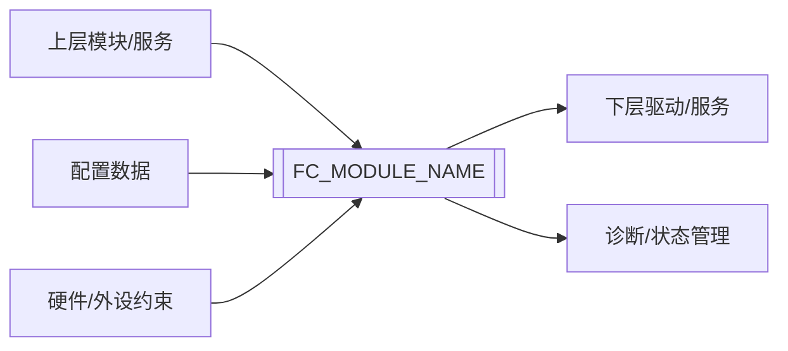
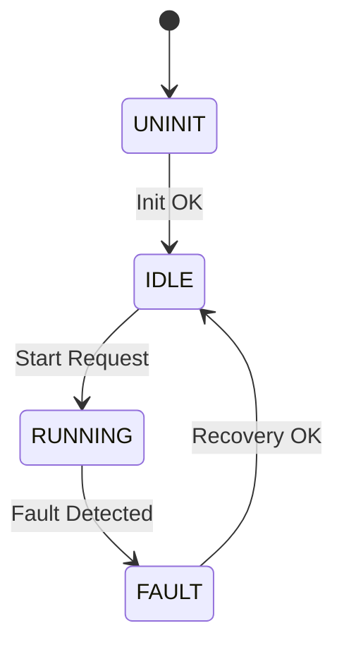

# FC架构设计编写规范

## 1 目的

本文档用于规范 FC（Function Component）软件架构设计文档（SDD：Software Design Description）的编写方法，确保架构设计能够承接 SRS，明确模块划分、接口、数据流、状态机、配置、依赖、安全机制、时序资源和验证入口，并作为 SDS、Coding、IT 和 ST 的输入依据。

FC 是独立的软件模块，架构设计应体现其可移植、可配置、可复用的特性。SDD 应优先描述模块的通用架构能力、稳定接口、配置裁剪方式和依赖适配边界，而不是围绕某一个具体项目的单次集成方式展开。

本文档适用于 MCAL、BSW、IoExtDrv、CDD、ASW 等层级中 FC 模块的软件架构设计、评审和维护。

---

## 2 基本原则

### 2.1 SRS 驱动原则

SDD 应基于已评审或已基线化的 SRS 编写。架构设计只能细化、分配和组织 SRS 中已有的软件行为、接口能力、约束和安全要求，不得凭经验新增无来源功能。

若架构阶段发现 SRS 缺失、矛盾或不可实现，应回写 SRS 问题清单或需求变更项，不得在 SDD 中静默补齐需求。

### 2.2 架构层级原则

SDD 应描述软件高层结构和集成方式，重点回答：

- 模块位于哪个软件层级？
- 模块对外提供什么接口？
- 模块依赖哪些下层接口或服务？
- 模块内部如何分层？
- 数据、控制流和状态如何流转？
- 配置、时序、资源、安全和诊断如何被架构承载？

### 2.2A FC 通用架构原则

SDD 应首先描述 FC 作为独立模块的通用架构形态，包括模块边界、分层、接口、配置模型、状态机、依赖抽象和错误处理边界，使该架构在更换 MCU、SoC、编译器、OS、板级连接关系或上层调用方后仍然成立。

架构中与具体集成环境相关的差异，应优先通过以下方式承载，而不是直接改写模块通用架构语义：

- 配置项
- Callout 或依赖适配接口
- 外部集成约束
- 条件编译或能力裁剪机制

### 2.2B 非项目化集成原则

SDD 可以描述集成方式，但应避免把某一个项目的目录组织、初始化链路、任务名、板级反相逻辑、通道编号、单一 OS 策略或单一调度方式写成 FC 固有架构。

若某项内容仅在特定集成环境下成立，应明确其属于“集成示例”“集成约束”或“适配实现方式”，而不是 FC 在所有场景下的唯一架构要求。

SDD 不应描述以下内容：

- 私有函数逐行处理逻辑。
- 局部变量级算法细节。
- 单元测试具体步骤。
- 与需求无关的未来扩展能力。
- 未经来源确认的芯片能力或第三方模块能力。

### 2.3 可追溯原则

SDD 中的每个架构决策、接口、状态机、安全机制和关键约束均应能追溯到至少一个 SRS 条目、系统/芯片/标准约束、平台约束、产品线约束或通用架构约束。

推荐编号格式：

```text
SDD-[FC_SHORT_NAME]-[CATEGORY]-[NNNN]
```

示例：

```text
SDD-TJA1043-ARCH-0001
SDD-TJA1043-INTF-0001
SDD-TJA1043-SAFE-0001
```

### 2.4 可实施原则

SDD 应足以指导 SDS 和编码，不应停留在“模块应合理分层”“接口应清晰”等空泛表述。每个设计项应明确：

- 设计对象。
- 输入来源。
- 输出去向。
- 责任边界。
- 异常边界。
- 下游交付物入口。

### 2.5 配置驱动原则

FC 架构应区分源码通用能力、配置可启用能力和当前集成环境下实际启用能力。文档不得仅凭目录或源码存在就断定某能力已运行，应以配置、Callout、任务调度、初始化链路或明确调用点作为依据。

### 2.6 可移植适配原则

FC 的硬件差异、板级差异、OS 差异、驱动差异和产品差异，应尽量通过配置、Callout、依赖抽象层或集成约束吸收，而不是通过分叉多个特定项目版本的架构定义来解决。

SDD 应明确：

- 哪些能力属于 FC 通用架构
- 哪些能力通过配置启用或裁剪
- 哪些差异通过 Callout/依赖适配处理
- 哪些内容属于外部集成环境前提

这样 SDS 和代码才能围绕“一个可复用 FC 模块”展开，而不是围绕“某个项目定制件”展开。

---

## 3 SDD 推荐结构

FC 模块 SDD 推荐包含以下章节：

1. 目的
2. 适用范围
3. 定义和缩写
4. 设计输入与追溯
5. 架构总览
6. 模块职责与边界
7. 软件分层与文件结构
8. 接口设计
9. 数据流设计
10. 状态机与模式设计
11. 配置设计
12. 依赖与 Callout 设计
13. 时序与调度设计
14. 资源设计
15. 诊断与错误处理设计
16. 安全机制设计
17. 多实例、多核与重入设计
18. Memory Map 与集成设计
19. 需求到架构追溯
20. 架构验证策略
21. 架构评审检查清单
22. 支持/相关性文件

支持/相关性文件章节应放在文档最后。文件名称应只写文档名称，不写绝对路径；若需要路径，应在文档索引或追溯文件中维护。

---

## 4 SDD 编号规则

### 4.1 编号格式

推荐格式：

```text
SDD-[FC_SHORT_NAME]-[CATEGORY]-[NNNN]
```

### 4.2 设计类别

| 类别 | 含义 | 示例 |
| --- | --- | --- |
| ARCH | 架构总览与模块分层 | 软件层级、内部层级、职责划分 |
| FILE | 文件结构设计 | `.c/.h/_Cfg/_Types/_Callout/MemMap` |
| INTF | 接口设计 | API、参数、返回值、可重入性 |
| DATA | 数据流与数据对象设计 | 输入输出缓存、运行时变量、配置数据 |
| STATE | 状态机/模式设计 | 初始化状态、运行模式、故障状态 |
| CFG | 配置设计 | 配置项、配置时机、配置一致性 |
| DEP | 依赖与 Callout 设计 | 下层 MCAL/BSW/IoHwAb 调用边界 |
| TIM | 时序与调度设计 | MainFunction、周期任务、同步/异步 |
| RES | 资源设计 | ROM/RAM/Stack/CPU Load 预算 |
| DIAG | 诊断与错误处理设计 | DET、DEM、内部错误/故障标记 |
| SAFE | 安全机制设计 | 安全状态、监控、降级、故障响应 |
| CORE | 多核/多实例/重入设计 | Core ID、Instance ID、临界区、Spinlock |
| MEM | Memory Map 与链接设计 | 段宏、MemMap、ASIL 分区 |
| VER | 架构验证设计 | Review、Analysis、IT/ST 入口 |

### 4.3 编号稳定性

SDD ID 一旦被 SDS、代码或测试追溯引用，应保持稳定。删除设计项时，应在追溯矩阵中记录废止状态和替代设计项，不建议复用原 ID。

---

## 5 第四章“设计输入与追溯”写法

### 5.1 设计输入清单

SDD 应列出架构设计使用的输入资料：

| 输入类型 | 文档/条目 | 版本/章节 | 用途 |
| --- | --- | --- | --- |
| SRS | `[SRS文档名称]` | `[版本/章节]` | 软件行为和约束输入 |
| IRS | `[接口需求文档]` | `[版本/章节]` | 接口需求输入 |
| 原始需求 | `[原始需求名称]` | `[章节/ID]` | 需求来源确认 |
| 芯片资料 | `[Datasheet/User Manual]` | `[章节]` | 硬件能力、时序、引脚、寄存器约束 |
| 标准规范 | `[AUTOSAR/MISRA/ISO 26262]` | `[章节]` | 合规约束 |
| 平台规范 | `[FC开发指南/命名规范/MemMap]` | `[章节]` | 文件、接口、编码和集成约束 |
| 产品线/复用约束 | `[复用规范/平台适配规范]` | `[章节]` | 模块通用化、配置裁剪和可移植边界输入 |
| 安全输入 | `[Safety Concept/FSR/TSR]` | `[ID]` | 安全机制和 ASIL 边界 |

### 5.2 SRS 到 SDD 输入检查

SRS 输出给 SDD 前，应至少明确以下内容：

| 输入项 | SDD 使用方式 |
| --- | --- |
| 模块职责 | 定义模块边界和内部层级 |
| 对外接口 | 固化 API 名称、参数、返回值和调用约束 |
| 模式/状态 | 建立状态机、状态语义和转换条件 |
| 配置项 | 建立配置结构、配置时机和校验策略 |
| 硬件约束 | 设计 Callout、寄存器抽象或下层接口 |
| 错误类别 | 设计 DET/DEM/内部错误标记 |
| 多实例 | 设计实例 ID、配置数组和隔离策略 |
| 多核 | 设计 Core ID、访问权限和同步策略 |
| 安全边界 | 设计安全机制、故障响应和安全状态 |
| 验证策略 | 建立架构验证和 IT/ST 输入 |
| 通用化边界 | 明确模块通用架构、配置启用能力和集成环境约束的边界 |
| 适配策略 | 明确跨平台、跨板级、跨项目差异通过配置、Callout 或依赖抽象解决 |

---

## 6 第五章“架构总览”写法

### 6.1 模块位置

应说明 FC 在整体软件架构中的层级位置，例如：

```text
ASW / Upper Layer
    |
RTE / Service Interface
    |
[FC_MODULE_NAME]
    |
IoHwAb / BSW Service / MCAL / External Device
    |
Hardware
```

模块位置描述应明确：

- 上层调用者。
- 下层依赖对象。
- 运行环境。
- 是否属于 ASW、BSW、IoExtDrv、CDD、MCAL 或平台服务。
- 与 AUTOSAR Classic 分层的关系。

### 6.2 模块上下文图

推荐使用 Mermaid 或 ASCII 图描述上下文：



上下文图下方应补充接口和依赖说明，不应只放图不解释。

### 6.3 架构摘要表

| 项 | 内容 |
| --- | --- |
| 模块名称 | `[FC_MODULE_NAME]` |
| 模块简称 | `[FC_SHORT_NAME]` |
| 所属层级 | `[ASW/BSW/IoExtDrv/CDD/MCAL]` |
| 安全等级 | `[QM/ASIL A/B/C/D]` |
| 运行方式 | `[周期/事件/同步调用/异步调度]` |
| 实例模型 | `[单实例/多实例]` |
| 多核模型 | `[单核/多核共享/多核隔离]` |
| 配置方式 | `[Pre-Compile/Link-Time/Post-Build]` |
| 主要依赖 | `[MCAL/BSW/Callout/硬件资源]` |
| 主要输出 | `[API/信号/诊断/状态]` |

---

## 7 第六章“模块职责与边界”写法

### 7.1 模块职责

模块职责应说明模块“负责什么”。推荐格式：

| 职责ID | 职责描述 | 来源需求 | 下游设计入口 |
| --- | --- | --- | --- |
| SDD-[FC]-ARCH-0001 | `[职责描述]` | `[SRS-ID]` | `[SDS章节/接口/状态机]` |

职责描述应聚焦模块对外可观察能力和架构责任，不应写成函数伪代码。

### 7.2 非职责边界

必须明确模块“不负责什么”，尤其是容易被误解的能力：

| 非职责项 | 不负责原因 | 由谁负责/如何处理 |
| --- | --- | --- |
| `[非职责能力]` | `[SRS未要求/硬件不支持/由下层负责]` | `[其他模块/不支持返回/配置关闭]` |

示例：

> 本模块不负责生成完整 DEM DTC 事件体系；若 SRS 仅要求接口返回错误码，则 DEM/DTC 集成应在上层诊断模块、平台诊断框架或外部集成层定义。

### 7.3 支持能力与非支持能力

对于芯片或平台存在但当前版本 FC 不对外支持的能力，应显式列出：

| 能力 | 芯片/平台是否支持 | 本模块是否支持 | 处理方式 |
| --- | --- | --- | --- |
| `[能力A]` | 是 | 是 | `[接口/配置/状态机支持]` |
| `[能力B]` | 是 | 否 | `[返回E_NOT_OK/配置禁止/不暴露接口]` |

---

## 8 第七章“软件分层与文件结构”写法

### 8.1 FC 内部分层

复杂 FC 推荐分层如下，简单 FC 可合并部分层级，但必须说明合并理由：

```text
Realize Interface Layer
    |
Integrated Function Layer
    |
Atomic Function Layer
    |
Register Abstraction Layer
    |
Communication Layer
    |
Dependency Interface Layer
```

| 层级 | 是否使用 | 职责 | 主要文件/接口 | 设计依据 |
| --- | --- | --- | --- | --- |
| Realize Interface Layer | 是 | 对外 API、防御性检查、输入输出缓存 | `[FC].c/.h` | `[SRS-ID]` |
| Integrated Function Layer | `[是/否]` | 组合原子功能或操作序列 | `[文件/函数]` | `[SRS/SDD-ID]` |
| Atomic Function Layer | `[是/否]` | 单个原子动作 | `[文件/函数]` | `[SRS/SDD-ID]` |
| Register Abstraction Layer | `[是/否]` | 寄存器镜像和帧处理 | `[文件/函数]` | `[手册章节]` |
| Communication Layer | `[是/否]` | SPI/I2C/UART/CAN 通讯与重试 | `[文件/函数]` | `[SRS/手册]` |
| Dependency Interface Layer | 是 | Callout 或下层接口适配 | `[Callout文件]` | `[SRS/平台约束]` |

### 8.2 文件结构

推荐文件结构：

| 类型 | 必需性 | 文件命名 | 内容 |
| --- | --- | --- | --- |
| Code | 必需 | `[FC][_Desc].c/.h` | 功能实现、接口函数、内部函数、内部变量 |
| Cfg | 必需 | `[FC][_Desc]_Cfg.c/.h`, `[FC][_Desc]_CfgData.h` | 配置宏、配置数据声明/定义 |
| Cali | 可选 | `[FC][_Desc]_Cali.c` | 标定参数 |
| Type | 必需 | `[FC][_Desc]_Types.h` | 类型、枚举、结构体、特殊值域 |
| Callout | 可选 | `[FC][_Desc]_Callout.c/.h` | 依赖接口实现和集成适配 |
| Mem | 必需 | `[FC]_MemMap.h` | Memory section 映射 |

### 8.3 文件包含关系

应给出文件包含关系图或表：

```text
[FC].c
  -> [FC].h
  -> [FC]_Types.h
  -> [FC]_Cfg.h
  -> [FC]_CfgData.h
  -> [FC]_Callout.h
  -> [FC]_MemMap.h
```

要求：

- 不得产生循环包含。
- 对外类型和接口应放在公共头文件。
- 内部私有声明应限制在 `.c` 文件或内部头文件。
- 配置数据声明与定义应分离。
- 供应商、MCAL 或硬件寄存器头文件不得无约束向上层扩散。

---

## 9 第八章“接口设计”写法

### 9.1 API 汇总表

每个对外 API 应在 SDD 中固定接口名称和调用语义：

| API名称 | SDD ID | 来源需求 | 同步/异步 | 可重入 | 参数 | 返回值 | 调用约束 |
| --- | --- | --- | --- | --- | --- | --- | --- |
| `[FC]_Init` | SDD-[FC]-INTF-0001 | `[SRS-ID]` | Sync | Non-Reentrant | `[参数]` | `[返回值]` | `[调用时机]` |
| `[FC]_MainFunction` | SDD-[FC]-INTF-0002 | `[SRS-ID]` | Async | Non-Reentrant | None | void | `[周期]` |
| `[FC]_GetStatus` | SDD-[FC]-INTF-0003 | `[SRS-ID]` | Sync | `[Yes/No]` | `[参数]` | Std_ReturnType | `[前置条件]` |

### 9.2 单个 API 设计属性

每个 API 建议使用属性表：

| 属性 | 内容 |
| --- | --- |
| SDD ID | SDD-[FC]-INTF-0001 |
| API 名称 | `[API_NAME]` |
| 需求来源 | `[SRS-ID]` |
| 服务 ID | `[Service ID/N/A]` |
| 同步/异步 | `[Synchronous/Asynchronous]` |
| 可重入性 | `[Reentrant/Non-Reentrant]` |
| 参数 in | `[参数名、类型、范围]` |
| 参数 inout | `[参数名、类型、范围]` |
| 参数 out | `[参数名、类型、范围、空指针行为]` |
| 返回值 | `[E_OK/E_NOT_OK/自定义状态语义]` |
| 前置条件 | `[初始化/配置/状态/调用上下文]` |
| 成功后置条件 | `[状态变化/输出更新/诊断变化]` |
| 失败后置条件 | `[状态保持/错误标记/返回值]` |
| 错误处理 | `[DET/内部错误/DEM/返回值]` |
| 下游 SDS | `[SDS-ID 或待分配]` |

### 9.3 接口设计规则

- API 命名应符合软件接口命名规范。
- SRS 未固定 API 名称时，SDD 应固定名称、签名和语义。
- 输出指针必须定义空指针处理方式。
- 无效实例、无效模式、未初始化调用、配置错误必须有明确接口行为。
- 返回值应区分“防御性检查失败”和“硬件/功能故障”。
- 异步接口必须定义数据更新时机和初始值。
- 可重入接口必须说明共享数据保护策略；不可重入接口必须说明调用约束。

---

## 10 第九章“数据流设计”写法

### 10.1 数据流图

推荐使用 ASCII 或 Mermaid 表示数据流：

```text
Upper Layer Request
    -> Interface Input Buffer
    -> Runtime Context
    -> Function/State Machine
    -> Dependency Callout
    -> Hardware/Lower Layer
    -> Runtime Status
    -> Upper Layer Get API
```

### 10.2 数据对象清单

| 数据对象 | 类型 | 作用域 | 初始值 | 更新者 | 读取者 | 保护策略 | 来源 |
| --- | --- | --- | --- | --- | --- | --- | --- |
| `[RuntimeContext]` | `[struct]` | Static | `[默认值]` | `[函数]` | `[函数]` | `[临界区/无]` | `[SRS/SDD-ID]` |
| `[ConfigData]` | `[const struct]` | External | `[配置生成]` | `[Cfg.c]` | `[Init/API]` | N/A | `[CFG需求]` |

### 10.3 数据流设计规则

- 模块间不得通过全局变量接口交互，应通过函数接口或 RTE/服务接口交互。
- 对外接口输入可缓存到内部运行时变量，由 MainFunction 或内部状态机处理。
- 输出接口读取的数据应定义初始值、更新周期和失效语义。
- 多实例数据应通过实例 ID 映射到配置或运行时上下文。
- 多核共享数据必须定义保护策略。
- 对于硬件状态，应区分软件请求状态、软件记录状态、硬件确认状态和状态不可确认。

---

## 11 第十章“状态机与模式设计”写法

### 11.1 状态集合

| 状态/模式 | 类型 | 初始状态 | 对外可见 | 进入条件 | 退出条件 | 状态语义 |
| --- | --- | --- | --- | --- | --- | --- |
| `[UNINIT]` | 内部状态 | 是 | `[是/否]` | `[复位后]` | `[Init成功]` | `[未初始化]` |
| `[IDLE]` | 运行状态 | `[是/否]` | 是 | `[条件]` | `[条件]` | `[空闲]` |
| `[FAULT]` | 故障状态 | 否 | 是 | `[故障条件]` | `[恢复条件]` | `[故障保持/降级]` |

### 11.2 状态转移表

| 当前状态 | 事件/触发 | 保护条件 | 动作 | 下一状态 | 异常处理 | 来源需求 |
| --- | --- | --- | --- | --- | --- | --- |
| `[UNINIT]` | `[Init调用]` | `[配置有效]` | `[初始化上下文]` | `[IDLE]` | `[返回E_NOT_OK]` | `[SRS-ID]` |

### 11.3 状态机图

推荐使用 Mermaid：



### 11.4 状态设计规则

- 状态名称、枚举值和接口返回语义应一致。
- 应明确非法状态的处理方式。
- 应明确非支持模式的处理方式。
- 应明确状态是否表示软件请求、软件记录、硬件确认或不可确认。
- 安全相关状态必须定义安全状态、降级路径和恢复条件。

---

## 12 第十一章“配置设计”写法

### 12.1 配置项清单

| 配置项 | 类型 | 配置时机 | 默认值 | 有效范围 | 失效行为 | 来源需求 |
| --- | --- | --- | --- | --- | --- | --- |
| `[FC_CFG_INSTANCE_NUM]` | Macro | Pre-Compile | `[值]` | `[范围]` | `[编译错误/初始化失败]` | `[SRS-ID]` |
| `[FC_Config]` | Struct | Post-Build | `[配置生成]` | `[约束]` | `[E_NOT_OK/DET]` | `[SRS-ID]` |

### 12.2 配置结构设计

应说明配置结构体字段、字段含义、范围和一致性约束。

| 字段 | 类型 | 含义 | 范围 | 是否必填 | 一致性约束 |
| --- | --- | --- | --- | --- | --- |
| `[Field]` | `[type]` | `[说明]` | `[范围]` | 是 | `[与其他字段关系]` |

### 12.3 配置设计规则

- 配置项应来源于 SRS 配置需求或平台集成约束。
- 无来源的配置灵活性不应随意加入。
- 配置错误应定义检测时机和失败行为。
- 多实例配置应定义实例 ID 到配置数组的映射。
- 若配置当前无法给出具体资源阈值，应写明集成阶段评估并记录，不得编造数值。

---

## 13 第十二章“依赖与 Callout 设计”写法

### 13.1 依赖清单

| 依赖对象 | 依赖类型 | 调用方向 | 用途 | 失败反馈 | 替代/Stub 策略 |
| --- | --- | --- | --- | --- | --- |
| `[MCAL_Dio]` | MCAL | FC -> MCAL | `[控制引脚]` | `[返回值/无返回]` | `[Callout固定返回/Stub]` |
| `[ExternalService]` | BSW Service | FC -> Service | `[获取状态]` | `[E_NOT_OK]` | `[配置为NULL/Stub]` |

### 13.2 Callout 设计

Callout 应从 FC 功能需求出发定义，不应把下层 MCAL 的概念直接泄露到 FC 对外接口。

| Callout | 输入 | 输出 | 返回值 | 功能语义 | 集成要求 |
| --- | --- | --- | --- | --- | --- |
| `[FC]_Callout_SetPin` | `[期望电平]` | None | boolean | 控制外设管脚到期望逻辑电平 | 若存在硬件连接极性差异或驱动语义差异，应在 Callout 内完成适配 |

### 13.3 依赖设计规则

- 依赖方向应由上层到下层，不得形成循环依赖。
- 上层不应直接访问供应商 MCAL 源码内部实现。
- 硬件连接差异、通道号、Sequence ID、极性翻转、电气适配等集成细节优先放在 Callout 或配置中。
- Callout 调用下层接口时，如下层提供返回值，应检查并反馈执行结果。
- 若下层接口无返回值，应在设计中说明结果不可确认或固定成功的理由。

---

## 14 第十三章“时序与调度设计”写法

### 14.1 调度模型

| 调度项 | 类型 | 周期/触发 | 执行上下文 | 最大执行时间 | 来源需求 |
| --- | --- | --- | --- | --- | --- |
| `[FC]_MainFunction` | Periodic | `[1ms/5ms/10ms]` | `[Task/ISR/MainLoop]` | `[预算]` | `[SRS-TIM-ID]` |
| `[API]` | Event | `[上层调用]` | `[Task]` | `[预算]` | `[SRS-INTF-ID]` |

### 14.2 同步/异步语义

应明确：

- 同步 API 是否在调用返回前完成动作。
- 异步 API 是否只缓存请求。
- MainFunction 何时处理请求。
- Get API 返回上次结果、当前请求状态还是硬件确认状态。
- 超时、忙状态、硬件稳定时间如何处理。

### 14.3 时序设计规则

- 不得设计无限等待。
- ISR 中不得调用非 ISR 安全函数或耗时操作。
- 临界区应短小，并明确保护对象。
- 若存在硬件稳定时间，应设计为有界等待、状态机延迟或由调用方满足前置条件。
- 多周期操作应定义中间状态和失败路径。

---

## 15 第十四章“资源设计”写法

### 15.1 资源预算

| 资源 | 预算/估算 | 评估方式 | 验证阶段 | 备注 |
| --- | --- | --- | --- | --- |
| ROM | `[预算或待评估]` | `[Map文件/工具]` | IT | `[说明]` |
| RAM | `[预算或待评估]` | `[Map文件/工具]` | IT | `[与实例数关系]` |
| Stack | `[预算或待评估]` | `[静态分析/运行监控]` | UT/IT | `[最大调用链]` |
| CPU Load | `[预算或待评估]` | `[测量/估算]` | IT/ST | `[周期任务影响]` |

### 15.2 资源设计规则

- 架构阶段应估算资源影响；集成阶段应测量并记录。
- 资源与实例数、通道数、核数相关时，应给出计算关系。
- 大局部变量应避免放在栈上。
- 复杂通讯缓存、寄存器镜像和状态矩阵应评估 RAM 增量。

---

## 16 第十五章“诊断与错误处理设计”写法

### 16.1 错误类别

| 错误类别 | 触发条件 | 检测位置 | 记录方式 | 对外行为 | 来源需求 |
| --- | --- | --- | --- | --- | --- |
| 未初始化 | Init 未成功时调用 API | Interface Layer | DET/内部错误 | E_NOT_OK，状态不变 | `[SRS-ID]` |
| 空指针 | 输出参数为 NULL | Interface Layer | DET/内部错误 | E_NOT_OK | `[SRS-ID]` |
| 硬件故障 | 下层反馈失败或硬件状态异常 | Function/Dependency Layer | 内部故障/DEM | `[故障状态]` | `[SRS-ID]` |

### 16.2 DET/DEM/内部错误边界

应明确：

- 哪些错误属于开发错误，受 DET 开关控制。
- 哪些错误属于运行故障，不受 DET 开关屏蔽。
- 哪些错误需要 DEM/DTC。
- 哪些错误仅通过接口返回值或内部状态暴露。
- 错误标记是否保持、是否可清除、何时初始化。

### 16.3 错误处理设计规则

- 接口防御性检查失败时，不应执行功能动作。
- 错误返回值不应覆盖硬件故障诊断状态。
- 各错误标记不应相互覆盖；需要位图时应定义 bit 含义。
- 硬件故障恢复策略必须有次数、条件和状态影响说明。

---

## 17 第十六章“安全机制设计”写法

### 17.1 安全机制清单

| 安全机制 | 关联安全需求 | ASIL | 检测对象 | 故障响应 | 安全状态 | 验证方式 |
| --- | --- | --- | --- | --- | --- | --- |
| `[机制]` | `[SRS-SAFE-ID/FSR/TSR]` | `[ASIL]` | `[故障对象]` | `[响应动作]` | `[状态]` | `[Review/Test/Analysis]` |

### 17.2 安全分析内容

安全机制设计应说明：

- 故障假设。
- 检测条件。
- 故障反应时间或时序约束。
- 安全状态进入条件。
- 降级策略。
- 恢复策略。
- 诊断输出。
- 测试或分析证据。

### 17.3 安全设计规则

- 安全机制必须来源于安全需求或安全分析结论。
- QM 模块不得在无安全需求支撑时宣称 ASIL 安全机制。
- ASIL C/D 相关状态机、监控和故障注入应考虑 MC/DC 或等效验证要求。
- 安全机制不得只描述“检测故障”，还必须描述检测后响应。

---

## 18 第十七章“多实例、多核与重入设计”写法

### 18.1 多实例设计

| 实例项 | 设计要求 |
| --- | --- |
| Instance ID 范围 | `[0..N-1]` |
| 实例到配置映射 | `[Config[InstanceId]]` |
| 实例到运行时数据映射 | `[Runtime[InstanceId]]` |
| 无效实例处理 | `[E_NOT_OK/DET/状态不变]` |
| 实例隔离 | `[独立状态/共享资源保护]` |

### 18.2 多核设计

| 核相关项 | 设计要求 |
| --- | --- |
| 支持核 | `[Core0/Core1/...]` |
| Core ID 来源 | `[Callout/OS/MCAL]` |
| 核访问权限 | `[哪些核可访问哪些实例]` |
| 共享数据 | `[共享对象列表]` |
| 同步策略 | `[关中断/Spinlock/SchM/无共享]` |
| 非法核处理 | `[E_NOT_OK/DET/忽略]` |

### 18.3 重入设计

| 接口 | 是否可重入 | 共享资源 | 保护策略 | 说明 |
| --- | --- | --- | --- | --- |
| `[API]` | `[Yes/No]` | `[对象]` | `[临界区/无]` | `[约束]` |

设计规则：

- 不支持重入时，应说明调用约束和违规后果。
- 支持重入时，应定义共享数据保护策略。
- 多核共享数据不应只用单核关中断保护，应考虑 Spinlock 或平台同步机制。

---

## 19 第十八章“Memory Map 与集成设计”写法

### 19.1 Memory Section 清单

| 对象类型 | Section 宏 | 文件 | 说明 |
| --- | --- | --- | --- |
| Code | `[FC]_START_SEC_CODE` / `[FC]_STOP_SEC_CODE` | `[FC]_MemMap.h` | 接口和内部函数 |
| Const | `[FC]_START_SEC_CONST_UNSPECIFIED` | `[FC]_MemMap.h` | 配置常量 |
| Var | `[FC]_START_SEC_VAR_CLEARED_UNSPECIFIED` | `[FC]_MemMap.h` | 运行时变量 |

### 19.2 集成设计

应说明：

- 模块如何加入构建系统。
- 头文件 include 路径和依赖边界。
- 配置文件由谁维护或生成。
- Callout 由谁实现。
- MemMap 是否需要新增段。
- 与 MCAL/BSW/RTE/OS 的集成点。

---

## 20 第十九章“需求到架构追溯”写法

推荐追溯表：

| SRS ID | SRS 主题 | SDD ID | 设计项 | 下游 SDS/接口/测试入口 | 状态 |
| --- | --- | --- | --- | --- | --- |
| `[SRS-ID]` | `[需求标题]` | `[SDD-ID]` | `[架构设计项]` | `[SDS/ITS/STS]` | `[Covered/Open/N/A]` |

追溯要求：

- 每条 SRS 至少被一个 SDD 项覆盖或说明 N/A 理由。
- 一个 SDD 项可覆盖多个 SRS，但不得导致职责混乱。
- SDD 新增的架构约束应回溯到平台规范、标准或设计决策记录。
- 安全相关 SRS 必须追溯到 SafetyDesign 和验证策略。

---

## 21 第二十章“架构验证策略”写法

### 21.1 验证方式

| 设计对象 | 验证方式 | 验证阶段 | 验证内容 |
| --- | --- | --- | --- |
| 模块边界 | Review | SDD | 职责是否清晰、是否无越界功能 |
| 接口设计 | Review/Test | SDD/IT | 参数、返回值、错误行为是否一致 |
| 状态机 | Review/Test | SDD/UT/IT | 转移完整性、非法状态、安全状态 |
| 时序资源 | Analysis/Test | SDD/IT/ST | 周期、执行时间、资源预算 |
| 安全机制 | Review/Test/Analysis | SDD/UT/IT/ST | 故障检测、响应、降级和恢复 |

### 21.2 架构验证输出

SDD 评审后应输出：

- 已基线化的 SDD 文档。
- 架构问题清单或评审记录。
- 待 SDS 固化项列表。
- SRS 到 SDD 追溯矩阵。
- IT/ST 设计输入清单。
- 安全机制验证入口。

---

## 22 架构评审检查清单

### 22.1 文档完整性检查

SDD 文档应满足：

- [ ] 是否列出所有设计输入？
- [ ] 是否明确模块职责和非职责边界？
- [ ] 是否说明模块在 AUTOSAR/目标软件架构中的位置？
- [ ] 是否包含架构图、上下文图或数据流图？
- [ ] 是否定义文件结构和包含关系？
- [ ] 是否定义所有对外 API？
- [ ] 是否定义配置项、状态机、数据流和依赖关系？
- [ ] 是否定义时序、资源、诊断、安全和多核约束？
- [ ] 是否提供 SRS 到 SDD 的追溯？
- [ ] 是否给出架构验证策略？

### 22.2 技术正确性检查

- [ ] 架构是否只实现 SRS 已定义能力？
- [ ] 是否避免把芯片存在能力误写成本模块支持能力？
- [ ] 是否区分软件请求状态、软件记录状态、硬件确认状态和不可确认状态？
- [ ] 接口返回值语义是否清晰？
- [ ] DET、DEM、内部错误和硬件故障边界是否清晰？
- [ ] 多实例、多核和重入策略是否可实施？
- [ ] Callout 是否隐藏集成环境差异和硬件连接差异？
- [ ] 同步/异步和 MainFunction 语义是否明确？
- [ ] 是否存在循环依赖或不合理层级穿透？
- [ ] 安全机制是否有来源、响应和验证方式？

### 22.3 下游可用性检查

- [ ] SDS 是否能据此编写函数级设计？
- [ ] Coding 是否能据此确定文件、接口、配置和 MemMap？
- [ ] IT 是否能据此设计接口、配置、调度和资源测试？
- [ ] ST 是否能据此验证系统级需求和安全机制？
- [ ] 追溯矩阵是否能连接 SRS、SDD、SDS、Code、Test？

---

## 23 常见问题

### 23.1 SDD 可以修改 SRS 中的接口语义吗？

不可以静默修改。若 SDD 发现 SRS 接口语义不完整或不可实现，应提出 SRS 问题或需求变更。SDD 可固定 API 名称、参数和调用细节，但不得改变已基线化需求的对外行为。

### 23.2 芯片手册里的所有模式都要写入 SDD 吗？

不一定。只有被 SRS 要求、影响软件对外行为、配置、状态机、诊断、时序或安全机制的模式才应写入 SDD。芯片支持但当前版本 FC 不支持的模式，应在“非支持能力”中说明处理方式。

### 23.3 SDD 要写到函数级吗？

SDD 应写到架构和接口足以指导 SDS 的程度。函数内部算法、局部变量和详细分支应进入 SDS，不应在 SDD 中展开为低层伪代码。

### 23.4 Callout 和普通 API 有什么区别？

普通 API 是本 FC 对外提供给上层调用的接口；Callout 是本 FC 为实现功能而提出的下层依赖能力，由集成层适配到 MCAL、BSW、硬件连接方式或其他 FC。Callout 应表达 FC 需要什么能力，而不是暴露下层实现细节。

### 23.5 当前集成配置未启用的能力如何写？

应明确区分“源码具备通用能力”“配置可启用能力”和“当前集成环境实际启用能力”。当前配置未启用的能力不得写成运行路径，只能写成预留能力、非支持能力或条件编译能力，并说明启用条件。

### 23.6 如何体现 FC 不是只适配一个项目的模块？

应在 SDD 中明确写出模块通用架构、配置裁剪点、Callout 适配点和外部集成前提。

判断标准是：当更换 MCU、板级连接关系、OS、上层调用方或产品项目时，模块的核心职责、接口语义和状态语义保持不变，变化主要通过配置、Callout 或依赖适配完成，而不是重写模块架构。

若某项设计只能在单一集成环境下成立，应将其降级为集成约束，而不是 FC 的通用架构定义。

---

## 24 支持/相关性文件

| 文档名称 | 用途 |
| --- | --- |
| 汽车电子 V 模型开发过程与规范要求 | 通用开发流程和阶段出口准则 |
| FC需求编写规范 | SRS 到 SDD 的输入约束 |
| Template-FC模块软件需求规范 | SRS 模板和需求属性结构 |
| G-C050 需求质量标准 | 需求质量和评审准则 |
| G-C119 FC开发指南（C语言） | FC 文件结构、分层设计、接口、防御性编程和编码约束 |
| G-C046 软件接口命名规范 | 接口、函数、变量和类型命名规则 |
| G-C045 软件模块命名规范 | 模块和版本命名规则 |
| C代码注释关键字 | SDS/代码解析所需注释关键字 |
| MemoryLayout段定义 | Memory Map 和段定义约束 |
| G-C068 代码静态分析操作手册 | 静态分析和质量报告要求 |

---

*本文档为 FC 架构设计编写规范，所有 FC SDD 文档应遵循本规范进行编写、评审、基线化和追溯。*
*版本：1.0.0 | 维护：FC 开发团队 | 日期：2026-05-15*
