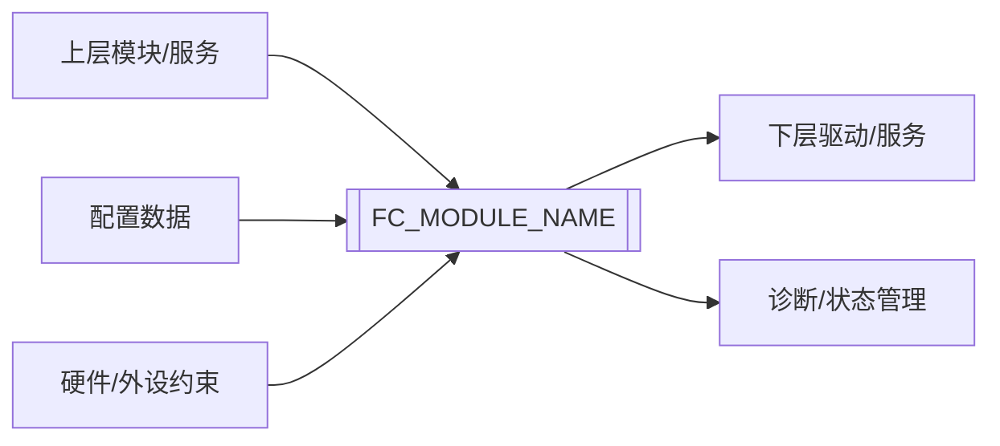
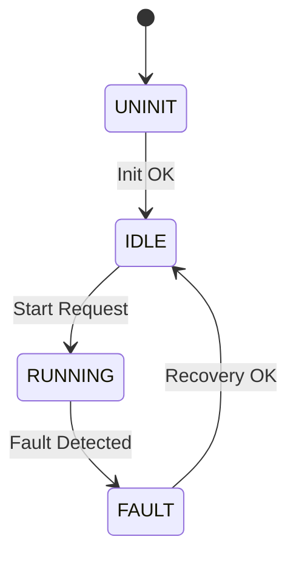

# 《[FC_MODULE_NAME] 模块架构设计规范》

| 项目 | 内容 |
| --- | --- |
| 文档编号 | SDD-[FC_SHORT_NAME]-001 |
| 模块名称 | [FC_MODULE_NAME] |
| 模块简称 | [FC_SHORT_NAME] |
| 软件版本 | [SW_VERSION] |
| 安全等级 | [QM / ASIL A / ASIL B / ASIL C / ASIL D] |
| 所属层级 | [ASW / BSW / IoExtDrv / CDD / MCAL / 其他] |
| 适用项目 | [PROJECT_NAME] |
| 文档状态 | [草稿 / 评审中 / 已发布 / 已废止] |
| 编制人 | [作者] |
| 编制日期 | YYYY-MM-DD |

---

## 文档修订记录

| 版本 | 日期 | 作者 | 变更说明 | 评审/批准 |
| --- | --- | --- | --- | --- |
| V0.1 | YYYY-MM-DD | [作者] | 初版创建 | [评审人] |
| V1.0 | YYYY-MM-DD | [作者] | 基线发布 | [批准人] |

---

## 目录

- [1 目的](#1-目的)
- [2 适用范围](#2-适用范围)
- [3 定义和缩写](#3-定义和缩写)
- [4 设计输入与追溯](#4-设计输入与追溯)
- [5 架构总览](#5-架构总览)
- [6 模块职责与边界](#6-模块职责与边界)
- [7 软件分层与文件结构](#7-软件分层与文件结构)
- [8 接口设计](#8-接口设计)
- [9 数据流设计](#9-数据流设计)
- [10 状态机与模式设计](#10-状态机与模式设计)
- [11 配置设计](#11-配置设计)
- [12 依赖与 Callout 设计](#12-依赖与-callout-设计)
- [13 时序与调度设计](#13-时序与调度设计)
- [14 资源设计](#14-资源设计)
- [15 诊断与错误处理设计](#15-诊断与错误处理设计)
- [16 安全机制设计](#16-安全机制设计)
- [17 多实例、多核与重入设计](#17-多实例多核与重入设计)
- [18 Memory Map 与集成设计](#18-memory-map-与集成设计)
- [19 需求到架构追溯](#19-需求到架构追溯)
- [20 架构验证策略](#20-架构验证策略)
- [21 架构评审检查清单](#21-架构评审检查清单)
- [22 支持/相关性文件](#22-支持相关性文件)

---

## 1 目的

本文档用于定义 `[FC_MODULE_NAME]` 模块的软件架构设计，明确模块在 FcStack 平台中的层级位置、职责边界、内部结构、接口、数据流、状态机、配置、依赖、时序、资源、诊断、安全机制、多实例/多核约束和集成方式。

本文档作为 `[FC_MODULE_NAME]` 模块后续软件详细设计（SDS）、编码实现、集成测试（IT）和系统测试（ST）的输入依据。

---

## 2 适用范围

本文档适用于 `[FC_MODULE_NAME]` 模块在 `[PROJECT_NAME]` 项目中的软件架构设计、评审、实现指导、集成和验证活动。

### 2.1 适用对象

- 软件架构/设计工程师
- 软件开发工程师
- 软件测试工程师
- 软件集成工程师
- 功能安全工程师
- 项目质量/配置管理人员

### 2.2 适用边界

本文档覆盖：

- `[FC_MODULE_NAME]` 模块的软件层级和职责边界
- `[FC_MODULE_NAME]` 模块对外接口和下层依赖
- `[FC_MODULE_NAME]` 模块内部架构分层、文件结构和数据流
- `[FC_MODULE_NAME]` 模块状态机、配置、时序、资源、诊断和安全机制设计
- `[FC_MODULE_NAME]` 模块多实例、多核、重入和集成约束

本文档不覆盖：

- 私有函数逐行处理逻辑
- 局部变量级算法细节
- 单元测试具体步骤
- 未经 SRS、芯片手册、标准或项目约束支撑的扩展功能
- 供应商 MCAL 或第三方软件内部实现细节，除非其直接影响本模块架构边界

---

## 3 定义和缩写

### 3.1 定义

| 术语 | 定义 |
| --- | --- |
| FC | Function Component，功能组件/功能模块。 |
| SDD | Software Design Description，软件架构设计说明。 |
| SRS | Software Requirements Specification，软件需求规范。 |
| SDS | Software Design Specification，软件详细设计规格。 |
| Callout | 本 FC 为实现功能而提出的下层依赖能力，由集成层适配到 MCAL、BSW、板级电路或其他 FC。 |
| 软件请求状态 | 上层最近一次成功请求并被模块接受的目标状态。 |
| 软件记录状态 | 模块内部保存的运行状态或请求状态。 |
| 硬件确认状态 | 模块通过硬件反馈、系统状态或设计策略确认的物理状态。 |
| 状态不可确认 | 当前设计无法可靠证明硬件处于某物理状态。 |
| TBD | To Be Determined，待确定，必须在评审中闭环。 |
| N/A | Not Applicable，不适用，应说明理由。 |

### 3.2 缩写

| 缩写 | 英文全称 | 中文说明 |
| --- | --- | --- |
| ASW | Application Software | 应用层软件 |
| BSW | Basic Software | 基础软件 |
| CDD | Complex Device Driver | 复杂设备驱动 |
| MCAL | Microcontroller Abstraction Layer | 微控制器抽象层 |
| IoHwAb | IO Hardware Abstraction | IO 硬件抽象 |
| RTE | Runtime Environment | 运行时环境 |
| DET | Default Error Tracer | 默认错误跟踪器 |
| DEM | Diagnostic Event Manager | 诊断事件管理器 |
| DTC | Diagnostic Trouble Code | 诊断故障码 |
| ASIL | Automotive Safety Integrity Level | 汽车安全完整性等级 |
| QM | Quality Management | 质量管理等级 |

---

## 4 设计输入与追溯

### 4.1 设计输入清单

| 输入类型 | 文档/条目 | 版本/章节 | 用途 |
| --- | --- | --- | --- |
| SRS | `[SRS文档名称]` | `[版本/章节]` | 软件行为、接口、配置和验证要求输入 |
| IRS | `[接口需求文档]` | `[版本/章节]` | 接口语义和数据交互输入 |
| 原始需求 | `[原始需求名称]` | `[章节/ID]` | 需求来源确认 |
| 芯片资料 | `[Datasheet/User Manual/Reference Manual]` | `[章节]` | 硬件能力、引脚、时序、寄存器约束 |
| 标准规范 | `[AUTOSAR/MISRA/ISO 26262]` | `[章节]` | 合规约束 |
| 平台规范 | `[FC开发指南/命名规范/MemMap]` | `[章节]` | 文件、接口、编码和集成约束 |
| 产品线/复用约束 | `[复用规范/平台适配规范]` | `[章节]` | 模块通用化、配置裁剪和可移植边界输入 |
| 安全输入 | `[Safety Concept/FSR/TSR]` | `[ID]` | 安全机制和 ASIL 边界 |

### 4.2 SRS 到 SDD 输入检查

| 输入项 | SRS 输入结论 | SDD 使用方式 | 状态 |
| --- | --- | --- | --- |
| 模块职责 | `[明确/待确认]` | `[定义模块边界和内部层级]` | `[Closed/Open]` |
| 对外接口 | `[明确/待确认]` | `[固化 API 名称、参数、返回值]` | `[Closed/Open]` |
| 模式/状态 | `[明确/待确认]` | `[建立状态机和状态语义]` | `[Closed/Open]` |
| 配置项 | `[明确/待确认]` | `[建立配置结构和校验策略]` | `[Closed/Open]` |
| 硬件约束 | `[明确/待确认]` | `[设计 Callout 或下层接口]` | `[Closed/Open]` |
| 错误类别 | `[明确/待确认]` | `[设计 DET/DEM/内部错误标记]` | `[Closed/Open]` |
| 多实例 | `[明确/待确认]` | `[设计 Instance ID 和实例隔离]` | `[Closed/Open]` |
| 多核 | `[明确/待确认]` | `[设计 Core ID、访问权限和同步策略]` | `[Closed/Open]` |
| 安全边界 | `[明确/待确认]` | `[设计安全机制和安全状态]` | `[Closed/Open]` |
| 验证策略 | `[明确/待确认]` | `[建立架构验证和 IT/ST 输入]` | `[Closed/Open]` |
| 通用化边界 | `[明确/待确认]` | `[区分通用架构、配置裁剪和集成约束]` | `[Closed/Open]` |
| 移植适配策略 | `[明确/待确认]` | `[定义配置/Callout/依赖抽象承担的差异]` | `[Closed/Open]` |

### 4.3 架构设计约束

| 约束ID | 约束来源 | 约束内容 | 影响范围 | 处理方式 |
| --- | --- | --- | --- | --- |
| SDD-[FC_SHORT_NAME]-ARCH-0001 | `[SRS/标准/平台规范/产品线约束/通用架构约束]` | `[架构约束描述]` | `[接口/状态/配置/安全]` | `[设计处理方式]` |

### 4.4 开放项与输入缺口

SDD 不得静默补齐 SRS 缺失或矛盾内容。所有影响架构判断的输入缺口均应登记，并回写 SRS 问题清单或设计决策记录。

| 开放项ID | 来源 | 问题描述 | 影响设计项 | 临时处理 | 关闭条件 | 状态 |
| --- | --- | --- | --- | --- | --- | --- |
| SDD-[FC_SHORT_NAME]-OPEN-0001 | `[SRS/手册/标准/评审]` | `[输入缺口或矛盾]` | `[SDD章节/ID]` | `[不设计/按约束设计/等待确认]` | `[关闭证据]` | `[Open/Closed/Accepted]` |

---

## 5 架构总览

### 5.1 模块架构摘要

| 项目 | 内容 |
| --- | --- |
| 模块名称 | `[FC_MODULE_NAME]` |
| 模块简称 | `[FC_SHORT_NAME]` |
| 所属层级 | `[ASW/BSW/IoExtDrv/CDD/MCAL]` |
| 安全等级 | `[QM/ASIL A/B/C/D]` |
| 运行方式 | `[周期/事件/同步调用/异步调度]` |
| 实例模型 | `[单实例/多实例]` |
| 多核模型 | `[单核/多核共享/多核隔离]` |
| 配置方式 | `[Pre-Compile/Link-Time/Post-Build]` |
| 主要依赖 | `[MCAL/BSW/IoHwAb/Callout/硬件资源]` |
| 主要输出 | `[API/信号/诊断/状态]` |

### 5.2 模块位置

```text
[Upper Layer / ASW / Service]
    |
    v
[FC_MODULE_NAME]
    |
    v
[IoHwAb / BSW Service / MCAL / External Device]
    |
    v
[Hardware]
```

说明：

- 上层调用者：`[上层模块/服务]`
- 下层依赖对象：`[下层驱动/服务/硬件]`
- 运行环境：`[Task/ISR/MainLoop/RTE/OS]`
- 与 AUTOSAR Classic 分层关系：`[说明]`

### 5.3 模块上下文图



### 5.4 当前配置与通用能力区分

| 能力 | 源码/芯片是否具备 | 当前项目是否启用 | 证据 | 说明 |
| --- | --- | --- | --- | --- |
| `[能力A]` | 是 | 是 | `[配置/Callout/任务/调用点]` | `[说明]` |
| `[能力B]` | 是 | 否 | `[配置关闭/无调用点]` | `[作为预留/非支持能力]` |

### 5.5 复用与适配边界

| 差异类型 | 架构承载方式 | 可变部分 | 不应改变的 FC 语义 | 验证方式 |
| --- | --- | --- | --- | --- |
| `[MCU/SoC差异]` | `[配置/Callout/依赖抽象]` | `[寄存器、驱动接口、通道映射]` | `[公共API语义/状态语义]` | `[Review/IT]` |
| `[板级连接差异]` | `[配置/Callout]` | `[极性、引脚、通道号]` | `[模式请求和错误处理语义]` | `[Review/IT]` |
| `[OS/调度差异]` | `[集成约束/调度配置]` | `[任务名、周期、调用点]` | `[MainFunction职责和同步/异步语义]` | `[Review/Analysis]` |

---

## 6 模块职责与边界

### 6.1 模块职责

| 职责ID | 职责描述 | 来源需求 | 下游设计入口 |
| --- | --- | --- | --- |
| SDD-[FC_SHORT_NAME]-ARCH-0001 | `[职责描述]` | `[SRS-ID]` | `[SDS章节/接口/状态机]` |
| SDD-[FC_SHORT_NAME]-ARCH-0002 | `[职责描述]` | `[SRS-ID]` | `[SDS章节/接口/状态机]` |

### 6.2 非职责边界

| 非职责项 | 不负责原因 | 由谁负责/如何处理 |
| --- | --- | --- |
| `[非职责能力]` | `[SRS未要求/硬件不支持/由下层负责]` | `[其他模块/不支持返回/配置关闭]` |

### 6.3 支持能力与非支持能力

| 能力 | 芯片/平台是否支持 | 本模块是否支持 | 处理方式 | 来源 |
| --- | --- | --- | --- | --- |
| `[能力A]` | 是 | 是 | `[接口/配置/状态机支持]` | `[SRS/手册]` |
| `[能力B]` | 是 | 否 | `[返回E_NOT_OK/配置禁止/不暴露接口]` | `[SRS/手册]` |

---

## 7 软件分层与文件结构

### 7.1 内部分层设计

```text
Realize Interface Layer
    |
Integrated Function Layer
    |
Atomic Function Layer
    |
Register Abstraction Layer
    |
Communication Layer
    |
Dependency Interface Layer
```

| 层级 | 是否使用 | 职责 | 主要文件/接口 | 设计依据 |
| --- | --- | --- | --- | --- |
| Realize Interface Layer | 是 | 对外 API、防御性检查、输入输出缓存 | `[FC].c/.h` | `[SRS-ID]` |
| Integrated Function Layer | `[是/否]` | 组合原子功能或操作序列 | `[文件/函数]` | `[SRS/SDD-ID]` |
| Atomic Function Layer | `[是/否]` | 单个原子动作 | `[文件/函数]` | `[SRS/SDD-ID]` |
| Register Abstraction Layer | `[是/否]` | 寄存器镜像和帧处理 | `[文件/函数]` | `[手册章节]` |
| Communication Layer | `[是/否]` | SPI/I2C/UART/CAN 通讯与重试 | `[文件/函数]` | `[SRS/手册]` |
| Dependency Interface Layer | 是 | Callout 或下层接口适配 | `[Callout文件]` | `[SRS/平台约束]` |

### 7.2 文件结构设计

| 类型 | 必需性 | 文件命名 | 内容 |
| --- | --- | --- | --- |
| Code | 必需 | `[FC_SHORT_NAME][_DESC].c/.h` | 功能实现、接口函数、内部函数、内部变量 |
| Cfg | 必需 | `[FC_SHORT_NAME][_DESC]_Cfg.c/.h`, `[FC_SHORT_NAME][_DESC]_CfgData.h` | 配置宏、配置数据声明/定义 |
| Cali | 可选 | `[FC_SHORT_NAME][_DESC]_Cali.c` | 标定参数 |
| Type | 必需 | `[FC_SHORT_NAME][_DESC]_Types.h` | 类型、枚举、结构体、特殊值域 |
| Callout | 可选 | `[FC_SHORT_NAME][_DESC]_Callout.c/.h` | 依赖接口实现和集成适配 |
| Mem | 必需 | `[FC_SHORT_NAME]_MemMap.h` | Memory section 映射 |

### 7.3 文件包含关系

```text
[FC_SHORT_NAME][_DESC].c
  -> [FC_SHORT_NAME][_DESC].h
  -> [FC_SHORT_NAME][_DESC]_Types.h
  -> [FC_SHORT_NAME][_DESC]_Cfg.h
  -> [FC_SHORT_NAME][_DESC]_CfgData.h
  -> [FC_SHORT_NAME][_DESC]_Callout.h
  -> [FC_SHORT_NAME]_MemMap.h
```

| 文件 | 直接包含 | 被谁包含 | 说明 |
| --- | --- | --- | --- |
| `[FC_SHORT_NAME][_DESC].h` | `[Types/Cfg]` | `[上层模块]` | 对外接口声明 |
| `[FC_SHORT_NAME][_DESC]_Types.h` | `[Std_Types.h]` | `[FC/配置/上层]` | 类型定义 |
| `[FC_SHORT_NAME][_DESC]_Cfg.h` | `[Types]` | `[FC].c` | 配置宏 |
| `[FC_SHORT_NAME][_DESC]_CfgData.h` | `[Types]` | `[FC].c/[Cfg].c` | 配置数据声明 |
| `[FC_SHORT_NAME][_DESC]_Callout.h` | `[Types]` | `[FC].c` | 依赖接口声明 |
| `[FC_SHORT_NAME]_MemMap.h` | N/A | `[FC].c/[Cfg].c` | 段映射 |

---

## 8 接口设计

### 8.1 API 汇总表

| API名称 | SDD ID | 来源需求 | 同步/异步 | 可重入 | 参数 | 返回值 | 调用约束 |
| --- | --- | --- | --- | --- | --- | --- | --- |
| `[FC_SHORT_NAME]_Init` | SDD-[FC_SHORT_NAME]-INTF-0001 | `[SRS-ID]` | Sync | Non-Reentrant | `[参数]` | `[返回值]` | `[调用时机]` |
| `[FC_SHORT_NAME]_MainFunction` | SDD-[FC_SHORT_NAME]-INTF-0002 | `[SRS-ID]` | Async | Non-Reentrant | None | void | `[周期]` |
| `[FC_SHORT_NAME]_GetStatus` | SDD-[FC_SHORT_NAME]-INTF-0003 | `[SRS-ID]` | Sync | `[Yes/No]` | `[参数]` | Std_ReturnType | `[前置条件]` |

### 8.2 API 详细设计属性

#### SDD-[FC_SHORT_NAME]-INTF-0001 `[API名称]`

| 属性 | 内容 |
| --- | --- |
| SDD ID | SDD-[FC_SHORT_NAME]-INTF-0001 |
| API 名称 | `[API_NAME]` |
| 需求来源 | `[SRS-ID]` |
| 服务 ID | `[Service ID/N/A]` |
| 同步/异步 | `[Synchronous/Asynchronous]` |
| 可重入性 | `[Reentrant/Non-Reentrant]` |
| 参数 in | `[参数名、类型、范围]` |
| 参数 inout | `[参数名、类型、范围]` |
| 参数 out | `[参数名、类型、范围、空指针行为]` |
| 返回值 | `[E_OK/E_NOT_OK/自定义状态语义]` |
| 前置条件 | `[初始化/配置/状态/调用上下文]` |
| 成功后置条件 | `[状态变化/输出更新/诊断变化]` |
| 失败后置条件 | `[状态保持/错误标记/返回值]` |
| 错误处理 | `[DET/内部错误/DEM/返回值]` |
| 下游 SDS | `[SDS-ID 或待分配]` |

### 8.3 信号/服务接口

| 接口对象 | 方向 | 数据类型 | 有效范围 | 初始值 | 更新时机 | 无效值/失效语义 |
| --- | --- | --- | --- | --- | --- | --- |
| `[SignalName]` | `[Input/Output]` | `[type]` | `[范围]` | `[初始值]` | `[周期/事件]` | `[说明]` |

---

## 9 数据流设计

### 9.1 数据流图

```text
Upper Layer Request
    -> Interface Input Buffer
    -> Runtime Context
    -> Function/State Machine
    -> Dependency Callout
    -> Hardware/Lower Layer
    -> Runtime Status
    -> Upper Layer Get API
```

### 9.2 数据对象清单

| 数据对象 | 类型 | 作用域 | 初始值 | 更新者 | 读取者 | 保护策略 | 来源 |
| --- | --- | --- | --- | --- | --- | --- | --- |
| `[RuntimeContext]` | `[struct]` | Static | `[默认值]` | `[函数]` | `[函数]` | `[临界区/无]` | `[SRS/SDD-ID]` |
| `[ConfigData]` | `[const struct]` | External | `[配置生成]` | `[Cfg.c]` | `[Init/API]` | N/A | `[CFG需求]` |

### 9.3 数据语义说明

| 数据项 | 语义类型 | 是否对外可见 | 更新条件 | 读取语义 |
| --- | --- | --- | --- | --- |
| `[Mode]` | `[软件请求状态/硬件确认状态/内部状态]` | `[是/否]` | `[条件]` | `[Get API 返回语义]` |
| `[Status]` | `[诊断状态/运行状态]` | `[是/否]` | `[条件]` | `[读取方式]` |

---

## 10 状态机与模式设计

### 10.1 状态集合

| 状态/模式 | 类型 | 初始状态 | 对外可见 | 进入条件 | 退出条件 | 状态语义 |
| --- | --- | --- | --- | --- | --- | --- |
| `[UNINIT]` | 内部状态 | 是 | `[是/否]` | `[复位后]` | `[Init成功]` | `[未初始化]` |
| `[IDLE]` | 运行状态 | `[是/否]` | 是 | `[条件]` | `[条件]` | `[空闲]` |
| `[FAULT]` | 故障状态 | 否 | 是 | `[故障条件]` | `[恢复条件]` | `[故障保持/降级]` |

### 10.2 状态转移表

| 当前状态 | 事件/触发 | 保护条件 | 动作 | 下一状态 | 异常处理 | 来源需求 |
| --- | --- | --- | --- | --- | --- | --- |
| `[UNINIT]` | `[Init调用]` | `[配置有效]` | `[初始化上下文]` | `[IDLE]` | `[返回E_NOT_OK]` | `[SRS-ID]` |

### 10.3 状态机图



### 10.4 非支持模式处理

| 非支持模式 | 来源 | 触发方式 | 处理方式 | 对外返回 |
| --- | --- | --- | --- | --- |
| `[UnsupportedMode]` | `[芯片手册/SRS]` | `[API请求/配置]` | `[拒绝/忽略/保持状态]` | `[E_NOT_OK/错误状态]` |

---

## 11 配置设计

### 11.1 配置项清单

| 配置项 | 类型 | 配置时机 | 默认值 | 有效范围 | 失效行为 | 来源需求 |
| --- | --- | --- | --- | --- | --- | --- |
| `[FC_CFG_INSTANCE_NUM]` | Macro | Pre-Compile | `[值]` | `[范围]` | `[编译错误/初始化失败]` | `[SRS-ID]` |
| `[FC_Config]` | Struct | Post-Build | `[配置生成]` | `[约束]` | `[E_NOT_OK/DET]` | `[SRS-ID]` |

### 11.2 配置结构设计

| 字段 | 类型 | 含义 | 范围 | 是否必填 | 一致性约束 |
| --- | --- | --- | --- | --- | --- |
| `[Field]` | `[type]` | `[说明]` | `[范围]` | 是 | `[与其他字段关系]` |

### 11.3 配置一致性规则

| 规则ID | 规则内容 | 检测时机 | 失败行为 |
| --- | --- | --- | --- |
| SDD-[FC_SHORT_NAME]-CFG-0001 | `[配置一致性规则]` | `[编译期/初始化/运行期]` | `[编译错误/E_NOT_OK/DET]` |

---

## 12 依赖与 Callout 设计

### 12.1 依赖清单

| 依赖对象 | 依赖类型 | 调用方向 | 用途 | 失败反馈 | 替代/Stub 策略 |
| --- | --- | --- | --- | --- | --- |
| `[MCAL_Dio]` | MCAL | FC -> MCAL | `[控制引脚]` | `[返回值/无返回]` | `[Callout固定返回/Stub]` |
| `[ExternalService]` | BSW Service | FC -> Service | `[获取状态]` | `[E_NOT_OK]` | `[配置为NULL/Stub]` |

### 12.2 Callout 设计

| Callout | 输入 | 输出 | 返回值 | 功能语义 | 集成要求 |
| --- | --- | --- | --- | --- | --- |
| `[FC_SHORT_NAME]_Callout_SetPin` | `[期望电平]` | None | boolean | 控制外设管脚到期望逻辑电平 | 若板级有反相电路，在 Callout 内转换 |

### 12.3 Callout 失败处理

| Callout | 失败条件 | FC 内部处理 | 对外影响 | 诊断记录 |
| --- | --- | --- | --- | --- |
| `[Callout]` | `[下层返回失败/状态不可确认]` | `[重试/置故障/进入安全状态]` | `[接口返回/状态变化]` | `[内部故障/DEM]` |

---

## 13 时序与调度设计

### 13.1 调度模型

| 调度项 | 类型 | 周期/触发 | 执行上下文 | 最大执行时间 | 来源需求 |
| --- | --- | --- | --- | --- | --- |
| `[FC_SHORT_NAME]_MainFunction` | Periodic | `[1ms/5ms/10ms]` | `[Task/ISR/MainLoop]` | `[预算]` | `[SRS-TIM-ID]` |
| `[API]` | Event | `[上层调用]` | `[Task]` | `[预算]` | `[SRS-INTF-ID]` |

### 13.2 同步/异步语义

| 行为 | 语义说明 |
| --- | --- |
| 同步 API | `[是否在调用返回前完成动作]` |
| 异步 API | `[是否只缓存请求，由 MainFunction 后续处理]` |
| MainFunction | `[处理周期、输入采样、输出更新]` |
| Get API | `[返回上次结果/当前请求状态/硬件确认状态]` |
| 超时/忙状态 | `[处理策略]` |

### 13.3 时序约束

| 约束项 | 目标值 | 适用场景 | 验证方式 |
| --- | --- | --- | --- |
| `[响应时间]` | `[数值/待评估]` | `[API/状态转换]` | `[UT/IT/Analysis]` |
| `[硬件稳定时间]` | `[数值/由调用方保证]` | `[模式切换/初始化]` | `[IT/ST]` |

---

## 14 资源设计

### 14.1 资源预算

| 资源 | 预算/估算 | 评估方式 | 验证阶段 | 备注 |
| --- | --- | --- | --- | --- |
| ROM | `[预算或待评估]` | `[Map文件/工具]` | IT | `[说明]` |
| RAM | `[预算或待评估]` | `[Map文件/工具]` | IT | `[与实例数关系]` |
| Stack | `[预算或待评估]` | `[静态分析/运行监控]` | UT/IT | `[最大调用链]` |
| CPU Load | `[预算或待评估]` | `[测量/估算]` | IT/ST | `[周期任务影响]` |

### 14.2 资源与配置关系

| 资源对象 | 与配置关系 | 计算方式 | 说明 |
| --- | --- | --- | --- |
| `[Runtime数组]` | `[实例数/通道数]` | `[sizeof(type) * N]` | `[说明]` |

---

## 15 诊断与错误处理设计

### 15.1 错误类别

| 错误类别 | 触发条件 | 检测位置 | 记录方式 | 对外行为 | 来源需求 |
| --- | --- | --- | --- | --- | --- |
| 未初始化 | Init 未成功时调用 API | Interface Layer | DET/内部错误 | E_NOT_OK，状态不变 | `[SRS-ID]` |
| 空指针 | 输出参数为 NULL | Interface Layer | DET/内部错误 | E_NOT_OK | `[SRS-ID]` |
| 硬件故障 | 下层反馈失败或硬件状态异常 | Function/Dependency Layer | 内部故障/DEM | `[故障状态]` | `[SRS-ID]` |

### 15.2 DET/DEM/内部错误边界

| 错误项 | DET | DEM/DTC | 内部错误标记 | 是否受 DET 开关影响 | 说明 |
| --- | --- | --- | --- | --- | --- |
| `[未初始化]` | 是 | 否 | 是 | 是 | `[说明]` |
| `[硬件故障]` | 否 | `[是/否]` | 是 | 否 | `[说明]` |

### 15.3 错误标记设计

| 标记 | 类型 | Bit/值 | 含义 | 置位条件 | 清除条件 |
| --- | --- | --- | --- | --- | --- |
| `[ErrorStatus]` | `[uint8/uint16/uint32]` | `[0x01]` | `[错误含义]` | `[条件]` | `[Init/恢复/不可清除]` |

---

## 16 安全机制设计

### 16.1 安全机制清单

| 安全机制 | 关联安全需求 | ASIL | 检测对象 | 故障响应 | 安全状态 | 验证方式 |
| --- | --- | --- | --- | --- | --- | --- |
| `[机制]` | `[SRS-SAFE-ID/FSR/TSR]` | `[ASIL]` | `[故障对象]` | `[响应动作]` | `[状态]` | `[Review/Test/Analysis]` |

### 16.2 安全状态与降级路径

| 故障/事件 | 检测条件 | 响应动作 | 安全状态 | 恢复条件 | 验证入口 |
| --- | --- | --- | --- | --- | --- |
| `[故障]` | `[条件]` | `[动作]` | `[Safe State]` | `[条件]` | `[UT/IT/ST]` |

### 16.3 安全分析说明

- 故障假设：`[说明]`
- 检测条件：`[说明]`
- 故障反应时间或时序约束：`[说明]`
- 安全状态进入条件：`[说明]`
- 降级策略：`[说明]`
- 恢复策略：`[说明]`
- 诊断输出：`[说明]`
- 测试或分析证据：`[说明]`

---

## 17 多实例、多核与重入设计

### 17.1 多实例设计

| 实例项 | 设计要求 |
| --- | --- |
| Instance ID 范围 | `[0..N-1]` |
| 实例到配置映射 | `[Config[InstanceId]]` |
| 实例到运行时数据映射 | `[Runtime[InstanceId]]` |
| 无效实例处理 | `[E_NOT_OK/DET/状态不变]` |
| 实例隔离 | `[独立状态/共享资源保护]` |

### 17.2 多核设计

| 核相关项 | 设计要求 |
| --- | --- |
| 支持核 | `[Core0/Core1/...]` |
| Core ID 来源 | `[Callout/OS/MCAL]` |
| 核访问权限 | `[哪些核可访问哪些实例]` |
| 共享数据 | `[共享对象列表]` |
| 同步策略 | `[关中断/Spinlock/SchM/无共享]` |
| 非法核处理 | `[E_NOT_OK/DET/忽略]` |

### 17.3 重入设计

| 接口 | 是否可重入 | 共享资源 | 保护策略 | 说明 |
| --- | --- | --- | --- | --- |
| `[API]` | `[Yes/No]` | `[对象]` | `[临界区/无]` | `[约束]` |

---

## 18 Memory Map 与集成设计

### 18.1 Memory Section 清单

| 对象类型 | Section 宏 | 文件 | 说明 |
| --- | --- | --- | --- |
| Code | `[FC_SHORT_NAME]_START_SEC_CODE` / `[FC_SHORT_NAME]_STOP_SEC_CODE` | `[FC_SHORT_NAME]_MemMap.h` | 接口和内部函数 |
| Const | `[FC_SHORT_NAME]_START_SEC_CONST_UNSPECIFIED` | `[FC_SHORT_NAME]_MemMap.h` | 配置常量 |
| Var | `[FC_SHORT_NAME]_START_SEC_VAR_CLEARED_UNSPECIFIED` | `[FC_SHORT_NAME]_MemMap.h` | 运行时变量 |

### 18.2 构建与集成点

| 集成项 | 设计说明 | 负责人/位置 |
| --- | --- | --- |
| 构建系统 | `[如何加入构建]` | `[路径/负责人]` |
| Include 路径 | `[头文件暴露范围]` | `[路径]` |
| 配置文件 | `[手写/工具生成/项目集成]` | `[路径]` |
| Callout | `[由谁实现]` | `[路径]` |
| MemMap | `[是否新增段]` | `[路径]` |
| OS/RTE/SchM | `[集成方式]` | `[路径]` |

---

## 19 需求到架构追溯

| SRS ID | SRS 主题 | SDD ID | 设计项 | 下游 SDS/接口/测试入口 | 状态 |
| --- | --- | --- | --- | --- | --- |
| `[SRS-ID]` | `[需求标题]` | `[SDD-ID]` | `[架构设计项]` | `[SDS/ITS/STS]` | `[Covered/Open/N/A]` |

### 19.1 未覆盖项说明

| SRS ID | 未覆盖原因 | 处理计划 | 负责人 | 关闭期限 |
| --- | --- | --- | --- | --- |
| `[SRS-ID]` | `[原因]` | `[补充设计/需求变更/N/A理由]` | `[负责人]` | `[日期]` |

---

## 20 架构验证策略

### 20.1 验证方式

| 设计对象 | 验证方式 | 验证阶段 | 验证内容 |
| --- | --- | --- | --- |
| 模块边界 | Review | SDD | 职责是否清晰、是否无越界功能 |
| 接口设计 | Review/Test | SDD/IT | 参数、返回值、错误行为是否一致 |
| 状态机 | Review/Test | SDD/UT/IT | 转移完整性、非法状态、安全状态 |
| 时序资源 | Analysis/Test | SDD/IT/ST | 周期、执行时间、资源预算 |
| 安全机制 | Review/Test/Analysis | SDD/UT/IT/ST | 故障检测、响应、降级和恢复 |

### 20.2 IT/ST 输入清单

| 验证项 | 测试阶段 | 输入设计 | 预期验证目标 |
| --- | --- | --- | --- |
| `[接口契约]` | IT | `[接口设计章节]` | `[参数/返回/错误行为一致]` |
| `[系统行为]` | ST | `[状态机/安全机制]` | `[满足SRS]` |

---

## 21 架构评审检查清单

### 21.1 文档完整性检查

- [ ] 是否列出所有设计输入？
- [ ] 是否明确模块职责和非职责边界？
- [ ] 是否说明模块在 AUTOSAR/FcStack 架构中的位置？
- [ ] 是否包含架构图、上下文图或数据流图？
- [ ] 是否定义文件结构和包含关系？
- [ ] 是否定义所有对外 API？
- [ ] 是否定义配置项、状态机、数据流和依赖关系？
- [ ] 是否定义时序、资源、诊断、安全和多核约束？
- [ ] 是否提供 SRS 到 SDD 的追溯？
- [ ] 是否给出架构验证策略？
- [ ] 是否登记所有 SRS 输入缺口、开放项和待确认设计决策？
- [ ] 是否区分通用架构、当前配置启用能力和集成示例？

### 21.2 技术正确性检查

- [ ] 架构是否只实现 SRS 已定义能力？
- [ ] 是否避免把芯片存在能力误写成本模块支持能力？
- [ ] 是否区分软件请求状态、软件记录状态、硬件确认状态和不可确认状态？
- [ ] 接口返回值语义是否清晰？
- [ ] DET、DEM、内部错误和硬件故障边界是否清晰？
- [ ] 多实例、多核和重入策略是否可实施？
- [ ] Callout 是否隐藏项目级/板级差异？
- [ ] 同步/异步和 MainFunction 语义是否明确？
- [ ] 是否存在循环依赖或不合理层级穿透？
- [ ] 安全机制是否有来源、响应和验证方式？
- [ ] 是否避免把单一项目的目录、任务名、通道号或板级接法固化为 FC 通用架构？
- [ ] 配置、Callout 和依赖抽象是否足以承担跨平台差异？

### 21.3 下游可用性检查

- [ ] SDS 是否能据此编写函数级设计？
- [ ] Coding 是否能据此确定文件、接口、配置和 MemMap？
- [ ] IT 是否能据此设计接口、配置、调度和资源测试？
- [ ] ST 是否能据此验证系统级需求和安全机制？
- [ ] 追溯矩阵是否能连接 SRS、SDD、SDS、Code、Test？

---

## 22 支持/相关性文件

| 文档名称 | 用途 |
| --- | --- |
| 汽车电子 V 模型开发过程与规范要求 | FcStack 整体开发流程和阶段出口准则 |
| FC架构设计编写规范 | SDD 编写规则和架构设计约束 |
| FC需求编写规范 | SRS 到 SDD 的输入约束 |
| Template-FC模块软件需求规范 | SRS 模板和需求属性结构 |
| G-C050 需求质量标准 | 需求质量和评审准则 |
| G-C119 FC开发指南（C语言） | FC 文件结构、分层设计、接口、防御性编程和编码约束 |
| G-C046 软件接口命名规范 | 接口、函数、变量和类型命名规则 |
| G-C045 软件模块命名规范 | 模块和版本命名规则 |
| C代码注释关键字 | SDS/代码解析所需注释关键字 |
| MemoryLayout段定义 | Memory Map 和段定义约束 |
| G-C068 代码静态分析操作手册 | 静态分析和质量报告要求 |

---

*本文档为 FcStack 项目 FC 模块架构设计模板，使用时应将占位符替换为具体模块信息，并保持 SRS-SDD-SDS-Code-Test 可追溯。*
*版本：1.0.0 | 维护：FcStack 开发团队 | 日期：2026-05-15*
