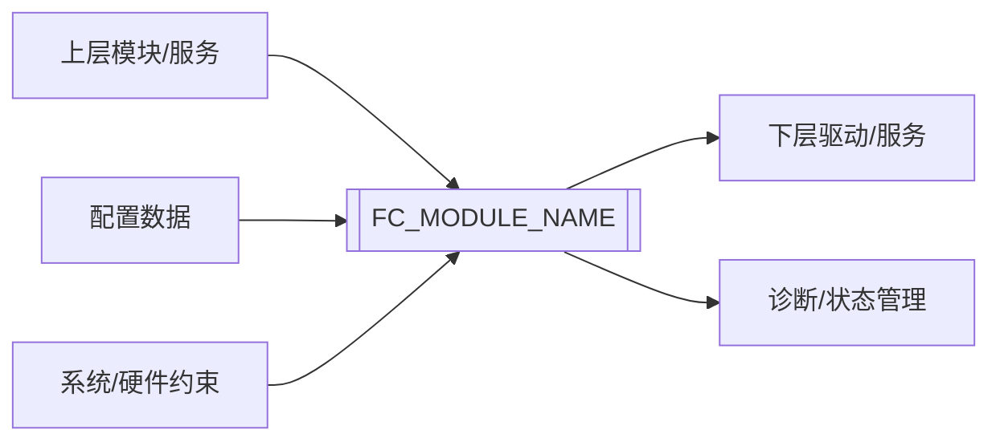

# 《[FC_MODULE_NAME] 软件需求规范》

| 项目 | 内容 |
| --- | --- |
| 文档编号 | SRS-[FC_SHORT_NAME]-001 |
| 模块名称 | [FC_MODULE_NAME] |
| 模块简称 | [FC_SHORT_NAME] |
| 软件版本 | [SW_VERSION] |
| 安全等级 | [QM / ASIL A / ASIL B / ASIL C / ASIL D] |
| 适用项目/平台 | [PROJECT_NAME / PLATFORM_NAME / N/A] |
| 文档状态 | [Draft / Review / Baselined / Deprecated] |
| 编制人 | [作者] |
| 编制日期 | YYYY-MM-DD |

---

## 文档修订记录

| 版本 | 日期 | 作者 | 变更说明 | 评审/批准 |
| --- | --- | --- | --- | --- |
| V0.1 | YYYY-MM-DD | [作者] | 初版创建 | [评审人] |
| V1.0 | YYYY-MM-DD | [作者] | 基线发布 | [批准人] |

---

## 目录

- [1 目的](#1-目的)
- [2 适用范围](#2-适用范围)
- [3 定义和缩写](#3-定义和缩写)
- [4 概述](#4-概述)
- [5 软件需求](#5-软件需求)
- [6 非功能需求](#6-非功能需求)
- [7 约束与假设](#7-约束与假设)
- [8 需求追溯](#8-需求追溯)
- [9 验证策略](#9-验证策略)
- [10 SRS 评审检查清单](#10-srs-评审检查清单)
- [附录A 需求条目清单](#附录a-需求条目清单)
- [支持/相关性文件](#支持相关性文件)

---

## 1 目的

本文档用于定义 `[FC_MODULE_NAME]` 模块的软件需求，明确模块的功能、接口、配置、初始化、模式/状态、诊断、安全、异常处理、时序、资源、约束及验证要求。

本文档作为 `[FC_MODULE_NAME]` 模块后续软件架构设计、详细设计、编码实现、单元测试、集成测试和系统测试的输入依据。

---

## 2 适用范围

本文档适用于 `[FC_MODULE_NAME]` 模块在 `[PROJECT_NAME / PLATFORM_NAME / N/A]` 范围内的软件开发、集成、测试、评审和交付活动。

若模块需要适配不同 ECU、SoC、板级连接关系或项目集成环境，差异应作为配置约束、Callout 适配或集成环境前提描述，不应改变 FC 的通用职责和稳定接口语义。

### 2.1 适用对象

- 软件需求工程师
- 软件架构/设计工程师
- 软件开发工程师
- 软件测试工程师
- 功能安全工程师
- 项目质量/配置管理人员

### 2.2 适用边界

本文档覆盖：

- `[FC_MODULE_NAME]` 模块对外可见的软件行为
- `[FC_MODULE_NAME]` 模块接口、输入、输出和配置需求
- `[FC_MODULE_NAME]` 模块初始化、去初始化、模式/状态和异常处理需求
- `[FC_MODULE_NAME]` 模块诊断、安全、时序、资源和合规约束
- `[FC_MODULE_NAME]` 模块作为 SDD 输入所需的前置条件、状态语义、错误类别和验证要求

本文档不覆盖：

- 详细软件架构分解方案
- 具体代码实现细节
- 单元测试用例详细步骤
- 硬件电气设计细节，除非其直接影响软件需求
- 未经原始需求、芯片手册、标准或项目约束支撑的功能扩展

---

## 3 定义和缩写

### 3.1 定义

| 术语 | 定义 |
| --- | --- |
| FC | Function Component，功能组件/功能模块。 |
| 软件需求 | 对软件外部可观察行为、约束、接口或质量属性的规定。 |
| 软件请求状态 | 上层最近一次成功请求并被模块接受的目标状态。 |
| 硬件确认状态 | 模块通过硬件反馈、系统状态或设计策略确认的物理状态。若无法可靠确认，不得将软件请求状态描述为硬件确认状态。 |
| 对外支持模式 | 模块公共接口允许上层请求或读取的模式集合。 |
| 非支持模式 | 外部对象或芯片可能存在，但本模块公共接口不支持的模式。 |
| 可追溯性 | 需求与来源、设计、实现、测试之间可建立双向关联的能力。 |
| TBD | To Be Determined，待确定。 |
| N/A | Not Applicable，不适用。 |

### 3.2 缩写

| 缩写 | 英文全称 | 中文说明 |
| --- | --- | --- |
| SRS | Software Requirement Specification | 软件需求规范 |
| SDD | Software Design Description | 软件设计说明 |
| UT | Unit Test | 单元测试 |
| IT | Integration Test | 集成测试 |
| ST | System Test | 系统测试 |
| ASIL | Automotive Safety Integrity Level | 汽车安全完整性等级 |
| QM | Quality Management | 质量管理等级 |
| BSW | Basic Software | 基础软件 |
| MCAL | Microcontroller Abstraction Layer | 微控制器抽象层 |
| RTE | Runtime Environment | 运行时环境 |
| DEM | Diagnostic Event Manager | 诊断事件管理器 |
| DET | Default Error Tracer | 默认错误跟踪器 |
| DTC | Diagnostic Trouble Code | 诊断故障码 |

---

## 4 概述

### 4.1 模块背景

`[FC_MODULE_NAME]` 模块用于 `[简述模块产生背景、业务目标、项目动机或客户需求]`。

本模块的软件职责边界为：`[说明模块做什么、不做什么；例如仅负责模式控制，不负责报文处理]`。

### 4.2 模块目标

`[FC_MODULE_NAME]` 模块目标如下：

1. `[目标1：例如提供初始化接口]`
2. `[目标2：例如提供模式/状态设置接口]`
3. `[目标3：例如提供模式/状态读取接口]`
4. `[目标4：例如支持多实例配置]`
5. `[目标5：例如支持多核访问控制]`
6. `[目标6：例如为 SDD 提供明确输入，包括状态语义、错误类别、引脚/接口约束]`

### 4.3 模块位置

`[FC_MODULE_NAME]` 位于软件架构中的 `[ASW/BSW/IoExtDrv/MCAL/其他]` 层，与以下对象交互：

| 交互对象 | 交互方向 | 交互内容 | 接口形式 |
| --- | --- | --- | --- |
| `[上层模块]` | 输入 | `[初始化/设置/读取/控制请求]` | `[C API/RTE/回调]` |
| `[下层驱动/服务]` | 输出/输入 | `[信号控制/状态读取/服务调用]` | `[MCAL/DIO/SPI/I2C/RTE/API]` |
| `[配置模块]` | 输入 | `[实例数/参数/引脚/状态策略配置]` | `[配置结构/编译期配置/Post-Build配置]` |
| `[系统/硬件约束]` | 约束输入 | `[供电/引脚/外设/安全/时序约束]` | `[系统设计/硬件设计输入]` |

### 4.4 模块上下文图

### 4.5 模式与状态概览

#### 4.5.1 对外支持模式/状态

| 模式/状态 | 是否对外支持 | 进入条件 | 退出条件 | 状态语义 |
| --- | --- | --- | --- | --- |
| `[ModeA]` | 是 | `[进入条件]` | `[退出条件]` | `[软件请求/物理确认/内部状态说明]` |
| `[ModeB]` | 是 | `[进入条件]` | `[退出条件]` | `[软件请求/物理确认/内部状态说明]` |
| `[UnsupportedMode]` | 否 | N/A | N/A | `[不支持原因及处理方式]` |

#### 4.5.2 外设/硬件模式映射

| 外设/硬件模式 | 控制条件 | 是否对外支持 | 与软件模式关系 |
| --- | --- | --- | --- |
| `[HW_MODE_A]` | `[控制引脚/寄存器/命令]` | 是/否 | `[映射关系]` |
| `[HW_MODE_B]` | `[控制引脚/寄存器/命令]` | 是/否 | `[映射关系]` |

#### 4.5.3 状态读取语义

| 状态项 | 对外语义 | 确认方式 | 说明 |
| --- | --- | --- | --- |
| `[GetMode/GetStatus返回项]` | `[软件请求状态/硬件确认状态/受控映射]` | `[软件记录/硬件反馈/诊断输入/不确认]` | `[约束说明]` |

---

## 5 软件需求

每条需求应只描述一个可验证的软件行为或约束，不应把多个独立行为合并到同一条需求中。

### 5.1 功能需求

| 需求ID | 需求标题 | 简介 | 来源 | ASIL | 验证方式 | 验证阶段 | 状态 |
| --- | --- | --- | --- | --- | --- | --- | --- |
| SRS-[FC_SHORT_NAME]-FUNC-0001 | `[功能需求标题]` | `[一句话概括功能能力]` | `[来源ID/章节]` | `[QM/ASIL]` | Test | UT/IT | Draft |
| SRS-[FC_SHORT_NAME]-FUNC-0002 | `[功能需求标题]` | `[一句话概括功能能力]` | `[来源ID/章节]` | `[QM/ASIL]` | Test | UT/IT | Draft |

#### SRS-[FC_SHORT_NAME]-FUNC-0001 `[功能需求标题]`

| 属性 | 内容 |
| --- | --- |
| 需求ID | SRS-[FC_SHORT_NAME]-FUNC-0001 |
| 需求标题 | `[功能需求标题]` |
| 需求描述 | `[FC_MODULE_NAME]` 模块应 `[明确、单一、可验证的软件行为]`。 |
| 需求来源 | `[原始需求ID/系统需求ID/芯片手册章节/标准条款]` |
| ASIL等级 | `[QM/ASIL A/ASIL B/ASIL C/ASIL D]` |
| 前置条件 | `[模块已初始化/配置有效/目标实例已配置/当前内核已使能]` |
| 触发条件 | `[API调用/周期任务/输入信号变化/配置加载]` |
| 输入 | `[输入参数/信号/配置/状态]` |
| 输出 | `[返回值/输出参数/信号/状态变化]` |
| 异常/边界条件 | `[异常输入、边界值、无效状态、失败后置条件]` |
| 验证方式 | `[Review/Analysis/Test/Inspection]` |
| 验证阶段 | `[UT/IT/ST/SDD/Coding]` |
| 状态 | Draft |

#### SRS-[FC_SHORT_NAME]-FUNC-0002 `[功能需求标题]`

| 属性 | 内容 |
| --- | --- |
| 需求ID | SRS-[FC_SHORT_NAME]-FUNC-0002 |
| 需求标题 | `[功能需求标题]` |
| 需求描述 | 当 `[触发条件]` 时，`[FC_MODULE_NAME]` 模块应 `[预期行为]`。 |
| 需求来源 | `[原始需求ID/系统需求ID/芯片手册章节/标准条款]` |
| ASIL等级 | `[QM/ASIL A/ASIL B/ASIL C/ASIL D]` |
| 前置条件 | `[前置条件]` |
| 触发条件 | `[触发条件]` |
| 输入 | `[输入]` |
| 输出 | `[输出]` |
| 异常/边界条件 | `[异常/边界条件]` |
| 验证方式 | `[Review/Analysis/Test/Inspection]` |
| 验证阶段 | `[UT/IT/ST/SDD/Coding]` |
| 状态 | Draft |

### 5.2 接口需求

| 需求ID | 需求标题 | 简介 | 来源 | ASIL | 验证方式 | 验证阶段 | 状态 |
| --- | --- | --- | --- | --- | --- | --- | --- |
| SRS-[FC_SHORT_NAME]-INTF-0001 | `[初始化接口]` | `[提供初始化能力]` | `[来源ID]` | `[QM/ASIL]` | Test | UT/IT | Draft |
| SRS-[FC_SHORT_NAME]-INTF-0002 | `[设置接口]` | `[提供设置/控制能力]` | `[来源ID]` | `[QM/ASIL]` | Test | UT/IT | Draft |
| SRS-[FC_SHORT_NAME]-INTF-0003 | `[读取接口]` | `[提供状态/模式读取能力]` | `[来源ID]` | `[QM/ASIL]` | Test | UT/IT | Draft |

#### SRS-[FC_SHORT_NAME]-INTF-0001 `[接口需求标题]`

| 属性 | 内容 |
| --- | --- |
| 需求ID | SRS-[FC_SHORT_NAME]-INTF-0001 |
| 需求标题 | `[接口需求标题]` |
| 需求描述 | 模块应提供 `[接口能力]`，用于 `[接口用途]`。 |
| 需求来源 | `[来源ID/章节]` |
| ASIL等级 | `[QM/ASIL]` |
| 前置条件 | `[调用前置条件]` |
| 触发条件 | `[上层调用/系统启动/周期调度]` |
| 输入 | `[参数/信号/配置]` |
| 输出 | `[返回值/输出参数/状态变化]` |
| 异常/边界条件 | `[空指针/非法实例/未初始化/权限不足]` |
| 验证方式 | Test |
| 验证阶段 | UT/IT |
| 状态 | Draft |

#### 5.2.1 API接口清单

| API名称 | 方向 | 同步/异步 | 可重入 | 参数 | 返回值 | 调用约束 |
| --- | --- | --- | --- | --- | --- | --- |
| `[Fc_Init]` | Input | Sync | No | `[参数列表]` | `[返回值]` | `[调用时机/前置条件/成功后置条件/失败后置条件]` |
| `[Fc_SetMode/Fc_SetState]` | Input | Sync | No | `[参数列表]` | `[返回值]` | `[支持模式/状态/边界条件]` |
| `[Fc_GetMode/Fc_GetStatus]` | Output | Sync | Yes/No | `[参数列表]` | `[返回值]` | `[返回的软件状态语义/物理确认语义]` |

#### 5.2.2 信号/数据接口清单

| 信号/数据名称 | 方向 | 数据类型 | 有效范围 | 初始值 | 无效值 | 单位 | 更新周期 |
| --- | --- | --- | --- | --- | --- | --- | --- |
| `[SignalName]` | Input | `[uint8/boolean/enum]` | `[范围]` | `[初值]` | `[无效值]` | `[单位]` | `[周期/按需]` |
| `[SignalName]` | Output | `[uint8/boolean/enum]` | `[范围]` | `[初值]` | `[无效值]` | `[单位]` | `[周期/按需]` |

### 5.3 配置需求

| 需求ID | 需求标题 | 简介 | 来源 | ASIL | 验证方式 | 验证阶段 | 状态 |
| --- | --- | --- | --- | --- | --- | --- | --- |
| SRS-[FC_SHORT_NAME]-CFG-0001 | `[配置项名称]` | `[配置能力简介]` | `[来源ID]` | `[QM/ASIL]` | Review/Test | UT/IT | Draft |
| SRS-[FC_SHORT_NAME]-CFG-0002 | `[配置一致性]` | `[配置校验简介]` | `[来源ID]` | `[QM/ASIL]` | Review/Test | UT/IT | Draft |

#### SRS-[FC_SHORT_NAME]-CFG-0001 `[配置需求标题]`

| 属性 | 内容 |
| --- | --- |
| 需求ID | SRS-[FC_SHORT_NAME]-CFG-0001 |
| 需求标题 | `[配置需求标题]` |
| 需求描述 | 模块应支持通过 `[配置项名称]` 配置 `[行为/参数]`。 |
| 需求来源 | `[来源ID/章节]` |
| ASIL等级 | `[QM/ASIL]` |
| 前置条件 | `[配置生成/编译前/初始化前]` |
| 触发条件 | `[配置校验/初始化/接口调用]` |
| 输入 | `[配置项、默认值、有效范围、配置时机]` |
| 输出 | `[配置生效行为/配置错误]` |
| 异常/边界条件 | `[配置越界/配置缺失/配置冲突]` |
| 验证方式 | Review/Test |
| 验证阶段 | UT/IT |
| 状态 | Draft |

### 5.4 初始化与去初始化需求

| 需求ID | 需求标题 | 简介 | 来源 | ASIL | 验证方式 | 验证阶段 | 状态 |
| --- | --- | --- | --- | --- | --- | --- | --- |
| SRS-[FC_SHORT_NAME]-INIT-0001 | 初始化默认状态 | `[初始化后的默认状态]` | `[来源ID]` | `[QM/ASIL]` | Test | UT/IT | Draft |
| SRS-[FC_SHORT_NAME]-INIT-0002 | 重复初始化处理 | `[重复初始化策略]` | `[来源ID]` | `[QM/ASIL]` | Review/Test | UT/IT | Draft |
| SRS-[FC_SHORT_NAME]-INIT-0003 | 去初始化处理 | `[去初始化后的状态]` | `[来源ID]` | `[QM/ASIL]` | Review/Test | UT/IT | Draft |

#### SRS-[FC_SHORT_NAME]-INIT-0001 初始化默认状态

| 属性 | 内容 |
| --- | --- |
| 需求ID | SRS-[FC_SHORT_NAME]-INIT-0001 |
| 需求标题 | 初始化默认状态 |
| 需求描述 | 模块初始化成功后应将 `[内部状态/外设状态/输出信号]` 设置为 `[默认状态]`。 |
| 需求来源 | `[来源ID/章节]` |
| ASIL等级 | `[QM/ASIL]` |
| 前置条件 | `[下层依赖可用/配置有效]` |
| 触发条件 | `[初始化接口调用]` |
| 输入 | `[配置数据/初始化参数]` |
| 输出 | `[默认状态/返回值/输出信号]` |
| 异常/边界条件 | `[配置无效/依赖不可用/重复初始化]` |
| 验证方式 | Test |
| 验证阶段 | UT/IT |
| 状态 | Draft |

### 5.5 模式管理需求

| 需求ID | 需求标题 | 简介 | 来源 | ASIL | 验证方式 | 验证阶段 | 状态 |
| --- | --- | --- | --- | --- | --- | --- | --- |
| SRS-[FC_SHORT_NAME]-MODE-0001 | `[模式/状态名称]` | `[模式行为简介]` | `[来源ID]` | `[QM/ASIL]` | Test | UT/IT | Draft |
| SRS-[FC_SHORT_NAME]-MODE-0002 | 非支持模式 | `[非支持模式处理]` | `[来源ID]` | `[QM/ASIL]` | Test | UT | Draft |
| SRS-[FC_SHORT_NAME]-MODE-0003 | 状态读取语义 | `[软件请求/物理确认/内部状态语义]` | `[来源ID]` | `[QM/ASIL]` | Review/Test | UT/IT | Draft |

#### SRS-[FC_SHORT_NAME]-MODE-0001 `[模式/状态需求标题]`

| 属性 | 内容 |
| --- | --- |
| 需求ID | SRS-[FC_SHORT_NAME]-MODE-0001 |
| 需求标题 | `[模式/状态需求标题]` |
| 需求描述 | 模块在 `[模式/状态]` 下应 `[模式行为、输出控制、状态语义]`。 |
| 需求来源 | `[来源ID/章节]` |
| ASIL等级 | `[QM/ASIL]` |
| 前置条件 | `[前置条件]` |
| 触发条件 | `[进入模式/退出模式/读取状态]` |
| 输入 | `[目标模式/状态/信号/配置]` |
| 输出 | `[控制输出/状态记录/接口返回值]` |
| 异常/边界条件 | `[非支持模式/过渡状态/无法确认状态]` |
| 验证方式 | `[Review/Analysis/Test]` |
| 验证阶段 | `[UT/IT/ST]` |
| 状态 | Draft |

### 5.6 诊断需求

| 需求ID | 需求标题 | 简介 | 来源 | ASIL | 验证方式 | 验证阶段 | 状态 |
| --- | --- | --- | --- | --- | --- | --- | --- |
| SRS-[FC_SHORT_NAME]-DIAG-0001 | `[诊断项]` | `[诊断/状态读取简介]` | `[来源ID]` | `[QM/ASIL]` | Test | UT/IT | Draft |
| SRS-[FC_SHORT_NAME]-DIAG-0002 | 未初始化错误 | `[未初始化调用处理]` | `[来源ID]` | `[QM/ASIL]` | Test | UT | Draft |
| SRS-[FC_SHORT_NAME]-DIAG-0003 | 参数错误 | `[参数错误处理]` | `[来源ID]` | `[QM/ASIL]` | Test | UT | Draft |

#### SRS-[FC_SHORT_NAME]-DIAG-0001 `[诊断需求标题]`

| 属性 | 内容 |
| --- | --- |
| 需求ID | SRS-[FC_SHORT_NAME]-DIAG-0001 |
| 需求标题 | `[诊断需求标题]` |
| 需求描述 | 当 `[诊断条件/故障条件]` 时，模块应 `[读取/记录/返回/上报]` `[诊断状态]`。 |
| 需求来源 | `[来源ID/章节]` |
| ASIL等级 | `[QM/ASIL]` |
| 前置条件 | `[诊断输入可用/模块已初始化]` |
| 触发条件 | `[接口调用/周期检测/状态变化]` |
| 输入 | `[诊断信号/状态/错误条件]` |
| 输出 | `[返回值/诊断状态/DET/DEM/DTC，若适用]` |
| 异常/边界条件 | `[诊断不可用/时序未满足/状态不可确认]` |
| 验证方式 | `[Review/Analysis/Test]` |
| 验证阶段 | `[UT/IT/ST]` |
| 状态 | Draft |

### 5.7 安全需求

| 需求ID | 需求标题 | 简介 | 来源 | ASIL | 验证方式 | 验证阶段 | 状态 |
| --- | --- | --- | --- | --- | --- | --- | --- |
| SRS-[FC_SHORT_NAME]-SAFE-0001 | 安全等级边界 | `[QM/ASIL边界]` | `[来源ID]` | `[QM/ASIL]` | Review | SRS/SDD | Draft |
| SRS-[FC_SHORT_NAME]-SAFE-0002 | 无效控制防护 | `[无效输入不改变输出]` | `[来源ID]` | `[QM/ASIL]` | Test | UT/IT | Draft |

#### SRS-[FC_SHORT_NAME]-SAFE-0001 安全等级边界

| 属性 | 内容 |
| --- | --- |
| 需求ID | SRS-[FC_SHORT_NAME]-SAFE-0001 |
| 需求标题 | 安全等级边界 |
| 需求描述 | 模块安全等级为 `[QM/ASIL]`，需求、设计和实现应保持在该安全等级边界内。 |
| 需求来源 | `[安全等级来源]` |
| ASIL等级 | `[QM/ASIL]` |
| 前置条件 | `[项目安全等级已定义]` |
| 触发条件 | `[需求/设计/代码评审]` |
| 输入 | `[安全等级、功能安全需求、项目约束]` |
| 输出 | `[安全边界确认结果]` |
| 异常/边界条件 | `[项目安全等级变更/安全机制新增]` |
| 验证方式 | Review |
| 验证阶段 | SRS/SDD |
| 状态 | Draft |

### 5.8 异常处理与边界条件需求

| 需求ID | 需求标题 | 简介 | 来源 | ASIL | 验证方式 | 验证阶段 | 状态 |
| --- | --- | --- | --- | --- | --- | --- | --- |
| SRS-[FC_SHORT_NAME]-ERR-0001 | `[异常/边界场景]` | `[异常处理简介]` | `[来源ID]` | `[QM/ASIL]` | Test | UT | Draft |
| SRS-[FC_SHORT_NAME]-ERR-0002 | 错误类别定义 | `[接口错误类别和返回值映射]` | `[来源ID]` | `[QM/ASIL]` | Review/Test | Review/UT | Draft |

#### SRS-[FC_SHORT_NAME]-ERR-0001 `[异常/边界需求标题]`

| 属性 | 内容 |
| --- | --- |
| 需求ID | SRS-[FC_SHORT_NAME]-ERR-0001 |
| 需求标题 | `[异常/边界需求标题]` |
| 需求描述 | 当 `[异常/边界条件]` 发生时，模块应 `[错误处理行为]`。 |
| 需求来源 | `[来源ID/章节]` |
| ASIL等级 | `[QM/ASIL]` |
| 前置条件 | `[前置条件]` |
| 触发条件 | `[异常输入/边界值/无效状态]` |
| 输入 | `[异常参数/配置/状态]` |
| 输出 | `[错误返回值/状态保持/诊断记录]` |
| 异常/边界条件 | `[边界值列表/非法组合/失败后置条件]` |
| 验证方式 | Test |
| 验证阶段 | UT |
| 状态 | Draft |

---

## 6 非功能需求

### 6.1 时序与性能需求

| 需求ID | 需求标题 | 简介 | 来源 | ASIL | 验证方式 | 验证阶段 | 状态 |
| --- | --- | --- | --- | --- | --- | --- | --- |
| SRS-[FC_SHORT_NAME]-TIM-0001 | 接口同步执行 | `[同步/异步语义]` | `[来源ID]` | `[QM/ASIL]` | Test | UT/IT | Draft |
| SRS-[FC_SHORT_NAME]-TIM-0002 | 响应时间/稳定时间 | `[时序约束简介]` | `[来源ID]` | `[QM/ASIL]` | Analysis/Test | UT/IT | Draft |

#### SRS-[FC_SHORT_NAME]-TIM-0001 接口同步执行

| 属性 | 内容 |
| --- | --- |
| 需求ID | SRS-[FC_SHORT_NAME]-TIM-0001 |
| 需求标题 | 接口同步执行 |
| 需求描述 | `[接口名称]` 应以 `[同步/异步]` 方式执行，并在 `[时机]` 给出结果。 |
| 需求来源 | `[来源ID/章节]` |
| ASIL等级 | `[QM/ASIL]` |
| 前置条件 | `[前置条件]` |
| 触发条件 | `[接口调用/周期调度/事件触发]` |
| 输入 | `[接口参数/输入信号]` |
| 输出 | `[返回值/状态变化]` |
| 异常/边界条件 | `[超时/忙状态/时序未满足]` |
| 验证方式 | Test |
| 验证阶段 | UT/IT |
| 状态 | Draft |

### 6.2 资源需求

| 需求ID | 需求标题 | 简介 | 来源 | ASIL | 验证方式 | 验证阶段 | 状态 |
| --- | --- | --- | --- | --- | --- | --- | --- |
| SRS-[FC_SHORT_NAME]-RES-0001 | ROM 占用 | `[ROM评估要求]` | `[来源ID]` | `[QM/ASIL]` | Analysis | IT | Draft |
| SRS-[FC_SHORT_NAME]-RES-0002 | RAM 占用 | `[RAM评估要求]` | `[来源ID]` | `[QM/ASIL]` | Analysis | IT | Draft |
| SRS-[FC_SHORT_NAME]-RES-0003 | Stack 使用 | `[栈使用约束]` | `[来源ID]` | `[QM/ASIL]` | Analysis/Test | UT/IT | Draft |
| SRS-[FC_SHORT_NAME]-RES-0004 | CPU Load | `[CPU负载约束]` | `[来源ID]` | `[QM/ASIL]` | Analysis/Test | IT | Draft |

#### SRS-[FC_SHORT_NAME]-RES-0001 ROM 占用

| 属性 | 内容 |
| --- | --- |
| 需求ID | SRS-[FC_SHORT_NAME]-RES-0001 |
| 需求标题 | ROM 占用 |
| 需求描述 | 模块 ROM 占用应 `[不超过阈值/在集成阶段评估并记录]`。 |
| 需求来源 | `[来源ID/项目约束]` |
| ASIL等级 | `[QM/ASIL]` |
| 前置条件 | `[构建完成/链接映射文件可用]` |
| 触发条件 | `[集成构建/资源评估]` |
| 输入 | `[链接映射文件/编译配置]` |
| 输出 | `[ROM占用记录/评估结论]` |
| 异常/边界条件 | `[配置变化/实例数变化导致资源变化]` |
| 验证方式 | Analysis |
| 验证阶段 | IT |
| 状态 | Draft |

### 6.3 可靠性与鲁棒性需求

| 需求ID | 需求标题 | 简介 | 来源 | ASIL | 验证方式 | 验证阶段 | 状态 |
| --- | --- | --- | --- | --- | --- | --- | --- |
| SRS-[FC_SHORT_NAME]-ERR-0003 | 非阻塞执行 | `[无无限等待/有界等待]` | `[来源ID]` | `[QM/ASIL]` | Review/Analysis | SDD/UT | Draft |
| SRS-[FC_SHORT_NAME]-ERR-0004 | 状态一致性 | `[软件状态一致性]` | `[来源ID]` | `[QM/ASIL]` | Review/Test | UT/IT | Draft |
| SRS-[FC_SHORT_NAME]-CFG-0003 | 配置一致性 | `[配置一致性校验]` | `[来源ID]` | `[QM/ASIL]` | Review/Test | UT/IT | Draft |

#### SRS-[FC_SHORT_NAME]-ERR-0003 非阻塞执行

| 属性 | 内容 |
| --- | --- |
| 需求ID | SRS-[FC_SHORT_NAME]-ERR-0003 |
| 需求标题 | 非阻塞执行 |
| 需求描述 | 模块运行时应避免无限阻塞式等待；若需要等待硬件稳定，应使用有界等待、有界拒绝或由调用方满足时序约束。 |
| 需求来源 | `[来源ID/项目约束/芯片手册章节]` |
| ASIL等级 | `[QM/ASIL]` |
| 前置条件 | `[模块运行/接口调用]` |
| 触发条件 | `[等待硬件稳定/状态确认/诊断读取]` |
| 输入 | `[时间约束/状态信号/接口请求]` |
| 输出 | `[成功/忙/超时/错误返回]` |
| 异常/边界条件 | `[硬件无响应/超时/连续请求]` |
| 验证方式 | Review/Analysis |
| 验证阶段 | SDD/UT |
| 状态 | Draft |

### 6.4 可维护性与编码约束需求

| 需求ID | 需求标题 | 简介 | 来源 | ASIL | 验证方式 | 验证阶段 | 状态 |
| --- | --- | --- | --- | --- | --- | --- | --- |
| SRS-[FC_SHORT_NAME]-COMP-0004 | MISRA C符合性 | `[MISRA裁剪规则]` | MISRA C:2012 | `[QM/ASIL]` | Inspection/Analysis | Coding/UT | Draft |
| SRS-[FC_SHORT_NAME]-COMP-0005 | AUTOSAR符合性 | `[AUTOSAR/FC约束]` | AUTOSAR/项目规范 | `[QM/ASIL]` | Review/Inspection | SDD/Coding | Draft |
| SRS-[FC_SHORT_NAME]-COMP-0006 | 可追溯性 | `[SRS-SDD-Code-Test追溯]` | 项目 V 模型流程 | `[QM/ASIL]` | Inspection | SDD/Coding/UT/IT/ST | Draft |

#### SRS-[FC_SHORT_NAME]-COMP-0004 MISRA C符合性

| 属性 | 内容 |
| --- | --- |
| 需求ID | SRS-[FC_SHORT_NAME]-COMP-0004 |
| 需求标题 | MISRA C符合性 |
| 需求描述 | 模块实现应符合 MISRA C:2012 项目裁剪规则。 |
| 需求来源 | MISRA C:2012 |
| ASIL等级 | `[QM/ASIL]` |
| 前置条件 | `[代码实现完成/静态检查工具可用]` |
| 触发条件 | `[代码评审/静态检查/发布检查]` |
| 输入 | `[源代码、MISRA裁剪规则、工具报告]` |
| 输出 | `[检查记录/偏差记录/整改结果]` |
| 异常/边界条件 | `[必要偏差需评审记录]` |
| 验证方式 | Inspection/Analysis |
| 验证阶段 | Coding/UT |
| 状态 | Draft |

---

## 7 约束与假设

### 7.1 设计约束

| 序号 | 约束描述 | 来源 | 影响范围 |
| --- | --- | --- | --- |
| 1 | `[例如：模块不得直接访问硬件寄存器，应通过下层驱动接口访问。]` | `[来源]` | `[影响范围]` |
| 2 | `[例如：模块不得动态分配内存。]` | `[来源]` | `[影响范围]` |
| 3 | `[例如：公共 API 仅暴露项目支持的模式/状态。]` | `[来源]` | `[影响范围]` |

### 7.2 平台约束

| 项目 | 约束内容 |
| --- | --- |
| MCU/SoC | `[芯片型号]` |
| 编译器 | `[编译器及版本]` |
| AUTOSAR版本 | `[版本]` |
| 操作系统 | `[OS/裸机]` |
| 调度周期 | `[周期/N/A]` |
| 字节序 | `[Little Endian/Big Endian/N/A]` |
| 外设/芯片 | `[外设或芯片名称，若适用]` |

### 7.3 假设条件

| 序号 | 假设内容 | 若假设不成立的影响 |
| --- | --- | --- |
| 1 | `[假设内容]` | `[影响]` |
| 2 | `[假设内容]` | `[影响]` |

### 7.4 开放项与待确认项

SRS 中不得用未经确认的结论替代开放项。所有 TBD、待确认、待定内容均应登记在本表，并在 SRS 基线发布前关闭或获得评审批准的遗留结论。

Open 项不得被下游设计默认为确定性输入，除非状态为 `Closed` 或 `Accepted`。

| 开放项ID | 类型 | 问题描述 | 影响章节/需求 | 责任方 | 关闭条件 | 状态 |
| --- | --- | --- | --- | --- | --- | --- |
| SRS-[FC_SHORT_NAME]-OPEN-0001 | `[需求/接口/硬件/安全/配置/验证]` | `[待确认问题]` | `[章节或SRS-ID]` | `[责任方]` | `[关闭证据]` | `[Open/Closed/Accepted]` |

---

## 8 需求追溯

### 8.1 上游需求追溯矩阵

上游需求追溯矩阵由独立追溯文档维护，本文档仅预留接入章节。

| 追溯文档 | 接入方式 | 状态 |
| --- | --- | --- |
| `[FC_SHORT_NAME] 需求追溯矩阵` | 文档链接接入 | 待接入 |

### 8.2 下游设计与测试追溯矩阵

下游设计、代码、UT/IT/ST 测试追溯矩阵由独立追溯文档维护，本文档仅预留接入章节。

| 追溯文档 | 接入方式 | 状态 |
| --- | --- | --- |
| `[FC_SHORT_NAME] 设计-实现-测试追溯矩阵` | 文档链接接入 | 待接入 |

---

## 9 验证策略

### 9.1 验证方式说明

| 验证方式 | 说明 | 适用需求类型 |
| --- | --- | --- |
| Review | 通过评审确认需求或设计满足要求 | 文档、接口、约束、安全边界 |
| Analysis | 通过分析、静态检查或计算确认满足要求 | 性能、资源、安全分析、时序分析 |
| Test | 通过测试用例执行确认满足要求 | 功能、接口、异常、模式、时序 |
| Inspection | 通过检查记录、代码或工具报告确认满足要求 | 编码规范、配置、可追溯性 |

### 9.2 验证阶段

| 阶段 | 说明 | 输出物 |
| --- | --- | --- |
| SRS | 需求评审阶段 | SRS评审记录 |
| SDD | 架构/设计阶段 | SDD评审记录 |
| Coding | 编码与静态检查阶段 | 代码评审/静态检查报告 |
| UT | 单元测试阶段 | 单元测试规范/报告 |
| IT | 集成测试阶段 | 集成测试规范/报告 |
| ST | 系统测试阶段 | 系统测试规范/报告 |

### 9.3 建议验证项

| 验证项 | 需求覆盖 | 验证重点 |
| --- | --- | --- |
| `[功能验证项]` | `[SRS-ID列表]` | `[验证重点]` |
| `[接口验证项]` | `[SRS-ID列表]` | `[验证重点]` |
| `[异常验证项]` | `[SRS-ID列表]` | `[验证重点]` |
| `[配置验证项]` | `[SRS-ID列表]` | `[验证重点]` |
| `[非功能验证项]` | `[SRS-ID列表]` | `[验证重点]` |

---

## 10 SRS 评审检查清单

### 10.1 完整性检查

- [ ] 是否覆盖所有原始需求、系统需求、接口约束、芯片/硬件约束和安全输入？
- [ ] 是否覆盖功能、接口、配置、初始化、状态/模式、诊断、安全、异常、时序、资源和合规需求？
- [ ] 是否明确支持能力、非支持能力、配置裁剪能力和集成环境前提？
- [ ] 是否登记所有 TBD/待确认项，并给出关闭条件？
- [ ] 是否建立上游来源和下游 SDD/测试追溯入口？

### 10.2 质量检查

- [ ] 每条需求是否只描述一个可验证行为或约束？
- [ ] 需求是否使用“应/不得/应能够”等明确措辞，避免“尽量/合理/适当/可能”等模糊表述？
- [ ] 输入、输出、前置条件、触发条件、异常/边界条件是否明确？
- [ ] 状态读取语义是否区分软件请求状态、软件记录状态、物理确认状态和不可确认状态？
- [ ] 是否避免把代码实现、函数流程、局部变量或测试步骤写入 SRS？
- [ ] 安全等级、验证方式和验证阶段是否完整且与来源一致？

### 10.3 基线发布门禁

- [ ] 所有高影响 Open 项是否关闭，或经评审同意作为遗留风险进入下一阶段？
- [ ] 所有无来源需求是否删除、补充来源或转为开放项？
- [ ] 所有需求 ID 是否稳定，未因排序或文字调整随意重编号？
- [ ] SDD 所需输入是否足够明确，可以进入架构设计？

## 附录A 需求条目清单

| 需求ID | 需求标题 | 需求类别 | 来源 | ASIL | 验证方式 | 验证阶段 | 状态 |
| --- | --- | --- | --- | --- | --- | --- | --- |
| SRS-[FC_SHORT_NAME]-FUNC-0001 | `[功能需求标题]` | FUNC | `[来源ID]` | `[QM/ASIL]` | Test | UT/IT | Draft |
| SRS-[FC_SHORT_NAME]-INTF-0001 | `[接口需求标题]` | INTF | `[来源ID]` | `[QM/ASIL]` | Test | UT/IT | Draft |
| SRS-[FC_SHORT_NAME]-CFG-0001 | `[配置需求标题]` | CFG | `[来源ID]` | `[QM/ASIL]` | Review/Test | UT/IT | Draft |
| SRS-[FC_SHORT_NAME]-INIT-0001 | `[初始化需求标题]` | INIT | `[来源ID]` | `[QM/ASIL]` | Test | UT/IT | Draft |
| SRS-[FC_SHORT_NAME]-MODE-0001 | `[模式需求标题]` | MODE | `[来源ID]` | `[QM/ASIL]` | Test | UT/IT | Draft |
| SRS-[FC_SHORT_NAME]-DIAG-0001 | `[诊断需求标题]` | DIAG | `[来源ID]` | `[QM/ASIL]` | Test | UT/IT | Draft |
| SRS-[FC_SHORT_NAME]-SAFE-0001 | `[安全需求标题]` | SAFE | `[来源ID]` | `[QM/ASIL]` | Review | SRS/SDD | Draft |
| SRS-[FC_SHORT_NAME]-ERR-0001 | `[异常需求标题]` | ERR | `[来源ID]` | `[QM/ASIL]` | Test | UT | Draft |
| SRS-[FC_SHORT_NAME]-TIM-0001 | `[时序需求标题]` | TIM | `[来源ID]` | `[QM/ASIL]` | Analysis/Test | UT/IT | Draft |
| SRS-[FC_SHORT_NAME]-RES-0001 | `[资源需求标题]` | RES | `[来源ID]` | `[QM/ASIL]` | Analysis | IT | Draft |
| SRS-[FC_SHORT_NAME]-COMP-0001 | `[合规/可维护性需求标题]` | COMP | `[来源ID]` | `[QM/ASIL]` | Review/Analysis | SDD/UT | Draft |

---

## 支持/相关性文件

| 序号 | 文件名称 | 文件编号/版本 | 来源 | 与本文档关系 |
| --- | --- | --- | --- | --- |
| 1 | `[原始开发需求文件名称]` | `[版本]` | 客户/项目 | 需求来源 |
| 2 | `[芯片手册/Datasheet/Reference Manual名称]` | `[版本]` | 芯片厂商 | 外设行为、寄存器、引脚、时序约束来源 |
| 3 | `[系统需求规范名称]` | `[版本]` | 系统团队 | 上层需求输入 |
| 4 | `[接口控制文档/ICD名称]` | `[版本]` | 系统/软件团队 | 接口约束 |
| 5 | `[功能安全概念/技术安全概念名称]` | `[版本]` | 安全团队 | 安全需求来源 |
| 6 | AUTOSAR Classic | `[项目适用版本]` | AUTOSAR | 标准约束 |
| 7 | MISRA C:2012 | `[项目适用版本]` | MISRA | 编码约束 |
| 8 | ISO 26262 | `[项目适用版本]` | ISO | 功能安全过程约束 |
| 9 | FC需求编写规范 | `[版本]` | FcStack | SRS 编写规范 |
